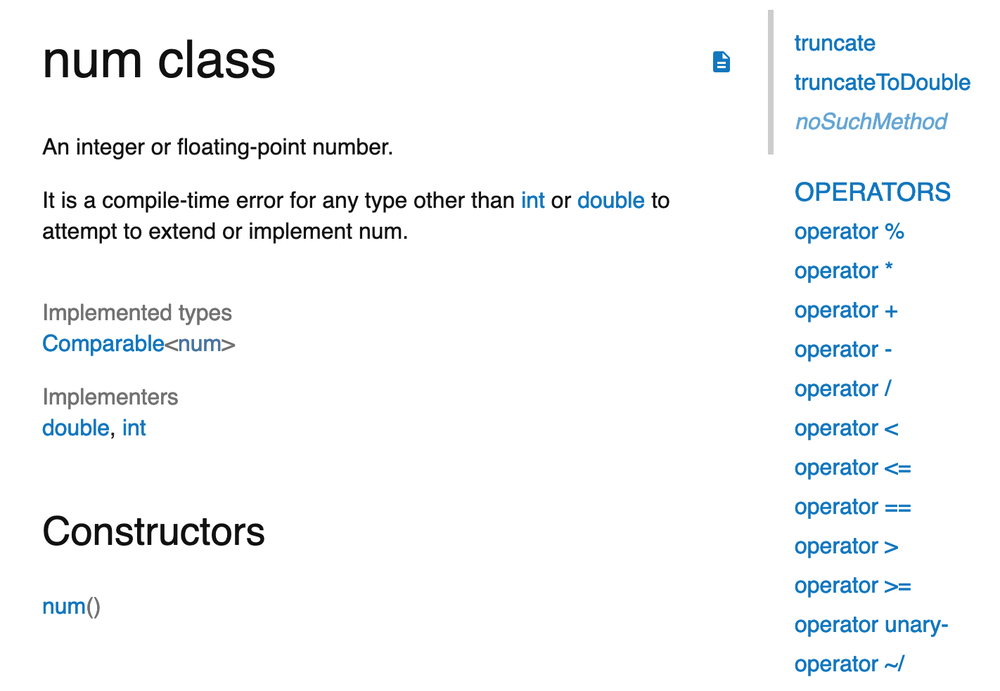

## Dart基础语法


在“[Dart 语言概览](./01.Dart语言概览.md)”中，我们简单地认识了 Dart 这门优秀的程序语言。那么，Dart 与其他语言究竟有什么不同呢？在已有其他编程语言经验的基础上，我又如何快速上手呢？

今天，我们就从编程语言中最重要的组成部分，也就是基础语法与类型变量出发，一起来学习 Dart 吧。

## Dart 初体验

为了简单地体验一下 Dart，我们打开浏览器，直接在[repl.it](https://repl.it/languages/dart)新建一个 main.dart 文件就可以了（当然，你也可以在电脑安装 Dart SDK，体验最新的语法）。

下面是一个基本的 hello world 示例，我声明了一个带 int 参数的函数，并通过字符串内嵌表达式的方式把这个参数打印出来：

```
printInteger(int a) {
  print('Hello world, this is $a.'); 
}
 
main() {
  var number = 2019; 
  printInteger(number); 
}
```

然后，在编辑器中点击“run”按钮，命令行就会输出：

```
Hello world, this is 2019. 
```

和绝大多数编译型语言一样，Dart 要求以 main 函数作为执行的入口。

在知道了如何简单地运行 Dart 代码后，我们再来看一下 Dart 的基本变量类型。

## Dart 的变量与类型

在 Dart 中，我们可以用 var 或者具体的类型来声明一个变量。当使用 var 定义变量时，表示类型是交由编译器推断决定的，当然你也可以用静态类型去定义变量，更清楚地跟编译器表达你的意图，这样编辑器和编译器就能使用这些静态类型，向你提供代码补全或编译警告的提示了。

在默认情况下，未初始化的变量的值都是 null，因此我们不用担心无法判定一个传递过来的、未定义变量到底是 undefined，还是烫烫烫而写一堆冗长的判断语句了。

Dart 是类型安全的语言，并且所有类型都是对象类型，都继承自顶层类型 Object，因此一切变量的值都是类的实例（即对象），甚至数字、布尔值、函数和 null 也都是继承自 Object 的对象。

Dart 内置了一些基本类型，如 num、bool、String、List 和 Map，在不引入其他库的情况下可以使用它们去声明变量。下面，我将逐一和你介绍。

### num、bool 与 String

作为编程语言中最常用的类型，num、bool、String 这三种基本类型被我放到了一起来介绍。
**Dart 的数值类型 num，只有两种子类**：即 64 位 int 和符合 IEEE 754 标准的 64 位 double。前者代表整数类型，而后者则是浮点数的抽象。在正常情况下，它们的精度与取值范围就足够满足我们的诉求了。

```
int x = 1;
int hex = 0xEEADBEEF;
double y = 1.1;
double exponents = 1.13e5;
int roundY = y.round();
```

除了常见的基本运算符，比如 +、-、*、/，以及位运算符外，你还能使用继承自 num 的 abs()、round() 等方法，来实现求绝对值、取整的功能。

实际上，你打开官方文档或查看源码，就会发现这些常见的运算符也是继承自 num：


图 1 num 中的运算符

如果还有其他高级运算方法的需求 num 无法满足，你可以试用一下 dart:math 库。这个库提供了诸如三角函数、指数、对数、平方根等高级函数。

**为了表示布尔值，Dart 使用了一种名为 bool 的类型**。在 Dart 里，只有两个对象具有 bool 类型：true 和 false，它们都是编译时常量。

Dart 是类型安全的，因此我们不能使用**if(nonbooleanValue)**或**assert(nonbooleanValue)**之类的在 JavaScript 可以正常工作的代码，而应该显式地检查值。

如下所示，检查变量是否为 0，在 Dart 中需要显示地与 0 做比较：

```
// 检查是否为 0.
var number = 0;
assert(number == 0);
// assert(number); 错误
```

**Dart 的 String 由 UTF-16 的字符串组成。**和 JavaScript 一样，构造字符串字面量时既能使用单引号也能使用双引号，还能在字符串中嵌入变量或表达式：你可以使用**${express}**把一个表达式的值放进字符串。而如果是一个标识符，你可以省略{}。

下面这段代码就是内嵌表达式的例子。我们把单词’cat’转成大写放入到变量 s1 的声明中：

```
var s = 'cat';
var s1 = 'this is a uppercased string: ${s.toUpperCase()}';
```

为了获得内嵌对象的字符串，Dart 会调用对象的**toString()**方法。而常见字符串的拼接，Dart 则通过内置运算符“+”实现。比如，下面这条语句会如你所愿声明一个值为’Hello World!'的字符串：

```
var s2 = 'Hello' + ' ' + 'World!' ;
```

对于多行字符串的构建，你可以通过三个单引号或三个双引号的方式声明，这与 Python 是一致的：

```
var s3 = """This is a
multi-line string.""";
```

### List 与 Map

其他编程语言中常见的数组和字典类型，在 Dart 中的对应实现是 List 和 Map，统称为集合类型。它们的声明和使用很简单，和 JavaScript 中的用法类似。

接下来，我们一起看一段代码示例。

- 在代码示例的前半部分，我们声明并初始化了两个 List 变量，在第二个变量中添加了一个新的元素后，调用其迭代方法依次打印出其内部元素；
- 在代码示例的后半部分，我们声明并初始化了两个 Map 变量，在第二个变量中添加了两个键值对后，同样调用其迭代方法依次打印出其内部元素。

```
var arr1 = ["Tom", "Andy", "Jack"];
var arr2 = List.of([1,2,3]);
arr2.add(499);
arr2.forEach((v) => print('${v}'));
  
var map1 = {"name": "Tom", 'sex': 'male'}; 
var map2 = new Map();
map2['name'] = 'Tom';
map2['sex'] = 'male';
map2.forEach((k,v) => print('${k}: ${v}')); 
```

容器里的元素也需要有类型，比如上述代码中 arr2 的类型是**List**，map2 的类型则为**Map**。Dart 会自动根据上下文进行类型推断，所以你后续往容器内添加的元素也必须遵照这一类型。

如果编译器自动推断的类型不符合预期，我们当然可以在声明时显式地把类型标记出来，不仅可以让代码提示更友好一些，更重要的是可以让静态分析器帮忙检查字面量中的错误，解除类型不匹配带来的安全隐患或是 Bug。

以上述代码为例，如果往 arr2 集合中添加一个浮点数**arr2.add(1.1)**，尽管语义上合法，但编译器会提示类型不匹配，从而导致编译失败。

和 Java 语言类似，在初始化集合实例对象时，你可以为它的类型添加约束，也可以用于后续判断集合类型。

下面的这段代码，在增加了类型约束后，语义是不是更清晰了？

```
var arr1 = <String>['Tom', 'Andy', 'Jack'];
var arr2 = new List<int>.of([1,2,3]);
arr2.add(499);
arr2.forEach((v) => print('${v}'));
print(arr2 is List<int>); // true
 
var map1 = <String, String>{'name': 'Tom','sex': 'male',};
var map2 = new Map<String, String>();
map2['name'] = 'Tom';
map2['sex'] = 'male';
map2.forEach((k,v) => print('${k}: ${v}')); 
print(map2 is Map<String, String>); // true
```

### 常量定义

如果你想定义不可变的变量，则需要在定义变量前加上 final 或 const 关键字：

- const，表示变量在编译期间即能确定的值；
- final 则不太一样，用它定义的变量可以在运行时确定值，而一旦确定后就不可再变。

声明 const 常量与 final 常量的典型例子，如下所示：

```
final name = 'Andy';
const count = 3;
 
var x = 70;  
var y = 30;
final z = x / y;
```

可以看到，const 适用于定义编译常量（字面量固定值）的场景，而 final 适用于定义运行时常量的场景。

## 总结

通过上面的介绍，相信你已经对 Dart 的基本语法和类型系统有了一个初步的印象。这些初步的印象，有助于你理解 Dart 语言设计的基本思路，在已有编程语言经验的基础上快速上手。

而对于流程控制语法：如**if-else、for**、**while**、**do-while**、**break/continue、switch-case、assert**，由于与其他编程语言类似，在这里我就不做一一介绍了，更多的 Dart 语言特性需要你在后续的使用过程中慢慢学习。在我们使用 Dart 的过程中，[官方文档](https://api.dartlang.org/stable/2.2.0/index.html)是我们最重要的学习参考资料。

恭喜你！你现在已经迈出了 Dart 语言学习的第一步。接下来，我们简单回顾一下今天的内容，以便加深记忆与理解：

- 在 Dart 中，所有类型都是对象类型，都继承自顶层类型 Object，因此一切变量都是对象，数字、布尔值、函数和 null 也概莫能外；
- 未初始化变量的值都是 null；
- 为变量指定类型，这样编辑器和编译器都能更好地理解你的意图。

## 思考题

对于集合类型 List 和 Map，如何让其内部元素支持多种类型（比如，int、double）呢？又如何在遍历集合时，判断究竟是何种类型呢？