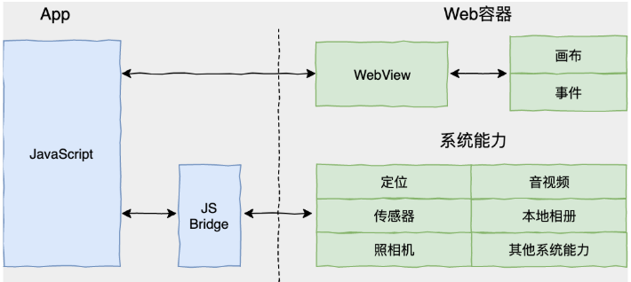
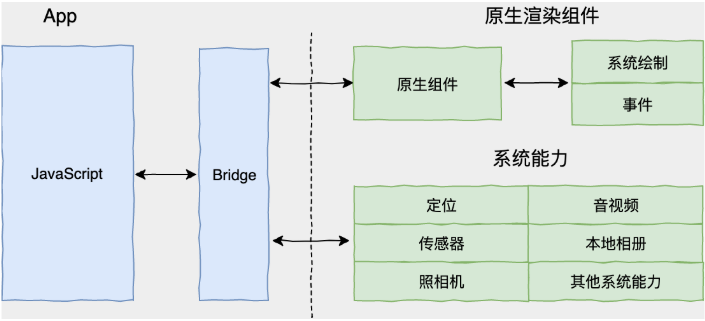
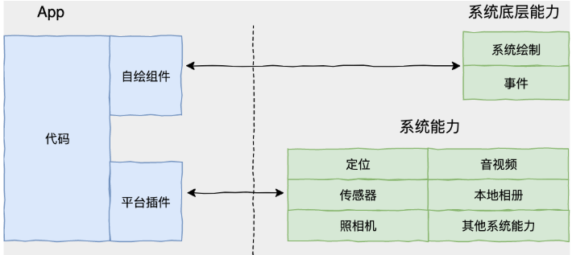
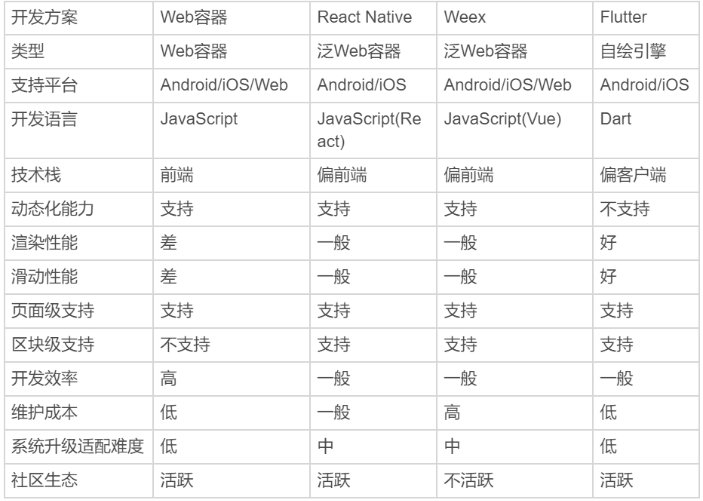

今天，我会从跨平台开发方案的诞生背景、原理和发展历史的角度，和你聊聊这些常见的开发方案，以及针对不同的场景我们应该如何选择对应的方案。

## 浅述跨平台开发的背景

我们当下所处的移动互联网时代，以它独有的变革方式，带给我们快捷、经济、安全和方便，改变着生活的方方面面。而对于企业来说，移动应用已然成为各类手机终端上一张必备的产品名片。

在移动互联网的浪潮下，我们开发的应用要想取胜，开发效率和使用体验可以说是同等重要。但是，使用原生的方式来开发 App，就要求我们必须针对 iOS 和 Android 这两个平台分别开发，这对于中小型团队来说就是隐患和额外的负担。

因为这样的话，我们不仅需要在不同的项目间尝试用不同的语言去实现同样的功能，还要承担由此带来的维护任务。如果还要继续向其他平台（比如 Web、Mac 或 Windows）拓展的话，我们需要付出的成本和时间将成倍增长。而这，显然是难以接受的。于是，跨平台开发的概念顺势走进了我们的视野。

所以从本质上讲，**跨平台开发是为了增加业务代码的复用率，减少因为要适配多个平台带来的工作量，从而降低开发成本。**在提高业务专注度的同时，能够为用户提供一致的用户体验。用一个词来概括这些好处的话，就是“多快好省”。

“一次编码，到处运行”。二十多年前 Java 正是以跨平台特性的口号登场，击败了众多竞争对手。这个口号，意味着 Java 可以在任何平台上进行开发，然后编译成一段标准的字节码后，就可以运行在任何安装有 Java 虚拟机（JVM）的设备上。虽然现在跨平台已经不是 Java 的最大优势（而是它繁荣的生态），但不可否认它当年打着跨平台旗号横空出世确实势不可挡。

而对于移动端开发来讲，如果能实现“一套代码，多端运行”，这样的技术势必会引发新的生产力变革，在目前多终端时代的大环境下，可以为企业节省人力资源上，从而带来直接的经济效益。

伴随着移动端的诞生和繁荣，为了满足人们对开发效率和用户体验的不懈追求，各种跨平台的开发方案也如雨后春笋般涌现。除了 React Native 和 Flutter 之外，这几年还出现过许多其他的解决方案，接下来我将会为你一一分析这些方案。这样，你在选择适合自己的移动开发框架时，也就有章可循了。

在此，我特地强调一下，我在下文提到的跨平台开发方案，如果没有特殊说明的话，指的就是跨 iOS 和 Android 开发。

## 跨平台开发方案的三个时代

根据实现方式的不同，业内常见的观点是将主流的跨平台方案划分为三个时代。

- Web 容器时代：基于 Web 相关技术通过浏览器组件来实现界面及功能，典型的框架包括 Cordova(PhoneGap)、Ionic 和微信小程序。
- 泛 Web 容器时代：采用类 Web 标准进行开发，但在运行时把绘制和渲染交由原生系统接管的技术，代表框架有 React Native、Weex 和快应用，广义的还包括天猫的 Virtual View 等。
- 自绘引擎时代：自带渲染引擎，客户端仅提供一块画布即可获得从业务逻辑到功能呈现的多端高度一致的渲染体验。Flutter，是为数不多的代表。

接下来，我们先看一下目前使用最广泛的 Web 容器方案。

### Web 容器时代

Web 时代的方案，主要采用的是原生应用内嵌浏览器控件 WebView（iOS 为 UIWebView 或 WKWebView，Android 为 WebView）的方式进行 HTML5 页面渲染，并定义 HTML5 与原生代码交互协议，将部分原生系统能力暴露给 HTML5，从而扩展 HTML5 的边界。这类交互协议，就是我们通常说的 JS Bridge（桥）。

这种开发模式既有原生应用代码又有 Web 应用代码，因此又被称为 Hybrid 开发模式。由于 HTML5 代码只需要开发一次，就能同时在多个系统运行，因此大大降低了开发成本。

由于采用了 Web 开发技术，社区和资源非常丰富，开发效率也很高。但，**一个完整 HTML5 页面的展示要经历浏览器控件的加载、解析和渲染三大过程，性能消耗要比原生开发增加 N 个数量级**。

接下来，我以加载过程为例，和你说明这个过程的复杂性。

1. 浏览器控件加载 HTML5 页面的 HTML 主文档；
2. 加载过程中遇到外部 CSS 文件，浏览器另外发出一个请求，来获取 CSS 文件；
3. 遇到图片资源，浏览器也会另外发出一个请求，来获取图片资源。这是异步请求，并不会影响 HTML 文档的加载。
4. 加载过程中遇到 JavaScript 文件，由于 JavaScript 代码可能会修改 DOM 树，因此 HTML 文档会挂起渲染（加载解析渲染同步）的线程，直到 JavaScript 文件加载解析并执行完毕，才可以恢复 HTML 文档的渲染线程。
5. JavaScript 代码中有用到 CSS 文件中的属性样式，于是阻塞，等待 CSS 加载完毕才能恢复执行。

而这，只是完成 HTML5 页面渲染的最基础的加载过程。加载、解析和渲染这三个过程在实际运行时又不是完全独立的，还会有交叉。也就是说，会存在一边加载，一边解析，一边渲染的现象。这，就使得页面的展示并不像想象中那么容易。

通过上面的分析你可以看出，一个 HTML5 页面的展示是多么得复杂！这和原生开发通过简单直接的创建控件，设置属性后即可完成页面渲染有非常大的差异。Web 与原生在 UI 渲染与系统功能调用上各司其职，因此这个时代的框架在 Web 与原生系统间还有比较明显的、甚至肉眼可见的边界。

图 1 Hybrid 开发框架

我也曾碰到过很多人觉得跨平台开发不靠谱。但其实，Web 容器方案是跨平台开发历史上最成功的例子。也正是因为它太成功了，以至于很多人都忽略了它也是跨平台方案之一。

### 泛 Web 容器时代

虽然 Web 容器方案具有生态繁荣、开发体验友好、生产效率高、跨平台兼容性强等优势，但它最大的问题在于承载着大量 Web 标准的 Web 容器过于笨重，以至于性能和体验都达不到与原生同样的水准，在复杂交互和动画上较难实现出优良的用户体验。

而在实际的产品功能研发中，我们通常只会用到 Web 标准中很小的一部分。面对这样的现实，我们很快就想到：能否对笨重的 Web 容器进行功能裁剪，在仅保留必要的 Web 标准和渲染能力的基础上，使得友好的开发体验与稳定的渲染性能保持一个平衡？

答案当然是可以。

泛 Web 容器时代的解决方案优化了 Web 容器时代的加载、解析和渲染这三大过程，把影响它们独立运行的 Web 标准进行了裁剪，以相对简单的方式支持了构建移动端页面必要的 Web 标准（如 Flexbox 等），也保证了便捷的前端开发体验；同时，这个时代的解决方案基本上完全放弃了浏览器控件渲染，而是采用原生自带的 UI 组件实现代替了核心的渲染引擎，仅保持必要的基本控件渲染能力，从而使得渲染过程更加简化，也保证了良好的渲染性能。

也就是说，在泛 Web 容器时代，我们仍然采用前端友好的 JavaScript 进行开发，整体加载、渲染机制大大简化，并且由原生接管绘制，即将原生系统作为渲染的后端，为依托于 JavaScript 虚拟机的 JavaScript 代码提供所需要的 UI 控件的实体。这，也是现在绝大部分跨平台框架的思路，而 React Native 和 Weex 就是其中的佼佼者。

图 2 泛 Web 容器框架

为了追求性能体验的极致，并进一步维持方案的简单可扩展性，有些轻量级的跨平台方案甚至会完全抛弃 Web 标准、放弃 JavaScript 的动态执行能力而自创一套原生 DSL，如天猫的[VirtualView](http://pingguohe.net/2017/12/07/Tangram-2.html)框架。从广义上来说，这些方案也是泛 Web 容器类方案。

### 自绘引擎时代

泛 Web 容器时代使用原生控件承载界面渲染，固然解决了不少性能问题，但同时也带来了新的问题。抛开框架本身需要处理大量平台相关的逻辑外，随着系统版本变化和 API 的变化，我们还需要处理不同平台的原生控件渲染能力差异，修复各类奇奇怪怪的 Bug。始终需要 Follow Native 的思维方式，就使得泛 Web 容器框架的跨平台特性被大打折扣。

而这一时期的代表 Flutter 则开辟了一种全新的思路，即从头到尾重写一套跨平台的 UI 框架，包括渲染逻辑，甚至是开发语言。

- 渲染引擎依靠跨平台的 Skia 图形库来实现，Skia 引擎会将使用 Dart 构建的抽象的视图结构数据加工成 GPU 数据，交由 OpenGL 最终提供给 GPU 渲染，至此完成渲染闭环，因此可以在最大程度上保证一款应用在不同平台、不同设备上的体验一致性。
- 而开发语言选用的是同时支持 JIT（Just-in-Time，即时编译）和 AOT（Ahead-of-Time，预编译）的 Dart，不仅保证了开发效率，更提升了执行效率（比使用 JavaScript 开发的泛 Web 容器方案要高得多）。

图 3 自绘引擎开发框架

通过这样的思路，Flutter 可以尽可能地减少不同平台之间的差异, 同时保持和原生开发一样的高性能。所以说，Flutter 成了三类跨平台移动开发方案中最灵活的那个，也成了目前最受业界关注的框架。

现在，我们已经弄明白了三类跨平台方案，那么我在开发应用的时候，到底应该如何选择最适合自己的框架呢？

## 我该选择哪一类跨平台开发方案？

从不同的角度来看，三个时代的跨平台框架代表们在开发效率、渲染性能、维护成本和社区生态上各有优劣，如下图所示：

图 4 主流跨平台框架对比

我们在做技术选型时，可以参考以上维度，从开发效率、技术栈、性能表现、维护成本和社区生态来进行综合考虑。比如，是否必须支持动态化？是只解决 Android、iOS 的跨端问题，还是要包括 Web？对性能要求如何？对多端体验的绝对一致性和维护成本是否有强诉求？

从各个维度综合考量，React Native 和 Flutter 无疑是最均衡的两种跨平台开发方案，而其他的方案或多或少都“偏科严重”。

- React Native 依托于 Facebook，经过 4 年多的发展已经成长为跨平台开发方案的实际领导者，并拥有较为丰富的第三方库和开发社区；
- Flutter 以挑战者姿态出现在我们的面前，可以提供更彻底的跨平台技术解决方案。虽然 Flutter 推出时间不长，但也有了诸多商用案例，加上清晰的[产品路线图](https://mp.weixin.qq.com/s/aRhQdMd0R74adph9_V0wgQ)和 Google 的强大号召力，Flutter 未来的发展非常值得期待。

那么问题来了，我究竟应该选择 React Native 还是 Flutter 呢？

在这里，我和你说一下我的建议吧。

**对于知识学习来说，**这两个应用层面的框架最好都学。学习的过程中最重要的是打好基础，深入理解框架的原理和设计思想，重点思考它们的 API 设计的取舍，发现它们的共性和差异。

Flutter 作为后来者，也从 React Native 社区学习和借鉴了不少的优秀设计，很多概念两边都有对应，比如 React Native 的 Component 和 Flutter 的 Widget、Flex 布局思想、状态管理和函数式编程等等，这类的知识都是两个框架通用的技术。**未来也许还会出现新的解决方案，老框架也会不断更新，只有掌握核心原理才能真正立于不败之地。**

**对于实际项目来说，**这两个框架都已达到了大面积商业应用的标准。综合成熟度和生态，目前俩看 React Native 略胜 Flutter。因此，如果是中短期项目的话，我建议使用 React Native。但作为技术选型，我们要看得更远一些。Flutter 的设计理念比较先进，解决方案也相对彻底，在渲染能力的一致性以及性能上，和 React Native 相比优势非常明显。

此外，Flutter 的野心不仅仅是移动端。前段时间，Google 团队已经完成了 Hummingbird，即 Flutter 的 Web 的官方 Demo，在桌面操作系统的探索上也取得了进展，未来大前端技术栈是否会由 Flutter 完成统一，值得期待。

## 小结

这就是今天分享的全部内容了。

在不同平台开发和维护同一个产品，所付出的成本一直以来一个令人头疼的问题，于是各类跨平台开发方案顺应而生。从 Web 容器时代到以 React Native、Weex 为代表的泛 Web 容器时代，最后再到以 Flutter 为代表的自绘引擎时代，这些优秀的跨平台开发框架们慢慢抹平了各个平台的差异，使得操作系统的边界变得越来越模糊。

与此同时，这个时代对开发者的要求也到达了一个新的阶段，拥抱大前端的时代已经向我们走来。在这个专栏里，我会假设你有一定的前端（Android、iOS 或 Web）开发基础。比如，你知道 View 是什么，路由是什么，如何实现一个基本页面布局等等。我会让希望迅速掌握 Flutter 开发的爱好者们，通过一种比较熟悉和友好的路径去学习 Flutter 相关的代码和程序，以及背后的原理和设计思想。