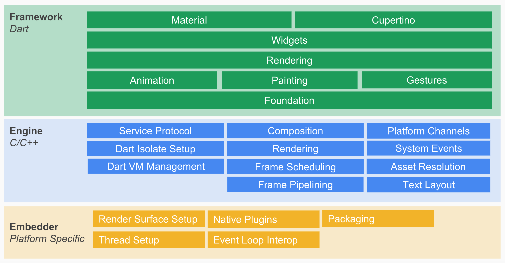
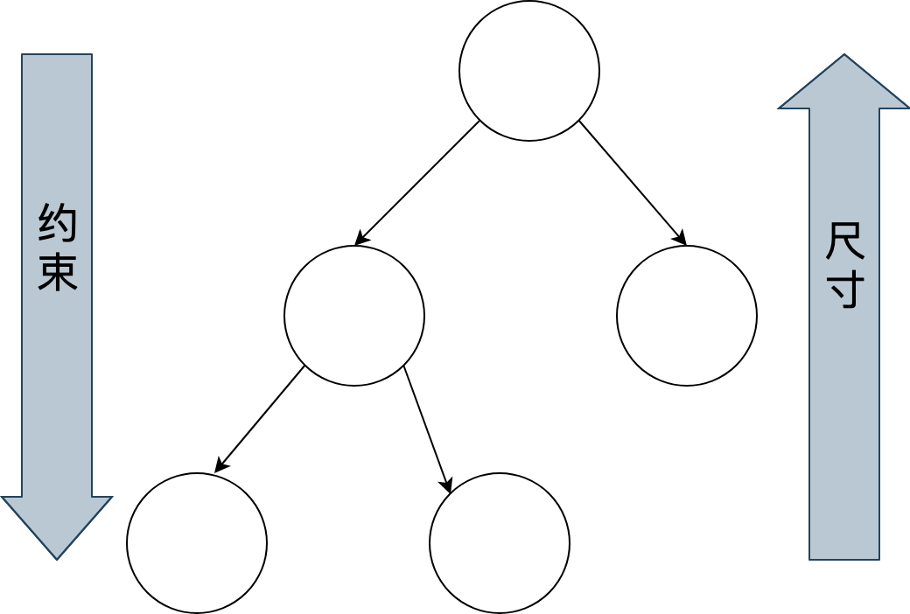
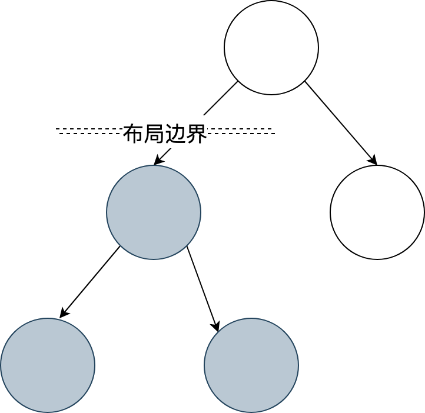
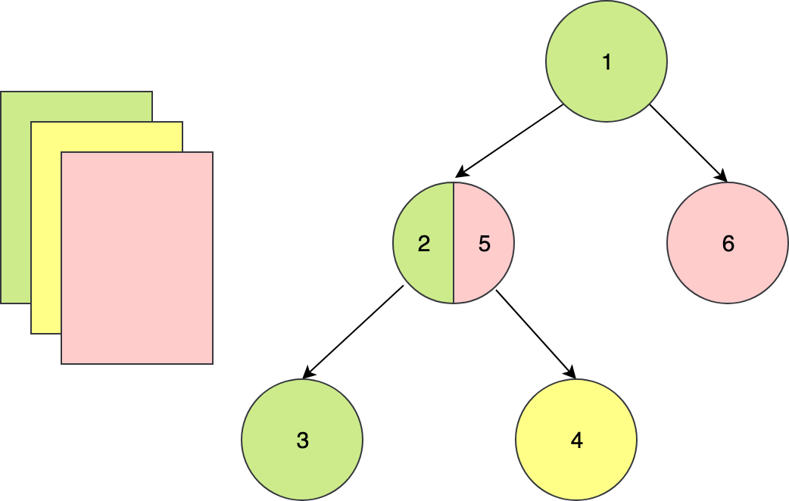
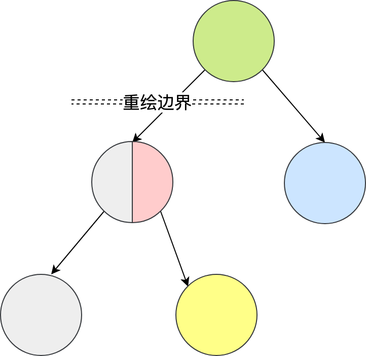

Flutter 是什么？它出现的动机是什么，解决了哪些痛点？相比其他跨平台技术，Flutter 的优势在哪里？……相信很多人在第一眼看到 Flutter 时，都会有类似的疑问。

别急，在今天的这篇文章中，我会与你介绍 Flutter 的历史背景和运行机制，并以界面渲染过程为例与你讲述其实现原理，让你对 Flutter 能够有一个全方位的认知和感受。在对 Flutter 有了全面了解后，这些疑问自然也就迎刃而解了。

接下来，我们就从 Flutter 出现的历史背景开始谈起吧。

## Flutter 出现的历史背景

为不同的操作系统开发拥有相同功能的应用程序，开发人员只有两个选择：

1. 使用原生开发语言（即 Java 和 Objective-C），针对不同平台分别进行开发。
2. 使用跨平台解决方案，对不同平台进行统一开发。

原生开发方式的体验最好，但研发效率和研发成本相对较高；而跨平台开发方式研发虽然效率高，但为了抹平多端平台差异，各类解决方案暴露的组件和 API 较原生开发相比少很多，因此研发体验和产品功能并不完美。

所以，最成功的跨平台开发方案其实是依托于浏览器控件的 Web。浏览器保证了 99% 的概率下 Web 的需求都是可以实现的，不需要业务将就“技术”。不过，Web 最大的问题在于它的性能和体验与原生开发存在肉眼可感知的差异，因此并不适用于对体验要求较高的场景。

对于用户体验更接近于原生的 React Native，对业务的支持能力却还不到浏览器的 5%，仅适用于中低复杂度的低交互类页面。面对稍微复杂一点儿的交互和动画需求，开发者都需要 case by case 地去 review，甚至还可能要通过原生代码去扩展才能实现。

这些因素，也就导致了虽然跨平台开发从移动端诞生之初就已经被多次提及，但到现在也没有被很好地解决。

带着这些问题，我们终于迎来了本次专栏的主角——Flutter。

Flutter 是构建 Google 物联网操作系统 Fuchsia 的 SDK，主打跨平台、高保真、高性能。开发者可以通过 Dart 语言开发 App，一套代码可以同时运行在 iOS 和 Android 平台。 Flutter 使用 Native 引擎渲染视图，并提供了丰富的组件和接口，这无疑为开发者和用户都提供了良好的体验。

从 2017 年 5 月，谷歌公司发布的了 Alpha 版本的 Flutter，到 2018 年底 Flutter Live 发布的 1.0 版本，再到现在最新的 1.5 版本（截止至 2019 年 7 月 1 日），Flutter 正在赢得越来越多的关注。

很多人开始感慨，跨平台技术似乎终于迎来了最佳解决方案。那么，接下来我们就从原理层面去看看，Flutter 是如何解决既有跨平台开发方案问题的。

## Flutter 是怎么运转的？

与用于构建移动应用程序的其他大多数框架不同，Flutter 是重写了一整套包括底层渲染逻辑和上层开发语言的完整解决方案。这样不仅可以保证视图渲染在 Android 和 iOS 上的高度一致性（即高保真），在代码执行效率和渲染性能上也可以媲美原生 App 的体验（即高性能）。

这，就是 Flutter 和其他跨平台方案的本质区别：

- React Native 之类的框架，只是通过 JavaScript 虚拟机扩展调用系统组件，由 Android 和 iOS 系统进行组件的渲染；
- Flutter 则是自己完成了组件渲染的闭环。

那么，**Flutter 是怎么完成组件渲染的呢**？这需要从图像显示的基本原理说起。

在计算机系统中，图像的显示需要 CPU、GPU 和显示器一起配合完成：CPU 负责图像数据计算，GPU 负责图像数据渲染，而显示器则负责最终图像显示。

CPU 把计算好的、需要显示的内容交给 GPU，由 GPU 完成渲染后放入帧缓冲区，随后视频控制器根据垂直同步信号（VSync）以每秒 60 次的速度，从帧缓冲区读取帧数据交由显示器完成图像显示。

操作系统在呈现图像时遵循了这种机制，而 Flutter 作为跨平台开发框架也采用了这种底层方案。下面有一张更为详尽的示意图来解释 Flutter 的绘制原理。

图 1 Flutter 绘制原理

可以看到，Flutter 关注如何尽可能快地在两个硬件时钟的 VSync 信号之间计算并合成视图数据，然后通过 Skia 交给 GPU 渲染：UI 线程使用 Dart 来构建视图结构数据，这些数据会在 GPU 线程进行图层合成，随后交给 Skia 引擎加工成 GPU 数据，而这些数据会通过 OpenGL 最终提供给 GPU 渲染。

在进一步学习 Flutter 之前，我们有必要了解下构建 Flutter 的关键技术，即 Skia 和 Dart。

## Skia 是什么？

要想了解 Flutter，你必须先了解它的底层图像渲染引擎 Skia。因为，Flutter 只关心如何向 GPU 提供视图数据，而 Skia 就是它向 GPU 提供视图数据的好帮手。

Skia 是一款用 C++ 开发的、性能彪悍的 2D 图像绘制引擎，其前身是一个向量绘图软件。2005 年被 Google 公司收购后，因为其出色的绘制表现被广泛应用在 Chrome 和 Android 等核心产品上。Skia 在图形转换、文字渲染、位图渲染方面都表现卓越，并提供了开发者友好的 API。

目前，Skia 已然是 Android 官方的图像渲染引擎了，因此 Flutter Android SDK 无需内嵌 Skia 引擎就可以获得天然的 Skia 支持；而对于 iOS 平台来说，由于 Skia 是跨平台的，因此它作为 Flutter iOS 渲染引擎被嵌入到 Flutter 的 iOS SDK 中，替代了 iOS 闭源的 Core Graphics/Core Animation/Core Text，这也正是 Flutter iOS SDK 打包的 App 包体积比 Android 要大一些的原因。

底层渲染能力统一了，上层开发接口和功能体验也就随即统一了，开发者再也不用操心平台相关的渲染特性了。也就是说，Skia 保证了同一套代码调用在 Android 和 iOS 平台上的渲染效果是完全一致的。

## 为什么是 Dart？

除了我们在第 2 篇预习文章“[预习篇 · Dart 语言概览](https://time.geekbang.org/column/article/104071)”中提到的，Dart 因为同时支持 AOT 和 JIT，所以具有运行速度快、执行性能好的特点外，Flutter 为什么选择了 Dart，而不是前端应用的准官方语言 JavaScript 呢？这个问题很有意思，但也很有争议。

很多人说，选择 Dart 是 Flutter 推广的一大劣势，毕竟多学一门新语言就多一层障碍。想想 Java 对 Android，JavaScript 对 NodeJS 的推动，如果换个语言可能就不一样了。

但，**Google 公司给出的原因很简单也很直接**：Dart 语言开发组就在隔壁，对于 Flutter 需要的一些语言新特性，能够快速在语法层面落地实现；而如果选择了 JavaScript，就必须经过各种委员会和浏览器提供商漫长的决议。

事实上，Flutter 的确得到了兄弟团队的紧密支持。2018 年 2 月发布的 Dart 2.0，2018 年 12 月发布的 Dart 2.1，2019 年 2 月发布的 Dart 2.2，2019 年 5 月发布的 Dart2.3，每次发布都包含了为 Flutter 量身定制的诸多改造（比如，改进的 AOT 性能、更智能的类型隐式转换等）。

当然，Google 公司选择使用 Dart 作为 Flutter 的开发语言，我想还有其他更有说服力的理由：

1. Dart 同时支持即时编译 JIT 和事前编译 AOT。在开发期使用 JIT，开发周期异常短，调试方式颠覆常规（支持有状态的热重载）；而发布期使用 AOT，本地代码的执行更高效，代码性能和用户体验也更卓越。
2. Dart 作为一门现代化语言，集百家之长，拥有其他优秀编程语言的诸多特性（比如，完善的包管理机制）。也正是这个原因，Dart 的学习成本并不高，很容易上手。
3. Dart 避免了抢占式调度和共享内存，可以在没有锁的情况下进行对象分配和垃圾回收，在性能方面表现相当不错。

Dart 是一门优秀的现代语言，最初设计也是为了取代 JavaScript 成为 Web 开发的官方语言。竞争对手如此强劲，最后的结果可想而知。这，也是为什么相比于其他热门语言，Dart 的生态要冷清不少的原因。

而随着 Flutter 的发布，Dart 开始转型，其自身定位也发生了变化，专注于改善构建客户端应用程序的体验，因此越来越多的开发者开始慢慢了解、学习这门语言，并共同完善它的生态。凭借着 Flutter 的火热势头，辅以 Google 强大的商业运作能力，相信转型后的 Dart 前景会非常光明。

## Flutter 的原理

在了解了 Flutter 的基本运作机制后，我们再来深入了解一下 Flutter 的实现原理。

首先，我们来看一下 Flutter 的架构图。我希望通过这张图以及对应的解读，你能在开始学习的时候就建立起对 Flutter 的整体印象，能够从框架设计和实现原理的高度去理解 Flutter 区别其他跨平台解决方案的关键所在，为后面的学习打好基础，而不是直接一上来就陷入语言和框架的功能细节“泥潭”而无法自拔。

图 2 Flutter 架构图

备注：此图引自[Flutter System Overview](https://flutter.dev/docs/resources/technical-overview)

Flutter 架构采用分层设计，从下到上分为三层，依次为：Embedder、Engine、Framework。

- Embedder 是操作系统适配层，实现了渲染 Surface 设置，线程设置，以及平台插件等平台相关特性的适配。从这里我们可以看到，Flutter 平台相关特性并不多，这就使得从框架层面保持跨端一致性的成本相对较低。
- Engine 层主要包含 Skia、Dart 和 Text，实现了 Flutter 的渲染引擎、文字排版、事件处理和 Dart 运行时等功能。Skia 和 Text 为上层接口提供了调用底层渲染和排版的能力，Dart 则为 Flutter 提供了运行时调用 Dart 和渲染引擎的能力。而 Engine 层的作用，则是将它们组合起来，从它们生成的数据中实现视图渲染。
- Framework 层则是一个用 Dart 实现的 UI SDK，包含了动画、图形绘制和手势识别等功能。为了在绘制控件等固定样式的图形时提供更直观、更方便的接口，Flutter 还基于这些基础能力，根据 Material 和 Cupertino 两种视觉设计风格封装了一套 UI 组件库。我们在开发 Flutter 的时候，可以直接使用这些组件库。

接下来，我**以界面渲染过程为例，和你介绍 Flutter 是如何工作的。**

页面中的各界面元素（Widget）以树的形式组织，即控件树。Flutter 通过控件树中的每个控件创建不同类型的渲染对象，组成渲染对象树。而渲染对象树在 Flutter 的展示过程分为四个阶段：布局、绘制、合成和渲染。

### 布局

Flutter 采用深度优先机制遍历渲染对象树，决定渲染对象树中各渲染对象在屏幕上的位置和尺寸。在布局过程中，渲染对象树中的每个渲染对象都会接收父对象的布局约束参数，决定自己的大小，然后父对象按照控件逻辑决定各个子对象的位置，完成布局过程。

图 3 Flutter 布局过程

为了防止因子节点发生变化而导致整个控件树重新布局，Flutter 加入了一个机制——布局边界（Relayout Boundary），可以在某些节点自动或手动地设置布局边界，当边界内的任何对象发生重新布局时，不会影响边界外的对象，反之亦然。

图 4 Flutter 布局边界

### 绘制

布局完成后，渲染对象树中的每个节点都有了明确的尺寸和位置。Flutter 会把所有的渲染对象绘制到不同的图层上。与布局过程一样，绘制过程也是深度优先遍历，而且总是先绘制自身，再绘制子节点。

以下图为例：节点 1 在绘制完自身后，会再绘制节点 2，然后绘制它的子节点 3、4 和 5，最后绘制节点 6。

图 5 Flutter 绘制示例

可以看到，由于一些其他原因（比如，视图手动合并）导致 2 的子节点 5 与它的兄弟节点 6 处于了同一层，这样会导致当节点 2 需要重绘的时候，与其无关的节点 6 也会被重绘，带来性能损耗。

为了解决这一问题，Flutter 提出了与布局边界对应的机制——重绘边界（Repaint Boundary）。在重绘边界内，Flutter 会强制切换新的图层，这样就可以避免边界内外的互相影响，避免无关内容置于同一图层引起不必要的重绘。

图 6 Flutter 重绘边界

重绘边界的一个典型场景是 Scrollview。ScrollView 滚动的时候需要刷新视图内容，从而触发内容重绘。而当滚动内容重绘时，一般情况下其他内容是不需要重绘的，这时候重绘边界就派上用场了。

### 合成和渲染

终端设备的页面越来越复杂，因此 Flutter 的渲染树层级通常很多，直接交付给渲染引擎进行多图层渲染，可能会出现大量渲染内容的重复绘制，所以还需要先进行一次图层合成，即将所有的图层根据大小、层级、透明度等规则计算出最终的显示效果，将相同的图层归类合并，简化渲染树，提高渲染效率。

合并完成后，Flutter 会将几何图层数据交由 Skia 引擎加工成二维图像数据，最终交由 GPU 进行渲染，完成界面的展示。这部分内容，我已经在前面的内容中介绍过，这里就不再赘述了。

接下来，我们再看看学习 Flutter，都需要学习哪些知识。

## 学习 Flutter 需要掌握哪些知识？

终端设备越来越碎片化，需要支持的操作系统越来越多，从研发效率和维护成本综合考虑，跨平台开发一定是未来大前端的趋势，我们应该拥抱变化。而 Flutter 提供了一套彻底的移动跨平台方案，也确实弥补了如今跨平台开发框架的短板，解决了业界痛点，极有可能成为跨平台开发领域的终极解决方案，前途非常光明。

那么，**我们学习 Flutter 都需要掌握哪些知识呢？**

我按照 App 的开发流程（开发、调试测试、发布与线上运维）将 Flutter 的技术栈进行了划分，里面几乎包含了 Flutter 开发需要的所有知识点。而这些所有知识点，我会在专栏中为你一一讲解。掌握了这些知识点后，你也就具备了企业级应用开发的必要技能。

这些知识点，如下图所示：

图 7 Flutter 知识体系

有了这张图，你是否感觉到学习 Flutter 的路线变得更加清晰了呢？

## 小结

今天，我带你了解了 Flutter 的历史背景与运行机制，并以界面渲染过程为例，从布局、绘制、合成和渲染四个阶段讲述了 Flutter 的实现原理。此外，我向你介绍了构建 Flutter 底层的关键技术：Skia 与 Dart，它们是 Flutter 有别于其他跨平台开发方案的核心所在。

最后，我梳理了一张 Flutter 学习思维导图，围绕一个应用的迭代周期介绍了 Flutter 相关的知识点。我希望通过这个专栏，能和你把 Flutter 背后的设计原理和知识体系讲清楚，让你能对 Flutter 有一个整体感知。这样，在你学完这个专栏以后，就能够具备企业级应用开发的理论基础与实践。