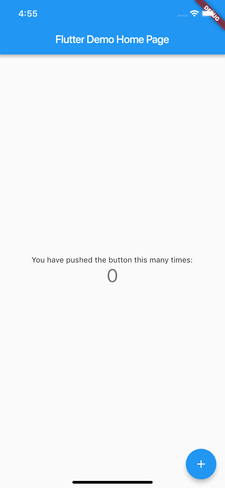
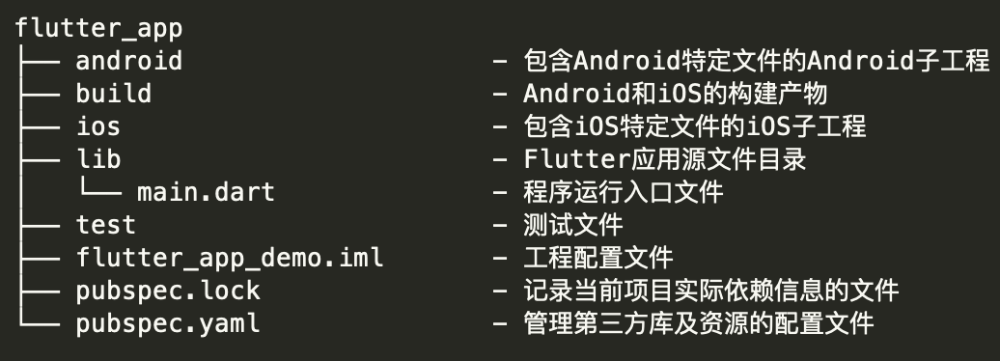
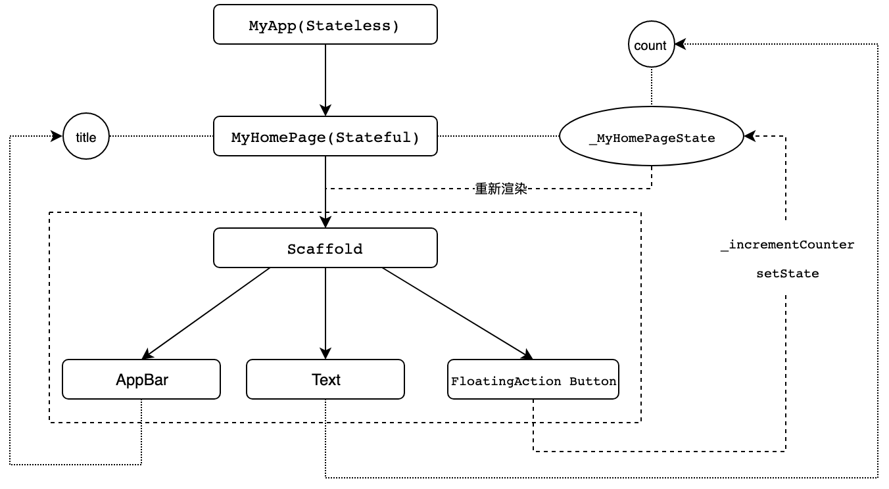

在专栏的第一篇预习文章中，我和你一起搭建了 Flutter 的开发环境，并且通过自带的 hello_world 示例，和你演示了 Flutter 项目是如何运行在 Android 和 iOS 模拟器以及真机上的。

今天，我会通过 Android Studio 创建的 Flutter 应用模板，带你去了解 Flutter 的项目结构，分析 Flutter 工程与原生 Android 和 iOS 工程有哪些联系，体验一个有着基本功能的 Flutter 应用是如何运转的，从而加深你对构建 Flutter 应用的关键概念和技术的理解。

如果你现在还不熟悉 Dart 语言也不用担心，只要能够理解基本的编程概念（比如，类型、变量、函数和面向对象），并具备一定的前端基础（比如，了解 View 是什么、页面基本布局等基础知识），就可以和我一起完成今天的学习。而关于 Dart 语言基础概念的讲述、案例分析，我会在下一个模块和你展开。

## 计数器示例工程分析

首先，我们打开 Android Studio，创建一个 Flutter 工程应用 flutter_app。Flutter 会根据自带的应用模板，自动生成一个简单的计数器示例应用 Demo。我们先运行此示例，效果如下：


图 1 计数器示例运行效果

每点击一次右下角带“+”号的悬浮按钮，就可以看到屏幕中央的数字随之 +1。

### 工程结构

在体会了示例工程的运行效果之后，我们再来看看 Flutter 工程目录结构，了解 Flutter 工程与原生 Android 和 iOS 工程之间的关系，以及这些关系是如何确保一个 Flutter 程序可以最终运行在 Android 和 iOS 系统上的。


图 2 Flutter 工程目录结构

可以看到，除了 Flutter 本身的代码、资源、依赖和配置之外，Flutter 工程还包含了 Android 和 iOS 的工程目录。

这也不难理解，因为 Flutter 虽然是跨平台开发方案，但却需要一个容器最终运行到 Android 和 iOS 平台上，所以**Flutter 工程实际上就是一个同时内嵌了 Android 和 iOS 原生子工程的父工程**：我们在 lib 目录下进行 Flutter 代码的开发，而某些特殊场景下的原生功能，则在对应的 Android 和 iOS 工程中提供相应的代码实现，供对应的 Flutter 代码引用。

Flutter 会将相关的依赖和构建产物注入这两个子工程，最终集成到各自的项目中。而我们开发的 Flutter 代码，最终则会以原生工程的形式运行。

### 工程代码

在对 Flutter 的工程结构有了初步印象之后，我们就可以开始学习 Flutter 的项目代码了。

Flutter 自带的应用模板，也就是这个计数器示例，对初学者来说是一个极好的入门范例。在这个简单示例中，从基础的组件、布局到手势的监听，再到状态的改变，Flutter 最核心的思想在这 60 余行代码中展现得可谓淋漓尽致。

为了便于你学习理解，领会构建 Flutter 程序的大体思路与关键技术，而不是在一开始时就陷入组件的 API 细节中，我删掉了与核心流程无关的组件配置代码及布局逻辑，在不影响示例功能的情况下对代码进行了改写，并将其分为两部分：

- 第一部分是应用入口、应用结构以及页面结构，可以帮助你理解构建 Flutter 程序的基本结构和套路；
- 第二部分则是页面布局、交互逻辑及状态管理，能够帮你理解 Flutter 页面是如何构建、如何响应交互，以及如何更新的。

首先，我们来看看**第一部分的代码**，也就是应用的整体结构：

```
import 'package:flutter/material.dart';
 
void main() => runApp(MyApp());
 
class MyApp extends StatelessWidget {
  @override
  Widget build(BuildContext context) => MaterialApp(home: MyHomePage(title: 'Flutter Demo Home Page'));
}
 
class MyHomePage extends StatefulWidget {
  MyHomePage({Key key, this.title}) : super(key: key);
  final String title;
  @override
  _MyHomePageState createState() => _MyHomePageState();
}
 
class _MyHomePageState extends State<MyHomePage> {
  Widget build(BuildContext context) => {...};
}
```

在本例中，Flutter 应用为 MyApp 类的一个实例，而 MyApp 类继承自 StatelessWidget 类，这也就意味着应用本身也是一个 Widget。事实上，在 Flutter 中，Widget 是整个视图描述的基础，在 Flutter 的世界里，包括应用、视图、视图控制器、布局等在内的概念，都建立在 Widget 之上，**Flutter 的核心设计思想便是一切皆 Widget**。

Widget 是组件视觉效果的封装，是 UI 界面的载体，因此我们还需要为它提供一个方法，来告诉 Flutter 框架如何构建 UI 界面，这个方法就是 build。

在 build 方法中，我们通常通过对基础 Widget 进行相应的 UI 配置，或是组合各类基础 Widget 的方式进行 UI 的定制化。比如在 MyApp 中，我通过 MaterialApp 这个 Flutter App 框架设置了应用首页，即 MyHomePage。当然，MaterialApp 也是一个 Widget。

MaterialApp 类是对构建 material 设计风格应用的组件封装框架，里面还有很多可配置的属性，比如应用主题、应用名称、语言标识符、组件路由等。但是，这些配置属性并不是本次分享的重点，如果你感兴趣的话，可以参考 Flutter 官方的[API 文档](https://api.flutter.dev/flutter/material/MaterialApp/MaterialApp.html)，来了解 MaterialApp 框架的其他配置能力。

MyHomePage 是应用的首页，继承自 StatefulWidget 类。这，代表着它是一个有状态的 Widget（Stateful Widget），而 _MyHomePageState 就是它的状态。

如果你足够细心的话就会发现，虽然 MyHomePage 类也是 Widget，但与 MyApp 类不同的是，它并没有一个 build 方法去返回 Widget，而是多了一个 createState 方法返回 _MyHomePageState 对象，而 build 方法则包含在这个 _MyHomePageState 类当中。

那么，**StatefulWidget 与 StatelessWidget 的接口设计，为什么会有这样的区别呢？**

这是因为 Widget 需要依据数据才能完成构建，而对于 StatefulWidget 来说，其依赖的数据在 Widget 生命周期中可能会频繁地发生变化。由 State 创建 Widget，以数据驱动视图更新，而不是直接操作 UI 更新视觉属性，代码表达可以更精炼，逻辑也可以更清晰。

在了解了计数器示例程序的整体结构以后，我们再来看看这个**示例代码的第二部分**，也就是页面布局及交互逻辑部分。

```
class _MyHomePageState extends State<MyHomePage> {
  int _counter = 0;
  void _incrementCounter() => setState(() {_counter++;});
 
  @override
  Widget build(BuildContext context) {
    return Scaffold(
      appBar: AppBar(title: Text(Widget.title)),
      body: Text('You have pushed the button this many times:$_counter')),
      floatingActionButton: FloatingActionButton(onPressed: _incrementCounter) 
    );
  }
```

_MyHomePageState 中创建的 Widget Scaffold，是 Material 库中提供的页面布局结构，它包含 AppBar、Body，以及 FloatingActionButton。

- AppBar 是页面的导航栏，我们直接将 MyHomePage 中的 title 属性作为标题使用。
- body 则是一个 Text 组件，显示了一个根据 _counter 属性可变的文本：‘You have pushed the button this many times:$_counter’。
- floatingActionButton，则是页面右下角的带“+”的悬浮按钮。我们将 _incrementCounter 作为其点击处理函数。

_incrementCounter 的实现很简单，使用 setState 方法去自增状态属性 _counter。setState 方法是 Flutter 以数据驱动视图更新的关键函数，它会通知 Flutter 框架：我这儿有状态发生了改变，赶紧给我刷新界面吧。而 Flutter 框架收到通知后，会执行 Widget 的 build 方法，根据新的状态重新构建界面。

**这里需要注意的是：状态的更改一定要配合使用 setState。**通过这个方法的调用，Flutter 会在底层标记 Widget 的状态，随后触发重建。于我们的示例而言，即使你修改了 _counter，如果不调用 setState，Flutter 框架也不会感知到状态的变化，因此界面上也不会有任何改变（你可以动手验证一下）。

下面的图 3，就是整个计数器示例的代码流程示意图。通过这张图，你就能够把这个实例的整个代码流程串起来了：


图 3 代码流程示意图

MyApp 为 Flutter 应用的运行实例，通过在 main 函数中调用 runApp 函数实现程序的入口。而应用的首页则为 MyHomePage，一个拥有 _MyHomePageState 状态的 StatefulWidget。_MyHomePageState 通过调用 build 方法，以相应的数据配置完成了包括导航栏、文本及按钮的页面视图的创建。

而当按钮被点击之后，其关联的控件函数 _incrementCounter 会触发调用。在这个函数中，通过调用 setState 方法，更新 _counter 属性的同时，也会通知 Flutter 框架其状态发生变化。随后，Flutter 会重新调用 build 方法，以新的数据配置重新构建 _MyHomePageState 的 UI，最终完成页面的重新渲染。

Widget 只是视图的“配置信息”，是数据的映射，是“只读”的。对于 StatefulWidget 而言，当数据改变的时候，我们需要重新创建 Widget 去更新界面，这也就意味着 Widget 的创建销毁会非常频繁。

为此，Flutter 对这个机制做了优化，其框架内部会通过一个中间层去收敛上层 UI 配置对底层真实渲染的改动，从而最大程度降低对真实渲染视图的修改，提高渲染效率，而不是上层 UI 配置变了就需要销毁整个渲染视图树重建。

这样一来，Widget 仅是一个轻量级的数据配置存储结构，它的重新创建速度非常快，所以我们可以放心地重新构建任何需要更新的视图，而无需分别修改各个子 Widget 的特定样式。关于 Widget 具体的渲染过程细节，我会在后续的第 9 篇文章“Widget，构建 Flutter 界面的基石”中向你详细介绍，在这里就不再展开了。

## 总结

今天的这次 Flutter 项目初体验，我们就先进行到这里。接下来，我们一起回顾下涉及到的知识点。

首先，我们通过 Flutter 标准模板创建了计数器示例，并分析了 Flutter 的项目结构，以及 Flutter 工程与原生 Android、iOS 工程的联系，知道了 Flutter 代码是怎么运行在原生系统上的。

然后，我带你学习了示例项目代码，了解了 Flutter 应用结构及页面结构，并认识了构建 Flutter 的基础，也就是 Widget，以及状态管理机制，知道了 Flutter 页面是如何构建的，StatelessWidget 与 StatefulWidget 的区别，以及如何通过 State 的成员函数 setState 以数据驱动的方式更新状态，从而更新页面。

有原生 Android 和 iOS 框架开发经验的同学，可能更习惯命令式的 UI 编程风格：手动创建 UI 组件，在需要更改 UI 时调用其方法修改视觉属性。而 Flutter 采用声明式 UI 设计，我们只需要描述当前的 UI 状态（即 State）即可，不同 UI 状态的视觉变更由 Flutter 在底层完成。

虽然命令式的 UI 编程风格更直观，但声明式 UI 编程方式的好处是，可以让我们把复杂的视图操作细节交给框架去完成，这样一来不仅可以提高我们的效率，也可以让我们专注于整个应用和页面的结构和功能。

所以在这里，我非常希望你能够适应这样的 UI 编程思维方式的转换。

## 思考题

最后，我给你留下一个思考题吧。

示例项目代码在 _MyHomePageState 类中，直接在 build 函数里以内联的方式完成了 Scaffold 页面元素的构建，这样做的好处是什么呢？

在实现同样功能的情况下，如果将 Scaffold 页面元素的构建封装成一个新 Widget 类，我们该如何处理？