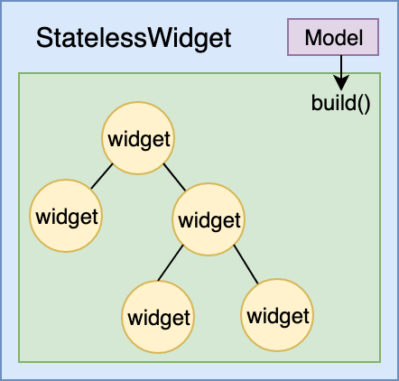
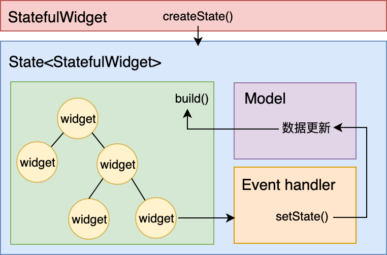

通过上一篇文章，我们已经深入理解了 Widget 是 Flutter 构建界面的基石，也认识了 Widget、Element、RenderObject 是如何互相配合，实现图形渲染工作的。Flutter 在底层做了大量的渲染优化工作，使得我们只需要通过组合、嵌套不同类型的 Widget，就可以构建出任意功能、任意复杂度的界面。

同时，我们通过前面的学习，也已经了解到 Widget 有 StatelessWidget 和 StatefulWidget 两种类型。StatefulWidget 应对有交互、需要动态变化视觉效果的场景，而 StatelessWidget 则用于处理静态的、无状态的视图展示。StatefulWidget 的场景已经完全覆盖了 StatelessWidget，因此我们在构建界面时，往往会大量使用 StatefulWidget 来处理静态的视图展示需求，看起来似乎也没什么问题。

那么，StatelessWidget 存在的必要性在哪里？StatefulWidget 是否是 Flutter 中的万金油？在今天这篇文章中，我将着重和你介绍这两种类型的区别，从而帮你更好地理解 Widget，掌握不同类型 Widget 的正确使用时机。

## UI 编程范式

要想理解 StatelessWidget 与 StatefulWidget 的使用场景，我们首先需要了解，在 Flutter 中，如何调整一个控件（Widget）的展示样式，即 UI 编程范式。
如果你有过原生系统（Android、iOS）或原生 JavaScript 开发经验的话，应该知道视图开发是命令式的，需要精确地告诉操作系统或浏览器用何种方式去做事情。比如，如果我们想要变更界面的某个文案，则需要找到具体的文本控件并调用它的控件方法命令，才能完成文字变更。

下述代码分别展示了在 Android、iOS 及原生 Javascript 中，如何将一个文本控件的展示文案更改为 Hello World：

```
// Android 设置某文本控件展示文案为 Hello World
TextView textView = (TextView) findViewById(R.id.txt);
textView.setText("Hello World");
 
// iOS 设置某文本控件展示文案为 Hello World
UILabel *label = (UILabel *)[self.view viewWithTag:1234];
label.text = @"Hello World";
 
// 原生 JavaScript 设置某文本控件展示文案为 Hello World
document.querySelector("#demo").innerHTML = "Hello World!";
```

与此不同的是，**Flutter 的视图开发是声明式的，其核心设计思想就是将视图和数据分离，这与 React 的设计思路完全一致**。

对我们来说，如果要实现同样的需求，则要稍微麻烦点：除了设计好 Widget 布局方案之外，还需要提前维护一套文案数据集，并为需要变化的 Widget 绑定数据集中的数据，使 Widget 根据这个数据集完成渲染。

但是，当需要变更界面的文案时，我们只要改变数据集中的文案数据，并通知 Flutter 框架触发 Widget 的重新渲染即可。这样一来，开发者将无需再精确关注 UI 编程中的各个过程细节，只要维护好数据集即可。比起命令式的视图开发方式需要挨个设置不同组件（Widget）的视觉属性，这种方式要便捷得多。

**总结来说，命令式编程强调精确控制过程细节；而声明式编程强调通过意图输出结果整体。**对应到 Flutter 中，意图是绑定了组件状态的 State，结果则是重新渲染后的组件。在 Widget 的生命周期内，应用到 State 中的任何更改都将强制 Widget 重新构建。

其中，对于组件完成创建后就无需变更的场景，状态的绑定是可选项。这里“可选”就区分出了 Widget 的两种类型，即：StatelessWidget 不带绑定状态，而 StatefulWidget 带绑定状态。**当你所要构建的用户界面不随任何状态信息的变化而变化时，需要选择使用 StatelessWidget，反之则选用 StatefulWidget。**前者一般用于静态内容的展示，而后者则用于存在交互反馈的内容呈现中。

接下来，我分别和你介绍 StatelessWidget 和 StatefulWidget，从源码分析它们的区别，并总结一些关于 Widget 选型的基本原则。

## StatelessWidget

在 Flutter 中，Widget 采用由父到子、自顶向下的方式进行构建，父 Widget 控制着子 Widget 的显示样式，其样式配置由父 Widget 在构建时提供。

用这种方式构建出的 Widget，有些（比如 Text、Container、Row、Column 等）在创建时，除了这些配置参数之外不依赖于任何其他信息，换句话说，它们一旦创建成功就不再关心、也不响应任何数据变化进行重绘。在 Flutter 中，**这样的 Widget 被称为 StatelessWidget（无状态组件）**。

这里有一张 StatelessWidget 的示意图，如下所示：


图 1 StatelessWidget 示意图

接下来，我以 Text 的部分源码为例，和你说明 StatelessWidget 的构建过程。

```
class Text extends StatelessWidget {     
  // 构造方法及属性声明部分
  const Text(this.data, {
    Key key,
    this.textAlign,
    this.textDirection,
    // 其他参数
    ...
  }) : assert(data != null),
     textSpan = null,
     super(key: key);
     
  final String data;
  final TextAlign textAlign;
  final TextDirection textDirection;
  // 其他属性
  ...
  
  @override
  Widget build(BuildContext context) {
    ...
    Widget result = RichText(
       // 初始化配置
       ...
      )
    );
    ...
    return result;
  }
}
```

可以看到，在构造方法将其属性列表赋值后，build 方法随即将子组件 RichText 通过其属性列表（如文本 data、对齐方式 textAlign、文本展示方向 textDirection 等）初始化后返回，之后 Text 内部不再响应外部数据的变化。

那么，什么场景下应该使用 StatelessWidget 呢？

这里，我有一个简单的判断规则：**父 Widget 是否能通过初始化参数完全控制其 UI 展示效果？**如果能，那么我们就可以使用 StatelessWidget 来设计构造函数接口了。

我准备了两个简单的小例子，来帮助你理解这个判断规则。

第一个小例子是，我需要创建一个自定义的弹窗控件，把使用 App 过程中出现的一些错误信息提示给用户。这个组件的父 Widget，能够完全在子 Widget 初始化时将组件所需要的样式信息和错误提示信息传递给它，也就意味着父 Widget 通过初始化参数就能完全控制其展示效果。所以，我可以采用继承 StatelessWidget 的方式，来进行组件自定义。

第二个小例子是，我需要定义一个计数器按钮，用户每次点击按钮后，按钮颜色都会随之加深。可以看到，这个组件的父 Widget 只能控制子 Widget 初始的样式展示效果，而无法控制在交互过程中发生的颜色变化。所以，我无法通过继承 StatelessWidget 的方式来自定义组件。那么，这个时候就轮到 StatefulWidget 出场了。

## StatefulWidget

与 StatelessWidget 相对应的，有一些 Widget（比如 Image、Checkbox）的展示，除了父 Widget 初始化时传入的静态配置之外，还需要处理用户的交互（比如，用户点击按钮）或其内部数据的变化（比如，网络数据回包），并体现在 UI 上。

换句话说，这些 Widget 创建完成后，还需要关心和响应数据变化来进行重绘。在 Flutter 中，**这一类 Widget 被称为 StatefulWidget（有状态组件）**。这里有一张 StatefulWidget 的示意图，如下所示：


图 2 StatefulWidget 示意图

看到这里，你可能有点困惑了。因为，我在上一篇文章“Widget，构建 Flutter 界面的基石”中和你分享到，Widget 是不可变的，发生变化时需要销毁重建，所以谈不上状态。那么，这到底是怎么回事呢？

其实，StatefulWidget 是以 State 类代理 Widget 构建的设计方式实现的。接下来，我就以 Image 的部分源码为例，和你说明 StatefulWidget 的构建过程，来帮助你理解这个知识点。

和上面提到的 Text 一样，Image 类的构造函数会接收要被这个类使用的属性参数。然而，不同的是，Image 类并没有 build 方法来创建视图，而是通过 createState 方法创建了一个类型为 _ImageState 的 state 对象，然后由这个对象负责视图的构建。

这个 state 对象持有并处理了 Image 类中的状态变化，所以我就以 _imageInfo 属性为例来和你展开说明。

_imageInfo 属性用来给 Widget 加载真实的图片，一旦 State 对象通过 _handleImageChanged 方法监听到 _imageInfo 属性发生了变化，就会立即调用 _ImageState 类的 setState 方法通知 Flutter 框架：“我这儿的数据变啦，请使用更新后的 _imageInfo 数据重新加载图片！”。而，Flutter 框架则会标记视图状态，更新 UI。

```
class Image extends StatefulWidget {
  // 构造方法及属性声明部分
  const Image({
    Key key,
    @required this.image,
    // 其他参数
  }) : assert(image != null),
       super(key: key);
 
  final ImageProvider image;
  // 其他属性
  ...
  
  @override
  _ImageState createState() => _ImageState();
  ...
}
 
class _ImageState extends State<Image> {
  ImageInfo _imageInfo;
  // 其他属性
  ...
 
  void _handleImageChanged(ImageInfo imageInfo, bool synchronousCall) {
    setState(() {
      _imageInfo = imageInfo;
    });
  }
  ...
  @override
  Widget build(BuildContext context) {
    final RawImage image = RawImage(
      image: _imageInfo?.image,
      // 其他初始化配置
      ...
    );
    return image;
  }
 ...
}
```

可以看到，在这个例子中，Image 以一种动态的方式运行：监听变化，更新视图。与 StatelessWidget 通过父 Widget 完全控制 UI 展示不同，StatefulWidget 的父 Widget 仅定义了它的初始化状态，而其自身视图运行的状态则需要自己处理，并根据处理情况即时更新 UI 展示。

好了，至此我们已经通过 StatelessWidget 与 StatefulWidget 的源码，理解了这两种类型的 Widget。这时，你可能会问，既然 StatefulWidget 不仅可以响应状态变化，又能展示静态 UI，那么 StatelessWidget 这种只能展示静态 UI 的 Widget，还有存在的必要吗？

## StatefulWidget 不是万金油，要慎用

对于 UI 框架而言，同样的展示效果一般可以通过多种控件实现。从定义来看，StatefulWidget 仿佛是万能的，替代 StatelessWidget 看起来合情合理。于是 StatefulWidget 的滥用，也容易因此变得顺理成章，难以避免。

但事实是，StatefulWidget 的滥用会直接影响 Flutter 应用的渲染性能。

接下来，在今天这篇文章的最后，我就再带你回顾一下 Widget 的更新机制，来帮你意识到完全使用 StatefulWidget 的代价：

> Widget 是不可变的，更新则意味着销毁 + 重建（build）。StatelessWidget 是静态的，一旦创建则无需更新；而对于 StatefulWidget 来说，在 State 类中调用 setState 方法更新数据，会触发视图的销毁和重建，也将间接地触发其每个子 Widget 的销毁和重建。

那么，这意味着什么呢？

如果我们的根布局是一个 StatefulWidget，在其 State 中每调用一次更新 UI，都将是一整个页面所有 Widget 的销毁和重建。

在上一篇文章中，我们了解到，虽然 Flutter 内部通过 Element 层可以最大程度地降低对真实渲染视图的修改，提高渲染效率，而不是销毁整个 RenderObject 树重建。但，大量 Widget 对象的销毁重建是无法避免的。如果某个子 Widget 的重建涉及到一些耗时操作，那页面的渲染性能将会急剧下降。

因此，**正确评估你的视图展示需求，避免无谓的 StatefulWidget 使用，是提高 Flutter 应用渲染性能最简单也是最直接的手段**。

在接下来的第 29 篇文章“为什么需要做状态管理，怎么做？”中，我会继续带你学习 StatefulWidget 常见的几种状态管理方法，与你更为具体地介绍在不同场景中，该选用何种 Widget 的基本原则。这些原则，你都可以根据实际需要应用到后续工作中。

## 总结

好了，今天关于 StatelessWidget 与 StatefulWidget 的介绍，我们就到这里了。我们一起来回顾下今天的主要知识点。

首先，我带你了解了 Flutter 基于声明式的 UI 编程范式，并通过阅读两个典型 Widget（Text 与 Image）源码的方式，与你一起学习了 StatelessWidget 与 StatefulWidget 的基本设计思路。

由于 Widget 采用由父到子、自顶向下的方式进行构建，因此在自定义组件时，我们可以根据父 Widget 是否能通过初始化参数完全控制其 UI 展示效果的基本原则，来判断究竟是继承 StatelessWidget 还是 StatefulWidget。

然后，针对 StatefulWidget 的“万金油”误区，我带你重新回顾了 Widget 的 UI 更新机制。尽管 Flutter 会通过 Element 层去最大程度降低对真实渲染视图的修改，但大量的 Widget 销毁重建无法避免，因此避免 StatefulWidget 的滥用，是最简单、直接地提升应用渲染性能的手段。

需要注意的是，除了我们主动地通过 State 刷新 UI 之外，在一些特殊场景下，Widget 的 build 方法有可能会执行多次。因此，我们不应该在这个方法内部，放置太多有耗时的操作。而关于这个 build 方法在哪些场景下会执行，以及为什么会执行多次，我会在下一篇文章“提到生命周期，我们是在说什么？”中，与你一起详细分析。

## 思考题

Flutter 工程应用模板是计数器示例应用 Demo，这个 Demo 的根节点是一个 StatelessWidget。请在保持原有功能的情况下，将这个 Demo 改造为根节点为 StatefulWidget 的 App。你能通过数据打点，得出这两种方式的性能差异吗？