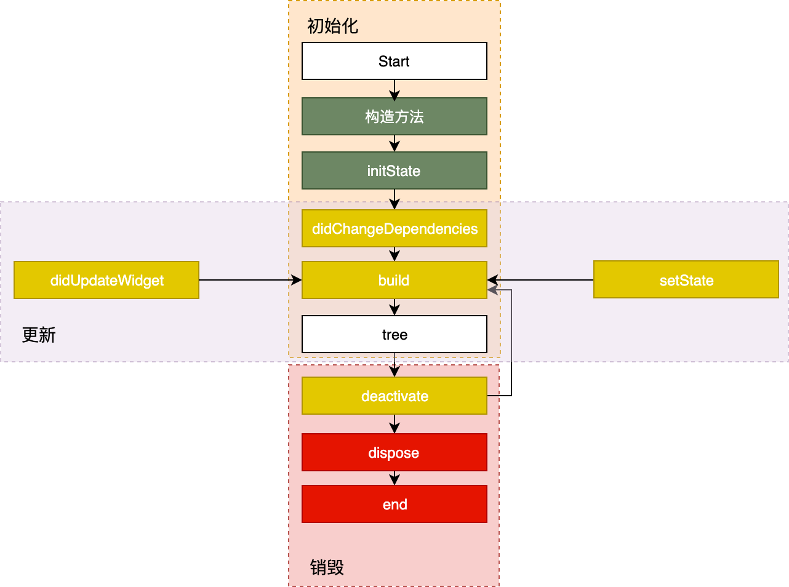

在上一篇文章中，我们从常见的 StatefulWidget 的“万金油”误区出发，一起回顾了 Widget 的 UI 更新机制。

通过父 Widget 初始化时传入的静态配置，StatelessWidget 就能完全控制其静态展示。而 StatefulWidget，还需要借助于 State 对象，在特定的阶段来处理用户的交互或其内部数据的变化，并体现在 UI 上。这些特定的阶段，就涵盖了一个组件从加载到卸载的全过程，即生命周期。与 iOS 的 ViewController、Android 的 Activity 一样，Flutter 中的 Widget 也存在生命周期，并且通过 State 来体现。

而 App 则是一个特殊的 Widget。除了需要处理视图显示的各个阶段（即视图的生命周期）之外，还需要应对应用从启动到退出所经历的各个状态（App 的生命周期）。

对于开发者来说，无论是普通 Widget（的 State）还是 App，框架都给我们提供了生命周期的回调，可以让我们选择恰当的时机，做正确的事儿。所以，在对生命周期有了深入理解之后，我们可以写出更加连贯流畅、体验优良的程序。

那么，今天我就分别从 Widget（的 State）和 App 这两个维度，与你介绍它们的生命周期。

## State 生命周期

State 的生命周期，指的是在用户参与的情况下，其关联的 Widget 所经历的，从创建到显示再到更新最后到停止，直至销毁等各个过程阶段。
这些不同的阶段涉及到特定的任务处理，因此为了写出一个体验和性能良好的控件，正确理解 State 的生命周期至关重要。
State 的生命周期流程，如图 1 所示：


图 1 State 生命周期图

可以看到，State 的生命周期可以分为 3 个阶段：创建（插入视图树）、更新（在视图树中存在）、销毁（从视图树中移除）。接下来，我们一起看看每一个阶段的具体流程。

### 创建

State 初始化时会依次执行 ：构造方法 -> initState -> didChangeDependencies -> build，随后完成页面渲染。
我们来看一下初始化过程中每个方法的意义。

- 构造方法是 State 生命周期的起点，Flutter 会通过调用 StatefulWidget.createState() 来创建一个 State。我们可以通过构造方法，来接收父 Widget 传递的初始化 UI 配置数据。这些配置数据，决定了 Widget 最初的呈现效果。
- initState，会在 State 对象被插入视图树的时候调用。这个函数在 State 的生命周期中只会被调用一次，所以我们可以在这里做一些初始化工作，比如为状态变量设定默认值。
- didChangeDependencies 则用来专门处理 State 对象依赖关系变化，会在 initState() 调用结束后，被 Flutter 调用。
- build，作用是构建视图。经过以上步骤，Framework 认为 State 已经准备好了，于是调用 build。我们需要在这个函数中，根据父 Widget 传递过来的初始化配置数据，以及 State 的当前状态，创建一个 Widget 然后返回。

### 更新

Widget 的状态更新，主要由 3 个方法触发：setState、didchangeDependencies 与 didUpdateWidget。

接下来，我和你分析下这三个方法分别会在什么场景下调用。

- setState：我们最熟悉的方法之一。当状态数据发生变化时，我们总是通过调用这个方法告诉 Flutter：“我这儿的数据变啦，请使用更新后的数据重建 UI！”
- didChangeDependencies：State 对象的依赖关系发生变化后，Flutter 会回调这个方法，随后触发组件构建。哪些情况下 State 对象的依赖关系会发生变化呢？典型的场景是，系统语言 Locale 或应用主题改变时，系统会通知 State 执行 didChangeDependencies 回调方法。
- didUpdateWidget：当 Widget 的配置发生变化时，比如，父 Widget 触发重建（即父 Widget 的状态发生变化时），热重载时，系统会调用这个函数。

一旦这三个方法被调用，Flutter 随后就会销毁老 Widget，并调用 build 方法重建 Widget。

### 销毁

组件销毁相对比较简单。比如组件被移除，或是页面销毁的时候，系统会调用 deactivate 和 dispose 这两个方法，来移除或销毁组件。
接下来，我们一起看一下它们的具体调用机制：

- 当组件的可见状态发生变化时，deactivate 函数会被调用，这时 State 会被暂时从视图树中移除。值得注意的是，页面切换时，由于 State 对象在视图树中的位置发生了变化，需要先暂时移除后再重新添加，重新触发组件构建，因此这个函数也会被调用。
- 当 State 被永久地从视图树中移除时，Flutter 会调用 dispose 函数。而一旦到这个阶段，组件就要被销毁了，所以我们可以在这里进行最终的资源释放、移除监听、清理环境，等等。

如图 2 所示，左边部分展示了当父 Widget 状态发生变化时，父子双方共同的生命周期；而中间和右边部分则描述了页面切换时，两个关联的 Widget 的生命周期函数是如何响应的。


图 2 几种常见场景下 State 生命周期图

我准备了一张表格，从功能，调用时机和调用次数的维度总结了这些方法，帮助你去理解、记忆。


图 3 State 生命周期中的方法调用对比

另外，我强烈建议你打开自己的 IDE，在应用模板中增加以上回调函数并添加打印代码，多运行几次看看各个函数的执行顺序，从而加深对 State 生命周期的印象。毕竟，实践出真知。

## App 生命周期

视图的生命周期，定义了视图的加载到构建的全过程，其回调机制能够确保我们可以根据视图的状态选择合适的时机做恰当的事情。而 App 的生命周期，则定义了 App 从启动到退出的全过程。
在原生 Android、iOS 开发中，有时我们需要在对应的 App 生命周期事件中做相应处理，比如 App 从后台进入前台、从前台退到后台，或是在 UI 绘制完成后做一些处理。
这样的需求，在原生开发中，我们可以通过重写 Activity、ViewController 生命周期回调方法，或是注册应用程序的相关通知，来监听 App 的生命周期并做相应的处理。而在 Flutter 中，我们可以利用**WidgetsBindingObserver**类，来实现同样的需求。

接下来，我们就来看看具体如何实现这样的需求。

首先，我们来看看 WidgetsBindingObserver 中具体有哪些回调函数：

```
abstract class WidgetsBindingObserver {
  // 页面 pop
  Future<bool> didPopRoute() => Future<bool>.value(false);
  // 页面 push
  Future<bool> didPushRoute(String route) => Future<bool>.value(false);
  // 系统窗口相关改变回调，如旋转
  void didChangeMetrics() { }
  // 文本缩放系数变化
  void didChangeTextScaleFactor() { }
  // 系统亮度变化
  void didChangePlatformBrightness() { }
  // 本地化语言变化
  void didChangeLocales(List<Locale> locale) { }
  //App 生命周期变化
  void didChangeAppLifecycleState(AppLifecycleState state) { }
  // 内存警告回调
  void didHaveMemoryPressure() { }
  //Accessibility 相关特性回调
  void didChangeAccessibilityFeatures() {}
}
```

可以看到，WidgetsBindingObserver 这个类提供的回调函数非常丰富，常见的屏幕旋转、屏幕亮度、语言变化、内存警告都可以通过这个实现进行回调。我们通过给 WidgetsBinding 的单例对象设置监听器，就可以监听对应的回调方法。

考虑到其他的回调相对简单，你可以参考[官方文档](https://api.flutter.dev/flutter/widgets/WidgetsBindingObserver-class.html)，对照着进行练习。因此，我今天主要和你分享 App 生命周期的回调 didChangeAppLifecycleState，和帧绘制回调 addPostFrameCallback 与 addPersistentFrameCallback。

### 生命周期回调

didChangeAppLifecycleState 回调函数中，有一个参数类型为 AppLifecycleState 的枚举类，这个枚举类是 Flutter 对 App 生命周期状态的封装。它的常用状态包括 resumed、inactive、paused 这三个。

- resumed：可见的，并能响应用户的输入。
- inactive：处在不活动状态，无法处理用户响应。
- paused：不可见并不能响应用户的输入，但是在后台继续活动中。

这里，我来和你分享一个实际案例。

在下面的代码中，我们在 initState 时注册了监听器，在 didChangeAppLifecycleState 回调方法中打印了当前的 App 状态，最后在 dispose 时把监听器移除：

```
class _MyHomePageState extends State<MyHomePage>  with WidgetsBindingObserver{// 这里你可以再回顾下，第 7 篇文章“函数、类与运算符：Dart 是如何处理信息的？”中关于 Mixin 的内容
...
  @override
  @mustCallSuper
  void initState() {
    super.initState();
    WidgetsBinding.instance.addObserver(this);// 注册监听器
  }
  @override
  @mustCallSuper
  void dispose(){
    super.dispose();
    WidgetsBinding.instance.removeObserver(this);// 移除监听器
  }
  @override
  void didChangeAppLifecycleState(AppLifecycleState state) async {
    print("$state");
    if (state == AppLifecycleState.resumed) {
      //do sth
    }
  }
}
```

我们试着切换一下前、后台，观察控制台输出的 App 状态，可以发现：

- 从后台切入前台，控制台打印的 App 生命周期变化如下: AppLifecycleState.paused->AppLifecycleState.inactive->AppLifecycleState.resumed；
- 从前台退回后台，控制台打印的 App 生命周期变化则变成了：AppLifecycleState.resumed->AppLifecycleState.inactive->AppLifecycleState.paused。

可以看到，App 前后台切换过程中打印出的状态是完全符合预期的。


图 4 App 切换前后台状态变化示意

### 帧绘制回调

除了需要监听 App 的生命周期回调做相应的处理之外，有时候我们还需要在组件渲染之后做一些与显示安全相关的操作。

在 iOS 开发中，我们可以通过 dispatch_async(dispatch_get_main_queue(),^{…}) 方法，让操作在下一个 RunLoop 执行；而在 Android 开发中，我们可以通过 View.post() 插入消息队列，来保证在组件渲染后进行相关操作。

其实，**在 Flutter 中实现同样的需求会更简单**：依然使用万能的 WidgetsBinding 来实现。

WidgetsBinding 提供了单次 Frame 绘制回调，以及实时 Frame 绘制回调两种机制，来分别满足不同的需求：

- 单次 Frame 绘制回调，通过 addPostFrameCallback 实现。它会在当前 Frame 绘制完成后进行进行回调，并且只会回调一次，如果要再次监听则需要再设置一次。

```
WidgetsBinding.instance.addPostFrameCallback((_){
    print(" 单次 Frame 绘制回调 ");// 只回调一次
  });
```

- 实时 Frame 绘制回调，则通过 addPersistentFrameCallback 实现。这个函数会在每次绘制 Frame 结束后进行回调，可以用做 FPS 监测。

```
WidgetsBinding.instance.addPersistentFrameCallback((_){
  print(" 实时 Frame 绘制回调 ");// 每帧都回调
});
```

## 总结

在今天这篇文章中，我和你介绍了 State 和 App 的生命周期，这是 Flutter 给我们提供的，感知 Widget 和应用在不同阶段状态变化的回调。

首先，我带你重新认识了 Widget 生命周期的实际承载者 State。我将 State 的生命周期划分为了创建（插入视图树）、更新（在视图树中存在）、销毁（从视图树种移除）这 3 个阶段，并为你介绍了每个阶段中涉及的关键方法，希望你能够深刻理解 Flutter 组件从加载到卸载的完整周期。

然后，通过与原生 Android、iOS 平台能力的对比，以及查看 WidgetsBindingObserver 源码的方式，我与你讲述了 Flutter 常用的生命周期状态切换机制。希望你能掌握 Flutter 的 App 生命周期监听方法，并理解 Flutter 常用的生命周期状态切换机制。

最后，我和你一起学习了 Flutter 帧绘制回调机制，理解了单次 Frame 绘制回调与实时 Frame 绘制回调的异同与使用场景。

为了能够精确地控制 Widget，Flutter 提供了很多状态回调，所以今天这一篇文章，涉及到的方法有些多。但，**只要你分别记住创建、更新与销毁这三条主线的调用规则，就一定能把这些方法的调用顺序串起来，并能在实际开发中运用正确的方法去感知状态变更，写出合理的组件。**

我把今天分享所涉及的全部知识点打包成了一个[小项目](https://github.com/cyndibaby905/11_Flutter_lifecycle)，你可以下载后在工程中实际运行，并对照着今天的课程学习，体会在不同场景下这些函数的调用时机。

## 思考题

最后，请你思考下这两个问题：

1. 构造方法与 initState 函数在 State 的生命周期中都只会被调用一次，也大都用于完成一些初始化的工作。根据我们今天的学习，你能否举出例子，比如哪些操作适合放在构造方法，哪些操作适合放在 initState，而哪些操作必须放在 initState。
2. 通过 didChangeDependencies 触发 Widget 重建时，父子 Widget 之间的生命周期函数调用时序是怎样的？