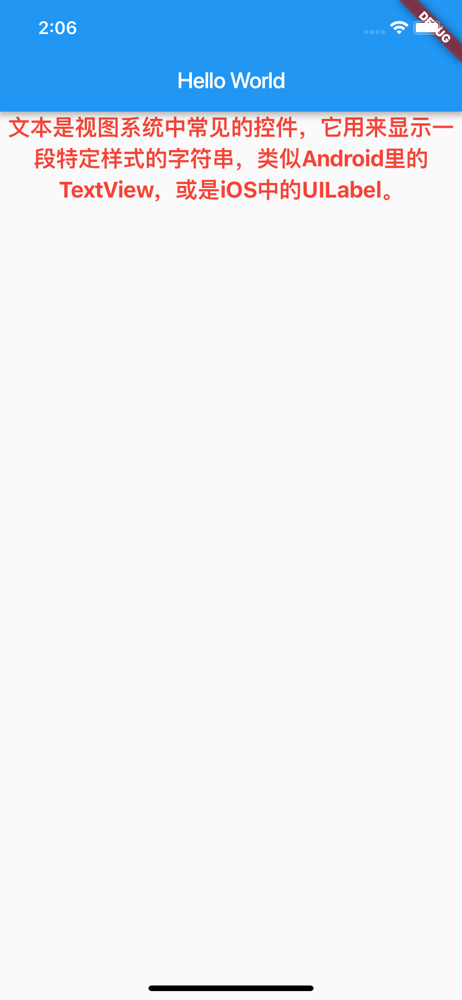
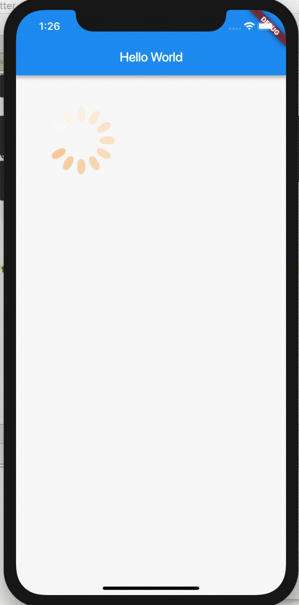

在上一篇文章中，我与你介绍了 Widget 生命周期的实际承载者 State，并详细介绍了初始化、状态更新与控件销毁，这 3 个不同阶段所涉及的关键方法调用顺序。深入理解视图从加载到构建再到销毁的过程，可以帮助你理解如何根据视图的状态在合适的时机做恰当的事情。

前面几次分享我们讲了很多关于 Flutter 框架视图渲染的基础知识和原理。但有些同学可能会觉得这些基础知识和原理在实践中并不常用，所以在学习时会选择忽视这些内容。

但其实，像视图数据流转机制、底层渲染方案、视图更新策略等知识，都是构成一个 UI 框架的根本，看似枯燥，却往往具有最长久的生命力。新框架每年层出不穷，可是扒下那层炫酷的“外衣”，里面其实还是那些最基础的知识和原理。

因此，**只有把这些最基础的知识弄明白了，修炼好了内功，才能触类旁通，由点及面形成自己的知识体系，也能够在框架之上思考应用层构建视图实现的合理性。**

在对视图的基础知识有了整体印象后，我们再来学习 Flutter 视图系统所提供的 UI 控件，就会事半功倍了。而作为一个 UI 框架，与 Android、iOS 和 React 类似的，Flutter 自然也提供了很多 UI 控件。而文本、图片和按钮则是这些不同的 UI 框架中构建视图都要用到的三个最基本的控件。因此，在今天这篇文章中，我就与你一起学习在 Flutter 中该如何使用它们。

## 文本控件

文本是视图系统中的常见控件，用来显示一段特定样式的字符串，就比如 Android 里的 TextView、iOS 中的 UILabel。而在 Flutter 中，文本展示是通过 Text 控件实现的。

Text 支持两种类型的文本展示，一个是默认的展示单一样式的文本 Text，另一个是支持多种混合样式的富文本 Text.rich。

我们先来看看**如何使用单一样式的文本 Text**。

单一样式文本 Text 的初始化，是要传入需要展示的字符串。而这个字符串的具体展示效果，受构造函数中的其他参数控制。这些参数大致可以分为两类：

- **控制整体文本布局的参数**，如文本对齐方式 textAlign、文本排版方向 textDirection，文本显示最大行数 maxLines、文本截断规则 overflow 等等，这些都是构造函数中的参数；
- **控制文本展示样式的参数**，如字体名称 fontFamily、字体大小 fontSize、文本颜色 color、文本阴影 shadows 等等，这些参数被统一封装到了构造函数中的参数 style 中。

接下来，我们以一个具体的例子来看看 Text 控件的使用方法。如下所示，我在代码中定义了一段居中布局、20 号红色粗体展示样式的字符串：

```
Text(
  '文本是视图系统中的常见控件，用来显示一段特定样式的字符串，就比如 Android 里的 TextView，或是 iOS 中的 UILabel。',
  textAlign: TextAlign.center,// 居中显示
  style: TextStyle(fontWeight: FontWeight.bold, fontSize: 20, color: Colors.red),//20 号红色粗体展示
);
```

运行效果如下图所示：


图 1 单一样式文本 Text 示例

理解了展示单一样式的文本 Text 的使用方法后，我们再来看看**如何在一段字符串中支持多种混合展示样式**。

**混合展示样式与单一样式的关键区别在于分片**，即如何把一段字符串分为几个片段来管理，给每个片段单独设置样式。面对这样的需求，在 Android 中，我们使用 SpannableString 来实现；在 iOS 中，我们使用 NSAttributedString 来实现；而在 Flutter 中也有类似的概念，即 TextSpan。
TextSpan 定义了一个字符串片段该如何控制其展示样式，而将这些有着独立展示样式的字符串组装在一起，则可以支持混合样式的富文本展示。

如下方代码所示，我们分别定义了黑色与红色两种展示样式，随后把一段字符串分成了 4 个片段，并设置了不同的展示样式：

```
TextStyle blackStyle = TextStyle(fontWeight: FontWeight.normal, fontSize: 20, color: Colors.black); // 黑色样式
 
TextStyle redStyle = TextStyle(fontWeight: FontWeight.bold, fontSize: 20, color: Colors.red); // 红色样式
 
Text.rich(
    TextSpan(
        children: <TextSpan>[
          TextSpan(text:'文本是视图系统中常见的控件，它用来显示一段特定样式的字符串，类似', style: redStyle), // 第 1 个片段，红色样式 
          TextSpan(text:'Android', style: blackStyle), // 第 1 个片段，黑色样式 
          TextSpan(text:'中的', style:redStyle), // 第 1 个片段，红色样式 
          TextSpan(text:'TextView', style: blackStyle) // 第 1 个片段，黑色样式 
        ]),
  textAlign: TextAlign.center,
);
```

运行效果，如下图所示：
:-:
图 2 混合样式富文本 Text.rich 示例

接下来，我们再看看 Flutter 中的图片控件 Image。

## 图片

使用 Image，可以让我们向用户展示一张图片。图片的显示方式有很多，比如资源图片、网络图片、文件图片等，图片格式也各不相同，因此在 Flutter 中也有多种方式，用来加载不同形式、支持不同格式的图片：

- 加载本地资源图片，如 Image.asset(‘images/logo.png’)；
- 加载本地（File 文件）图片，如 Image.file(new File(’/storage/xxx/xxx/test.jpg’))；
- 加载网络图片，如 Image.network(`'http://xxx/xxx/test.gif'`) 。

除了可以根据图片的显示方式设置不同的图片源之外，图片的构造方法还提供了填充模式 fit、拉伸模式 centerSlice、重复模式 repeat 等属性，可以针对图片与目标区域的宽高比差异制定排版模式。

这，和 Android 中 ImageView、iOS 里的 UIImageView 的属性都是类似的。因此，我在这里就不再过多展开了。你可以参考官方文档中的[Image 的构造函数](https://api.flutter.dev/flutter/widgets/Image/Image.html)部分，去查看 Image 控件的具体使用方法。

关于图片展示，我还要和你分享下 Flutter 中的**FadeInImage**控件。在加载网络图片的时候，为了提升用户的等待体验，我们往往会加入占位图、加载动画等元素，但是默认的 Image.network 构造方法并不支持这些高级功能，这时候 FadeInImage 控件就派上用场了。

FadeInImage 控件提供了图片占位的功能，并且支持在图片加载完成时淡入淡出的视觉效果。此外，由于 Image 支持 gif 格式，我们甚至还可以将一些炫酷的加载动画作为占位图。

下述代码展示了这样的场景。我们在加载大图片时，将一张 loading 的 gif 作为占位图展示给用户：

```
FadeInImage.assetNetwork(
  placeholder: 'assets/loading.gif', //gif 占位
  image: 'https://xxx/xxx/xxx.jpg',
  fit: BoxFit.cover, // 图片拉伸模式
  width: 200,
  height: 200,
)
```


图 3 FadeInImage 占位图

Image 控件需要根据图片资源异步加载的情况，决定自身的显示效果，因此是一个 StatefulWidget。图片加载过程由 ImageProvider 触发，而 ImageProvider 表示异步获取图片数据的操作，可以从资源、文件和网络等不同的渠道获取图片。

首先，ImageProvider 根据 _ImageState 中传递的图片配置生成对应的图片缓存 key；然后，去 ImageCache 中查找是否有对应的图片缓存，如果有，则通知 _ImageState 刷新 UI；如果没有，则启动 ImageStream 开始异步加载，加载完毕后，更新缓存；最后，通知 _ImageState 刷新 UI。

图片展示的流程，可以用以下流程图表示：


图 4 图片加载流程

值得注意的是，ImageCache 使用 LRU（Least Recently Used，最近最少使用）算法进行缓存更新策略，并且默认最多存储 1000 张图片，最大缓存限制为 100MB，当限定的空间已存满数据时，把最久没有被访问到的图片清除。图片**缓存只会在运行期间生效，也就是只缓存在内存中**。如果想要支持缓存到文件系统，可以使用第三方的[CachedNetworkImage](https://pub.dev/packages/cached_network_image/)控件。

CachedNetworkImage 的使用方法与 Image 类似，除了支持图片缓存外，还提供了比 FadeInImage 更为强大的加载过程占位与加载错误占位，可以支持比用图片占位更灵活的自定义控件占位。

在下面的代码中，我们在加载图片时，不仅给用户展示了作为占位的转圈 loading，还提供了一个错误图兜底，以备图片加载出错：

```
CachedNetworkImage(
        imageUrl: "http://xxx/xxx/jpg",
        placeholder: (context, url) => CircularProgressIndicator(),
        errorWidget: (context, url, error) => Icon(Icons.error),
     )
```

最后，我们再来看看 Flutter 中的按钮控件。

## 按钮

通过按钮，我们可以响应用户的交互事件。Flutter 提供了三个基本的按钮控件，即 FloatingActionButton、FlatButton 和 RaisedButton。

- FloatingActionButton：一个圆形的按钮，一般出现在屏幕内容的前面，用来处理界面中最常用、最基础的用户动作。在之前的第 5 篇文章“[从标准模板入手，体会 Flutter 代码是如何运行在原生系统上的](https://time.geekbang.org/column/article/106199)”中，计数器示例的“+”悬浮按钮就是一个 FloatingActionButton。
- RaisedButton：凸起的按钮，默认带有灰色背景，被点击后灰色背景会加深。
- FlatButton：扁平化的按钮，默认透明背景，被点击后会呈现灰色背景。

这三个按钮控件的使用方法类似，唯一的区别只是默认样式不同而已。

下述代码中，我分别定义了 FloatingActionButton、FlatButton 与 RaisedButton，它们的功能完全一样，在点击时打印一段文字：

```
FloatingActionButton(onPressed: () => print('FloatingActionButton pressed'),child: Text('Btn'),);
FlatButton(onPressed: () => print('FlatButton pressed'),child: Text('Btn'),);
RaisedButton(onPressed: () => print('RaisedButton pressed'),child: Text('Btn'),);
```


图 5 按钮控件

既然是按钮，因此除了控制基本样式之外，还需要响应用户点击行为。这就对应着按钮控件中的两个最重要的参数了：

- onPressed 参数用于设置点击回调，告诉 Flutter 在按钮被点击时通知我们。如果 onPressed 参数为空，则按钮会处于禁用状态，不响应用户点击。
- child 参数用于设置按钮的内容，告诉 Flutter 控件应该长成什么样，也就是控制着按钮控件的基本样式。child 可以接收任意的 Widget，比如我们在上面的例子中传入的 Text，除此之外我们还可以传入 Image 等控件。

虽然我们可以通过 child 参数来控制按钮控件的基本样式，但是系统默认的样式还是太单调了。因此通常情况下，我们还是会进行控件样式定制。

与 Text 控件类似，按钮控件也提供了丰富的样式定制功能，比如背景颜色 color、按钮形状 shape、主题颜色 colorBrightness，等等。

接下来，我就以 FlatButton 为例，与你介绍按钮的样式定制：

```
FlatButton(
    color: Colors.yellow, // 设置背景色为黄色
    shape:BeveledRectangleBorder(borderRadius: BorderRadius.circular(20.0)), // 设置斜角矩形边框
    colorBrightness: Brightness.light, // 确保文字按钮为深色
    onPressed: () => print('FlatButton pressed'), 
    child: Row(children: <Widget>[Icon(Icons.add), Text("Add")],)
)；
```

可以看到，我们将一个加号 Icon 与文本组合，定义了按钮的基本外观；随后通过 shape 来指定其外形为一个斜角矩形边框，并将按钮的背景色设置为黄色。
因为按钮背景颜色是浅色的，为避免按钮文字看不清楚，我们通过设置按钮主题 colorBrightness 为 Brightness.light，保证按钮文字颜色为深色。
展示效果如下：


图 6 按钮控件定制外观

## 总结

UI 控件是构建一个视图的基本元素，而文本、图片和按钮则是其中最经典的控件。
接下来，我们简单回顾一下今天的内容，以便加深理解与记忆。
首先，我们认识了支持单一样式和混合样式两种类型的文本展示控件 Text。其中，通过 TextStyle 控制字符串的展示样式，其他参数控制文本布局，可以实现单一样式的文本展示；而通过 TextSpan 将字符串分割为若干片段，对每个片段单独设置样式后组装，可以实现支持混合样式的富文本展示。
然后，我带你学习了支持多种图片源加载方式的图片控件 Image。Image 内部通过 ImageProvider 根据缓存状态，触发异步加载流程，通知 _ImageState 刷新 UI。不过，由于图片缓存是内存缓存，因此只在运行期间生效。如果要支持缓存到文件系统，可以使用第三方的 CachedNetworkImage。
最后，我们学习了按钮控件。Flutter 提供了多种按钮控件，而它们的使用方法也都类似。其中，控件初始化的 child 参数用于设置按钮长什么样，而 onPressed 参数则用于设置点击回调。与 Text 类似，按钮内部也有丰富的 UI 定制接口，可以满足开发者的需求。
通过今天的学习，我们可以发现，在 UI 基本信息的表达上，Flutter 的经典控件与原生 Android、iOS 系统提供的控件没有什么本质区别。但是，在自定义控件样式上，Flutter 的这些经典控件提供了强大而简洁的扩展能力，使得我们可以快速开发出功能复杂、样式丰富的页面。

## 思考题

最后，我给你留下一道思考题吧。
请你打开 IDE，阅读 Flutter SDK 中 Text、Image、FadeInImage，以及按钮控件 FloatingActionButton、FlatButton 与 RaisedButton 的源码，在 build 函数中找出在内部真正承载其视觉功能的控件。请和我分享下，你在这一过程中发现了什么现象？