在前面两篇文章中，我们一起学习了构建视图的基本元素：文本、图片和按钮，用于展示一组连续视图元素的 ListView，以及处理多重嵌套的可滚动视图的 CustomScrollView。

在 Flutter 中，一个完整的界面通常就是由这些小型、单用途的基本控件元素依据特定的布局规则堆砌而成的。那么今天，我就带你一起学习一下，在 Flutter 中，搭建出一个漂亮的布局，我们需要了解哪些布局规则，以及这些规则与其他平台类似概念的差别在哪里。希望这样的设计，可以帮助你站在已有经验的基础上去高效学习 Flutter 的布局规则。

我们已经知道，在 Flutter 中一切皆 Widget，那么布局也不例外。但与基本控件元素不同，布局类的 Widget 并不会直接呈现视觉内容，而是作为承载其他子 Widget 的容器。

这些布局类的 Widget，内部都会包含一个或多个子控件，并且都提供了摆放子控件的不同布局方式，可以实现子控件的对齐、嵌套、层叠和缩放等。而我们要做的就是，通过各种定制化的参数，将其内部的子 Widget 依照自己的布局规则放置在特定的位置上，最终形成一个漂亮的布局。

Flutter 提供了 31 种[布局 Widget](https://flutter.dev/docs/development/ui/widgets/layout)，对布局控件的划分非常详细，一些相同（或相似）的视觉效果可以通过多种布局控件实现，因此布局类型相比原生 Android、iOS 平台多了不少。比如，Android 布局一般就只有 FrameLayout、LinearLayout、RelativeLayout、GridLayout 和 TableLayout 这 5 种，而 iOS 的布局更少，只有 Frame 布局和自动布局两种。

为了帮你建立起对布局类 Widget 的认知，了解基本布局类 Widget 的布局特点和用法，从而学以致用快速上手开发，在今天的这篇文章中，我特意挑选了几类在开发 Flutter 应用时，最常用也最有代表性的布局 Widget，包括单子 Widget 布局、多子 Widget 布局、层叠 Widget 布局，与你展开介绍。

掌握了这些典型的 Widget，你也就基本掌握了构建一个界面精美的 App 所需要的全部布局方式了。接下来，我们就先从单子 Widget 布局聊起吧。

## 单子 Widget 布局：Container、Padding 与 Center

单子 Widget 布局类容器比较简单，一般用来对其唯一的子 Widget 进行样式包装，比如限制大小、添加背景色样式、内间距、旋转变换等。这一类布局 Widget，包括 Container、Padding 与 Center 三种。
Container，是一种允许在其内部添加其他控件的控件，也是 UI 框架中的一个常见概念。
在 Flutter 中，Container 本身可以单独作为控件存在（比如单独设置背景色、宽高），也可以作为其他控件的父级存在：Container 可以定义布局过程中子 Widget 如何摆放，以及如何展示。与其他框架不同的是，**Flutter 的 Container 仅能包含一个子 Widget**。
所以，对于多个子 Widget 的布局场景，我们通常会这样处理：先用一个根 Widget 去包装这些子 Widget，然后把这个根 Widget 放到 Container 中，再由 Container 设置它的对齐 alignment、边距 padding 等基础属性和样式属性。
接下来，我通过一个示例，与你演示如何定义一个 Container。

在这个示例中，我将一段较长的文字，包装在一个红色背景、圆角边框的、固定宽高的 Container 中，并分别设置了 Container 的外边距（距离其父 Widget 的边距）和内边距（距离其子 Widget 的边距）：

```
Container(
  child: Text('Container（容器）在 UI 框架中是一个很常见的概念，Flutter 也不例外。'),
  padding: EdgeInsets.all(18.0), // 内边距
  margin: EdgeInsets.all(44.0), // 外边距
  width: 180.0,
  height:240,
  alignment: Alignment.center, // 子 Widget 居中对齐
  decoration: BoxDecoration( //Container 样式
    color: Colors.red, // 背景色
    borderRadius: BorderRadius.circular(10.0), // 圆角边框
  ),
)
```

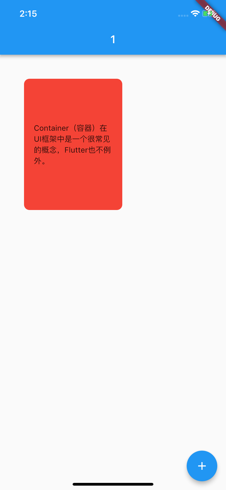
图 1 Container 示例

如果我们只需要将子 Widget 设定间距，则可以使用另一个单子容器控件 Padding 进行内容填充：

```
Padding(
  padding: EdgeInsets.all(44.0),
  child: Text('Container（容器）在 UI 框架中是一个很常见的概念，Flutter 也不例外。'),
);
```

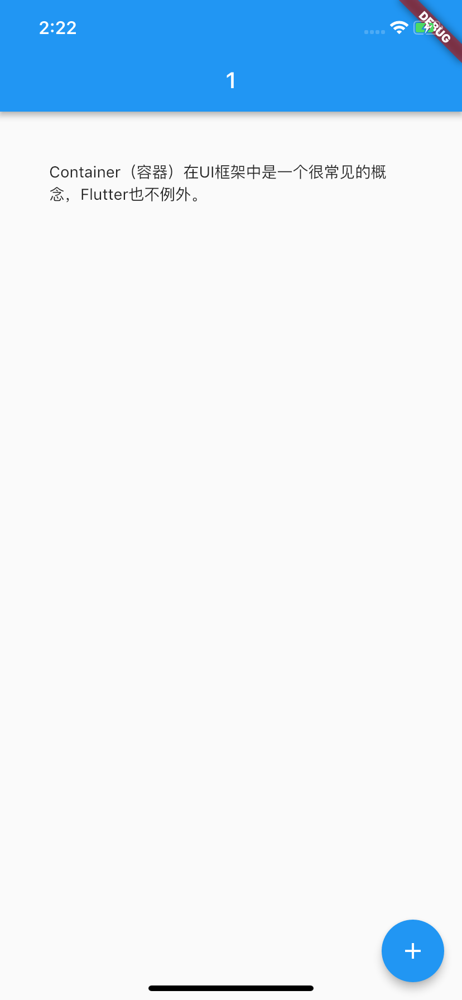
图 2 Padding 示例

在需要设置内容间距时，我们可以通过 EdgeInsets 的不同构造函数，分别制定四个方向的不同补白方式，如均使用同样数值留白、只设置左留白或对称方向留白等。如果你想更深入地了解这部分内容，可以参考这个[API 文档](https://api.flutter.dev/flutter/painting/EdgeInsets-class.html#constructors)。

接下来，我们再来看看单子 Widget 布局容器中另一个常用的容器 Center。正如它的名字一样，Center 会将其子 Widget 居中排列。

比如，我们可以把一个 Text 包在 Center 里，实现居中展示：

```
Scaffold(
  body: Center(child: Text("Hello")) // This trailing comma makes auto-formatting nicer for build methods.
);
```

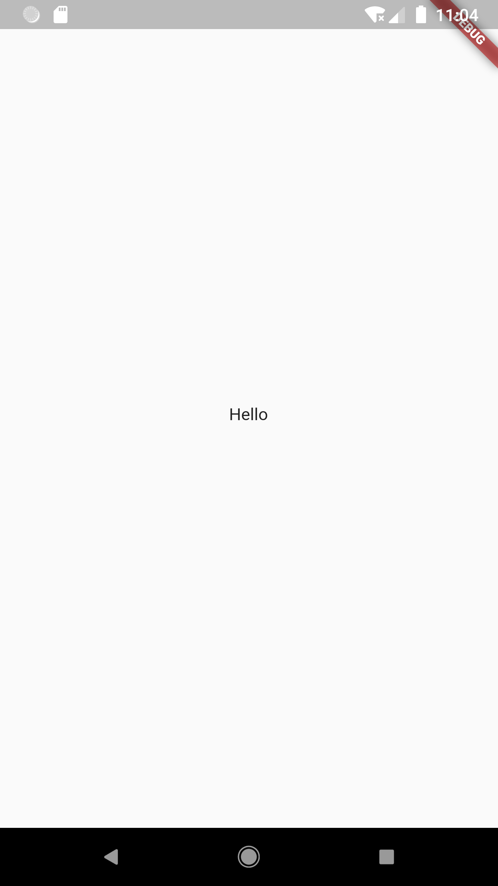
图 3 Center 示例

需要注意的是，为了实现居中布局，Center 所占据的空间一定要比其子 Widget 要大才行，这也是显而易见的：如果 Center 和其子 Widget 一样大，自然就不需要居中，也没空间居中了。因此 Center 通常会结合 Container 一起使用。

现在，我们结合 Container，一起看看 Center 的具体使用方法吧。

```
Container(
  child: Center(child: Text('Container（容器）在 UI 框架中是一个很常见的概念，Flutter 也不例外。')),
  padding: EdgeInsets.all(18.0), // 内边距
  margin: EdgeInsets.all(44.0), // 外边距
  width: 180.0,
  height:240,
  decoration: BoxDecoration( //Container 样式
    color: Colors.red, // 背景色
    borderRadius: BorderRadius.circular(10.0), // 圆角边框
  ),
);
```

可以看到，我们通过 Center 容器实现了 Container 容器中**alignment: Alignment.center**的效果。
事实上，为了达到这一效果，Container 容器与 Center 容器底层都依赖了同一个容器 Align，通过它实现子 Widget 的对齐方式。Align 的使用也比较简单，如果你想深入了解的话，可以参考[官方文档](https://api.flutter.dev/flutter/widgets/Align-class.html)，这里我就不再过多介绍了。

接下来，我们再看看多子 Widget 布局的三种方式，即 Row、Column 与 Expanded。

## 多子 Widget 布局：Row、Column 与 Expanded

对于拥有多个子 Widget 的布局类容器而言，其布局行为无非就是两种规则的抽象：水平方向上应该如何布局、垂直方向上应该如何布局。

如同 Android 的 LinearLayout、前端的 Flex 布局一样，Flutter 中也有类似的概念，即将子 Widget 按行水平排列的 Row，按列垂直排列的 Column，以及负责分配这些子 Widget 在布局方向（行 / 列）中剩余空间的 Expanded。

Row 与 Column 的使用方法很简单，我们只需要将各个子 Widget 按序加入到 chiildren 数组即可。在下面的代码中，我们把 4 个分别设置了不同的颜色和宽高的 Container 加到 Row 与 Column 中：

```
//Row 的用法示范
Row(
  children: <Widget>[
    Container(color: Colors.yellow, width: 60, height: 80,),
    Container(color: Colors.red, width: 100, height: 180,),
    Container(color: Colors.black, width: 60, height: 80,),
    Container(color: Colors.green, width: 60, height: 80,),
  ],
);
 
//Column 的用法示范
Column(
  children: <Widget>[
    Container(color: Colors.yellow, width: 60, height: 80,),
    Container(color: Colors.red, width: 100, height: 180,),
    Container(color: Colors.black, width: 60, height: 80,),
    Container(color: Colors.green, width: 60, height: 80,),
  ],
);
```

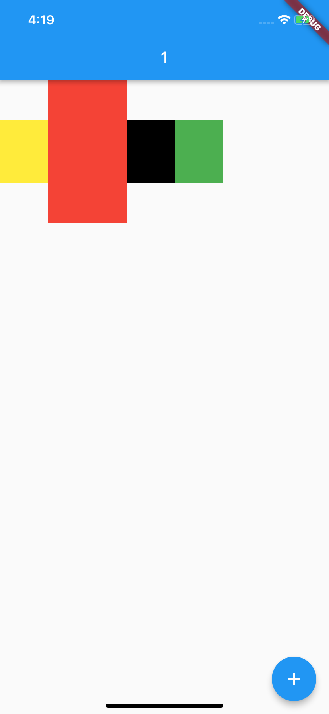
(a)Row 示例

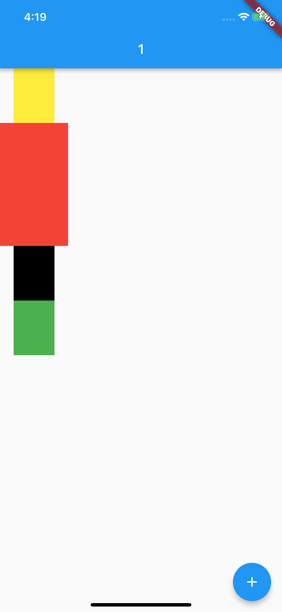
(b)Column 示例
图 4 Row 与 Column 示例

可以看到，单纯使用 Row 和 Column 控件，在子 Widget 的尺寸较小时，无法将容器填满，视觉样式比较难看。对于这样的场景，我们可以通过 Expanded 控件，来制定分配规则填满容器的剩余空间。
比如，我们希望 Row 组件（或 Column 组件）中的绿色容器与黄色容器均分剩下的空间，于是就可以设置它们的弹性系数参数 flex 都为 1，这两个 Expanded 会按照其 flex 的比例（即 1：1）来分割剩余的 Row 横向（Column 纵向）空间：

```
Row(
  children: <Widget>[
    Expanded(flex: 1, child: Container(color: Colors.yellow, height: 60)), // 设置了 flex=1，因此宽度由 Expanded 来分配
    Container(color: Colors.red, width: 100, height: 180,),
    Container(color: Colors.black, width: 60, height: 80,),
    Expanded(flex: 1, child: Container(color: Colors.green,height: 60),)/ 设置了 flex=1，因此宽度由 Expanded 来分配
  ],
);
```

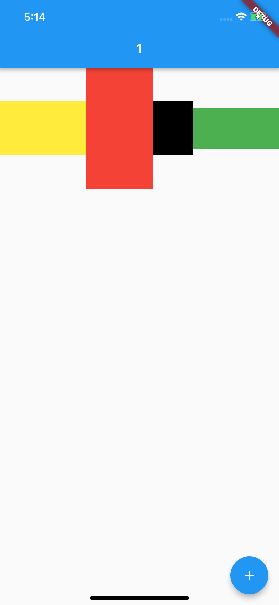
图 5 Expanded 控件示例

于 Row 与 Column 而言，Flutter 提供了依据坐标轴的布局对齐行为，即根据布局方向划分出主轴和纵轴：主轴，表示容器依次摆放子 Widget 的方向；纵轴，则是与主轴垂直的另一个方向。

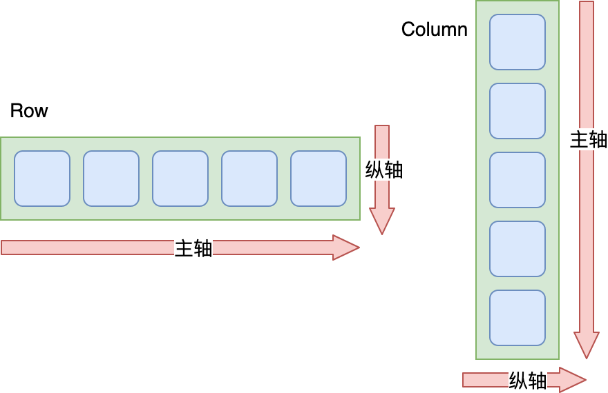
图 6 Row 和 Column 控件的主轴与纵轴

我们可以根据主轴与纵轴，设置子 Widget 在这两个方向上的对齐规则 mainAxisAlignment 与 crossAxisAlignment。比如，主轴方向 start 表示靠左对齐、center 表示横向居中对齐、end 表示靠右对齐、spaceEvenly 表示按固定间距对齐；而纵轴方向 start 则表示靠上对齐、center 表示纵向居中对齐、end 表示靠下对齐。

下图展示了在 Row 中设置不同方向的对齐规则后的呈现效果：

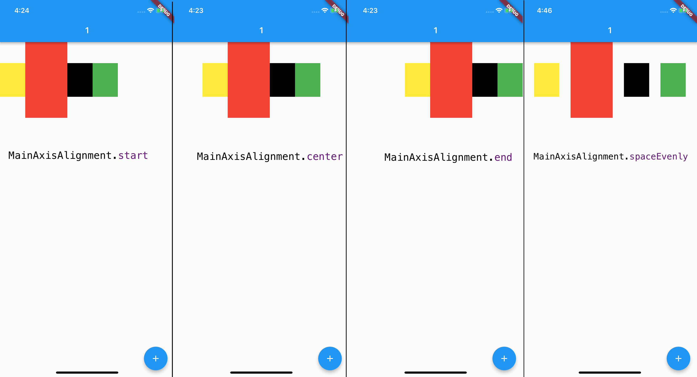
图 7 Row 的主轴对齐方式

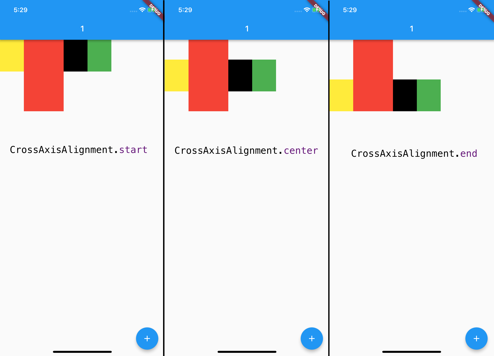
图 8 Row 的纵轴对齐方式

Column 的对齐方式也是类似的，我就不再过多展开了。

这里需要注意的是，对于主轴而言，Flutter 默认是让父容器决定其长度，即尽可能大，类似 Android 中的 match_parent。

在上面的例子中，Row 的宽度为屏幕宽度，Column 的高度为屏幕高度。主轴长度大于所有子 Widget 的总长度，意味着容器在主轴方向的空间比子 Widget 要大，这也是我们能通过主轴对齐方式设置子 Widget 布局效果的原因。

如果想让容器与子 Widget 在主轴上完全匹配，我们可以通过设置 Row 的 mainAxisSize 参数为 MainAxisSize.min，由所有子 Widget 来决定主轴方向的容器长度，即主轴方向的长度尽可能小，类似 Android 中的 wrap_content：

```
Row(
  mainAxisAlignment: MainAxisAlignment.spaceEvenly, // 由于容器与子 Widget 一样宽，因此这行设置排列间距的代码并未起作用
  mainAxisSize: MainAxisSize.min, // 让容器宽度与所有子 Widget 的宽度一致
  children: <Widget>[
    Container(color: Colors.yellow, width: 60, height: 80,),
    Container(color: Colors.red, width: 100, height: 180,),
    Container(color: Colors.black, width: 60, height: 80,),
    Container(color: Colors.green, width: 60, height: 80,),
  ],
)
```

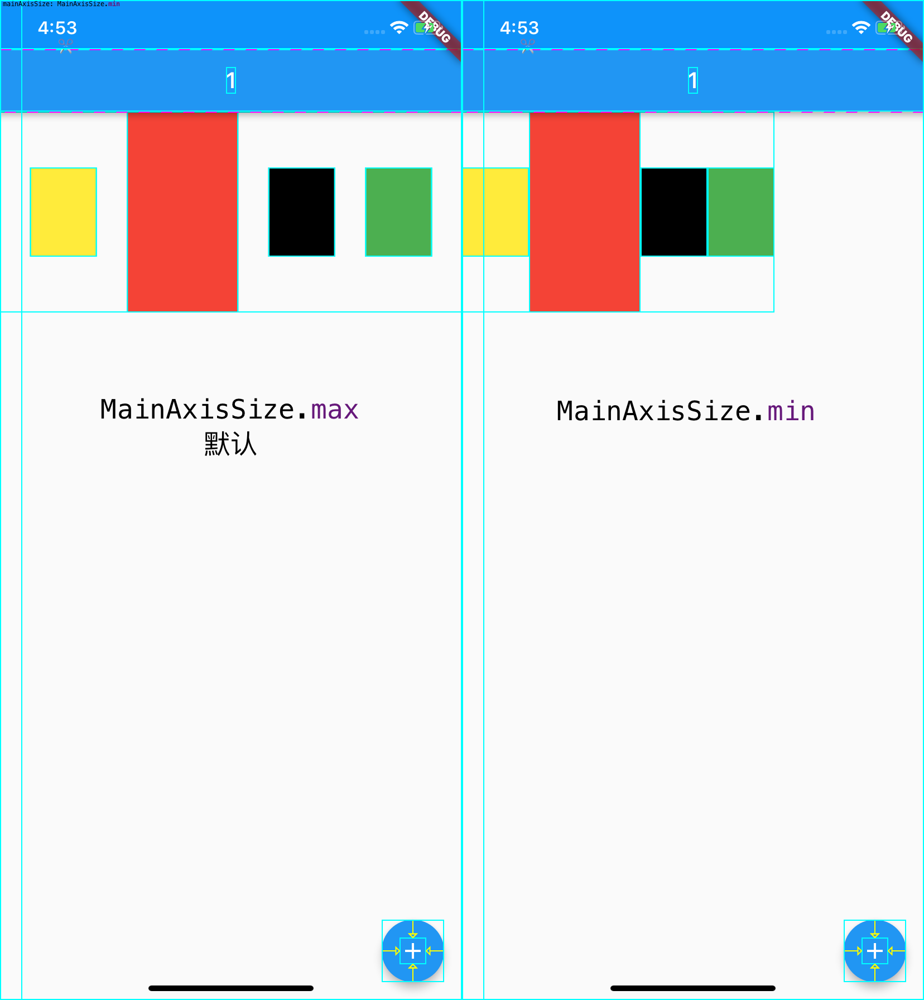
图 9 Row 的主轴大小

可以看到，我们设置了主轴大小为 MainAxisSize.min 之后，Row 的宽度变得和其子 Widget 一样大，因此再设置主轴的对齐方式也就不起作用了。

## 层叠 Widget 布局：Stack 与 Positioned

有些时候，我们需要让一个控件叠加在另一个控件的上面，比如在一张图片上放置一段文字，又或者是在图片的某个区域放置一个按钮。这时候，我们就需要用到层叠布局容器 Stack 了。

Stack 容器与前端中的绝对定位、Android 中的 Frame 布局非常类似，子 Widget 之间允许叠加，还可以根据父容器上、下、左、右四个角的位置来确定自己的位置。

**Stack 提供了层叠布局的容器，而 Positioned 则提供了设置子 Widget 位置的能力**。接下来，我们就通过一个例子来看一下 Stack 和 Positioned 的具体用法吧。

在这个例子中，我先在 Stack 中放置了一块 300*300 的黄色画布，随后在 (18,18) 处放置了一个 50*50 的绿色控件，然后在 (18,70) 处放置了一个文本控件。

```
Stack(
  children: <Widget>[
    Container(color: Colors.yellow, width: 300, height: 300),// 黄色容器
    Positioned(
      left: 18.0,
      top: 18.0,
      child: Container(color: Colors.green, width: 50, height: 50),// 叠加在黄色容器之上的绿色控件
    ),
    Positioned(
      left: 18.0,
      top:70.0,
      child: Text("Stack 提供了层叠布局的容器 "),// 叠加在黄色容器之上的文本
    )
  ],
)
```

试着运行一下，可以看到，这三个子 Widget 都按照我们预定的规则叠加在一起了。

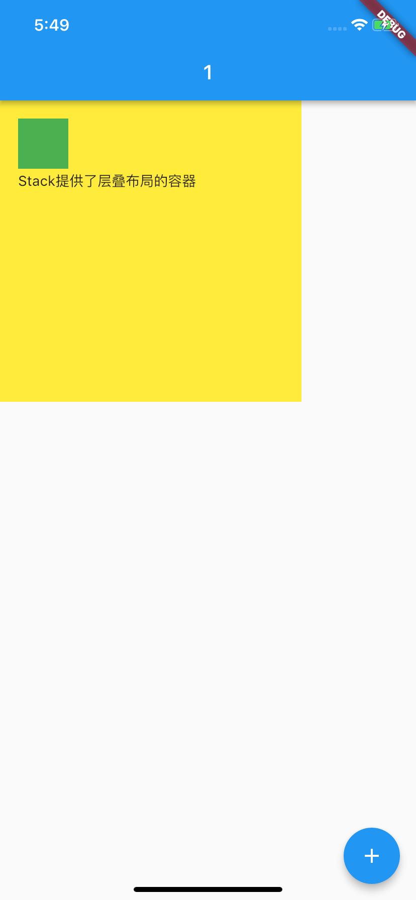
图 10 Stack 与 Positioned 容器示例

Stack 控件允许其子 Widget 按照创建的先后顺序进行层叠摆放，而 Positioned 控件则用来控制这些子 Widget 的摆放位置。需要注意的是，Positioned 控件只能在 Stack 中使用，在其他容器中使用会报错。

## 总结

Flutter 的布局容器强大而丰富，可以将小型、单用途的基本视觉元素快速封装成控件。今天我选取了 Flutter 中最具代表性，也最常用的几类布局 Widget，与你介绍了构建一个界面精美的 App 所需要的布局概念。

接下来，我们简单回顾一下今天的内容，以便加深理解与记忆：

首先，我们认识了单子容器 Container、Padding 与 Center。其中，Container 内部提供了间距、背景样式等基础属性，为子 Widget 的摆放方式，及展现样式都提供了定制能力。而 Padding 与 Center 提供的功能，则正如其名一样简洁，就是对齐与居中。

然后，我们深入学习了多子 Widget 布局中的 Row 和 Column，各子 Widget 间对齐的规则，以及容器自身扩充的规则，以及如何通过 Expanded 控件使用容器内部的剩余空间，

最后，我们学习了层叠布局 Stack，以及与之搭配使用的，定位子 Widget 位置的 Positioned 容器，你可以通过它们，实现多个控件堆放的布局效果。

通过今天的文章，相信你已经对如何搭建 App 的界面有了足够的知识储备，所以在下一篇文章中，我会通过一些实际的例子，带你认识在 Flutter 中，如何通过这些基本控件与布局规则，实现好看的界面。

## 思考题

最后，我给你留下一道思考题吧。
Row 与 Column 自身的大小是如何决定的？当它们嵌套时，又会出现怎样的情况呢？