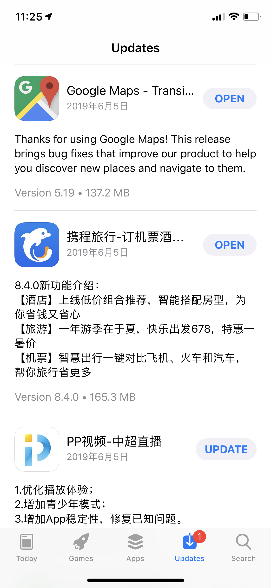
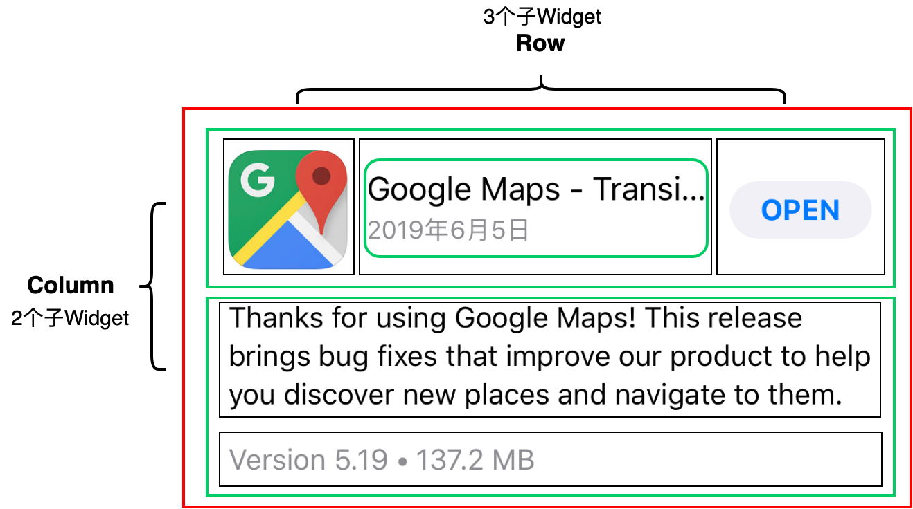
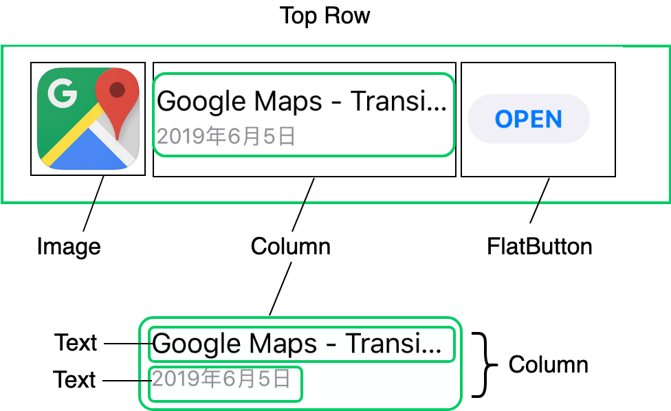
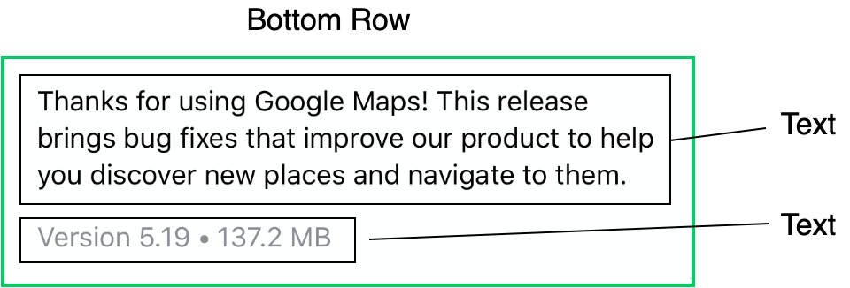
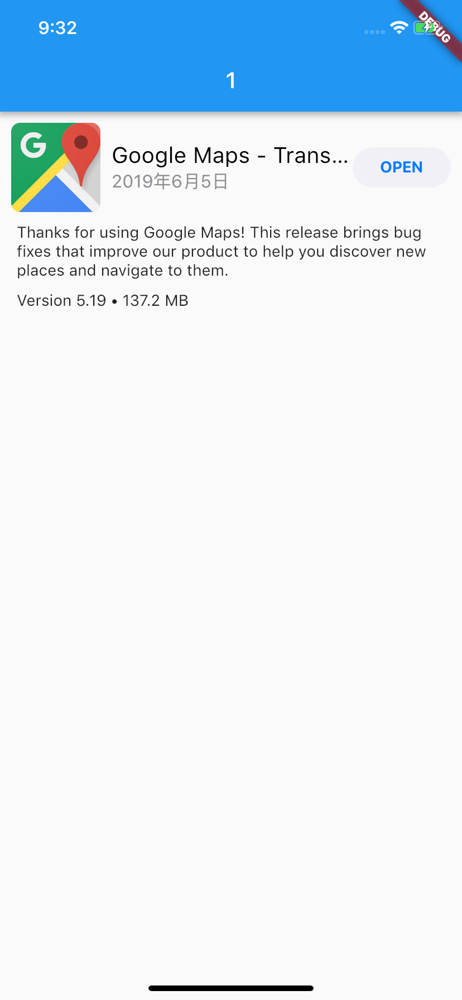
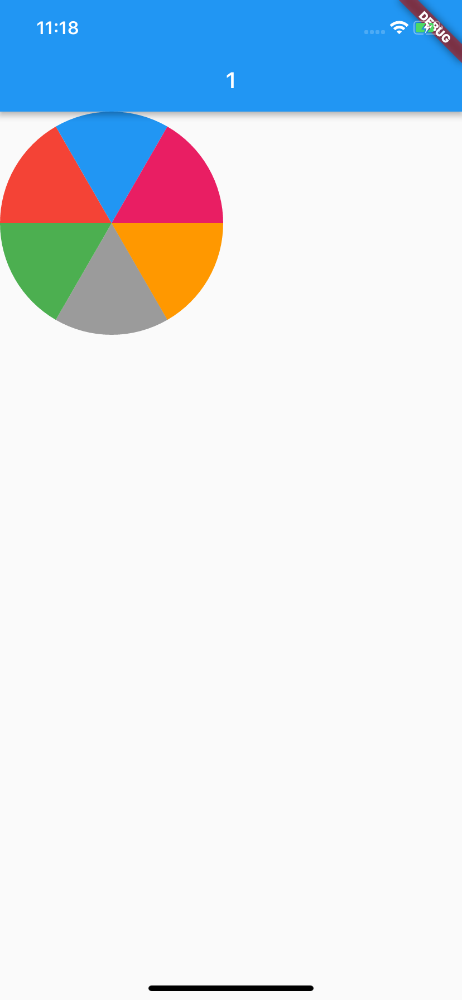

在上一次分享中，我们认识了 Flutter 中最常用也最经典的布局 Widget，即单子容器 Container、多子容器 Row/Column，以及层叠容器 Stack 与 Positioned，也学习了这些不同容器之间的摆放子 Widget 的布局规则，我们可以通过它们，来实现子控件的对齐、嵌套、层叠等，它们也是构建一个界面精美的 App 所必须的布局概念。

在实际开发中，我们会经常遇到一些复杂的 UI 需求，往往无法通过使用 Flutter 的基本 Widget，通过设置其属性参数来满足。这个时候，我们就需要针对特定的场景自定义 Widget 了。

在 Flutter 中，自定义 Widget 与其他平台类似：可以使用基本 Widget 组装成一个高级别的 Widget，也可以自己在画板上根据特殊需求来画界面。

接下来，我会分别与你介绍组合和自绘这两种自定义 Widget 的方式。

## 组装

使用组合的方式自定义 Widget，即通过我们之前介绍的布局方式，摆放项目所需要的基础 Widget，并在控件内部设置这些基础 Widget 的样式，从而组合成一个更高级的控件。

这种方式，对外暴露的接口比较少，减少了上层使用成本，但也因此增强了控件的复用性。在 Flutter 中，**组合的思想始终贯穿在框架设计之中**，这也是 Flutter 提供了如此丰富的控件库的原因之一。

比如，在新闻类应用中，我们经常需要将新闻 Icon、标题、简介与日期组合成一个单独的控件，作为一个整体去响应用户的点击事件。面对这类需求，我们可以把现有的 Image、Text 及各类布局，组合成一个更高级的新闻 Item 控件，对外暴露设置 model 和点击回调的属性即可。

接下来，我通过一个例子为你说明如何通过组装去自定义控件。

下图是 App Store 的升级项 UI 示意图，图里的每一项，都有应用 Icon、名称、更新日期、更新简介、应用版本、应用大小以及更新 / 打开按钮。可以看到，这里面的 UI 元素还是相对较多的，现在我们希望将升级项 UI 封装成一个单独的控件，节省使用成本，以及后续的维护成本。


图 1 App Store 升级项 UI

在分析这个升级项 UI 的整体结构之前，我们先定义一个数据结构 UpdateItemModel 来存储升级信息。在这里为了方便讨论，我把所有的属性都定义为了字符串类型，你在实际使用中可以根据需要将属性定义得更规范（比如，将 appDate 定义为 DateTime 类型）。

```
class UpdateItemModel {
  String appIcon;//App 图标
  String appName;//App 名称
  String appSize;//App 大小
  String appDate;//App 更新日期
  String appDescription;//App 更新文案
  String appVersion;//App 版本
  // 构造函数语法糖，为属性赋值
  UpdateItemModel({this.appIcon, this.appName, this.appSize, this.appDate, this.appDescription, this.appVersion});
}
```

接下来，我以 Google Map 为例，和你一起分析下这个升级项 UI 的整体结构。
按照子 Widget 的摆放方向，布局方式只有水平和垂直两种，因此我们也按照这两个维度对 UI 结构进行拆解。

按垂直方向，我们用绿色的框把这个 UI 拆解为上半部分与下半部分，如图 2 所示。下半部分比较简单，是两个文本控件的组合；上半部分稍微复杂一点，我们先将其包装为一个水平布局的 Row 控件。

接下来，我们再一起看看水平方向应该如何布局。


图 2 升级项 UI 整体结构示意图

我们先把升级项的上半部分拆解成对应的 UI 元素：

- 左边的应用图标拆解为 Image；
- 右边的按钮拆解为 FlatButton；
- 中间部分是两个文本在垂直方向上的组合，因此拆解为 Column，Column 内部则是两个 Text。

拆解示意图，如下所示：


图 3 上半部分 UI 结构示意图

通过与拆解前的 UI 对比，你就会发现还有 3 个问题待解决：即控件间的边距如何设置、中间部分的伸缩（截断）规则又是怎样、图片圆角怎么实现。接下来，我们分别来看看。

Image、FlatButton，以及 Column 这三个控件，与父容器 Row 之间存在一定的间距，因此我们还需要在最左边的 Image 与最右边的 FlatButton 上包装一层 Padding，用以留白填充。

另一方面，考虑到需要适配不同尺寸的屏幕，中间部分的两个文本应该是变长可伸缩的，但也不能无限制地伸缩，太长了还是需要截断的，否则就会挤压到右边按钮的固定空间了。

因此，我们需要在 Column 的外层用 Expanded 控件再包装一层，让 Image 与 FlatButton 之间的空间全留给 Column。不过，通常情况下这两个文本并不能完全填满中间的空间，因此我们还需要设置对齐格式，按照垂直方向上居中，水平方向上居左的方式排列。

最后一项需要注意的是，升级项 UI 的 App Icon 是圆角的，但普通的 Image 并不支持圆角。这时，我们可以使用 ClipRRect 控件来解决这个问题。ClipRRect 可以将其子 Widget 按照圆角矩形的规则进行裁剪，所以用 ClipRRect 将 Image 包装起来，就可以实现图片圆角的功能了。

下面的代码，就是控件上半部分的关键代码：

```
Widget buildTopRow(BuildContext context) {
  return Row(//Row 控件，用来水平摆放子 Widget
    children: <Widget>[
      Padding(//Paddng 控件，用来设置 Image 控件边距
        padding: EdgeInsets.all(10),// 上下左右边距均为 10
        child: ClipRRect(// 圆角矩形裁剪控件
          borderRadius: BorderRadius.circular(8.0),// 圆角半径为 8
          child: Image.asset(model.appIcon, width: 80,height:80) 图片控件 //
        )
      ),
      Expanded(//Expanded 控件，用来拉伸中间区域
        child: Column(//Column 控件，用来垂直摆放子 Widget
          mainAxisAlignment: MainAxisAlignment.center,// 垂直方向居中对齐
          crossAxisAlignment: CrossAxisAlignment.start,// 水平方向居左对齐
          children: <Widget>[
            Text(model.appName,maxLines: 1),//App 名字
            Text(model.appDate,maxLines: 1),//App 更新日期
          ],
        ),
      ),
      Padding(//Paddng 控件，用来设置 Widget 间边距
        padding: EdgeInsets.fromLTRB(0,0,10,0),// 右边距为 10，其余均为 0
        child: FlatButton(// 按钮控件
          child: Text("OPEN"),
          onPressed: onPressed,// 点击回调
        )
      )
  ]);
}
```

升级项 UI 的下半部分比较简单，是两个文本控件的组合。与上半部分的拆解类似，我们用一个 Column 控件将它俩装起来，如图 4 所示：


图 4 下半部分 UI 结构示意图

与上半部分类似，这两个文本与父容器之间存在些间距，因此在 Column 的最外层还需要用 Padding 控件给包装起来，设置父容器间距。
另一方面，Column 的两个文本控件间也存在间距，因此我们仍然使用 Padding 控件将下面的文本包装起来，单独设置这两个文本之间的间距。
同样地，通常情况下这两个文本并不能完全填满下部空间，因此我们还需要设置对齐格式，即按照水平方向上居左的方式对齐。
控件下半部分的关键代码如下所示：

```
Widget buildBottomRow(BuildContext context) {
  return Padding(//Padding 控件用来设置整体边距
    padding: EdgeInsets.fromLTRB(15,0,15,0),// 左边距和右边距为 15
    child: Column(//Column 控件用来垂直摆放子 Widget
      crossAxisAlignment: CrossAxisAlignment.start,// 水平方向距左对齐
      children: <Widget>[
        Text(model.appDescription),// 更新文案
        Padding(//Padding 控件用来设置边距
          padding: EdgeInsets.fromLTRB(0,10,0,0),// 上边距为 10
          child: Text("${model.appVersion} • ${model.appSize} MB")
        )
      ]
  ));
}
```

最后，我们将上下两部分控件通过 Column 包装起来，这次升级项 UI 定制就完成了：

```
class UpdatedItem extends StatelessWidget {
  final UpdatedItemModel model;// 数据模型
  // 构造函数语法糖，用来给 model 赋值
  UpdatedItem({Key key,this.model, this.onPressed}) : super(key: key);
  final VoidCallback onPressed;
 
  @override
  Widget build(BuildContext context) {
    return Column(// 用 Column 将上下两部分合体
        children: <Widget>[
          buildTopRow(context),// 上半部分
          buildBottomRow(context)// 下半部分
        ]);
  }
  Widget buildBottomRow(BuildContext context) {...}
  Widget buildTopRow(BuildContext context) {...}
}
```

试着运行一下，效果如下所示：


图 5 升级项 UI 运行示例

搞定！

**按照从上到下、从左到右去拆解 UI 的布局结构，把复杂的 UI 分解成各个小 UI 元素，在以组装的方式去自定义 UI 中非常有用，请一定记住这样的拆解方法。**

## 自绘

Flutter 提供了非常丰富的控件和布局方式，使得我们可以通过组合去构建一个新的视图。但对于一些不规则的视图，用 SDK 提供的现有 Widget 组合可能无法实现，比如饼图，k 线图等，这个时候我们就需要自己用画笔去绘制了。

在原生 iOS 和 Android 开发中，我们可以继承 UIView/View，在 drawRect/onDraw 方法里进行绘制操作。其实，在 Flutter 中也有类似的方案，那就是 CustomPaint。

**CustomPaint 是用以承接自绘控件的容器，并不负责真正的绘制**。既然是绘制，那就需要用到画布与画笔。
在 Flutter 中，画布是 Canvas，画笔则是 Paint，而画成什么样子，则由定义了绘制逻辑的 CustomPainter 来控制。将 CustomPainter 设置给容器 CustomPaint 的 painter 属性，我们就完成了一个自绘控件的封装。

对于画笔 Paint，我们可以配置它的各种属性，比如颜色、样式、粗细等；而画布 Canvas，则提供了各种常见的绘制方法，比如画线 drawLine、画矩形 drawRect、画点 DrawPoint、画路径 drawPath、画圆 drawCircle、画圆弧 drawArc 等。

这样，我们就可以在 CustomPainter 的 paint 方法里，通过 Canvas 与 Paint 的配合，实现定制化的绘制逻辑。

接下来，我们看一个例子。

在下面的代码中，我们继承了 CustomPainter，在定义了绘制逻辑的 paint 方法中，通过 Canvas 的 drawArc 方法，用 6 种不同颜色的画笔依次画了 6 个 1/6 圆弧，拼成了一张饼图。最后，我们使用 CustomPaint 容器，将 painter 进行封装，就完成了饼图控件 Cake 的定义。

```
class WheelPainter extends CustomPainter {
 // 设置画笔颜色 
  Paint getColoredPaint(Color color) {// 根据颜色返回不同的画笔
    Paint paint = Paint();// 生成画笔
    paint.color = color;// 设置画笔颜色
    return paint;
  }
 
  @override
  void paint(Canvas canvas, Size size) {// 绘制逻辑
    double wheelSize = min(size.width,size.height)/2;// 饼图的尺寸
    double nbElem = 6;// 分成 6 份
    double radius = (2 * pi) / nbElem;//1/6 圆
    // 包裹饼图这个圆形的矩形框
    Rect boundingRect = Rect.fromCircle(center: Offset(wheelSize, wheelSize), radius: wheelSize);
    // 每次画 1/6 个圆弧
    canvas.drawArc(boundingRect, 0, radius, true, getColoredPaint(Colors.orange));
    canvas.drawArc(boundingRect, radius, radius, true, getColoredPaint(Colors.black38));
    canvas.drawArc(boundingRect, radius * 2, radius, true, getColoredPaint(Colors.green));
    canvas.drawArc(boundingRect, radius * 3, radius, true, getColoredPaint(Colors.red));
    canvas.drawArc(boundingRect, radius * 4, radius, true, getColoredPaint(Colors.blue));
    canvas.drawArc(boundingRect, radius * 5, radius, true, getColoredPaint(Colors.pink));
  }
  // 判断是否需要重绘，这里我们简单的做下比较即可
  @override
  bool shouldRepaint(CustomPainter oldDelegate) => oldDelegate != this;
}
// 将饼图包装成一个新的控件
class Cake extends StatelessWidget {
  @override
  Widget build(BuildContext context) {
    return CustomPaint(
        size: Size(200, 200),
        painter: WheelPainter(),
      );
  }
}
```

试着运行一下，效果如下所示：


图 6 自绘控件示例

可以看到，使用 CustomPainter 进行自绘控件并不算复杂。这里，我建议你试着用画笔和画布，去实现更丰富的功能。

**在实现视觉需求上，自绘需要自己亲自处理绘制逻辑，而组合则是通过子 Widget 的拼接来实现绘制意图。**因此从渲染逻辑处理上，自绘方案可以进行深度的渲染定制，从而实现少数通过组合很难实现的需求（比如饼图、k 线图）。不过，当视觉效果需要调整时，采用自绘的方案可能需要大量修改绘制代码，而组合方案则相对简单：只要布局拆分设计合理，可以通过更换子 Widget 类型来轻松搞定。

## 总结

在面对一些复杂的 UI 视图时，Flutter 提供的单一功能类控件往往不能直接满足我们的需求。于是，我们需要自定义 Widget。Flutter 提供了组装与自绘两种自定义 Widget 的方式，来满足我们对视图的自定义需求。

以组装的方式构建 UI，我们需要将目标视图分解成各个 UI 小元素。通常，我们可以按照从上到下、从左到右的布局顺序去对控件层次结构进行拆解，将基本视觉元素封装到 Column、Row 中。对于有着固定间距的视觉元素，我们可以通过 Padding 对其进行包装，而对于大小伸缩可变的视觉元素，我们可以通过 Expanded 控件让其填充父容器的空白区域。

而以自绘的方式定义控件，则需要借助于 CustomPaint 容器，以及最终承接真实绘制逻辑的 CustomPainter。CustomPainter 是绘制逻辑的封装，在其 paint 方法中，我们可以使用不同类型的画笔 Paint，利用画布 Canvas 提供的不同类型的绘制图形能力，实现控件自定义绘制。

无论是组合还是自绘，在自定义 UI 时，有了目标视图整体印象后，我们首先需要考虑的事情应该是如何将它化繁为简，把视觉元素拆解细分，变成自己立即可以着手去实现的一个小控件，然后再思考如何将这些小控件串联起来。把大问题拆成小问题后，实现目标也逐渐清晰，落地方案就自然浮出水面了。

这其实就和我们学习新知识的过程是一样的，在对整体知识概念有了初步认知之后，也需要具备将复杂的知识化繁为简的能力：先理清楚其逻辑脉络，然后再把不懂的知识拆成小点，最后逐个攻破。

我把今天分享讲的两个例子放到了[GitHub](https://github.com/cyndibaby905/15_custom_ui_demo)上，你可以下载后在工程中实际运行，并对照着今天的知识点进行学习，体会在不同场景下，组合和自绘这两种自定义 Widget 的具体使用方法。

## 思考题

最后，我给你留下两道作业题吧。

- 请扩展 UpdatedItem 控件，使其能自动折叠过长的更新文案，并能支持点击后展开的功能。
  
- 请扩展 Cake 控件，使其能够根据传入的 double 数组（最多 10 个元素）中数值的大小，定义饼图的圆弧大小。