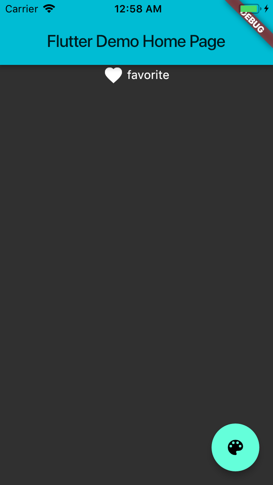
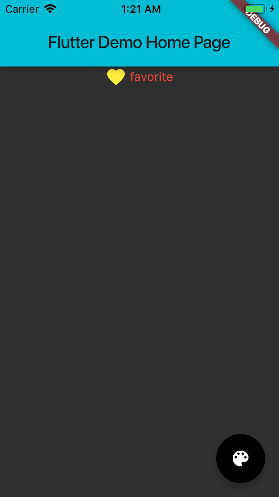
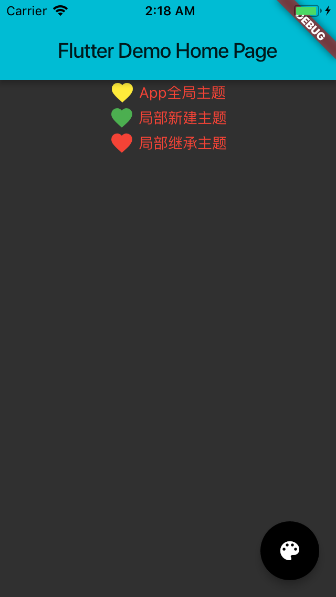
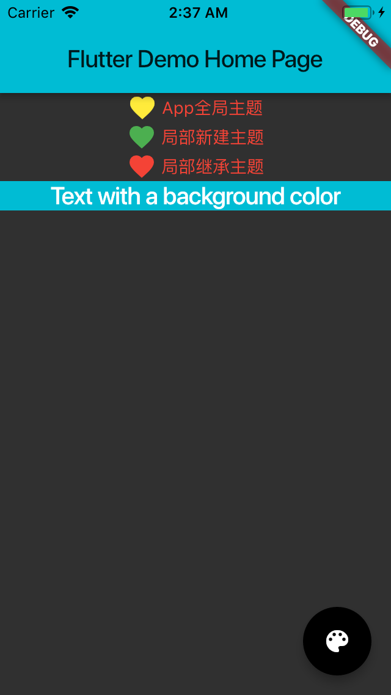
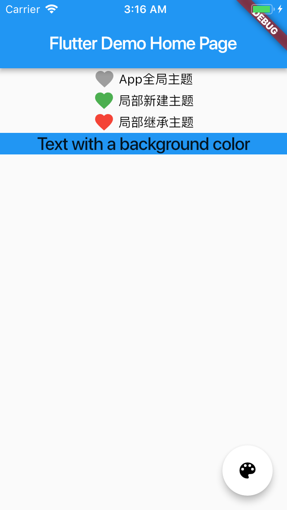
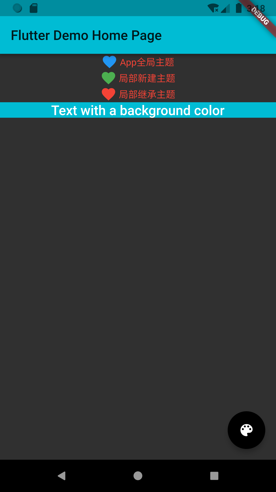

今天，我和你分享的主题是，从夜间模式说起，如何定制不同风格的 App 主题。
在上一篇文章中，我与你介绍了组装与自绘这两种自定义 Widget 的方式。对于组装，我们按照从上到下、从左到右的布局顺序去分解目标视图，将基本的 Widget 封装到 Column、Row 中，从而合成更高级别的 Widget；而对于自绘，我们则通过承载绘制逻辑的载体 CustomPainter，在其 paint 方法中使用画笔 Paint 与画布 Canvas，绘制不同风格、不同类型的图形，从而实现基于自绘的自定义组件。
对于一个产品来说，在业务早期其实更多的是处理基本功能有和无的问题：工程师来负责实现功能，PM 负责功能好用不好用。在产品的基本功能已经完善，做到了六七十分的时候，再往上的如何做增长就需要运营来介入了。
在这其中，如何通过用户分层去实现 App 的个性化是常见的增长运营手段，而主题样式更换则是实现个性化中的一项重要技术手段。
比如，微博、UC 浏览器和电子书客户端都提供了对夜间模式的支持，而淘宝、京东这样的电商类应用，还会在特定的电商活动日自动更新主题样式，就连现在的手机操作系统也提供了系统级切换展示样式的能力。
那么，这些在应用内切换样式的功能是如何实现的呢？在 Flutter 中，在普通的应用上增加切换主题的功能又要做哪些事情呢？这些问题，我都会在今天的这篇文章中与你详细分享。

## 主题定制

主题，又叫皮肤、配色，一般由颜色、图片、字号、字体等组成，我们可以把它看做是视觉效果在不同场景下的可视资源，以及相应的配置集合。比如，App 的按钮，无论在什么场景下都需要背景图片资源、字体颜色、字号大小等，而所谓的主题切换只是在不同主题之间更新这些资源及配置集合而已。
因此在 App 开发中，我们通常不关心资源和配置的视觉效果好不好看，只要关心资源提供的视觉功能能不能用。比如，对于图片类资源，我们并不需要关心它渲染出来的实际效果，只需要确定它渲染出来是一张固定宽高尺寸的区域，不影响页面布局，能把业务流程跑通即可。

**视觉效果是易变的，我们将这些变化的部分抽离出来，把提供不同视觉效果的资源和配置按照主题进行归类，整合到一个统一的中间层去管理，这样我们就能实现主题的管理和切换了。**

在 iOS 中，我们通常会将主题的配置信息预先写到 plist 文件中，通过一个单例来控制 App 应该使用哪种配置；而 Android 的配置信息则写入各个 style 属性值的 xml 中，通过 activity 的 setTheme 进行切换；前端的处理方式也类似，简单更换 css 就可以实现多套主题 / 配色之间的切换。

Flutter 也提供了类似的能力，**由 ThemeData 来统一管理主题的配置信息**。

ThemeData 涵盖了 Material Design 规范的可自定义部分样式，比如应用明暗模式 brightness、应用主色调 primaryColor、应用次级色调 accentColor、文本字体 fontFamily、输入框光标颜色 cursorColor 等。如果你想深入了解 ThemeData 的其他 API 参数，可以参考官方文档[ThemeData](https://api.flutter.dev/flutter/material/ThemeData/ThemeData.html)。

通过 ThemeData 来自定义应用主题，我们可以实现 App 全局范围，或是 Widget 局部范围的样式切换。接下来，我便分别与你讲述这两种范围的主题切换。

## 全局统一的视觉风格定制

在 Flutter 中，应用程序类 MaterialApp 的初始化方法，为我们提供了设置主题的能力。我们可以通过参数 theme，选择改变 App 的主题色、字体等，设置界面在 MaterialApp 下的展示样式。

以下代码演示了如何设置 App 全局范围主题。在这段代码中，我们设置了 App 的明暗模式 brightness 为暗色、主色调为青色：

```
MaterialApp(
  title: 'Flutter Demo',// 标题
  theme: ThemeData(// 设置主题
      brightness: Brightness.dark,// 明暗模式为暗色
      primaryColor: Colors.cyan,// 主色调为青色
  ),
  home: MyHomePage(title: 'Flutter Demo Home Page'),
);
```

试着运行一下，效果如下：


图 1 Flutter 全局模式主题

可以看到，虽然我们只修改了主色调和明暗模式两个参数，但按钮、文字颜色都随之调整了。这是因为默认情况下，**ThemeData 中很多其他次级视觉属性，都会受到主色调与明暗模式的影响**。如果我们想要精确控制它们的展示样式，需要再细化一下主题配置。

下面的例子中，我们将 icon 的颜色调整为黄色，文字颜色调整为红色，按钮颜色调整为黑色：

```
MaterialApp(
  title: 'Flutter Demo',// 标题
  theme: ThemeData(// 设置主题
      brightness: Brightness.dark,// 设置明暗模式为暗色
      accentColor: Colors.black,//(按钮）Widget 前景色为黑色
      primaryColor: Colors.cyan,// 主色调为青色
      iconTheme:IconThemeData(color: Colors.yellow),// 设置 icon 主题色为黄色
      textTheme: TextTheme(body1: TextStyle(color: Colors.red))// 设置文本颜色为红色
  ),
  home: MyHomePage(title: 'Flutter Demo Home Page'),
);
```

运行一下，可以看到图标、文字、按钮的颜色都随之更改了。


图 2 Flutter 全局模式主题示例 2

## 局部独立的视觉风格定制

为整个 App 提供统一的视觉呈现效果固然很有必要，但有时我们希望为某个页面、或是某个区块设置不同于 App 风格的展现样式。以主题切换功能为例，我们希望为不同的主题提供不同的展示预览。

在 Flutter 中，我们可以使用 Theme 来对 App 的主题进行局部覆盖。Theme 是一个单子 Widget 容器，与 MaterialApp 类似的，我们可以通过设置其 data 属性，对其子 Widget 进行样式定制：

- 如果我们不想继承任何 App 全局的颜色或字体样式，可以直接新建一个 ThemeData 实例，依次设置对应的样式；
- 而如果我们不想在局部重写所有的样式，则可以继承 App 的主题，使用 copyWith 方法，只更新部分样式。

下面的代码演示了这两种方式的用法：

```
// 新建主题
Theme(
    data: ThemeData(iconTheme: IconThemeData(color: Colors.red)),
    child: Icon(Icons.favorite)
);
 
// 继承主题
Theme(
    data: Theme.of(context).copyWith(iconTheme: IconThemeData(color: Colors.green)),
    child: Icon(Icons.feedback)
);
```


图 3 Theme 局部主题更改示例

对于上述例子而言，由于 Theme 的子 Widget 只有一个 Icon 组件，因此这两种方式都可以实现覆盖全局主题，从而更改 Icon 样式的需求。而像这样使用局部主题覆盖全局主题的方式，在 Flutter 中是一种常见的自定义子 Widget 展示样式的方法。

**除了定义 Material Design 规范中那些可自定义部分样式外，主题的另一个重要用途是样式复用。**

比如，如果我们想为一段文字复用 Materia Design 规范中的 title 样式，或是为某个子 Widget 的背景色复用 App 的主题色，我们就可以通过 Theme.of(context) 方法，取出对应的属性，应用到这段文字的样式中。

Theme.of(context) 方法将向上查找 Widget 树，并返回 Widget 树中最近的主题 Theme。如果 Widget 的父 Widget 们有一个单独的主题定义，则使用该主题。如果不是，那就使用 App 全局主题。
在下面的例子中，我们创建了一个包装了一个 Text 组件的 Container 容器。在 Text 组件的样式定义中，我们复用了全局的 title 样式，而在 Container 的背景色定义中，则复用了 App 的主题色：

```
Container(
    color: Theme.of(context).primaryColor,// 容器背景色复用应用主题色
    child: Text(
      'Text with a background color',
      style: Theme.of(context).textTheme.title,//Text 组件文本样式复用应用文本样式
    ));
```


图 4 主题复用示例

## 分平台主题定制

有时候，**为了满足不同平台的用户需求，我们希望针对特定的平台设置不同的样式**。比如，在 iOS 平台上设置浅色主题，在 Android 平台上设置深色主题。面对这样的需求，我们可以根据 defaultTargetPlatform 来判断当前应用所运行的平台，从而根据系统类型来设置对应的主题。

在下面的例子中，我们为 iOS 与 Android 分别创建了两个主题。在 MaterialApp 的初始化方法中，我们根据平台类型，设置了不同的主题：

```
// iOS 浅色主题
final ThemeData kIOSTheme = ThemeData(
    brightness: Brightness.light,// 亮色主题
    accentColor: Colors.white,//(按钮)Widget 前景色为白色
    primaryColor: Colors.blue,// 主题色为蓝色
    iconTheme:IconThemeData(color: Colors.grey),//icon 主题为灰色
    textTheme: TextTheme(body1: TextStyle(color: Colors.black))// 文本主题为黑色
);
// Android 深色主题
final ThemeData kAndroidTheme = ThemeData(
    brightness: Brightness.dark,// 深色主题
    accentColor: Colors.black,//(按钮)Widget 前景色为黑色
    primaryColor: Colors.cyan,// 主题色 Wie 青色
    iconTheme:IconThemeData(color: Colors.blue),//icon 主题色为蓝色
    textTheme: TextTheme(body1: TextStyle(color: Colors.red))// 文本主题色为红色
);
// 应用初始化
MaterialApp(
  title: 'Flutter Demo',
  theme: defaultTargetPlatform == TargetPlatform.iOS ? kIOSTheme : kAndroidTheme,// 根据平台选择不同主题
  home: MyHomePage(title: 'Flutter Demo Home Page'),
);
```

试着运行一下：


（a)iOS 平台


（b)Android 平台
图 5 根据不同平台设置对应主题

当然，除了主题之外，你也可以用 defaultTargetPlatform 这个变量去实现一些其他需要判断平台的逻辑，比如在界面上使用更符合 Android 或 iOS 设计风格的组件。

## 总结

好了，今天的分享就到这里。我们简单回顾一下今天的主要内容吧。

主题设置属于 App 开发的高级特性，归根结底其实是提供了一种视觉资源与视觉配置的管理机制。与其他平台类似，Flutter 也提供了集中式管理主题的机制，可以在遵循 Material Design 规范的 ThemeData 中，定义那些可定制化的样式。

我们既可以通过设置 MaterialApp 全局主题实现应用整体视觉风格的统一，也可以通过 Theme 单子 Widget 容器使用局部主题覆盖全局主题，实现局部独立的视觉风格。

除此之外，在自定义组件过程中，我们还可以使用 Theme.of 方法取出主题对应的属性值，从而实现多种组件在视觉风格上的复用。

最后，面对常见的分平台设置主题场景，我们可以根据 defaultTargetPlatform，来精确识别当前应用所处的系统，从而配置对应的主题。

## 思考题

最后，我给你留下一个课后小作业吧。

在上一篇文章中，我与你介绍了如何实现 App Store 升级项 UI 自定义组件布局。现在，请在这个自定义 Widget 的基础上，增加切换夜间模式的功能。