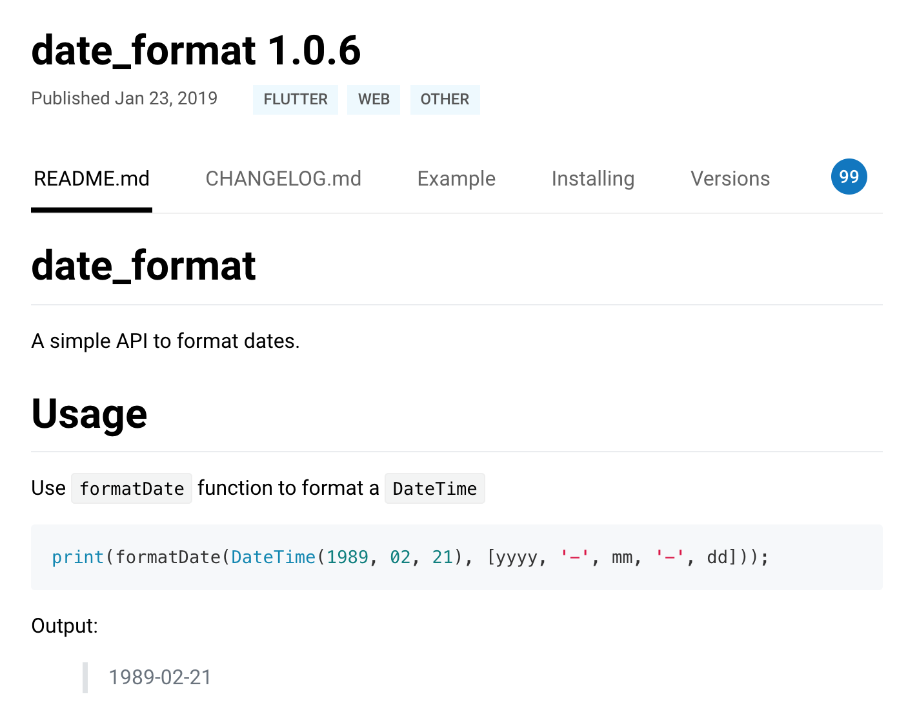

在上一篇文章中，我与你介绍了 Flutter 工程的资源管理机制。在 Flutter 中，资源采用先声明后使用的机制，在 pubspec.yaml 显式地声明资源路径后，才可以使用。

对于图片，Flutter 基于像素密度，设立不同分辨率的目录分开管理，但只需要在 pubspec.yaml 声明一次；而字体则基于样式支持，除了正常字体，还可以支持粗体、斜体等样式。最后，由于 Flutter 需要原生运行环境，因此对于在其启动之前所需的启动图和图标这两类特殊资源，我们还需要分别去原生工程中进行相应的设置。

其实，除了管理这些资源外，pubspec.yaml 更为重要的作用是管理 Flutter 工程代码的依赖，比如第三方库、Dart 运行环境、Flutter SDK 版本都可以通过它来进行统一管理。所以，pubspec.yaml 与 iOS 中的 Podfile、Android 中的 build.gradle、前端的 package.json 在功能上是类似的。

那么，今天这篇文章，我就主要与你分享，在 Flutter 中如何通过配置文件来管理工程代码依赖。

## Pub

Dart 提供了包管理工具 Pub，用来管理代码和资源。从本质上说，包（package）实际上就是一个包含了 pubspec.yaml 文件的目录，其内部可以包含代码、资源、脚本、测试和文档等文件。包中包含了需要被外部依赖的功能抽象，也可以依赖其他包。

与 Android 中的 JCenter/Maven、iOS 中的 CocoaPods、前端中的 npm 库类似，Dart 提供了官方的包仓库 Pub。通过 Pub，我们可以很方便地查找到有用的第三方包。

当然，这并不意味着我们可以简单地拿别人的库来拼凑成一个应用程序。**Dart 提供包管理工具 Pub 的真正目的是，让你能够找到真正好用的、经过线上大量验证的库，复用他人的成果来缩短开发周期，提升软件质量。**

在 Dart 中，库和应用都属于包。pubspec.yaml 是包的配置文件，包含了包的元数据（比如，包的名称和版本）、运行环境（也就是 Dart SDK 与 Fluter SDK 版本）、外部依赖、内部配置（比如，资源管理）。

在下面的例子中，我们声明了一个 flutter_app_example 的应用配置文件，其版本为 1.0，Dart 运行环境支持 2.1 至 3.0 之间，依赖 flutter 和 cupertino_icon：

```
name: flutter_app_example # 应用名称
description: A new Flutter application. # 应用描述
version: 1.0.0 
#Dart 运行环境区间
environment:
  sdk: ">=2.1.0 <3.0.0"
#Flutter 依赖库
dependencies:
  flutter:
    sdk: flutter
  cupertino_icons: ">0.1.1"
```

运行环境和依赖库 cupertino_icons 冒号后面的部分是版本约束信息，由一组空格分隔的版本描述组成，可以支持指定版本、版本号区间，以及任意版本这三种版本约束方式。比如上面的例子中，cupertino_icons 引用了大于 0.1.1 的版本。

需要注意的是，由于元数据与名称使用空格分隔，因此版本号中不能出现空格；同时又由于大于符号“>”也是 YAML 语法中的折叠换行符号，因此在指定版本范围的时候，必须使用引号， 比如">=2.1.0 < 3.0.0"。

**对于包，我们通常是指定版本区间，而很少直接指定特定版本**，因为包升级变化很频繁，如果有其他的包直接或间接依赖这个包的其他版本时，就会经常发生冲突。

而**对于运行环境，如果是团队多人协作的工程，建议将 Dart 与 Flutter 的 SDK 环境写死，统一团队的开发环境**，避免因为跨 SDK 版本出现的 API 差异进而导致工程问题。

比如，在上面的示例中，我们可以将 Dart SDK 写死为 2.3.0，Flutter SDK 写死为 1.2.1。

```
environment:
  sdk: 2.3.0
  flutter: 1.2.1
```

基于版本的方式引用第三方包，需要在其 Pub 上进行公开发布，我们可以访问https://pub.dev/来获取可用的第三方包。而对于不对外公开发布，或者目前处于开发调试阶段的包，我们需要设置数据源，使用本地路径或 Git 地址的方式进行包声明。

在下面的例子中，我们分别以路径依赖以及 Git 依赖的方式，声明了 package1 和 package2 这两个包：

```
dependencies:
  package1:
    path: ../package1/  # 路径依赖
  date_format:
    git:
      url: https://github.com/xxx/package2.git #git 依赖
```

在开发应用时，我们可以不写明具体的版本号，而是以区间的方式声明包的依赖；但对于一个程序而言，其运行时具体引用哪个版本的依赖包必须要确定下来。因此，**除了管理第三方依赖，包管理工具 Pub 的另一个职责是，找出一组同时满足每个包版本约束的包版本。**包版本一旦确定，接下来就是下载对应版本的包了。

对于 dependencies 中的不同数据源，Dart 会使用不同的方式进行管理，最终会将远端的包全部下载到本地。比如，对于 Git 声明依赖的方式，Pub 会 clone Git 仓库；对于版本号的方式，Pub 则会从 [pub.dartlang.org](http://pub.dartlang.org/) 下载包。如果包还有其他的依赖包，比如 package1 包还依赖 package3 包，Pub 也会一并下载。

然后，在完成了所有依赖包的下载后，**Pub 会在应用的根目录下创建.packages 文件**，将依赖的包名与系统缓存中的包文件路径进行映射，方便后续维护。

最后，**Pub 会自动创建 pubspec.lock 文件**。pubspec.lock 文件的作用类似 iOS 的 Podfile.lock 或前端的 package-lock.json 文件，用于记录当前状态下实际安装的各个直接依赖、间接依赖的包的具体来源和版本号。

比较活跃的第三方包的升级通常比较频繁，因此对于多人协作的 Flutter 应用来说，我们需要把 pubspec.lock 文件也一并提交到代码版本管理中，这样团队中的所有人在使用这个应用时安装的所有依赖都是完全一样的，以避免出现库函数找不到或者其他的依赖错误。

**除了提供功能和代码维度的依赖之外，包还可以提供资源的依赖**。在依赖包中的 pubspec.yaml 文件已经声明了同样资源的情况下，为节省应用程序安装包大小，我们需要复用依赖包中的资源。

在下面的例子中，我们的应用程序依赖了一个名为 package4 的包，而它的目录结构是这样的：

```
pubspec.yaml    
└──assets
    ├──2.0x
    │   └── placeholder.png
    └──3.0x
        └── placeholder.png
```

其中，placeholder.png 是可复用资源。因此，在应用程序中，我们可以通过 Image 和 AssetImage 提供的 package 参数，根据设备实际分辨率去加载图像。

```
Image.asset('assets/placeholder.png', package: 'package4');
 
AssetImage('assets/placeholder.png', package: 'package4');
例子
```

## 例子

接下来，我们通过一个日期格式化的例子，来演示如何使用第三方库。
在 Flutter 中，提供了表达日期的数据结构[DateTime](https://api.flutter.dev/flutter/dart-core/DateTime-class.html)，这个类拥有极大的表示范围，可以表达 1970-01-01 UTC 时间后 100,000,000 天内的任意时刻。不过，如果我们想要格式化显示日期和时间，DateTime 并没有提供非常方便的方法，我们不得不自己取出年、月、日、时、分、秒，来定制显示方式。

值得庆幸的是，我们可以通过 date_format 这个第三方包来实现我们的诉求：date_format 提供了若干常用的日期格式化方法，可以很方便地实现格式化日期的功能。

**首先**，我们在 Pub 上找到 date_format 这个包，确定其使用说明：


图 1 date_format 使用说明

date_format 包最新的版本是 1.0.6，于是**接下来**我们把 date_format 添加到 pubspec.yaml 中：

```
dependencies:
  date_format: 1.0.6
```

**随后**，IDE（Android Studio）监测到了配置文件的改动，提醒我们进行安装包依赖更新。于是，我们点击 Get dependencies，下载 date_format :


图 2 下载安装包依赖

下载完成后，我们就可以在工程中使用 date_format 来进行日期的格式化了：

```
print(formatDate(DateTime.now(), [mm, '月', dd, '日', hh, ':', n]));
// 输出 2019 年 06 月 30 日 01:56
print(formatDate(DateTime.now(), [m, '月第', w, '周']));
// 输出 6 月第 5 周
```

## 总结

好了，今天的分享就到这里。我们简单回顾一下今天的内容。
在 Flutter 中，资源与工程代码依赖属于包管理范畴，采用包的配置文件 pubspec.yaml 进行统一管理。

我们可以通过 pubspec.yaml 设置包的元数据（比如，包的名称和版本）、运行环境（比如，Dart SDK 与 Fluter SDK 版本）、外部依赖和内部配置。

对于依赖的指定，可以以区间的方式确定版本兼容范围，也可以指定本地路径、Git、Pub 这三种不同的数据源，包管理工具会找出同时满足每个依赖包版本约束的包版本，然后依次下载，并通过.packages 文件建立下载缓存与包名的映射，最后统一将当前状态下，实际安装的各个包的具体来源和版本号记录至 pubspec.lock 文件。

现代编程语言大都自带第依赖管理机制，其核心功能是为工程中所有直接或间接依赖的代码库找到合适的版本，但这并不容易。就比如前端的依赖管理器 npm 的早期版本，就曾因为不太合理的算法设计，导致计算依赖耗时过长，依赖文件夹也高速膨胀，一度被开发者们戏称为“黑洞”。而 Dart 使用的 Pub 依赖管理机制所采用的[PubGrub 算法](https://github.com/dart-lang/pub/blob/master/doc/solver.md)则解决了这些问题，因此被称为下一代版本依赖解决算法，在 2018 年底被苹果公司吸纳，成为 Swift 所采用的[依赖管理器算法](https://github.com/apple/swift-package-manager/pull/1918)。

当然，如果你的工程里的依赖比较多，并且依赖关系比较复杂，即使再优秀的依赖解决算法也需要花费较长的时间才能计算出合适的依赖库版本。如果我们想减少依赖管理器为你寻找代码库依赖版本所耗费的时间，一个简单的做法就是从源头抓起，在 pubspec.yaml 文件中固定那些依赖关系复杂的第三方库们，及它们递归依赖的第三方库的版本号。

## 思考题

最后，我给你留下两道思考题吧。

1. pubspec.yaml、.packages 与 pubspec.lock 这三个文件，在包管理中的具体作用是什么？
2. .packages 与 pubspec.lock 是否需要做代码版本管理呢？为什么？