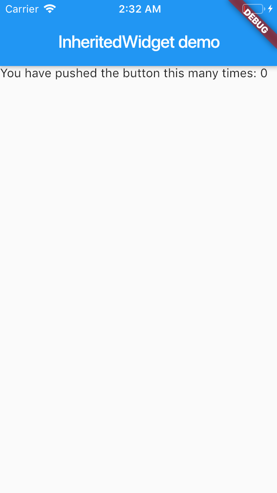
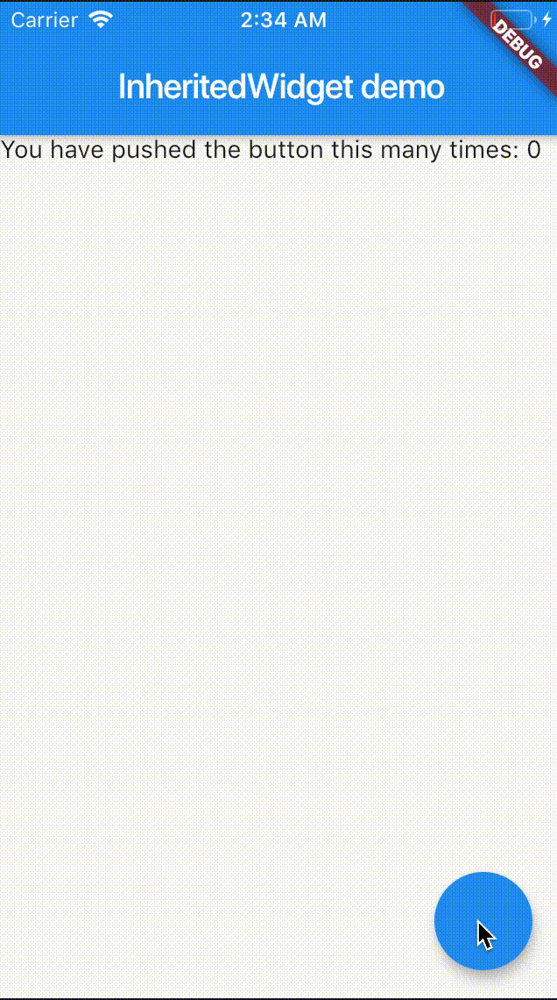
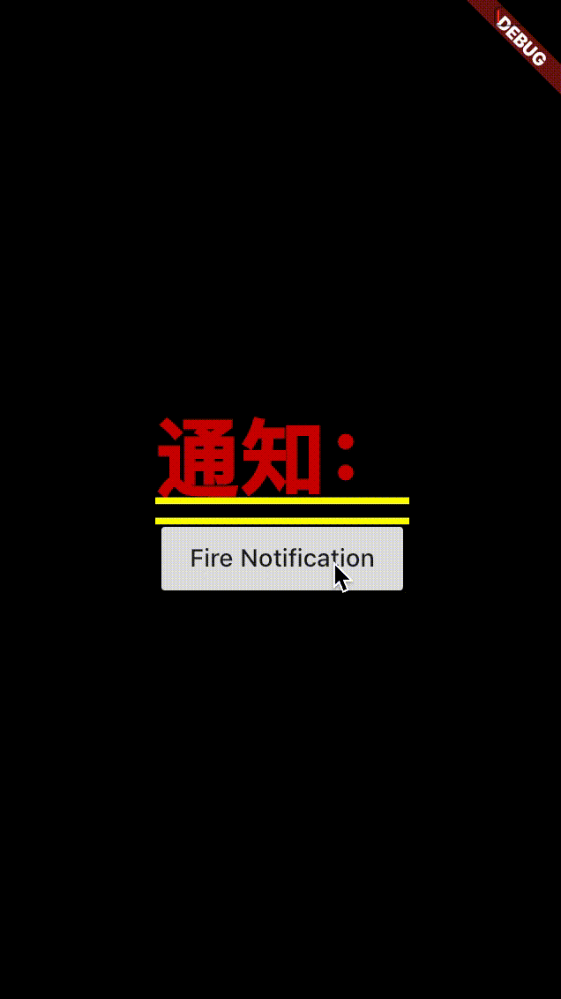
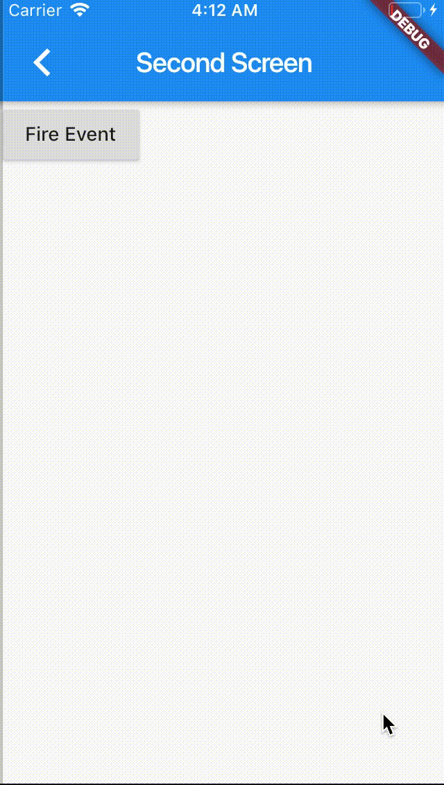
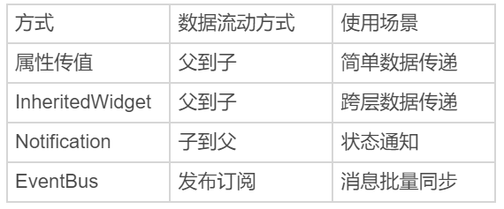

在上一篇文章中，我带你一起学习了在 Flutter 中如何响应用户交互事件（手势）。手势处理在 Flutter 中分为两种：原始的指针事件处理和高级的手势识别。
其中，指针事件以冒泡机制分发，通过 Listener 完成监听；而手势识别则通过 Gesture 处理。但需要注意的是，虽然 Flutter 可以同时支持多个手势（包括一个 Widget 监听多个手势，或是多个 Widget 监听同一个手势），但最终只会有一个 Widget 的手势能够响应用户行为。为了改变这一点，我们需要自定义手势，修改手势竞技场对于多手势优先级判断的默认行为。
除了需要响应外部的事件之外，UI 框架的另一个重要任务是，处理好各个组件之间的数据同步关系。尤其对于 Flutter 这样大量依靠组合 Widget 的行为来实现用户界面的框架来说，如何确保数据的改变能够映射到最终的视觉效果上就显得更为重要。所以，在今天这篇文章中，我就与你介绍在 Flutter 中如何进行跨组件数据传递。
在之前的分享中，通过组合嵌套的方式，利用数据对基础 Widget 的样式进行视觉属性定制，我们已经实现了多种界面布局。所以，你应该已经体会到了，在 Flutter 中实现跨组件数据传递的标准方式是通过属性传值。
但是，对于稍微复杂一点的、尤其视图层级比较深的 UI 样式，一个属性可能需要跨越很多层才能传递给子组件，这种传递方式就会导致中间很多并不需要这个属性的组件也需要接收其子 Widget 的数据，不仅繁琐而且冗余。
所以，对于数据的跨层传递，Flutter 还提供了三种方案：InheritedWidget、Notification 和 EventBus。接下来，我将依次为你讲解这三种方案。

## InheritedWidget

InheritedWidget 是 Flutter 中的一个功能型 Widget，适用于在 Widget 树中共享数据的场景。通过它，我们可以高效地将数据在 Widget 树中进行跨层传递。

在前面的第 16 篇文章“[从夜间模式说起，如何定制不同风格的 App 主题？](https://time.geekbang.org/column/article/112148)”中，我与你介绍了如何通过 Theme 去访问当前界面的样式风格，从而进行样式复用的例子，比如 Theme.of(context).primaryColor。

**Theme 类是通过 InheritedWidget 实现的典型案例**。在子 Widget 中通过 Theme.of 方法找到上层 Theme 的 Widget，获取到其属性的同时，建立子 Widget 和上层父 Widget 的观察者关系，当上层父 Widget 属性修改的时候，子 Widget 也会触发更新。

接下来，我就以 Flutter 工程模板中的计数器为例，与你说明 InheritedWidget 的使用方法。

- 首先，为了使用 InheritedWidget，我们定义了一个继承自它的新类 CountContainer。
- 然后，我们将计数器状态 count 属性放到 CountContainer 中，并提供了一个 of 方法方便其子 Widget 在 Widget 树中找到它。
- 最后，我们重写了 updateShouldNotify 方法，这个方法会在 Flutter 判断 InheritedWidget 是否需要重建，从而通知下层观察者组件更新数据时被调用到。在这里，我们直接判断 count 是否相等即可。

```
class CountContainer extends InheritedWidget {
  // 方便其子 Widget 在 Widget 树中找到它
  static CountContainer of(BuildContext context) => context.inheritFromWidgetOfExactType(CountContainer) as CountContainer;
  
  final int count;
 
  CountContainer({
    Key key,
    @required this.count,
    @required Widget child,
  }): super(key: key, child: child);
 
  // 判断是否需要更新
  @override
  bool updateShouldNotify(CountContainer oldWidget) => count != oldWidget.count;
}
```

然后，我们使用 CountContainer 作为根节点，并用 0 初始化 count。随后在其子 Widget Counter 中，我们通过 InheritedCountContainer.of 方法找到它，获取计数状态 count 并展示：

```
class _MyHomePageState extends State<MyHomePage> {
  @override
  Widget build(BuildContext context) {
   // 将 CountContainer 作为根节点，并使用 0 作为初始化 count
    return CountContainer(
      count: 0,
      child: Counter()
    );
  }
}
 
class Counter extends StatelessWidget {
  @override
  Widget build(BuildContext context) {
    // 获取 InheritedWidget 节点
    CountContainer state = CountContainer.of(context);
    return Scaffold(
      appBar: AppBar(title: Text("InheritedWidget demo")),
      body: Text(
        'You have pushed the button this many times: ${state.count}',
      ),
    );
}
```

运行一下，效果如下图所示：


图 1 InheritedWidget 使用方法

可以看到 InheritedWidget 的使用方法还是比较简单的，无论 Counter 在 CountContainer 下层什么位置，都能获取到其父 Widget 的计数属性 count，再也不用手动传递属性了。

**不过，InheritedWidget 仅提供了数据读的能力，如果我们想要修改它的数据，则需要把它和 StatefulWidget 中的 State 配套使用**。我们需要把 InheritedWidget 中的数据和相关的数据修改方法，全部移到 StatefulWidget 中的 State 上，而 InheritedWidget 只需要保留对它们的引用。

我们对上面的代码稍加修改，删掉 CountContainer 中持有的 count 属性，增加对数据持有者 State，以及数据修改方法的引用：

```
class CountContainer extends InheritedWidget {
  ...
  final _MyHomePageState model;// 直接使用 MyHomePage 中的 State 获取数据
  final Function() increment;
 
  CountContainer({
    Key key,
    @required this.model,
    @required this.increment,
    @required Widget child,
  }): super(key: key, child: child);
  ...
}
```

然后，我们将 count 数据和其对应的修改方法放在了 State 中，仍然使用 CountContainer 作为根节点，完成了数据和修改方法的初始化。
在其子 Widget Counter 中，我们还是通过 InheritedCountContainer.of 方法找到它，将计数状态 count 与 UI 展示同步，将按钮的点击事件与数据修改同步：

```
class _MyHomePageState extends State<MyHomePage> {
  int count = 0;
  void _incrementCounter() => setState(() {count++;});// 修改计数器
 
  @override
  Widget build(BuildContext context) {
    return CountContainer(
      model: this,// 将自身作为 model 交给 CountContainer
      increment: _incrementCounter,// 提供修改数据的方法
      child:Counter()
    );
  }
}
 
class Counter extends StatelessWidget {
  @override
  Widget build(BuildContext context) {
    // 获取 InheritedWidget 节点
    CountContainer state = CountContainer.of(context);
    return Scaffold(
      ...
      body: Text(
        'You have pushed the button this many times: ${state.model.count}', // 关联数据读方法
      ),
      floatingActionButton: FloatingActionButton(onPressed: state.increment), // 关联数据修改方法
    );
  }
}
```

运行一下，可以看到，我们已经实现 InheritedWidget 数据的读写了。


图 2 InheritedWidget 数据修改示例

## Notification

Notification 是 Flutter 中进行跨层数据共享的另一个重要的机制。如果说 InheritedWidget 的数据流动方式是从父 Widget 到子 Widget 逐层传递，那 Notificaiton 则恰恰相反，数据流动方式是从子 Widget 向上传递至父 Widget。这样的数据传递机制适用于子 Widget 状态变更，发送通知上报的场景。

在前面的第 13 篇文章“[经典控件（二）：UITableView/ListView 在 Flutter 中是什么？](https://time.geekbang.org/column/article/110859)”中，我与你介绍了 ScrollNotification 的使用方法：ListView 在滚动时会分发通知，我们可以在上层使用 NotificationListener 监听 ScrollNotification，根据其状态做出相应的处理。

自定义通知的监听与 ScrollNotification 并无不同，而如果想要实现自定义通知，我们首先需要继承 Notification 类。Notification 类提供了 dispatch 方法，可以让我们沿着 context 对应的 Element 节点树向上逐层发送通知。

接下来，我们一起看一个具体的案例吧。在下面的代码中，我们自定义了一个通知和子 Widget。子 Widget 是一个按钮，在点击时会发送通知：

```
class CustomNotification extends Notification {
  CustomNotification(this.msg);
  final String msg;
}
 
// 抽离出一个子 Widget 用来发通知
class CustomChild extends StatelessWidget {
  @override
  Widget build(BuildContext context) {
    return RaisedButton(
      // 按钮点击时分发通知
      onPressed: () => CustomNotification("Hi").dispatch(context),
      child: Text("Fire Notification"),
    );
  }
}
```

而在子 Widget 的父 Widget 中，我们监听了这个通知，一旦收到通知，就会触发界面刷新，展示收到的通知信息：

```
class _MyHomePageState extends State<MyHomePage> {
  String _msg = " 通知：";
  @override
  Widget build(BuildContext context) {
    // 监听通知
    return NotificationListener<CustomNotification>(
        onNotification: (notification) {
          setState(() {_msg += notification.msg+"  ";});// 收到子 Widget 通知，更新 msg
        },
        child:Column(
          mainAxisAlignment: MainAxisAlignment.center,
          children: <Widget>[Text(_msg),CustomChild()],// 将子 Widget 加入到视图树中
        )
    );
  }
}
```

运行一下代码，可以看到，我们每次点击按钮之后，界面上都会出现最新的通知信息：


图 3 自定义 Notification

## EventBus

无论是 InheritedWidget 还是 Notificaiton，它们的使用场景都需要依靠 Widget 树，也就意味着只能在有父子关系的 Widget 之间进行数据共享。但是，组件间数据传递还有一种常见场景：这些组件间不存在父子关系。这时，事件总线 EventBus 就登场了。

事件总线是在 Flutter 中实现跨组件通信的机制。它遵循发布 / 订阅模式，允许订阅者订阅事件，当发布者触发事件时，订阅者和发布者之间可以通过事件进行交互。发布者和订阅者之间无需有父子关系，甚至非 Widget 对象也可以发布 / 订阅。这些特点与其他平台的事件总线机制是类似的。

接下来，我们通过一个跨页面通信的例子，来看一下事件总线的具体使用方法。需要注意的是，EventBus 是一个第三方插件，因此我们需要在 pubspec.yaml 文件中声明它：

```
dependencies:  
  event_bus: 1.1.0
```

EventBus 的使用方式灵活，可以支持任意对象的传递。所以在这里，我们传输数据的载体就选择了一个有字符串属性的自定义事件类 CustomEvent：

```
class CustomEvent {
  String msg;
  CustomEvent(this.msg);
}
```

然后，我们定义了一个全局的 eventBus 对象，并在第一个页面监听了 CustomEvent 事件，一旦收到事件，就会刷新 UI。需要注意的是，千万别忘了在 State 被销毁时清理掉事件注册，否则你会发现 State 永远被 EventBus 持有着，无法释放，从而造成内存泄漏：

```
// 建立公共的 event bus
EventBus eventBus = new EventBus();
// 第一个页面
class _FirstScreenState extends  State<FirstScreen>  {
 
  String msg = " 通知：";
  @override
  initState() {
   // 监听 CustomEvent 事件，刷新 UI
    eventBus.on<CustomEvent>().listen((event) {
      setState(() {msg+= event.msg;});// 更新 msg
    });
    super.initState();
  }
  dispose() {
    subscription.cancel();//State 销毁时，清理注册
    super.dispose();
  }
 
  @override
  Widget build(BuildContext context) {
    return new Scaffold(
      body:Text(msg),
      ...
    );
  }
}
```

最后，我们在第二个页面以按钮点击回调的方式，触发了 CustomEvent 事件：

```
class SecondScreen extends StatelessWidget {
  @override
  Widget build(BuildContext context) {
    return new Scaffold(
      ...
      body: RaisedButton(
          child: Text('Fire Event'),
          // 触发 CustomEvent 事件
          onPressed: ()=> eventBus.fire(CustomEvent("hello"))
      ),
    );
  }
}
```

运行一下，多点击几下第二个页面的按钮，然后返回查看第一个页面上的消息：


图 4 EventBus 示例

可以看到，EventBus 的使用方法还是比较简单的，使用限制也相对最少。

这里我准备了一张表格，把属性传值、InheritedWidget、Notification 与 EventBus 这四种数据共享方式的特点和使用场景做了简单总结，供你参考：


图 5 属性传值、InheritedWidget、Notification 与 EventBus 数据传递方式对比

## 总结

好了，今天的分享就到这里。我们来简单回顾下在 Flutter 中，如何实现跨组件的数据共享。

首先，我们认识了 InheritedWidget。对于视图层级比较深的 UI 样式，直接通过属性传值的方式会导致很多中间层增加冗余属性，而使用 InheritedWidget 可以实现子 Widget 跨层共享父 Widget 的属性。需要注意的是，InheritedWidget 中的属性在子 Widget 中只能读，如果有修改的场景，我们需要把它和 StatefulWidget 中的 State 配套使用。

然后，我们学习了 Notification，这种由下到上传递数据的跨层共享机制。我们可以使用 NotificationListener，在父 Widget 监听来自子 Widget 的事件。

最后，我与你介绍了 EventBus，这种无需发布者与订阅者之间存在父子关系的数据同步机制。

我把今天分享所涉及到的三种跨组件的[数据共享方式 demo](https://github.com/cyndibaby905/20_data_transfer)放到了 GitHub，你可以下载下来自己运行，体会它们之间的共同点和差异。

## 思考题

最后，我来给你留下一个思考题吧。
请你分别概括属性传值、InheritedWidget、Notification 与 EventBus 的优缺点