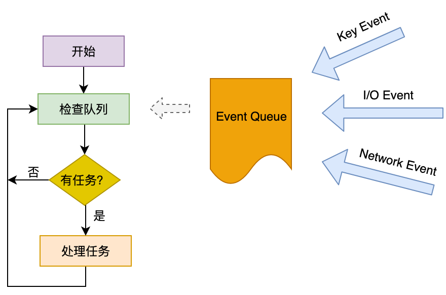
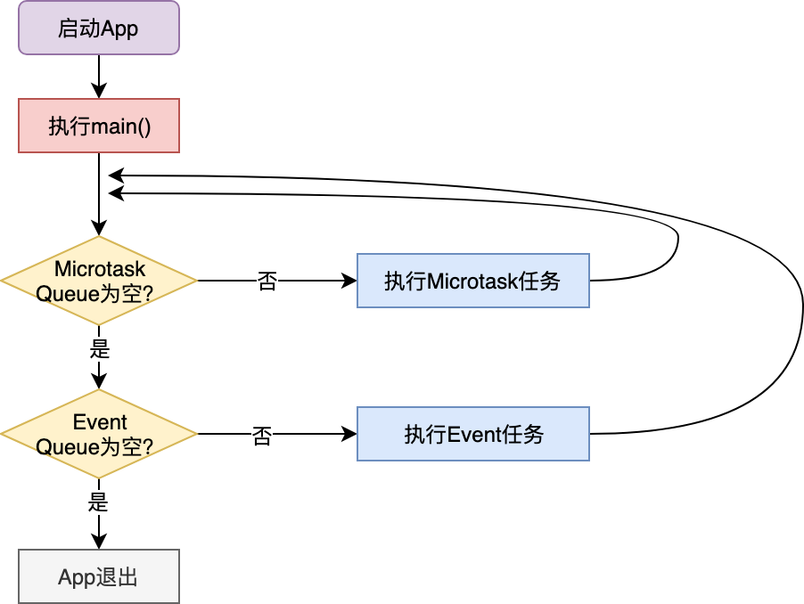
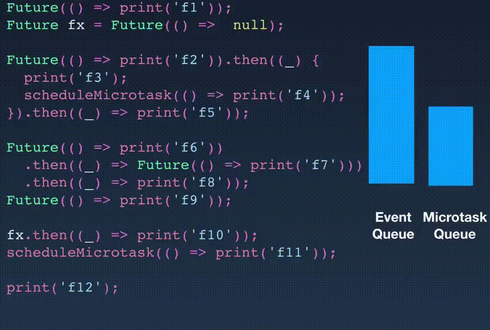

在上一篇文章中，我带你一起学习了如何在 Flutter 中实现动画。对于组件动画，Flutter 将动画的状态与渲染进行了分离，因此我们需要使用动画曲线生成器 Animation、动画状态控制器 AnimationController 与动画进度监听器一起配合完成动画更新；而对于跨页面动画，Flutter 提供了 Hero 组件，可以实现共享元素变换的页面切换效果。
在之前的章节里，我们介绍了很多 Flutter 框架出色的渲染和交互能力。支撑起这些复杂的能力背后，实际上是基于单线程模型的 Dart。那么，与原生 Android 和 iOS 的多线程机制相比，单线程的 Dart 如何从语言设计层面和代码运行机制上保证 Flutter UI 的流畅性呢？
因此今天，我会通过几个小例子，循序渐进地向你介绍 Dart 语言的 Event Loop 处理机制、异步处理和并发编程的原理和使用方法，从语言设计和实践层面理解 Dart 单线程模型下的代码运行本质，从而懂得后续如何在工作中使用 Future 与 Isolate，优化我们的项目。

## Event Loop 机制

首先，我们需要建立这样一个概念，那就是**Dart 是单线程的**。那单线程意味着什么呢？这意味着 Dart 代码是有序的，按照在 main 函数出现的次序一个接一个地执行，不会被其他代码中断。另外，作为支持 Flutter 这个 UI 框架的关键技术，Dart 当然也支持异步。需要注意的是，**单线程和异步并不冲突。**
那为什么单线程也可以异步？
这里有一个大前提，那就是我们的 App 绝大多数时间都在等待。比如，等用户点击、等网络请求返回、等文件 IO 结果，等等。而这些等待行为并不是阻塞的。比如说，网络请求，Socket 本身提供了 select 模型可以异步查询；而文件 IO，操作系统也提供了基于事件的回调机制。
所以，基于这些特点，单线程模型可以在等待的过程中做别的事情，等真正需要响应结果了，再去做对应的处理。因为等待过程并不是阻塞的，所以给我们的感觉就像是同时在做多件事情一样。但其实始终只有一个线程在处理你的事情。
等待这个行为是通过 Event Loop 驱动的。事件队列 Event Queue 会把其他平行世界（比如 Socket）完成的，需要主线程响应的事件放入其中。像其他语言一样，Dart 也有一个巨大的事件循环，在不断的轮询事件队列，取出事件（比如，键盘事件、I\O 事件、网络事件等），在主线程同步执行其回调函数，如下图所示：


图 1 简化版 Event Loop

## 异步任务

事实上，图 1 的 Event Loop 示意图只是一个简化版。在 Dart 中，实际上有两个队列，一个事件队列（Event Queue），另一个则是微任务队列（Microtask Queue）。在每一次事件循环中，Dart 总是先去第一个微任务队列中查询是否有可执行的任务，如果没有，才会处理后续的事件队列的流程。
所以，Event Loop 完整版的流程图，应该如下所示：


图 2 Microtask Queue 与 Event Queue

接下来，我们分别看一下这两个队列的特点和使用场景吧。
首先，我们看看微任务队列。微任务顾名思义，表示一个短时间内就会完成的异步任务。从上面的流程图可以看到，微任务队列在事件循环中的优先级是最高的，只要队列中还有任务，就可以一直霸占着事件循环。

微任务是由 scheduleMicroTask 建立的。如下所示，这段代码会在下一个事件循环中输出一段字符串：

```dart
scheduleMicrotask(() => print('This is a microtask'));
```

不过，一般的异步任务通常也很少必须要在事件队列前完成，所以也不需要太高的优先级，因此我们通常很少会直接用到微任务队列，就连 Flutter 内部，也只有 7 处用到了而已（比如，手势识别、文本输入、滚动视图、保存页面效果等需要高优执行任务的场景）。
异步任务我们用的最多的还是优先级更低的 Event Queue。比如，I/O、绘制、定时器这些异步事件，都是通过事件队列驱动主线程执行的。
**Dart 为 Event Queue 的任务建立提供了一层封装，叫作 Future**。从名字上也很容易理解，它表示一个在未来时间才会完成的任务。
把一个函数体放入 Future，就完成了从同步任务到异步任务的包装。Future 还提供了链式调用的能力，可以在异步任务执行完毕后依次执行链路上的其他函数体。
接下来，我们看一个具体的代码示例：分别声明两个异步任务，在下一个事件循环中输出一段字符串。其中第二个任务执行完毕之后，还会继续输出另外两段字符串：

```dart
Future(() => print('Running in Future 1'));// 下一个事件循环输出字符串
 
Future(() => print(‘Running in Future 2'))
  .then((_) => print('and then 1'))
  .then((_) => print('and then 2’));// 上一个事件循环结束后，连续输出三段字符串
```

当然，这两个 Future 异步任务的执行优先级比微任务的优先级要低。

正常情况下，一个 Future 异步任务的执行是相对简单的：在我们声明一个 Future 时，Dart 会将异步任务的函数执行体放入事件队列，然后立即返回，后续的代码继续同步执行。而当同步执行的代码执行完毕后，事件队列会按照加入事件队列的顺序（即声明顺序），依次取出事件，最后同步执行 Future 的函数体及后续的 then。

这意味着，**then 与 Future 函数体共用一个事件循环**。而如果 Future 有多个 then，它们也会按照链式调用的先后顺序同步执行，同样也会共用一个事件循环。

如果 Future 执行体已经执行完毕了，但你又拿着这个 Future 的引用，往里面加了一个 then 方法体，这时 Dart 会如何处理呢？面对这种情况，Dart 会将后续加入的 then 方法体放入微任务队列，尽快执行。

下面的代码演示了 Future 的执行规则，即，先加入事件队列，或者先声明的任务先执行；then 在 Future 结束后立即执行。

- 在第一个例子中，由于 f1 比 f2 先声明，因此会被先加入事件队列，所以 f1 比 f2 先执行；
- 在第二个例子中，由于 Future 函数体与 then 共用一个事件循环，因此 f3 执行后会立刻同步执行 then 3；
- 最后一个例子中，Future 函数体是 null，这意味着它不需要也没有事件循环，因此后续的 then 也无法与它共享。在这种场景下，Dart 会把后续的 then 放入微任务队列，在下一次事件循环中执行。

```dart
//f1 比 f2 先执行
Future(() => print('f1'));
Future(() => print('f2'));
 
//f3 执行后会立刻同步执行 then 3
Future(() => print('f3')).then((_) => print('then 3'));
 
//then 4 会加入微任务队列，尽快执行
Future(() => null).then((_) => print('then 4'));
```

说了这么多规则，可能大家并没有完全记住。那我们通过一个综合案例，来把之前介绍的各个执行规则都串起来，再集中学习一下。
在下面的例子中，我们依次声明了若干个异步任务 Future，以及微任务。在其中的一些 Future 内部，我们又内嵌了 Future 与 microtask 的声明：

```dart
Future(() => print('f1'));// 声明一个匿名 Future
Future fx = Future(() =>  null);// 声明 Future fx，其执行体为 null
 
// 声明一个匿名 Future，并注册了两个 then。在第一个 then 回调里启动了一个微任务
Future(() => print('f2')).then((_) {
  print('f3');
  scheduleMicrotask(() => print('f4'));
}).then((_) => print('f5'));
 
// 声明了一个匿名 Future，并注册了两个 then。第一个 then 是一个 Future
Future(() => print('f6'))
  .then((_) => Future(() => print('f7')))
  .then((_) => print('f8'));
 
// 声明了一个匿名 Future
Future(() => print('f9'));
 
// 往执行体为 null 的 fx 注册了了一个 then
fx.then((_) => print('f10'));
 
// 启动一个微任务
scheduleMicrotask(() => print('f11'));
print('f12');
```

运行一下，上述各个异步任务会依次打印其内部执行结果：

```
f12

f11

f1

f10

f2

f3

f5

f4

f6

f9

f7

f8
```

看到这儿，你可能已经懵了。别急，我们先来看一下这段代码执行过程中，Event Queue 与 Microtask Queue 中的变化情况，依次分析一下它们的执行顺序为什么会是这样的：


图 3 Event Queue 与 Microtask Queue 变化示例

- 因为其他语句都是异步任务，所以先打印 f12。
- 剩下的异步任务中，微任务队列优先级最高，因此随后打印 f11；然后按照 Future 声明的先后顺序，打印 f1。
- 随后到了 fx，由于 fx 的执行体是 null，相当于执行完毕了，Dart 将 fx 的 then 放入微任务队列，由于微任务队列的优先级最高，因此 fx 的 then 还是会最先执行，打印 f10。
- 然后到了 fx 下面的 f2，打印 f2，然后执行 then，打印 f3。f4 是一个微任务，要到下一个事件循环才执行，因此后续的 then 继续同步执行，打印 f5。本次事件循环结束，下一个事件循环取出 f4 这个微任务，打印 f4。
- 然后到了 f2 下面的 f6，打印 f6，然后执行 then。这里需要注意的是，这个 then 是一个 Future 异步任务，因此这个 then，以及后续的 then 都被放入到事件队列中了。
- f6 下面还有 f9，打印 f9。
- 最后一个事件循环，打印 f7，以及后续的 f8。

上面的代码很是烧脑，万幸我们平时开发 Flutter 时一般不会遇到这样奇葩的写法，所以你大可放心。你只需要记住一点：**then 会在 Future 函数体执行完毕后立刻执行，无论是共用同一个事件循环还是进入下一个微任务。**

在深入理解 Future 异步任务的执行规则之后，我们再来看看怎么封装一个异步函数。

## 异步函数

对于一个异步函数来说，其返回时内部执行动作并未结束，因此需要返回一个 Future 对象，供调用者使用。调用者根据 Future 对象，来决定：是在这个 Future 对象上注册一个 then，等 Future 的执行体结束了以后再进行异步处理；还是一直同步等待 Future 执行体结束。
对于异步函数返回的 Future 对象，如果调用者决定同步等待，则需要在调用处使用 await 关键字，并且在调用处的函数体使用 async 关键字。
在下面的例子中，异步方法延迟 3 秒返回了一个 Hello 2019，在调用处我们使用 await 进行持续等待，等它返回了再打印：

```
// 声明了一个延迟 3 秒返回 Hello 的 Future，并注册了一个 then 返回拼接后的 Hello 2019
Future<String> fetchContent() => 
  Future<String>.delayed(Duration(seconds:3), () => "Hello")
    .then((x) => "$x 2019");
 
  main() async{
    print(await fetchContent());// 等待 Hello 2019 的返回
  }
```

也许你已经注意到了，我们在使用 await 进行等待的时候，在等待语句的调用上下文函数 main 加上了 async 关键字。为什么要加这个关键字呢？
因为**Dart 中的 await 并不是阻塞等待，而是异步等待**。Dart 会将调用体的函数也视作异步函数，将等待语句的上下文放入 Event Queue 中，一旦有了结果，Event Loop 就会把它从 Event Queue 中取出，等待代码继续执行。
接下来，为了帮助你加深印象，我准备了两个具体的案例。
我们先来看下这段代码。第二行的 then 执行体 f2 是一个 Future，为了等它完成再进行下一步操作，我们使用了 await，期望打印结果为 f1、f2、f3、f4：

```
Future(() => print('f1'))
  .then((_) async => await Future(() => print('f2')))
  .then((_) => print('f3'));
Future(() => print('f4'));
```

实际上，当你运行这段代码时就会发现，打印出来的结果其实是 f1、f4、f2、f3！
我来给你分析一下这段代码的执行顺序：

- 按照任务的声明顺序，f1 和 f4 被先后加入事件队列。
- f1 被取出并打印；然后到了 then。then 的执行体是个 future f2，于是放入 Event Queue。然后把 await 也放到 Event Queue 里。
- 这个时候要注意了，Event Queue 里面还有一个 f4，我们的 await 并不能阻塞 f4 的执行。因此，Event Loop 先取出 f4，打印 f4；然后才能取出并打印 f2，最后把等待的 await 取出，开始执行后面的 f3。

由于 await 是采用事件队列的机制实现等待行为的，所以比它先在事件队列中的 f4 并不会被它阻塞。
接下来，我们再看另一个例子：在主函数调用一个异步函数去打印一段话，而在这个异步函数中，我们使用 await 与 async 同步等待了另一个异步函数返回字符串：

```dart
// 声明了一个延迟 2 秒返回 Hello 的 Future，并注册了一个 then 返回拼接后的 Hello 2019
Future<String> fetchContent() => 
  Future<String>.delayed(Duration(seconds:2), () => "Hello")
    .then((x) => "$x 2019");
// 异步函数会同步等待 Hello 2019 的返回，并打印
func() async => print(await fetchContent());
 
main() {
  print("func before");
  func();
  print("func after");
}
```

运行这段代码，我们发现最终输出的顺序其实是“func before”“func after”“Hello 2019”。func 函数中的等待语句似乎没起作用。这是为什么呢？

同样，我来给你分析一下这段代码的执行顺序：

- 首先，第一句代码是同步的，因此先打印“func before”。
- 然后，进入 func 函数，func 函数调用了异步函数 fetchContent，并使用 await 进行等待，因此我们把 fetchContent、await 语句的上下文函数 func 先后放入事件队列。
- await 的上下文函数并不包含调用栈，因此 func 后续代码继续执行，打印“func after”。
- 2 秒后，fetchContent 异步任务返回“Hello 2019”，于是 func 的 await 也被取出，打印“Hello 2019”。

通过上述分析，你发现了什么现象？那就是 await 与 async 只对调用上下文的函数有效，并不向上传递。因此对于这个案例而言，func 是在异步等待。如果我们想在 main 函数中也同步等待，需要在调用异步函数时也加上 await，在 main 函数也加上 async。

经过上面两个例子的分析，你应该已经明白 await 与 async 是如何配合，完成等待工作的了吧。

介绍完了异步，我们再来看在 Dart 中，如何通过多线程实现并发。

## Isolate

尽管 Dart 是基于单线程模型的，但为了进一步利用多核 CPU，将 CPU 密集型运算进行隔离，Dart 也提供了多线程机制，即 Isolate。在 Isolate 中，资源隔离做得非常好，每个 Isolate 都有自己的 Event Loop 与 Queue，**Isolate 之间不共享任何资源，只能依靠消息机制通信，因此也就没有资源抢占问题**。

和其他语言一样，Isolate 的创建非常简单，我们只要给定一个函数入口，创建时再传入一个参数，就可以启动 Isolate 了。如下所示，我们声明了一个 Isolate 的入口函数，然后在 main 函数中启动它，并传入了一个字符串参数：

```dart
doSth(msg) => print(msg);
 
main() {
  Isolate.spawn(doSth, "Hi");
  ...
}
```

但更多情况下，我们的需求并不会这么简单，不仅希望能并发，还希望 Isolate 在并发执行的时候告知主 Isolate 当前的执行结果。

对于执行结果的告知，Isolate 通过发送管道（SendPort）实现消息通信机制。我们可以在启动并发 Isolate 时将主 Isolate 的发送管道作为参数传给它，这样并发 Isolate 就可以在任务执行完毕后利用这个发送管道给我们发消息了。

下面我们通过一个例子来说明：在主 Isolate 里，我们创建了一个并发 Isolate，在函数入口传入了主 Isolate 的发送管道，然后等待并发 Isolate 的回传消息。在并发 Isolate 中，我们用这个管道给主 Isolate 发了一个 Hello 字符串：

```dart
Isolate isolate;
 
start() async {
  ReceivePort receivePort= ReceivePort();// 创建管道
  // 创建并发 Isolate，并传入发送管道
  isolate = await Isolate.spawn(getMsg, receivePort.sendPort);
  // 监听管道消息
  receivePort.listen((data) {
    print('Data：$data');
    receivePort.close();// 关闭管道
    isolate?.kill(priority: Isolate.immediate);// 杀死并发 Isolate
    isolate = null;
  });
}
// 并发 Isolate 往管道发送一个字符串
getMsg(sendPort) => sendPort.send("Hello");
```

这里需要注意的是，在 Isolate 中，发送管道是单向的：我们启动了一个 Isolate 执行某项任务，Isolate 执行完毕后，发送消息告知我们。如果 Isolate 执行任务时，需要依赖主 Isolate 给它发送参数，执行完毕后再发送执行结果给主 Isolate，这样**双向通信的场景我们如何实现呢**？答案也很简单，让并发 Isolate 也回传一个发送管道即可。
接下来，我们以一个**并发计算阶乘**的例子来说明如何实现双向通信。
在下面的例子中，我们创建了一个异步函数计算阶乘。在这个异步函数内，创建了一个并发 Isolate，传入主 Isolate 的发送管道；并发 Isolate 也回传一个发送管道；主 Isolate 收到回传管道后，发送参数 N 给并发 Isolate，然后立即返回一个 Future；并发 Isolate 用参数 N，调用同步计算阶乘的函数，返回执行结果；最后，主 Isolate 打印了返回结果：

```dart
// 并发计算阶乘
Future<dynamic> asyncFactoriali(n) async{
  final response = ReceivePort();// 创建管道
  // 创建并发 Isolate，并传入管道
  await Isolate.spawn(_isolate,response.sendPort);
  // 等待 Isolate 回传管道
  final sendPort = await response.first as SendPort;
  // 创建了另一个管道 answer
  final answer = ReceivePort();
  // 往 Isolate 回传的管道中发送参数，同时传入 answer 管道
  sendPort.send([n,answer.sendPort]);
  return answer.first;// 等待 Isolate 通过 answer 管道回传执行结果
}
 
//Isolate 函数体，参数是主 Isolate 传入的管道
_isolate(initialReplyTo) async {
  final port = ReceivePort();// 创建管道
  initialReplyTo.send(port.sendPort);// 往主 Isolate 回传管道
  final message = await port.first as List;// 等待主 Isolate 发送消息 (参数和回传结果的管道)
  final data = message[0] as int;// 参数
  final send = message[1] as SendPort;// 回传结果的管道 
  send.send(syncFactorial(data));// 调用同步计算阶乘的函数回传结果
}
 
// 同步计算阶乘
int syncFactorial(n) => n < 2 ? n : n * syncFactorial(n-1);
main() async => print(await asyncFactoriali(4));// 等待并发计算阶乘结果
```

看完这段代码你是什么感觉呢？我们只是为了并发计算一个阶乘，这样是不是太繁琐了？
没错，确实太繁琐了。在 Flutter 中，像这样执行并发计算任务我们可以采用更简单的方式。Flutter 提供了支持并发计算的 compute 函数，其内部对 Isolate 的创建和双向通信进行了封装抽象，屏蔽了很多底层细节，我们在调用时只需要传入函数入口和函数参数，就能够实现并发计算和消息通知。

我们试着用 compute 函数改造一下并发计算阶乘的代码：

```dart
// 同步计算阶乘
int syncFactorial(n) => n < 2 ? n : n * syncFactorial(n-1);
// 使用 compute 函数封装 Isolate 的创建和结果的返回
main() async => print(await compute(syncFactorial, 4));
```

可以看到，用 compute 函数改造以后，整个代码就变成了两行，现在并发计算阶乘的代码看起来就清爽多了。

## 总结

好了，今天关于 Dart 的异步与并发机制、实现原理的分享就到这里了，我们来简单回顾一下主要内容。
Dart 是单线程的，但通过事件循环可以实现异步。而 Future 是异步任务的封装，借助于 await 与 async，我们可以通过事件循环实现非阻塞的同步等待；Isolate 是 Dart 中的多线程，可以实现并发，有自己的事件循环与 Queue，独占资源。Isolate 之间可以通过消息机制进行单向通信，这些传递的消息通过对方的事件循环驱动对方进行异步处理。

在 UI 编程过程中，异步和多线程是两个相伴相生的名词，也是很容易混淆的概念。对于异步方法调用而言，代码不需要等待结果的返回，而是通过其他手段（比如通知、回调、事件循环或多线程）在后续的某个时刻主动（或被动）地接收执行结果。

因此，从辩证关系上来看，异步与多线程并不是一个同等关系：异步是目的，多线程只是我们实现异步的一个手段之一。而在 Flutter 中，借助于 UI 框架提供的事件循环，我们可以不用阻塞的同时等待多个异步任务，因此并不需要开多线程。我们一定要记住这一点。

我把今天分享所涉及到的知识点打包到了[GitHub](https://github.com/cyndibaby905/23_dart_async)中，你可以下载下来，反复运行几次，加深理解。

## 思考题

最后，我给你留下两道思考题吧。

1. 在通过并发 Isolate 计算阶乘的例子中，我在 asyncFactoriali 方法里先后发给了并发 Isolate 两个 SendPort。你能否解释下这么做的原因？可以只发一个 SendPort 吗？
2. 请改造以下代码，在不改变整体异步结构的情况下，实现输出结果为 f1、f2、f3、f4。

```dart
Future(() => print('f1'))
  .then((_) async => await Future(() => print('f2')))
  .then((_) => print('f3'));
Future(() => print('f4'));
```