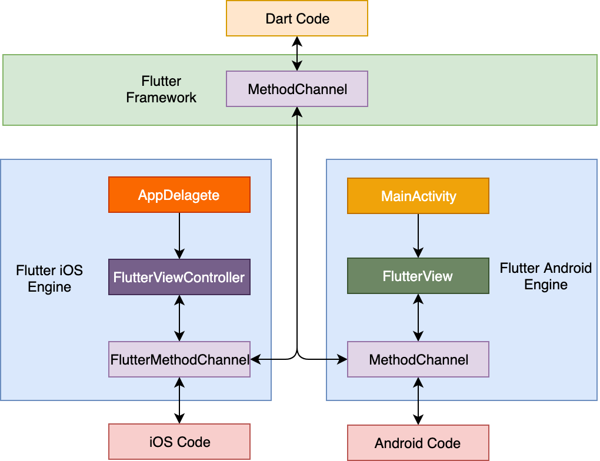
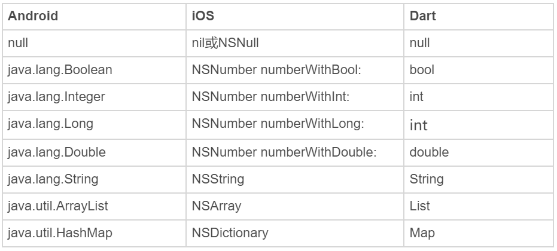

在上一篇文章中，我与你介绍了在 Flutter 中实现数据持久化的三种方式，即文件、SharedPreferences 与数据库。

其中，文件适用于字符串或者二进制流的数据持久化，我们可以根据访问频次，决定将它存在临时目录或是文档目录。而 SharedPreferences 则适用于存储小型键值对信息，可以应对一些轻量配置缓存的场景。数据库则适用于频繁变化的、结构化的对象存取，可以轻松应对数据的增删改查。

依托于与 Skia 的深度定制及优化，Flutter 给我们提供了很多关于渲染的控制和支持，能够实现绝对的跨平台应用层渲染一致性。但对于一个应用而言，除了应用层视觉显示和对应的交互逻辑处理之外，有时还需要原生操作系统（Android、iOS）提供的底层能力支持。比如，我们前面提到的数据持久化，以及推送、摄像头硬件调用等。

由于 Flutter 只接管了应用渲染层，因此这些系统底层能力是无法在 Flutter 框架内提供支持的；而另一方面，Flutter 还是一个相对年轻的生态，因此原生开发中一些相对成熟的 Java、C++ 或 Objective-C 代码库，比如图片处理、音视频编解码等，可能在 Flutter 中还没有相关实现。

因此，为了解决调用原生系统底层能力以及相关代码库复用问题，Flutter 为开发者提供了一个轻量级的解决方案，即逻辑层的方法通道（Method Channel）机制。基于方法通道，我们可以将原生代码所拥有的能力，以接口形式暴露给 Dart，从而实现 Dart 代码与原生代码的交互，就像调用了一个普通的 Dart API 一样。

接下来，我就与你详细讲述 Flutter 的方法通道机制吧。

## 方法通道

Flutter 作为一个跨平台框架，提供了一套标准化的解决方案，为开发者屏蔽了操作系统的差异。但，Flutter 毕竟不是操作系统，因此在某些特定场景下（比如推送、蓝牙、摄像头硬件调用时），也需要具备直接访问系统底层原生代码的能力。为此，Flutter 提供了一套灵活而轻量级的机制来实现 Dart 和原生代码之间的通信，即方法调用的消息传递机制，而方法通道则是用来传递通信消息的信道。

一次典型的方法调用过程类似网络调用，由作为客户端的 Flutter，通过方法通道向作为服务端的原生代码宿主发送方法调用请求，原生代码宿主在监听到方法调用的消息后，调用平台相关的 API 来处理 Flutter 发起的请求，最后将处理完毕的结果通过方法通道回发至 Flutter。调用过程如下图所示：


图 1 方法通道示意图

从上图中可以看到，方法调用请求的处理和响应，在 Android 中是通过 FlutterView，而在 iOS 中则是通过 FlutterViewController 进行注册的。FlutterView 与 FlutterViewController 为 Flutter 应用提供了一个画板，使得构建于 Skia 之上的 Flutter 通过绘制即可实现整个应用所需的视觉效果。因此，它们不仅是 Flutter 应用的容器，同时也是 Flutter 应用的入口，自然也是注册方法调用请求最合适的地方。

接下来，我通过一个例子来演示如何使用方法通道实现与原生代码的交互。

## 方法通道使用示例

在实际业务中，提示用户跳转到应用市场（iOS 为 App Store、Android 则为各类手机应用市场）去评分是一个高频需求，考虑到 Flutter 并未提供这样的接口，而跳转方式在 Android 和 iOS 上各不相同，因此我们需要分别在 Android 和 iOS 上实现这样的功能，并暴露给 Dart 相关的接口。

我们先来看看作为客户端的 Flutter，怎样实现一次方法调用请求。

### Flutter 如何实现一次方法调用请求？

首先，我们需要确定一个唯一的字符串标识符，来构造一个命名通道；然后，在这个通道之上，Flutter 通过指定方法名“openAppMarket”来发起一次方法调用请求。

可以看到，这和我们平时调用一个 Dart 对象的方法完全一样。因为方法调用过程是异步的，所以我们需要使用非阻塞（或者注册回调）来等待原生代码给予响应。

```
// 声明 MethodChannel
const platform = MethodChannel('samples.chenhang/utils');
 
// 处理按钮点击
handleButtonClick() async{
  int result;
  // 异常捕获
  try {
    // 异步等待方法通道的调用结果
    result = await platform.invokeMethod('openAppMarket');
  }
  catch (e) {
    result = -1;
  }
  print("Result：$result");
}
```

需要注意的是，与网络调用类似，方法调用请求有可能会失败（比如，Flutter 发起了原生代码不支持的 API 调用，或是调用过程出错等），因此我们需要把发起方法调用请求的语句用 try-catch 包装起来。

调用方的实现搞定了，接下来就需要在原生代码宿主中完成方法调用的响应实现了。由于我们需要适配 Android 和 iOS 两个平台，所以我们分别需要在两个平台上完成对应的接口实现。

### 在原生代码中完成方法调用的响应

首先，**我们来看看 Android 端的实现方式**。在上一小结最后我提到，在 Android 平台，方法调用的处理和响应是在 Flutter 应用的入口，也就是在 MainActivity 中的 FlutterView 里实现的，因此我们需要打开 Flutter 的 Android 宿主 App，找到 MainActivity.java 文件，并在其中添加相关的逻辑。

调用方与响应方都是通过命名通道进行信息交互的，所以我们需要在 onCreate 方法中，创建一个与调用方 Flutter 所使用的通道名称一样的 MethodChannel，并在其中设置方法处理回调，响应 openAppMarket 方法，打开应用市场的 Intent。同样地，考虑到打开应用市场的过程可能会出错，我们也需要增加 try-catch 来捕获可能的异常：

```
protected void onCreate(Bundle savedInstanceState) {
  ...
  // 创建与调用方标识符一样的方法通道
  new MethodChannel(getFlutterView(), "samples.chenhang/utils").setMethodCallHandler(
   // 设置方法处理回调
    new MethodCallHandler() {
      // 响应方法请求
      @Override
      public void onMethodCall(MethodCall call, Result result) {
        // 判断方法名是否支持
        if(call.method.equals("openAppMarket")) {
          try {
            // 应用市场 URI
            Uri uri = Uri.parse("market://details?id=com.hangchen.example.flutter_module_page.host");
            Intent intent = new Intent(Intent.ACTION_VIEW, uri);
            intent.addFlags(Intent.FLAG_ACTIVITY_NEW_TASK);
            // 打开应用市场
            activity.startActivity(intent);
            // 返回处理结果
            result.success(0);
          } catch (Exception e) {
            // 打开应用市场出现异常
            result.error("UNAVAILABLE", " 没有安装应用市场 ", null);
          }
        }else {
          // 方法名暂不支持 
          result.notImplemented();
        }
      }
    });
}
```

现在，方法调用响应的 Android 部分已经搞定，接下来我们来看一下**iOS 端的方法调用响应如何实现。**
在 iOS 平台，方法调用的处理和响应是在 Flutter 应用的入口，也就是在 Applegate 中的 rootViewController（即 FlutterViewController）里实现的，因此我们需要打开 Flutter 的 iOS 宿主 App，找到 AppDelegate.m 文件，并添加相关逻辑。

与 Android 注册方法调用响应类似，我们需要在 didFinishLaunchingWithOptions: 方法中，创建一个与调用方 Flutter 所使用的通道名称一样的 MethodChannel，并在其中设置方法处理回调，响应 openAppMarket 方法，通过 URL 打开应用市场：

```
- (BOOL)application:(UIApplication *)application didFinishLaunchingWithOptions:(NSDictionary *)launchOptions {
  // 创建命名方法通道
  FlutterMethodChannel* channel = [FlutterMethodChannel methodChannelWithName:@"samples.chenhang/utils" binaryMessenger:(FlutterViewController *)self.window.rootViewController];
  // 往方法通道注册方法调用处理回调
  [channel setMethodCallHandler:^(FlutterMethodCall* call, FlutterResult result) {
    // 方法名称一致
    if ([@"openAppMarket" isEqualToString:call.method]) {
      // 打开 App Store(本例打开微信的 URL)
      [[UIApplication sharedApplication] openURL:[NSURL URLWithString:@"itms-apps://itunes.apple.com/xy/app/foo/id414478124"]];
      // 返回方法处理结果
      result(@0);
    } else {
      // 找不到被调用的方法
      result(FlutterMethodNotImplemented);
    }
  }];
  ...
}
```

这样，iOS 端的方法调用响应也已经实现了。

接下来，我们就可以在 Flutter 应用里，通过调用 openAppMarket 方法，实现打开不同操作系统提供的应用市场功能了。

需要注意的是，在原生代码处理完毕后将处理结果返回给 Flutter 时，**我们在 Dart、Android 和 iOS 分别用了三种数据类型**：Android 端返回的是 java.lang.Integer、iOS 端返回的是 NSNumber、Dart 端接收到返回结果时又变成了 int 类型。这是为什么呢？

这是因为在使用方法通道进行方法调用时，由于涉及到跨系统数据交互，Flutter 会使用 StandardMessageCodec 对通道中传输的信息进行类似 JSON 的二进制序列化，以标准化数据传输行为。这样在我们发送或者接收数据时，这些数据就会根据各自系统预定的规则自动进行序列化和反序列化。看到这里，你是不是对这样类似网络调用的方法通道技术有了更深刻的印象呢。

对于上面提到的例子，类型为 java.lang.Integer 或 NSNumber 的返回值，先是被序列化成了一段二进制格式的数据在通道中传输，然后当该数据传递到 Flutter 后，又被反序列化成了 Dart 语言中的 int 类型的数据。

关于 Android、iOS 和 Dart 平台间的常见数据类型转换，我总结成了下面一张表格，帮助你理解与记忆。你只要记住，像 null、布尔、整型、字符串、数组和字典这些基本类型，是可以在各个平台之间以平台定义的规则去混用的，就可以了。


图 2 Android、iOS 和 Dart 平台间的常见数据类型转换

## 总结

好了，今天的分享就到这里，我们来总结一下主要内容吧。

方法通道解决了逻辑层的原生能力复用问题，使得 Flutter 能够通过轻量级的异步方法调用，实现与原生代码的交互。一次典型的调用过程由 Flutter 发起方法调用请求开始，请求经由唯一标识符指定的方法通道到达原生代码宿主，而原生代码宿主则通过注册对应方法实现、响应并处理调用请求，最后将执行结果通过消息通道，回传至 Flutter。

需要注意的是，方法通道是非线程安全的。这意味着原生代码与 Flutter 之间所有接口调用必须发生在主线程。Flutter 是单线程模型，因此自然可以确保方法调用请求是发生在主线程（Isolate）的；而原生代码在处理方法调用请求时，如果涉及到异步或非主线程切换，需要确保回调过程是在原生系统的 UI 线程（也就是 Android 和 iOS 的主线程）中执行的，否则应用可能会出现奇怪的 Bug，甚至是 Crash。

我把今天分享所涉及到的知识点打包到了[GitHub](https://github.com/cyndibaby905/26_native_method)中，你可以下载下来，反复运行几次，加深理解。

## 思考题

最后，我给你留下一道思考题吧。
请扩展方法通道示例，让 openAppMarket 支持传入 AppID 和包名，使得我们可以跳转到任意一个 App 的应用市场。