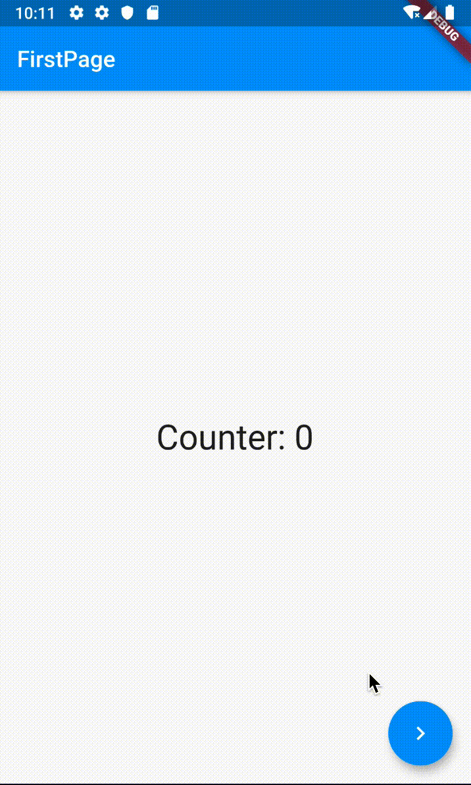

在上一篇文章中，我与你分享了如何在原生混编 Flutter 工程中管理混合导航栈，应对跨渲染引擎的页面跳转，即解决原生页面如何切换到 Flutter 页面，以及 Flutter 页面如何切换到原生页面的问题。

如果说跨渲染引擎页面切换的关键在于，如何确保页面跳转的渲染体验一致性，那么跨组件（页面）之间保持数据共享的关键就在于，如何清晰地维护组件共用的数据状态了。在第 20 篇文章“[关于跨组件传递数据，你只需要记住这三招](https://time.geekbang.org/column/article/116382)”中，我已经与你介绍了 InheritedWidget、Notification 和 EventBus 这 3 种数据传递机制，通过它们可以实现组件间的单向数据传递。

如果我们的应用足够简单，数据流动的方向和顺序是清晰的，我们只需要将数据映射成视图就可以了。作为声明式的框架，Flutter 可以自动处理数据到渲染的全过程，通常并不需要状态管理。

但，随着产品需求迭代节奏加快，项目逐渐变得庞大时，我们往往就需要管理不同组件、不同页面之间共享的数据关系。当需要共享的数据关系达到几十上百个的时候，我们就很难保持清晰的数据流动方向和顺序了，导致应用内各种数据传递嵌套和回调满天飞。在这个时候，我们迫切需要一个解决方案，来帮助我们理清楚这些共享数据的关系，于是状态管理框架便应运而生。

Flutter 在设计声明式 UI 上借鉴了不少 React 的设计思想，因此涌现了诸如 flutter_redux、flutter_mobx 、fish_redux 等基于前端设计理念的状态管理框架。但这些框架大都比较复杂，且需要对框架设计概念有一定理解，学习门槛相对较高。

而源自 Flutter 官方的状态管理框架 Provider 则相对简单得多，不仅容易理解，而且框架的入侵性小，还可以方便地组合和控制 UI 刷新粒度。因此，在 Google I/O 2019 大会一经面世，Provider 就成为了官方推荐的状态管理方式之一。

那么今天，我们就来聊聊 Provider 到底怎么用吧。

## Provider

从名字就可以看出，Provider 是一个用来提供数据的框架。它是 InheritedWidget 的语法糖，提供了依赖注入的功能，允许在 Widget 树中更加灵活地处理和传递数据。

那么，什么是依赖注入呢？通俗地说，依赖注入是一种可以让我们在需要时提取到所需资源的机制，即：预先将某种“资源”放到程序中某个我们都可以访问的位置，当需要使用这种“资源”时，直接去这个位置拿即可，而无需关心“资源”是谁放进去的。

所以，为了使用 Provider，我们需要解决以下 3 个问题：

- 资源（即数据状态）如何封装？
- 资源放在哪儿，才都能访问得到？
- 具体使用时，如何取出资源？

接下来，我通过一个例子来与你演示如何使用 Provider。

在下面的示例中，我们有两个独立的页面 FirstPage 和 SecondPage，它们会共享计数器的状态：其中 FirstPage 负责读，SecondPage 负责读和写。

在使用 Provider 之前，我们**首先需要在 pubspec.yaml 文件中添加 Provider 的依赖**：

```
dependencies:
  flutter:
    sdk: flutter
  provider: 3.0.0+1  #provider 依赖
```

添加好 Provider 的依赖后，我们就可以进行数据状态的封装了。这里，我们只有一个状态需要共享，即 count。由于第二个页面还需要修改状态，因此我们还需要在数据状态的封装上包含更改数据的方法：

```
// 定义需要共享的数据模型，通过混入 ChangeNotifier 管理听众
class CounterModel with ChangeNotifier {
  int _count = 0;
  // 读方法
  int get counter => _count; 
  // 写方法
  void increment() {
    _count++;
    notifyListeners();// 通知听众刷新
  }
}
```

可以看到，我们在资源封装类中使用 mixin 混入了 ChangeNotifier。这个类能够帮助我们管理所有依赖资源封装类的听众。当资源封装类调用 notifyListeners 时，它会通知所有听众进行刷新。
**资源已经封装完毕，接下来我们就需要考虑把它放到哪儿了。**
因为 Provider 实际上是 InheritedWidget 的语法糖，所以通过 Provider 传递的数据从数据流动方向来看，是由父到子（或者反过来）。这时我们就明白了，原来需要把资源放到 FirstPage 和 SecondPage 的父 Widget，也就是应用程序的实例 MyApp 中（当然，把资源放到更高的层级也是可以的，比如放到 main 函数中）：

```
class MyApp extends StatelessWidget {
  @override
  Widget build(BuildContext context) {
     // 通过 Provider 组件封装数据资源
    return ChangeNotifierProvider.value(
        value: CounterModel(),// 需要共享的数据资源
        child: MaterialApp(
          home: FirstPage(),
        )
    );
  }
}
```

可以看到，既然 Provider 是 InheritedWidget 的语法糖，因此它也是一个 Widget。所以，我们直接在 MaterialApp 的外层使用 Provider 进行包装，就可以把数据资源依赖注入到应用中。
这里需要注意的是，由于封装的数据资源不仅需要为子 Widget 提供读的能力，还要提供写的能力，因此我们需要使用 Provider 的升级版 ChangeNotifierProvider。而如果只需要为子 Widget 提供读能力，直接使用 Provider 即可。
**最后，在注入数据资源完成之后，我们就可以在 FirstPage 和 SecondPage 这两个子 Widget 完成数据的读写操作了。**
关于读数据，与 InheritedWidget 一样，我们可以通过 Provider.of 方法来获取资源数据。而如果我们想写数据，则需要通过获取到的资源数据，调用其暴露的更新数据方法（本例中对应的是 increment），代码如下所示：

```
// 第一个页面，负责读数据
class FirstPage extends StatelessWidget {
  @override
  Widget build(BuildContext context) {
    // 取出资源
    final _counter = Provider.of<CounterModel>(context);
    return Scaffold(
      // 展示资源中的数据
      body: Text('Counter: ${_counter.counter}'),
      // 跳转到 SecondPage
      floatingActionButton: FloatingActionButton(
        onPressed: () => Navigator.of(context).push(MaterialPageRoute(builder: (context) => SecondPage()))
      ));
  }
}
 
// 第二个页面，负责读写数据
class SecondPage extends StatelessWidget {
  @override
  Widget build(BuildContext context) {
    // 取出资源
    final _counter = Provider.of<CounterModel>(context);
    return Scaffold(
      // 展示资源中的数据
      body: Text('Counter: ${_counter.counter}'),
      // 用资源更新方法来设置按钮点击回调
      floatingActionButton:FloatingActionButton(
          onPressed: _counter.increment,
          child: Icon(Icons.add),
     ));
  }
}
```

运行代码，试着多点击几次第二个界面的“+”按钮，关闭第二个界面，可以看到第一个界面也同步到了按钮的点击数。


图 1 Provider 使用示例

## Consumer

通过上面的示例可以看到，使用 Provider.of 获取资源，可以得到资源暴露的数据的读写接口，在实现数据的共享和同步上还是比较简单的。但是，**滥用 Provider.of 方法也有副作用，那就是当数据更新时，页面中其他的子 Widget 也会跟着一起刷新。**

为验证这一点，我们以第二个界面右下角 FloatingActionButton 中的子 Widget “+”Icon 为例做个测试。

首先，为了打印出 Icon 控件每一次刷新的情况，我们需要自定义一个控件 TestIcon，并在其 build 方法中返回 Icon 实例的同时，打印一句话：

```
// 用于打印 build 方法执行情况的自定义控件
class TestIcon extends StatelessWidget {
  @override
  Widget build(BuildContext context) {
    print("TestIcon build");
    return Icon(Icons.add);// 返回 Icon 实例
  }
}
```

然后，我们用 TestIcon 控件，替换掉 SecondPage 中 FloatingActionButton 的 Icon 子 Widget：

```
class SecondPage extends StatelessWidget {
  @override
  Widget build(BuildContext context) {
    // 取出共享的数据资源
    final _counter = Provider.of<CounterModel>(context);
    return Scaffold(
     ...
      floatingActionButton:FloatingActionButton(
          onPressed: _counter.increment,
          child: TestIcon(),// 替换掉原有的 Icon(Icons.add)
     ));
  }
```

运行这段实例，然后在第二个页面多次点击“+”按钮，观察控制台输出：

```
I/flutter (21595): TestIcon build
I/flutter (21595): TestIcon build
I/flutter (21595): TestIcon build
I/flutter (21595): TestIcon build
I/flutter (21595): TestIcon build
```

可以看到，TestIcon 控件本来是一个不需要刷新的 StatelessWidget，但却因为其父 Widget FloatingActionButton 所依赖的数据资源 counter 发生了变化，导致它也要跟着刷新。

那么，**有没有办法能够在数据资源发生变化时，只刷新对资源存在依赖关系的 Widget，而其他 Widget 保持不变呢？**

答案当然是可以的。

在本次分享一开始时，我曾说 Provider 可以精确地控制 UI 刷新粒度，而这一切是基于 Consumer 实现的。Consumer 使用了 Builder 模式创建 UI，收到更新通知就会通过 builder 重新构建 Widget。

接下来，我们就看看**如何使用 Consumer 来改造 SecondPage**吧。

在下面的例子中，我们在 SecondPage 中去掉了 Provider.of 方法来获取 counter 的语句，在其真正需要这个数据资源的两个子 Widget，即 Text 和 FloatingActionButton 中，使用 Consumer 来对它们进行了一层包装：

```
class SecondPage extends StatelessWidget {
  @override
  Widget build(BuildContext context) {
    return Scaffold(
      // 使用 Consumer 来封装 counter 的读取
      body: Consumer<CounterModel>(
        //builder 函数可以直接获取到 counter 参数
        builder: (context, CounterModel counter, _) => Text('Value: ${counter.counter}')),
      // 使用 Consumer 来封装 increment 的读取 
      floatingActionButton: Consumer<CounterModel>(
        //builder 函数可以直接获取到 increment 参数
        builder: (context, CounterModel counter, child) => FloatingActionButton(
          onPressed: counter.increment,
          child: child,
        ),
        child: TestIcon(),
      ),
    );
  }
}
```

可以看到，Consumer 中的 builder 实际上就是真正刷新 UI 的函数，它接收 3 个参数，即 context、model 和 child。其中：context 是 Widget 的 build 方法传进来的 BuildContext，model 是我们需要的数据资源，而 child 则用来构建那些与数据资源无关的部分。在数据资源发生变更时，builder 会多次执行，但 child 不会重建。

运行这段代码，可以发现，不管我们点击了多少次“+”按钮，TestIcon 控件始终没有发生销毁重建。

## 多状态的资源封装

通过上面的例子，我们学习了 Provider 是如何共享一个数据状态的。那么，如果有多个数据状态需要共享，我们又该如何处理呢？
其实也不难。接下来，我就**按照封装、注入和读写这 3 个步骤，与你介绍多个数据状态的共享**。
在处理多个数据状态共享之前，我们需要先扩展一下上面计数器状态共享的例子，让两个页面之间展示计数器数据的 Text 能够共享 App 传递的字体大小。
**首先，我们来看看如何封装**。
多个数据状态与单个数据的封装并无不同，如果需要支持数据的读写，我们需要一个接一个地为每一个数据状态都封装一个单独的资源封装类；而如果数据是只读的，则可以直接传入原始的数据对象，从而省去资源封装的过程。
**接下来，我们再看看如何实现注入。**
在单状态的案例中，我们通过 Provider 的升级版 ChangeNotifierProvider 实现了可读写资源的注入，而如果我们想注入多个资源，则可以使用 Provider 的另一个升级版 MultiProvider，来实现多个 Provider 的组合注入。

在下面的例子中，我们通过 MultiProvider 往 App 实例内注入了 double 和 CounterModel 这两个资源 Provider：

```
class MyApp extends StatelessWidget {
  @override
  Widget build(BuildContext context) {
    return MultiProvider(providers: [
      Provider.value(value: 30.0),// 注入字体大小
      ChangeNotifierProvider.value(value: CounterModel())// 注入计数器实例
    ],
    child: MaterialApp(
      home: FirstPage(),
    ));
  }
}
```

在完成了多个资源的注入后，最后我们来看看**如何获取这些资源**。
这里，我们还是使用 Provider.of 方式来获取资源。相较于单状态资源的获取来说，获取多个资源时，我们只需要依次读取每一个资源即可：

```
final _counter = Provider.of<CounterModel>(context);// 获取计时器实例
final textSize = Provider.of<double>(context);// 获取字体大小
```

而如果以 Consumer 的方式来获取资源的话，我们只要使用 Consumer2 对象（这个对象提供了读取两个数据资源的能力），就可以一次性地获取字体大小与计数器实例这两个数据资源：

```
// 使用 Consumer2 获取两个数据资源
Consumer2<CounterModel,double>(
  //builder 函数以参数的形式提供了数据资源
  builder: (context, CounterModel counter, double textSize, _) => Text(
      'Value: ${counter.counter}', 
      style: TextStyle(fontSize: textSize))
)
```

可以看到，Consumer2 与 Consumer 的使用方式基本一致，只不过是在 builder 方法中多了一个数据资源参数。事实上，如果你希望在子 Widget 中共享更多的数据，我们最多可以使用到 Consumer6，即共享 6 个数据资源。

## 总结

好了，今天的分享就到这里，我们总结一下今天的主要内容吧。
我与你介绍了在 Flutter 中通过 Provider 进行状态管理的方法，Provider 以 InheritedWidget 语法糖的方式，通过数据资源封装、数据注入和数据读写这 3 个步骤，为我们实现了跨组件（跨页面）之间的数据共享。
我们既可以用 Provider 来实现静态的数据读传递，也可以使用 ChangeNotifierProvider 来实现动态的数据读写传递，还可以通过 MultiProvider 来实现多个数据资源的共享。
在具体使用数据时，Provider.of 和 Consumer 都可以实现数据的读取，并且 Consumer 还可以控制 UI 刷新的粒度，避免与数据无关的组件的无谓刷新。
可以看到，通过 Provider 来实现数据传递，无论在单个页面内还是在整个 App 之间，我们都可以很方便地实现状态管理，搞定那些通过 StatefulWidget 无法实现的场景，进而开发出简单、层次清晰、可扩展性高的应用。事实上，当我们使用 Provider 后，我们就再也不需要使用 StatefulWidget 了。
我把今天分享所涉及到的知识点打包到了[GitHub](https://github.com/cyndibaby905/30_provider_demo)中，你可以下载下来，反复运行几次，加深理解与记忆。

## 思考题

最后，我给你留一道思考题吧。
使用 Provider 可以实现 2 个同样类型的对象共享，你知道应该如何实现吗？