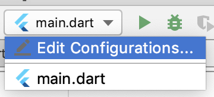
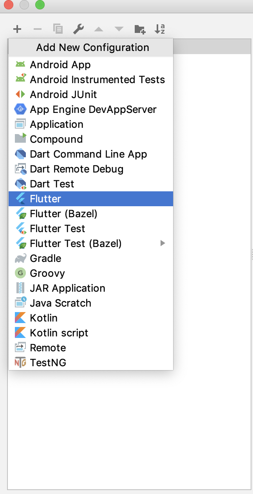
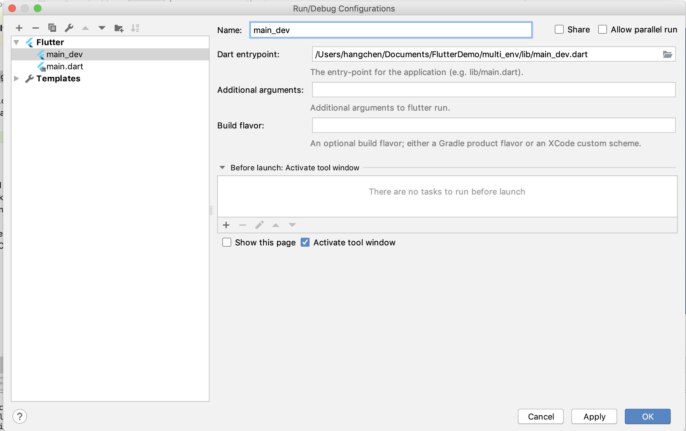
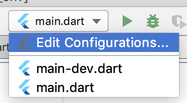
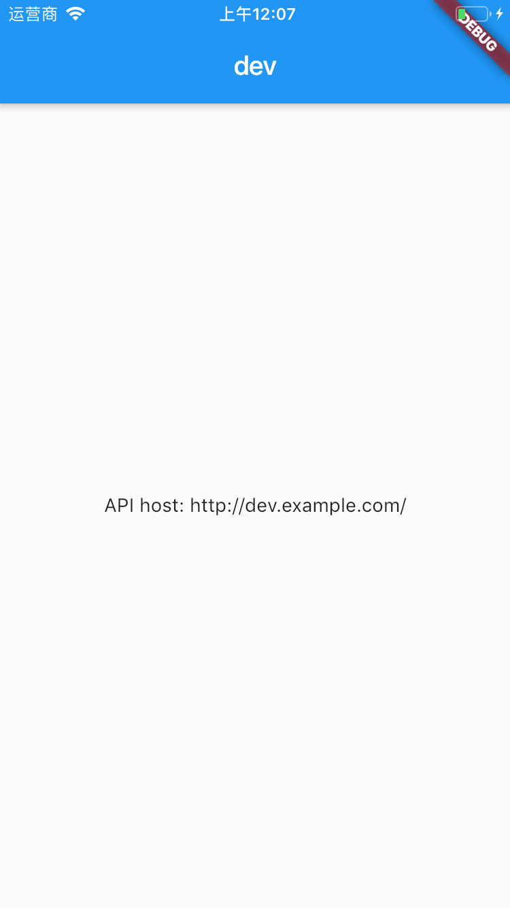
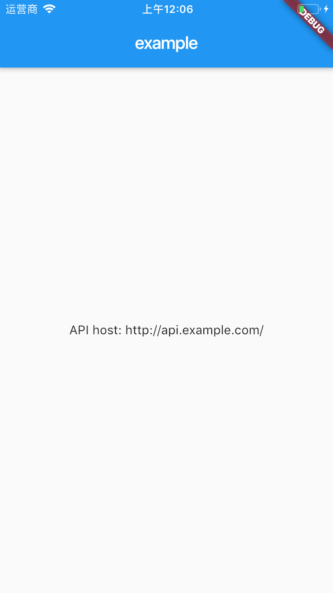

今天，我们来聊聊 Flutter 的编译模式吧。

在开发移动应用程序时，一个 App 的完整生命周期包括开发、测试和上线 3 个阶段。在每个阶段，开发者的关注点都不一样。

比如，在开发阶段，我们希望调试尽可能方便、快速，尽可能多地提供错误上下文信息；在测试阶段，我们希望覆盖范围尽可能全面，能够具备不同配置切换能力，可以测试和验证还没有对外发布的新功能；而在发布阶段，我们则希望能够去除一切测试代码，精简调试信息，使运行速度尽可能快，代码足够安全。

这就要求开发者在构建移动应用时，不仅要在工程内提前准备多份配置环境，还要利用编译器提供的编译选项，打包出符合不同阶段优化需求的 App。

对于 Flutter 来说，它既支持常见的 Debug、Release 等工程物理层面的编译模式，也支持在工程内提供多种配置环境入口。今天，我们就来学习一下 Flutter 提供的编译模式，以及如何在 App 中引用开发环境和生产环境，使得我们在不破坏任何生产环境代码的情况下，能够测试处于开发期的新功能。

## Flutter 的编译模式

Flutter 支持 3 种运行模式，包括 Debug、Release 和 Profile。在编译时，这三种模式是完全独立的。首先，我们先来看看这 3 种模式的具体含义吧。

- Debug 模式对应 Dart 的 JIT 模式，可以在真机和模拟器上同时运行。该模式会打开所有的断言（assert），以及所有的调试信息、服务扩展和调试辅助（比如 Observatory）。此外，该模式为快速开发和运行做了优化，支持亚秒级有状态的 Hot reload（热重载），但并没有优化代码执行速度、二进制包大小和部署。flutter run --debug 命令，就是以这种模式运行的。
- Release 模式对应 Dart 的 AOT 模式，只能在真机上运行，不能在模拟器上运行，其编译目标为最终的线上发布，给最终的用户使用。该模式会关闭所有的断言，以及尽可能多的调试信息、服务扩展和调试辅助。此外，该模式优化了应用快速启动、代码快速执行，以及二级制包大小，因此编译时间较长。flutter run --release 命令，就是以这种模式运行的。
- Profile 模式，基本与 Release 模式一致，只是多了对 Profile 模式的服务扩展的支持，包括支持跟踪，以及一些为了最低限度支持所需要的依赖（比如，可以连接 Observatory 到进程）。该模式用于分析真实设备实际运行性能。flutter run --profile 命令，就是以这种模式运行的。

由于 Profile 与 Release 在编译过程上几乎无差异，因此我们今天只讨论 Debug 和 Release 模式。

在开发应用时，为了便于快速发现问题，我们通常会在运行时识别当前的编译模式，去改变代码的部分执行行为：在 Debug 模式下，我们会打印详细的日志，调用开发环境接口；而在 Release 模式下，我们会只记录极少的日志，调用生产环境接口。

在运行时识别应用的编译模式，有两种解决办法：

- 通过断言识别；
- 通过 Dart VM 所提供的编译常数识别。

我们先来看看**如何通过断言识别应用的编译模式**。

通过 Debug 与 Release 模式的介绍，我们可以得出，Release 与 Debug 模式的一个重要区别就是，Release 模式关闭了所有的断言。因此，我们可以借助于断言，写出只在 Debug 模式下生效的代码。

如下所示，我们在断言里传入了一个始终返回 true 的匿名函数执行结果，这个匿名函数的函数体只会在 Debug 模式下生效：

```
assert(() {
  //Do sth for debug
  return true;
}());
```

需要注意的是，匿名函数声明调用结束时追加了小括号（）。 这是因为断言只能检查布尔值，所以我们必须使用括号强制执行这个始终返回 true 的匿名函数，以确保匿名函数体的代码可以执行。

接下来，我们再看看**如何通过编译常数识别应用的编译模式**。

如果说通过断言只能写出在 Debug 模式下运行的代码，而通过 Dart 提供的编译常数，我们还可以写出只在 Release 模式下生效的代码。Dart 提供了一个布尔型的常量 kReleaseMode，用于反向指示当前 App 的编译模式。

如下所示，我们通过判断这个常量，可以准确地识别出当前的编译模式：

```
if(kReleaseMode){
  //Do sth for release 
} else {
  //Do sth for debug
}
```

## 分离配置环境

通过断言和 kReleaseMode 常量，我们能够识别出当前 App 的编译环境，从而可以在运行时对某个代码功能进行局部微调。而如果我们想在整个应用层面，为不同的运行环境提供更为统一的配置（比如，对于同一个接口调用行为，开发环境会使用 [dev.example.com](http://dev.example.com/) 域名，而生产环境会使用 [api.example.com](http://api.example.com/) 域名），则需要在应用启动入口提供可配置的初始化方式，根据特定需求为应用注入配置环境。

在 Flutter 构建 App 时，为应用程序提供不同的配置环境，总体可以分为抽象配置、配置多入口、读配置和编译打包 4 个步骤：

1. 抽象出应用程序的可配置部分，并使用 InheritedWidget 对其进行封装；
2. 将不同的配置环境拆解为多个应用程序入口（比如，开发环境为 main-dev.dart、生产环境为 main.dart），把应用程序的可配置部分固化在各个入口处；
3. 在运行期，通过 InheritedWidget 提供的数据共享机制，将配置部分应用到其子 Widget 对应的功能中；
4. 使用 Flutter 提供的编译打包选项，构建出不同配置环境的安装包。

**接下来，我将依次为你介绍具体的实现步骤。**

在下面的示例中，我会把应用程序调用的接口和标题进行区分实现，即开发环境使用 [dev.example.com](http://dev.example.com/) 域名，应用主页标题为 dev；而生产环境使用 [api.example.com](http://api.example.com/) 域名，主页标题为 example。

首先是**配置抽象**。根据需求可以看出，应用程序中有两个需要配置的部分，即接口 apiBaseUrl 和标题 appName，因此我定义了一个继承自 InheritedWidget 的类 AppConfig，对这两个配置进行封装：

```
class AppConfig extends InheritedWidget {
  AppConfig({
    @required this.appName,
    @required this.apiBaseUrl,
    @required Widget child,
  }) : super(child: child);
 
  final String appName;// 主页标题
  final String apiBaseUrl;// 接口域名
 
  // 方便其子 Widget 在 Widget 树中找到它
  static AppConfig of(BuildContext context) {
    return context.inheritFromWidgetOfExactType(AppConfig);
  }
  
  // 判断是否需要子 Widget 更新。由于是应用入口，无需更新
  @override
  bool updateShouldNotify(InheritedWidget oldWidget) => false;
}
```

接下来，我们需要**为不同的环境创建不同的应用入口**。

在这个例子中，由于只有两个环境，即开发环境与生产环境，因此我们将文件分别命名为 main_dev.dart 和 main.dart。在这两个文件中，我们会使用不同的配置数据来对 AppConfig 进行初始化，同时把应用程序实例 MyApp 作为其子 Widget，这样整个应用内都可以获取到配置数据：

```
//main_dev.dart
void main() {
  var configuredApp = AppConfig(
    appName: 'dev',// 主页标题
    apiBaseUrl: 'http://dev.example.com/',// 接口域名
    child: MyApp(),
  );
  runApp(configuredApp);// 启动应用入口
}
 
//main.dart
void main() {
  var configuredApp = AppConfig(
    appName: 'example',// 主页标题
    apiBaseUrl: 'http://api.example.com/',// 接口域名
    child: MyApp(),
  );
  runApp(configuredApp);// 启动应用入口
}
```

完成配置环境的注入之后，接下来就可以**在应用内获取配置数据**，来实现定制化的功能了。由于 AppConfig 是整个应用程序的根节点，因此我可以通过调用 AppConfig.of 方法，来获取到相关的数据配置。

在下面的代码中，我分别获取到了应用主页的标题，以及接口域名，并显示了出来：

```
class MyApp extends StatelessWidget {
  @override
  Widget build(BuildContext context) {
    var config = AppConfig.of(context);// 获取应用配置
    return MaterialApp(
      title: config.appName,// 应用主页标题
      home: MyHomePage(),
    );
  }
}
 
class MyHomePage extends StatelessWidget {
  @override
  Widget build(BuildContext context) {
    var config = AppConfig.of(context);// 获取应用配置
    return Scaffold(
      appBar: AppBar(
        title: Text(config.appName),// 应用主页标题
      ),
      body:  Center(
        child: Text('API host: ${config.apiBaseUrl}'),// 接口域名
      ),
    );
  }
}
```

现在，我们已经完成了分离配置环境的代码部分。最后，我们可以使用 Flutter 提供的编译选项，来**构建出不同配置的安装包**了。
如果想要在模拟器或真机上运行这段代码，我们可以在 flutter run 命令后面，追加–target 或 -t 参数，来指定应用程序初始化入口：

```
// 运行开发环境应用程序
flutter run -t lib/main_dev.dart 
 
// 运行生产环境应用程序
flutter run -t lib/main.dart
```

如果我们想在 Android Studio 上为应用程序创建不同的启动配置，则可以**通过 Flutter 插件为 main_dev.dart 增加启动入口**。

首先，点击工具栏上的 Config Selector，选择 Edit Configurations 进入编辑应用程序启动选项：


图 1 Config Selector 新增入口

然后，点击位于工具栏面板左侧顶部的“+”按钮，在弹出的菜单中选择 Flutter 选项，为应用程序新增一项启动入口：


图 2 选择新增类型

最后，在入口的编辑面板中，为 main_dev 选择程序的 Dart 入口，点击 OK 后，就完成了入口的新增工作：


图 3 编辑启动入口

接下来，我们就可以**在 Config Selector 中切换不同的启动入口，从而直接在 Android Studio 中注入不同的配置环境了**：


图 4 Config Selector 切换启动入口

我们试着在不同的入口中进行切换和运行，可以看到，App 已经可以识别出不同的配置环境了：


图 5 开发环境运行示例


图 6 生产环境运行示例

而如果我们想要打包构建出适用于 Android 的 APK，或是 iOS 的 IPA 安装包，则可以在 flutter build 命令后面，同样追加–target 或 -t 参数，指定应用程序初始化入口：

```
// 打包开发环境应用程序
flutter build apk -t lib/main_dev.dart 
flutter build ios -t lib/main_dev.dart
 
// 打包生产环境应用程序
flutter build apk -t lib/main.dart
flutter build ios -t lib/main.dart
```

## 总结

好了，今天的分享就到这里。我们来总结一下今天的主要内容吧。
Flutter 支持 Debug 与 Release 的编译模式，并且这两种模式在构建时是完全独立的。Debug 模式下会打开所有的断言和调试信息，而 Release 模式下则会关闭这些信息，因此我们可以通过断言，写出只在 Debug 模式下生效的代码。而如果我们想更精准地识别出当前的编译模式，则可以利用 Dart 所提供的编译常数 kReleaseMode，写出只在 Release 模式下生效的代码。
除此之外，Flutter 对于常见的分环境配置能力也提供了支持，我们可以使用 InheritedWidget 为应用中可配置部分进行封装抽象，通过配置多入口的方式为应用的启动注入配置环境。
需要注意的是，虽然断言和 kReleaseMode 都能够识别出 Debug 编译模式，但它们对二进制包的打包构建影响是不同的。
采用断言的方式，其相关代码会在 Release 构建中被完全剔除；而如果使用 kReleaseMode 常量来识别 Debug 环境，虽然这段代码永远不会在 Release 环境中执行，但却会被打入到二进制包中，增大包体积。因此，如果没有特殊需求的话，一定要使用断言来实现 Debug 特有的逻辑，或是在发布期前将使用 kReleaseMode 判断的 Debug 逻辑完全删除。
我把今天分享所涉及到的知识点打包到了[GitHub](https://github.com/cyndibaby905/34_multi_env)中，你可以下载下来，反复运行几次，加深理解与记忆。

## 思考题

最后，我给你留一道思考题吧。
在保持生产环境代码不变的情况下，如果想在开发环境中支持不同配置的切换，我们应该如何实现？