今天我们来聊聊如何调试 Flutter App。

软件开发通常是一个不断迭代、螺旋式上升的过程。在迭代的过程中，我们不可避免地会经常与 Bug 打交道，特别是在多人协作的项目中，我们不仅要修复自己的 Bug，有时还需要帮别人解决 Bug。

而修复 Bug 的过程，不仅能帮我们排除代码中的隐患，也能帮助我们更快地上手项目。因此，掌握好调试这门技能，就显得尤为重要了。

在 Flutter 中，调试代码主要分为输出日志、断点调试和布局调试 3 类。所以，在今天这篇文章中，我将会围绕这 3 个主题为你详细介绍 Flutter 应用的代码调试。

我们先来看看，如何通过输出日志调试应用代码吧。

## 输出日志

为了便于跟踪和记录应用的运行情况，我们在开发时通常会在一些关键步骤输出日志（Log），即使用 print 函数在控制台打印出相关的上下文信息。通过这些信息，我们可以定位代码中可能出现的问题。

在前面的很多篇文章里，我们都大量使用了 print 函数来输出应用执行过程中的信息。不过，由于涉及 I/O 操作，使用 print 来打印信息会消耗较多的系统资源。同时，这些输出数据很可能会暴露 App 的执行细节，所以我们需要在发布正式版时屏蔽掉这些输出。

说到操作方法，你想到的可能是在发布版本前先注释掉所有的 print 语句，等以后需要调试时，再取消这些注释。但，这种方法无疑是非常无聊且耗时的。那么，Flutter 给我们提供了什么更好的方式吗？

为了根据不同的运行环境来开启日志调试功能，我们可以使用 Flutter 提供的 debugPrint 来代替 print。**debugPrint 函数同样会将消息打印至控制台，但与 print 不同的是，它提供了定制打印的能力。**也就是说，我们可以向 debugPrint 函数，赋值一个函数声明来自定义打印行为。

比如在下面的代码中，我们将 debugPrint 函数定义为一个空函数体，这样就可以实现一键取消打印的功能了：

```
debugPrint = (String message, {int wrapWidth}) {};// 空实现
```

在 Flutter 中，我们可以使用不同的 main 文件来表示不同环境下的入口。比如，在第 34 篇文章“[如何理解 Flutter 的编译模式？](https://time.geekbang.org/column/article/135865)”中，我们就分别用 main.dart 与 main-dev.dart 实现了生产环境与开发环境的分离。同样，我们可以通过 main.dart 与 main-dev.dart，去分别定义生产环境与开发环境不同的打印日志行为。

在下面的例子中，我们将生产环境的 debugPrint 定义为空实现，将开发环境的 debugPrint 定义为同步打印数据：

```
//main.dart
void main() {
  // 将 debugPrint 指定为空的执行体, 所以它什么也不做
  debugPrint = (String message, {int wrapWidth}) {};
  runApp(MyApp()); 
}
 
//main-dev.dart
void main() async {
  // 将 debugPrint 指定为同步打印数据
  debugPrint = (String message, {int wrapWidth}) => debugPrintSynchronously(message, wrapWidth: wrapWidth);
  runApp(MyApp());
}
```

可以看到，在代码实现上，我们只要将应用内所有的 print 都替换成 debugPrint，就可以满足开发环境下打日志的需求，也可以保证生产环境下应用的执行信息不会被意外打印。

## 断点调试

输出日志固然方便，但如果要想获取更为详细，或是粒度更细的上下文信息，静态调试的方式非常不方便。这时，我们需要更为灵活的动态调试方法，即断点调试。断点调试可以让代码在目标语句上暂停，让程序逐条执行后续的代码语句，来帮助我们实时关注代码执行上下文中所有变量值的详细变化过程。

Android Studio 提供了断点调试的功能，调试 Flutter 应用与调试原生 Android 代码的方法完全一样，具体可以分为三步，即**标记断点、调试应用、查看信息**。

接下来，我们以 Flutter 默认的计数器应用模板为例，观察代码中 _counter 值的变化，体会断点调试的全过程。

**首先是标记断点。**既然我们要观察 _counter 值的变化，因此在界面上展示最新的 _counter 值时添加断点，去观察其数值变化是最理想的。因此，我们在行号右侧点击鼠标，可以把断点加载到初始化 Text 控件所示的位置。

在下图的例子中，我们为了观察 _counter 在等于 20 的时候是否正常，还特意设置了一个条件断点 _counter==20，这样调试器就只会在第 20 次点击计数器按钮时暂停下来：

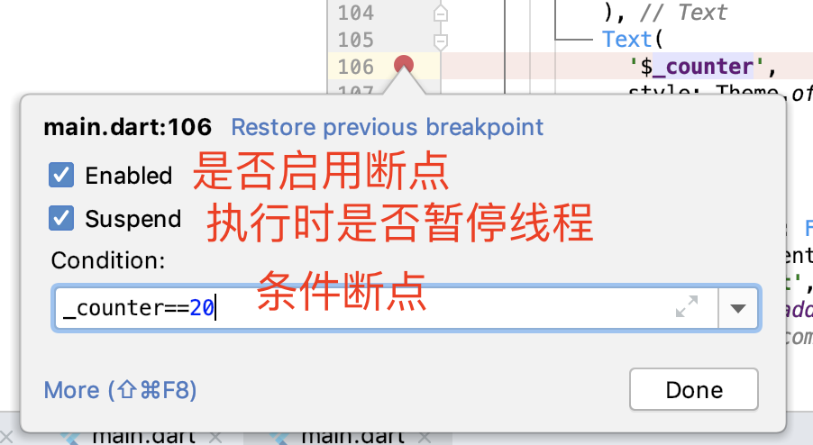
图 1 标记断点

添加断点后，对应的行号将会出现圆形的断点标记，并高亮显示整行代码。到此，断点就添加好了。当然，我们还可以同时添加多个断点，以便更好地观察代码的执行过程。

**接下来则是调试应用了。**和之前通过点击 run 按钮的运行方式不同，这一次我们需要点击工具栏上的虫子图标，以调试模式启动 App，如下图所示：

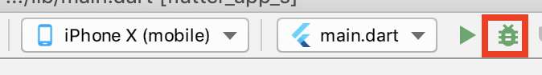
图 2 调试 App

等调试器初始化好后，我们的程序就启动了。由于我们的断点设置在了 _counter 为 20 时，因此在第 20 次点击了“+”按钮后，代码运行到了断点位置，自动进入了 Debug 视图模式。

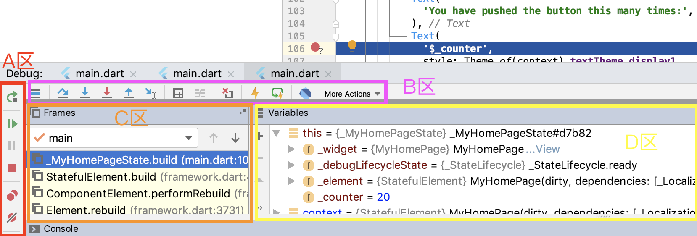
图 3 Debug 视图模式

如图所示，我把 Debug 视图模式划分为 4 个区域，即 A 区控制调试工具、B 区步进调试工具、C 区帧调试窗口、D 区变量查看窗口。

**A 区的按钮**，主要用来控制调试的执行情况：

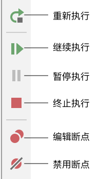
图 4 A 区按钮

- 比如，我们可以点击继续执行按钮来让程序继续运行、点击终止执行按钮来让程序终止运行、点击重新执行按钮来让程序重新启动，或是在程序正常执行时，点击暂停执行按钮按钮来让程序暂停运行。
- 又比如，我们可以点击编辑断点按钮来编辑断点信息，或是点击禁用断点按钮来取消断点。

**B 区的按钮**，主要用来控制断点的步进情况：

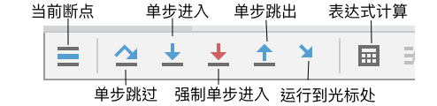
图 5 B 区按钮

- 比如，我们可以点击单步跳过按钮来让程序单步执行（但不会进入方法体内部）、点击单步进入或强制单步进入按钮让程序逐条语句执行，甚至还可以点击运行到光标处按钮让程序执行到在光标处（相当于新建临时断点）。
- 比如，当我们认为断点所在的方法体已经无需执行时，则可以点击单步跳出按钮让程序立刻执行完当前进入的方法，从而返回方法调用处的下一行。
- 又比如，我们可以点击表达式计算按钮来通过赋值或表达式方式修改任意变量的值。如下图所示，我们通过输入表达式 _counter+=100，将计数器更新为 120：

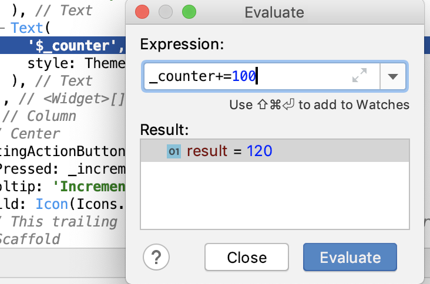
图 6 Evaluate 计算表达式

**C 区**用来指示当前断点所包含的函数执行堆栈，**D 区**则是其堆栈中的函数帧所对应的变量。

在这个例子中，我们的断点是在 _MyHomePageState 类中的 build 方法设置的，因此 D 区显示的也是 build 方法上下文所包含的变量信息（比如 _counter、_widget、this、_element 等）。如果我们想切换到 _MyHomePageState 的 build 方法执行堆栈中的其他函数（比如 StatefulElement.build），查看相关上下文的变量信息时，只需要在 C 区中点击对应的方法名即可。

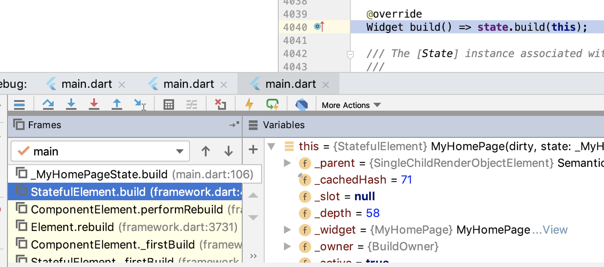
图 7 切换函数执行堆栈

可以看到，Android Studio 提供的 Flutter 调试能力很丰富，我们可以通过这些基本步骤的组合，更为灵活地调整追踪步长，观察程序的执行情况，揪出代码中的 Bug。

## 布局调试

通过断点调试，我们在 Android Studio 的调试面板中，可以随时查看执行上下文有关的变量的值，根据逻辑来做进一步的判断，确定跟踪执行的步骤。不过在更多时候，我们使用 Flutter 的目的是实现视觉功能，而视觉功能的调试是无法简单地通过 Debug 视图模式面板来搞定的。

在上一篇文章中，我们通过 Flutter 提供的热重载机制，已经极大地缩短了从代码编写到界面运行所耗费的时间，可以更快地发现代码与目标界面的明显问题，但**如果想要更快地发现界面中更为细小的问题，比如对齐、边距等，则需要使用 Debug Painting 这个界面调试工具**。

Debug Painting 能够以辅助线的方式，清晰展示每个控件元素的布局边界，因此我们可以根据辅助线快速找出布局出问题的地方。而 Debug Painting 的开启也比较简单，只需要将 debugPaintSizeEnabled 变量置为 true 即可。如下所示，我们在 main 函数中，开启了 Debug Painting 调试开关：

```
import 'package:flutter/rendering.dart';
 
void main() {
  debugPaintSizeEnabled = true;      // 打开 Debug Painting 调试开关
  runApp(new MyApp());
}
```

运行代码后，App 在 iPhone X 中的执行效果如下：

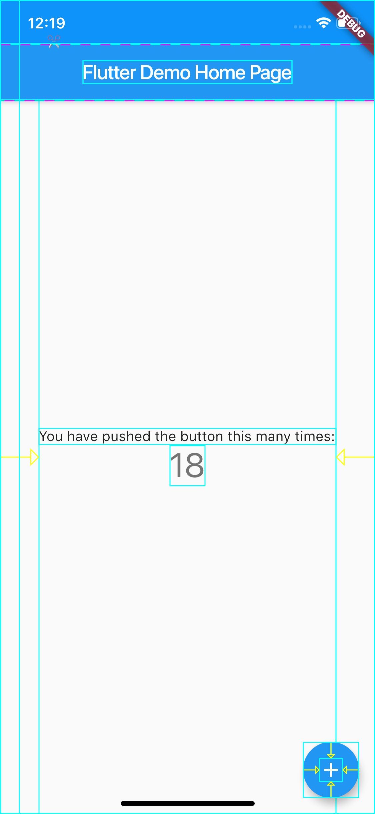
图 8 Debug Painting 运行效果

可以看到，计数器示例中的每个控件元素都已经被标尺辅助线包围了。

辅助线提供了基本的 Widget 可视化能力。通过辅助线，我们能够感知界面中是否存在对齐或边距的问题，但却没有办法获取到布局信息，比如 Widget 距离父视图的边距信息、Widget 宽高尺寸信息等。

**如果我们想要获取到 Widget 的可视化信息（比如布局信息、渲染信息等）去解决渲染问题，就需要使用更强大的 Flutter Inspector 了。**Flutter Inspector 对控件布局详细数据提供了一种强大的可视化手段，来帮助我们诊断布局问题。

为了使用 Flutter Inspector，我们需要回到 Android Studio，通过工具栏上的“Open DevTools”按钮启动 Flutter Inspector：

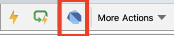
图 9 Flutter Inspector 启动按钮

随后，Android Studio 会打开浏览器，将计数器示例中的 Widget 树结构展示在面板中。可以看到，Flutter Inspector 所展示的 Widget 树结构，与代码中实现的 Widget 层次是一一对应的。

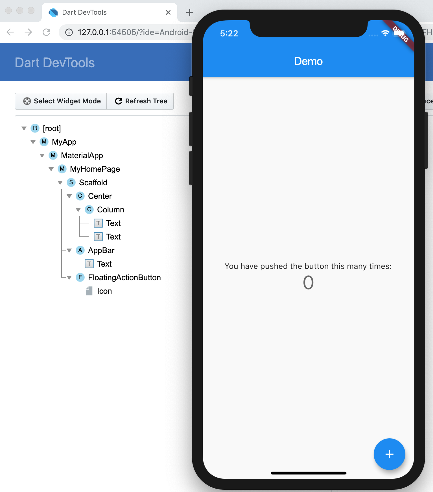
图 10 Flutter Inspector 示意图

我们的 App 运行在 iPhone X 之上，其分辨率为 375*812。接下来，我们以 Column 组件的布局信息为例，通过确认其水平方向为居中布局、垂直方向为充满父 Widget 剩余空间的过程，来说明**Flutter Inspector 的具体用法**。

为了确认 Column 在垂直方向是充满其父 Widget 剩余空间的，我们首先需要确定其父 Widget 在垂直方向上的另一个子 Widget，即 AppBar 的信息。我们点击 Flutter Inspector 面板左侧中的 AppBar 控件，右侧对应显示了它的具体视觉信息。

可以看到 AppBar 控件距离左边距为 0，上边距也为 0；宽为 375，高为 100：

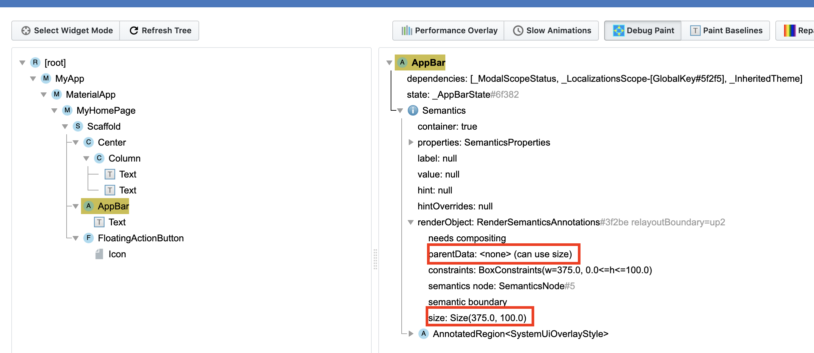
图 11 Flutter Inspector 之 AppBar

然后，我们将 Flutter Inspector 面板左侧选择的控件更新为 Column，右侧也更新了它的具体视觉信息，比如排版方向、对齐模式、渲染信息，以及它的两个子 Widget-Text。

可以看到，Column 控件的距离左边距为 38.5，上边距为 0；宽为 298，高为 712：

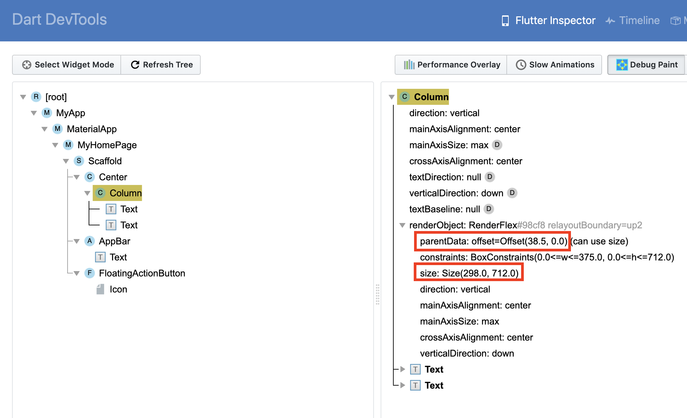
图 12 Flutter Inspector 之 Columnn

通过上面的数据我们可以得出：

- Column 的右边距 = 父 Widget 宽度（即 iPhone X 宽度 375）-Column 左边距（即 38.5）- Column 宽（即 298）=38.5，即左右边距相等，因此 Column 是水平方向居中的；
- Column 的高度 = 父 Widget 的高度（即 iPhone X 高度 812）- AppBar 上边距（即 0）- AppBar 高度（即 100） - Column 上边距（即 0）= 712.0，即 Column 在垂直方向上完全填满了父 Widget 除去 AppBar 之后的剩余空间。

因此，Column 的布局行为是完全符合预期的。

## 总结

好了，今天的分享就到这里，我们总结一下今天的主要内容吧。

首先，我带你学习了如何实现定制日志的输出能力。Flutter 提供了 debugPrint 函数，这是一个可以被覆盖的打印函数。我们可以分别定义生产环境与开发环境的日志输出行为，来满足开发期打日志需求的同时，保证发布期日志执行信息不会被意外打印。

然后，我与你介绍了 Android Studio 提供的 Flutter 调试功能，并通过观察计数器工程的计数器变量为例，与你讲述了具体的调试方法。

最后，我们一起学习了 Flutter 的布局调试能力，即通过 Debug Paiting 来定义辅助线，以及通过 Flutter Inspector 这种可视化手段来更为准确地诊断布局问题。

写代码不可避免会出现 Bug，出现时就需要 Debug（调试）。调试代码本质上就是一个不断收敛问题发生范围的过程，因此排查问题的一个最基本思路，就是二分法。

所谓二分调试法，是指通过某种稳定复现的特征（比如 Crash、某个变量的值、是否出现某个现象等任何明显的迹象），加上一个能把问题出现的范围划分为两半的手段（比如断点、assert、日志等），两者结合反复迭代不断将问题可能出现的范围一分为二（比如能判断出引发问题的代码出现在断点之前等）。通过二分法，我们可以快速缩小问题范围，这样一来调试的效率也就上去了。

## 思考题

最后，我给你留下一道思考题吧。

请将 debugPrint 在生产环境下的打印日志行为更改为写日志文件。其中，日志文件一共 5 个（0-4），每个日志文件不能超过 2MB，但可以循环写。如果日志文件已满，则循环至下一个日志文件，清空后重新写入。