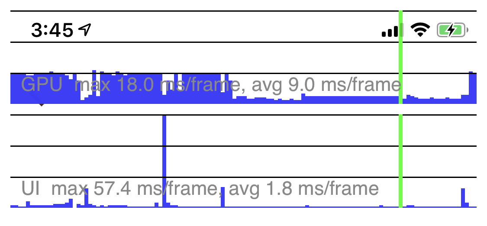
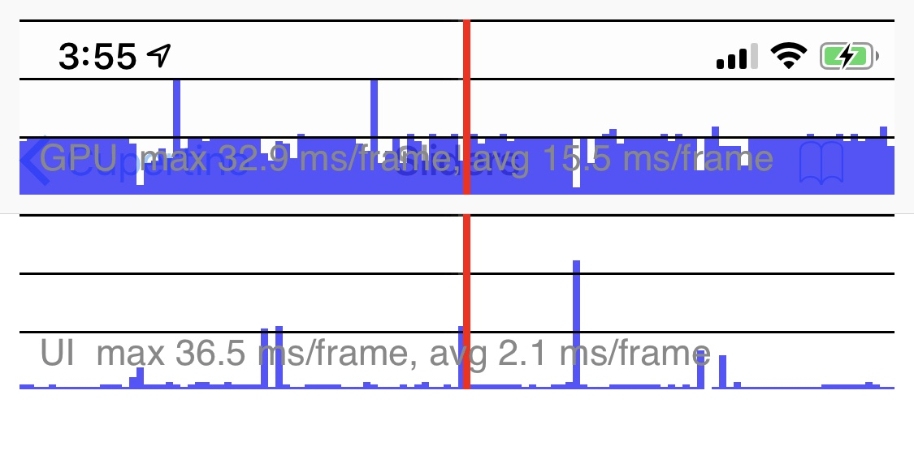
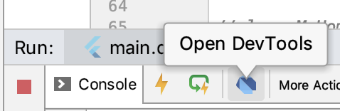
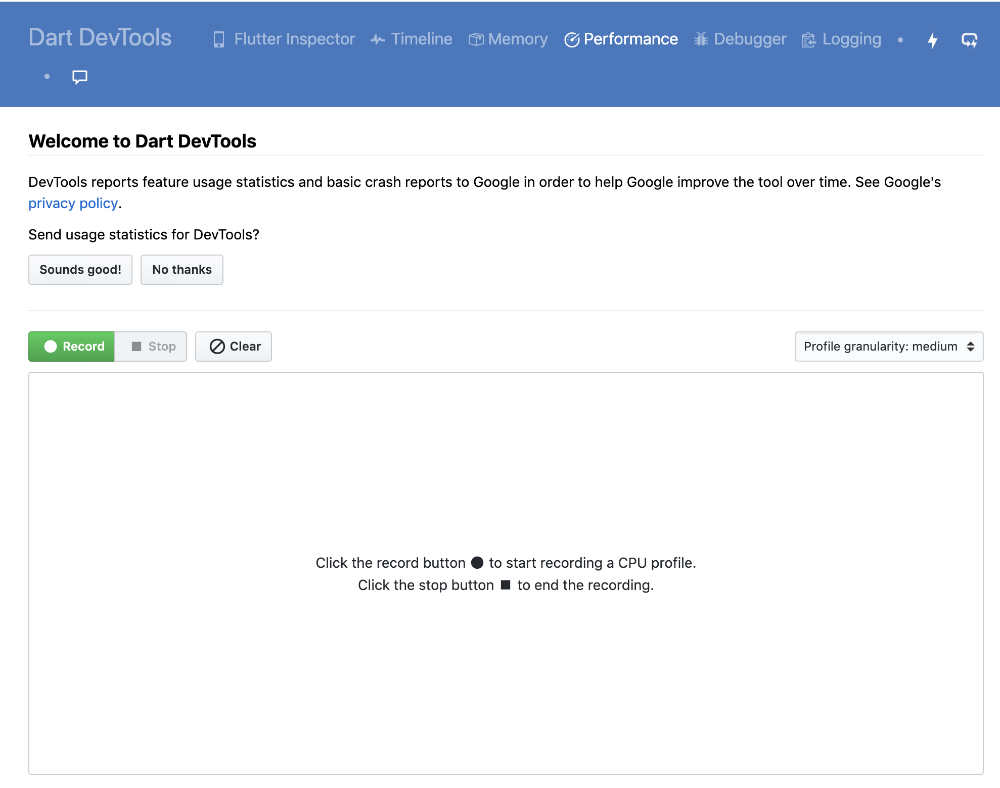
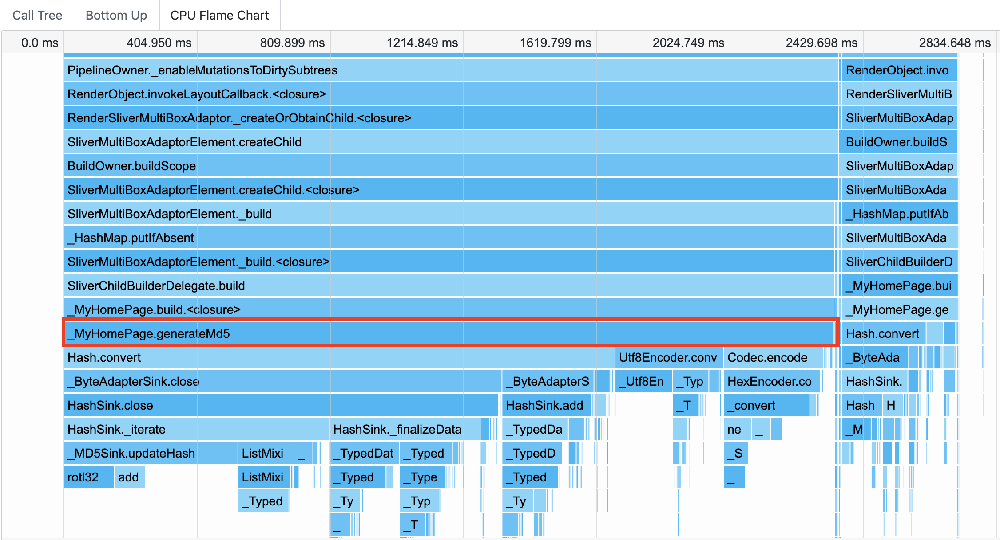

在上一篇文章中，我与你分享了调试 Flutter 代码的 3 种基本方式，即输出日志、断点调试与布局调试。

通过可定制打印行为的 debugPrint 函数，我们可以实现生产环境与开发环境不同的日志输出行为，从而保证在开发期打印的调试信息不会被发布至线上；借助于 IDE（Android Studio）所提供的断点调试选项，我们可以不断调整代码执行步长和代码暂停条件，收敛问题发生范围，直至找到问题根源；而如果我们想找出代码中的布局渲染类 Bug，则可以通过 Debug Painting 和 Flutter Inspector 提供的辅助线和视图可视化信息，来更为精准地定位视觉问题。

除了代码逻辑 Bug 和视觉异常这些功能层面的问题之外，移动应用另一类常见的问题是性能问题，比如滑动操作不流畅、页面出现卡顿丢帧现象等。这些问题虽然不至于让移动应用完全不可用，但也很容易引起用户反感，从而对应用质量产生质疑，甚至失去耐心。

那么，如果应用渲染并不流畅，出现了性能问题，我们该如何检测，又该从哪里着手处理呢？

在 Flutter 中，性能问题可以分为 GPU 线程问题和 UI 线程（CPU）问题两类。这些问题的确认都需要先通过性能图层进行初步分析，而一旦确认问题存在，接下来就需要利用 Flutter 提供的各类分析工具来定位问题了。

所以在今天这篇文章中，我会与你一起学习分析 Flutter 应用性能问题的基本思路和工具，以及常见的优化办法。

## 如何使用性能图层？

要解决问题，我们首先得了解如何去度量问题，性能分析也不例外。Flutter 提供了度量性能问题的工具和手段，来帮助我们快速定位代码中的性能问题，而性能图层就是帮助我们确认问题影响范围的利器。

**为了使用性能图层，我们首先需要以分析（Profile）模式启动应用。**与调试代码可以通过模拟器在调试模式下找到代码逻辑 Bug 不同，性能问题需要在发布模式下使用真机进行检测。

这是因为，相比发布模式而言，调试模式增加了很多额外的检查（比如断言），这些检查可能会耗费很多资源；更重要的是，调试模式使用 JIT 模式运行应用，代码执行效率较低。这就使得调试模式运行的应用，无法真实反映出它的性能问题。

而另一方面，模拟器使用的指令集为 x86，而真机使用的指令集是 ARM。这两种方式的二进制代码执行行为完全不同，因此模拟器与真机的性能差异较大：一些 x86 指令集擅长的操作模拟器会比真机快，而另一些操作则会比真机慢。这也使得我们无法使用模拟器来评估真机才能出现的性能问题。

**为了调试性能问题，我们需要在发布模式的基础之上，为分析工具提供少量必要的应用追踪信息，这就是分析模式**。除了一些调试性能问题必须的追踪方法之外，Flutter 应用的分析模式和发布模式的编译和运行是类似的，只是启动参数变成了 profile 而已：我们既可以在 Android Studio 中通过菜单栏点击 Run->Profile ‘main.dart’ 选项启动应用，也可以通过命令行参数 flutter run --profile 运行 Flutter 应用。

## 分析渲染问题

在完成了应用启动之后，接下来我们就可以利用 Flutter 提供的渲染问题分析工具，即性能图层（Performance Overlay），来分析渲染问题了。

性能图层会在当前应用的最上层，以 Flutter 引擎自绘的方式展示 GPU 与 UI 线程的执行图表，而其中每一张图表都代表当前线程最近 300 帧的表现，如果 UI 产生了卡顿（跳帧），这些图表可以帮助我们分析并找到原因。

下图演示了性能图层的展现样式。其中，GPU 线程的性能情况在上面，UI 线程的情况显示在下面，蓝色垂直的线条表示已执行的正常帧，绿色的线条代表的是当前帧：


图 1 性能图层

为了保持 60Hz 的刷新频率，GPU 线程与 UI 线程中执行每一帧耗费的时间都应该小于 16ms（1/60 秒）。在这其中有一帧处理时间过长，就会导致界面卡顿，图表中就会展示出一个红色竖条。下图演示了应用出现渲染和绘制耗时的情况下，性能图层的展示样式：


图 2 渲染和绘制耗时异常

如果红色竖条出现在 GPU 线程图表，意味着渲染的图形太复杂，导致无法快速渲染；而如果是出现在了 UI 线程图表，则表示 Dart 代码消耗了大量资源，需要优化代码执行时间。

接下来，我们就先看看 GPU 问题定位吧。

## GPU 问题定位

GPU 问题主要集中在底层渲染耗时上。有时候 Widget 树虽然构造起来容易，但在 GPU 线程下的渲染却很耗时。涉及 Widget 裁剪、蒙层这类多视图叠加渲染，或是由于缺少缓存导致静态图像的反复绘制，都会明显拖慢 GPU 的渲染速度。

我们可以使用性能图层提供的两项参数，即检查多视图叠加的视图渲染开关 checkerboardOffscreenLayers，和检查缓存的图像开关 checkerboardRasterCacheImages，来检查这两种情况。

### checkerboardOffscreenLayers

多视图叠加通常会用到 Canvas 里的 savaLayer 方法，这个方法在实现一些特定的效果（比如半透明）时非常有用，但由于其底层实现会在 GPU 渲染上涉及多图层的反复绘制，因此会带来较大的性能问题。

对于 saveLayer 方法使用情况的检查，我们只要在 MaterialApp 的初始化方法中，将 checkerboardOffscreenLayers 开关设置为 true，分析工具就会自动帮我们检测多视图叠加的情况了：使用了 saveLayer 的 Widget 会自动显示为棋盘格式，并随着页面刷新而闪烁。

不过，saveLayer 是一个较为底层的绘制方法，因此我们一般不会直接使用它，而是会通过一些功能性 Widget，在涉及需要剪切或半透明蒙层的场景中间接地使用。所以一旦遇到这种情况，我们需要思考一下是否一定要这么做，能不能通过其他方式来实现呢。

比如下面的例子中，我们使用 CupertinoPageScaffold 与 CupertinoNavigationBar 实现了一个动态模糊的效果。

```
CupertinoPageScaffold(
  navigationBar: CupertinoNavigationBar(),// 动态模糊导航栏
    child: ListView.builder(
      itemCount: 100,
      // 为列表创建 100 个不同颜色的 RowItem
      itemBuilder: (context, index)=>TabRowItem(
            index: index,
            lastItem: index == 100 - 1,
            color: colorItems[index],// 设置不同的颜色
            colorName: colorNameItems[index],
          )
    )
);
```


图 3 动态模糊效果

由于视图滚动过程中频繁涉及视图蒙层效果的更新，因此 checkerboardOffscreenLayers 检测图层也感受到了对 GPU 的渲染压力，频繁的刷新闪烁。


图 4 检测 saveLayer 使用

如果我们没有对动态模糊效果的特殊需求，则可以使用不带模糊效果的 Scaffold 和白色的 AppBar 实现同样的产品功能，来解决这个性能问题：

```
Scaffold(
  // 使用普通的白色 AppBar
  appBar: AppBar(title: Text('Home', style: TextStyle(color:Colors.black),),backgroundColor: Colors.white),
  body: ListView.builder(
      itemCount: 100,
      // 为列表创建 100 个不同颜色的 RowItem
      itemBuilder: (context, index)=>TabRowItem(
        index: index,
        lastItem: index == 100 - 1,
        color: colorItems[index],// 设置不同的颜色
        colorName: colorNameItems[index],
      )
  ),
);
```

运行一下代码，可以看到，在去掉了动态模糊效果之后，GPU 的渲染压力得到了缓解，checkerboardOffscreenLayers 检测图层也不再频繁闪烁了。


图 5 去掉动态模糊效果

### checkerboardRasterCacheImages

从资源的角度看，另一类非常消耗性能的操作是，渲染图像。这是因为图像的渲染涉及 I/O、GPU 存储，以及不同通道的数据格式转换，因此渲染过程的构建需要消耗大量资源。为了缓解 GPU 的压力，Flutter 提供了多层次的缓存快照，这样 Widget 重建时就无需重新绘制静态图像了。

与检查多视图叠加渲染的 checkerboardOffscreenLayers 参数类似，Flutter 也提供了检查缓存图像的开关 checkerboardRasterCacheImages，来检测在界面重绘时频繁闪烁的图像（即没有静态缓存）。

我们可以把需要静态缓存的图像加到 RepaintBoundary 中，RepaintBoundary 可以确定 Widget 树的重绘边界，如果图像足够复杂，Flutter 引擎会自动将其缓存，避免重复刷新。当然，因为缓存资源有限，如果引擎认为图像不够复杂，也可能会忽略 RepaintBoundary。

如下代码展示了通过 RepaintBoundary，将一个静态复合 Widget 加入缓存的具体用法。可以看到，RepaintBoundary 在使用上与普通 Widget 并无区别：

```
RepaintBoundary(// 设置静态缓存图像
  child: Center(
    child: Container(
      color: Colors.black,
      height: 10.0,
      width: 10.0,
    ),
));
```

## UI 线程问题定位

如果说 GPU 线程问题定位的是渲染引擎底层渲染异常，那么 UI 线程问题发现的则是应用的性能瓶颈。比如在视图构建时，在 build 方法中使用了一些复杂的运算，或是在主 Isolate 中进行了同步的 I/O 操作。这些问题，都会明显增加 CPU 的处理时间，拖慢应用的响应速度。

这时，我们可以使用 Flutter 提供的 Performance 工具，来记录应用的执行轨迹。Performance 是一个强大的性能分析工具，能够以时间轴的方式展示 CPU 的调用栈和执行时间，去检查代码中可疑的方法调用。

在点击了 Android Studio 底部工具栏中的“Open DevTools”按钮之后，系统会自动打开 Dart DevTools 的网页，将顶部的 tab 切换到 Performance 后，我们就可以开始分析代码中的性能问题了。


图 6 打开 Performance 工具


图 7 Performance 主界面

接下来，我们通过一个 ListView 中计算 MD5 的例子，来演示 Performance 的具体分析过程。

考虑到在 build 函数中进行渲染信息的组装是一个常见的操作，为了演示这个知识点，我们故意放大了计算 MD5 的耗时，循环迭代计算了 1 万次：

```
class MyHomePage extends StatelessWidget {
  MyHomePage({Key key}) : super(key: key);
 
  String generateMd5(String data) {
    //MD5 固定算法
    var content = new Utf8Encoder().convert(data);
    var digest = md5.convert(content);
    return hex.encode(digest.bytes);
  }
 
  @override
  Widget build(BuildContext context) {
    return Scaffold(
      appBar: AppBar(title: Text('demo')),
      body: ListView.builder(
          itemCount: 30,// 列表元素个数
          itemBuilder: (context, index) {
            // 反复迭代计算 MD5
            String str = '1234567890abcdefghijklmnopqrstuvwxyz';
            for(int i = 0;i<10000;i++) {
              str = generateMd5(str);
            }
            return ListTile(title: Text("Index : $index"), subtitle: Text(str));
          }// 列表项创建方法
      ),
    );
  }
}
```

与性能图层能够自动记录应用执行情况不同，使用 Performance 来分析代码执行轨迹，我们需要手动点击“Record”按钮去主动触发，在完成信息的抽样采集后，点击“Stop”按钮结束录制。这时，我们就可以得到在这期间应用的执行情况了。

Performance 记录的应用执行情况叫做 CPU 帧图，又被称为火焰图。火焰图是基于记录代码执行结果所产生的图片，用来展示 CPU 的调用栈，表示的是 CPU 的繁忙程度。

其中，y 轴表示调用栈，其每一层都是一个函数。调用栈越深，火焰就越高，底部就是正在执行的函数，上方都是它的父函数；x 轴表示单位时间，一个函数在 x 轴占据的宽度越宽，就表示它被采样到的次数越多，即执行时间越长。

所以，我们要检测 CPU 耗时问题，皆可以查看火焰图底部的哪个函数占据的宽度最大。只要有“平顶”，就表示该函数可能存在性能问题。比如，我们这个案例的火焰图如下所示：


图 8 CPU 帧图 / 火焰图

可以看到，_MyHomePage.generateMd5 函数的执行时间最长，几乎占满了整个火焰图的宽，而这也与代码中存在的问题是一致的。
在找到了问题之后，我们就可以使用 Isolate（或 compute）将这些耗时的操作挪到并发主 Isolate 之外去完成了。

## 总结

好了，今天的分享就到这里。我们总结一下今天的主要内容吧。
在 Flutter 中，性能分析过程可以分为 GPU 线程问题定位和 UI 线程（CPU）问题定位，而它们都需要在真机上以分析模式（Profile）启动应用，并通过性能图层分析大致的渲染问题范围。一旦确认问题存在，接下来就需要利用 Flutter 所提供的分析工具来定位问题原因了。
关于 GPU 线程渲染问题，我们可以重点检查应用中是否存在多视图叠加渲染，或是静态图像反复刷新的现象。而 UI 线程渲染问题，我们则是通过 Performance 工具记录的火焰图（CPU 帧图），分析代码耗时，找出应用执行瓶颈。
通常来说，由于 Flutter 采用基于声明式的 UI 设计理念，以数据驱动渲染，并采用 Widget->Element->RenderObject 三层结构，屏蔽了无谓的界面刷新，能够保证绝大多数情况下我们构建的应用都是高性能的，所以在使用分析工具检测出性能问题之后，通常我们并不需要做太多的细节优化工作，只需要在改造过程中避开一些常见的坑，就可以获得优异的性能。如：

- 控制 build 方法耗时，将 Widget 拆小，避免直接返回一个巨大的 Widget，这样 Widget 会享有更细粒度的重建和复用；
- 尽量不要为 Widget 设置半透明效果，而是考虑用图片的形式代替，这样被遮挡的 Widget 部分区域就不需要绘制了；
- 对列表采用懒加载而不是直接一次性创建所有的子 Widget，这样视图的初始化时间就减少了。

## 思考题

最后，我给你留下一道思考题吧。
请你改造 ListView 计算 MD5 的示例，在保证原有功能的情况下，使用并发 Isolate（或 compute）完成 MD5 的计算。提示：计算过程可以使用 CircularProgressIndicator 来展示加载动画