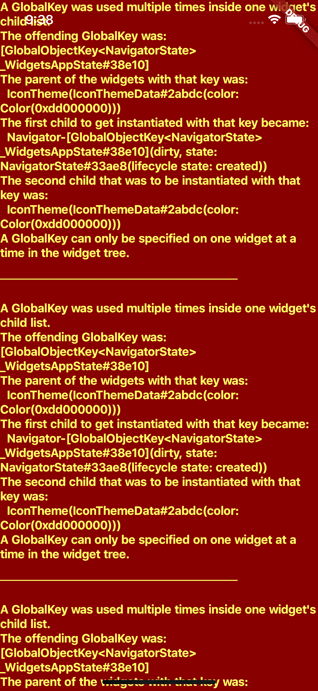
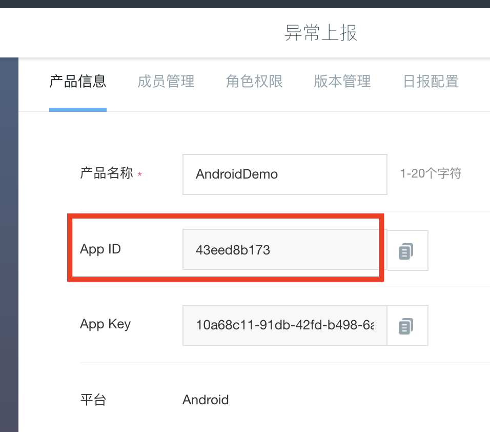
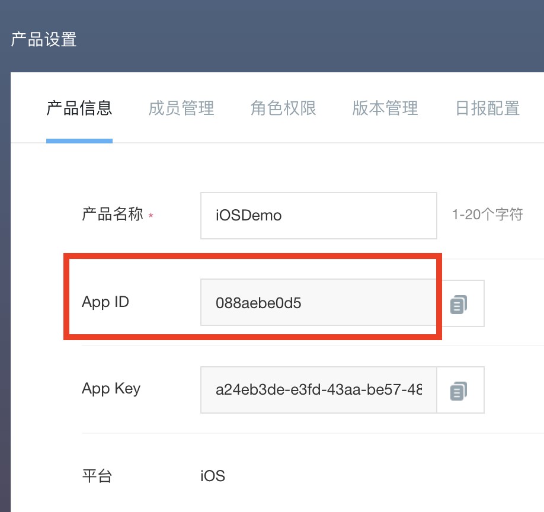
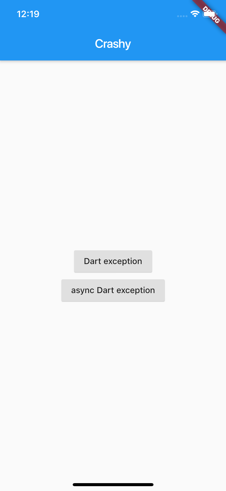
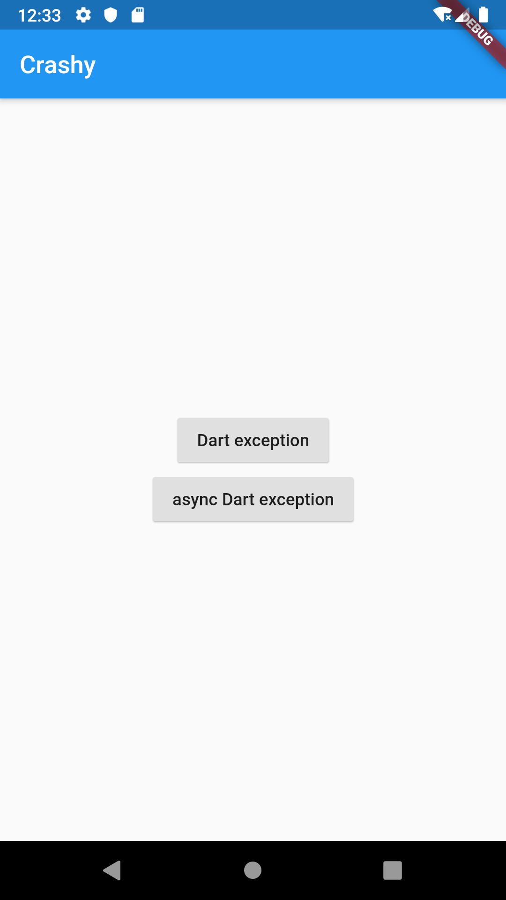
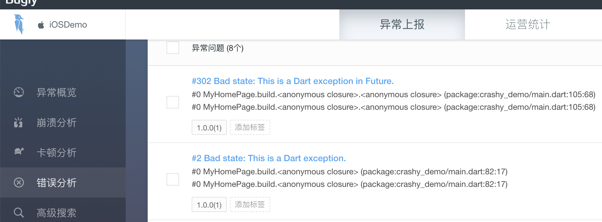
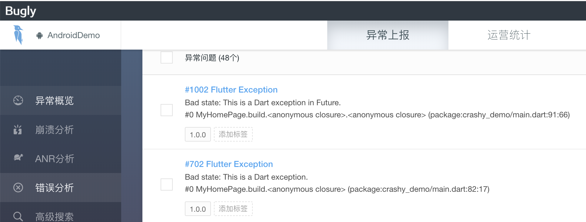

在上一篇文章中，我与你分享了如何为一个 Flutter 工程编写自动化测试用例。设计一个测试用例的基本步骤可以分为 3 步，即定义、执行和验证，而 Flutter 提供的单元测试和 UI 测试框架则可以帮助我们简化这些步骤。

其中，通过单元测试，我们可以很方便地验证单个函数、方法或类的行为，还可以利用 mockito 定制外部依赖返回任意数据，从而让测试更可控；而 UI 测试则提供了与 Widget 交互的能力，我们可以模仿用户行为，对应用进行相应的交互操作，确认其功能是否符合预期。

通过自动化测试，我们可以把重复的人工操作变成自动化的验证步骤，从而在开发阶段更及时地发现问题。但终端设备的碎片化，使得我们终究无法在应用开发期就完全模拟出真实用户的运行环境。所以，无论我们的应用写得多么完美、测试得多么全面，总是无法完全避免线上的异常问题。

这些异常，可能是因为不充分的机型适配、用户糟糕的网络状况；也可能是因为 Flutter 框架自身的 Bug，甚至是操作系统底层的问题。这些异常一旦发生，Flutter 应用会无法响应用户的交互事件，轻则报错，重则功能无法使用甚至闪退，这对用户来说都相当不友好，是开发者最不愿意看到的。

所以，我们要想办法去捕获用户的异常信息，将异常现场保存起来，并上传至服务器，这样我们就可以分析异常上下文，定位引起异常的原因，去解决此类问题了。那么今天，我们就一起来学习下 Flutter 异常的捕获和信息采集，以及对应的数据上报处理。

## Flutter 异常

Flutter 异常指的是，Flutter 程序中 Dart 代码运行时意外发生的错误事件。我们可以通过与 Java 类似的 try-catch 机制来捕获它。但**与 Java 不同的是，Dart 程序不强制要求我们必须处理异常**。
这是因为，Dart 采用事件循环的机制来运行任务，所以各个任务的运行状态是互相独立的。也就是说，即便某个任务出现了异常我们没有捕获它，Dart 程序也不会退出，只会导致当前任务后续的代码不会被执行，用户仍可以继续使用其他功能。
Dart 异常，根据来源又可以细分为 App 异常和 Framework 异常。Flutter 为这两种异常提供了不同的捕获方式，接下来我们就一起看看吧。

## App 异常的捕获方式

App 异常，就是应用代码的异常，通常由未处理应用层其他模块所抛出的异常引起。根据异常代码的执行时序，App 异常可以分为两类，即同步异常和异步异常：同步异常可以通过 try-catch 机制捕获，异步异常则需要采用 Future 提供的 catchError 语句捕获。

这两种异常的捕获方式，如下代码所示：

```
// 使用 try-catch 捕获同步异常
try {
  throw StateError('This is a Dart exception.');
}
catch(e) {
  print(e);
}
 
// 使用 catchError 捕获异步异常
Future.delayed(Duration(seconds: 1))
    .then((e) => throw StateError('This is a Dart exception in Future.'))
    .catchError((e)=>print(e));
    
// 注意，以下代码无法捕获异步异常
try {
  Future.delayed(Duration(seconds: 1))
      .then((e) => throw StateError('This is a Dart exception in Future.'))
}
catch(e) {
  print("This line will never be executed. ");
}
```

需要注意的是，这两种方式是不能混用的。可以看到，在上面的代码中，我们是无法使用 try-catch 去捕获一个异步调用所抛出的异常的。
同步的 try-catch 和异步的 catchError，为我们提供了直接捕获特定异常的能力，而如果我们想集中管理代码中的所有异常，Flutter 也提供了 Zone.runZoned 方法。
我们可以给代码执行对象指定一个 Zone，在 Dart 中，Zone 表示一个代码执行的环境范围，其概念类似沙盒，不同沙盒之间是互相隔离的。如果我们想要观察沙盒中代码执行出现的异常，沙盒提供了 onError 回调函数，拦截那些在代码执行对象中的未捕获异常。
在下面的代码中，我们将可能抛出异常的语句放置在了 Zone 里。可以看到，在没有使用 try-catch 和 catchError 的情况下，无论是同步异常还是异步异常，都可以通过 Zone 直接捕获到：

```
runZoned(() {
  // 同步抛出异常
  throw StateError('This is a Dart exception.');
}, onError: (dynamic e, StackTrace stack) {
  print('Sync error caught by zone');
});
 
runZoned(() {
  // 异步抛出异常
  Future.delayed(Duration(seconds: 1))
      .then((e) => throw StateError('This is a Dart exception in Future.'));
}, onError: (dynamic e, StackTrace stack) {
  print('Async error aught by zone');
});
```

因此，如果我们想要集中捕获 Flutter 应用中的未处理异常，可以把 main 函数中的 runApp 语句也放置在 Zone 中。这样在检测到代码中运行异常时，我们就能根据获取到的异常上下文信息，进行统一处理了：

```
runZoned<Future<Null>>(() async {
  runApp(MyApp());
}, onError: (error, stackTrace) async {
 //Do sth for error
});
```

接下来，我们再看看 Framework 异常应该如何捕获吧。

## Framework 异常的捕获方式

Framework 异常，就是 Flutter 框架引发的异常，通常是由应用代码触发了 Flutter 框架底层的异常判断引起的。比如，当布局不合规范时，Flutter 就会自动弹出一个触目惊心的红色错误界面，如下所示：


图 1 Flutter 布局错误提示

这其实是因为，Flutter 框架在调用 build 方法构建页面时进行了 try-catch 的处理，并提供了一个 ErrorWidget，用于在出现异常时进行信息提示：

```
@override
void performRebuild() {
  Widget built;
  try {
    // 创建页面
    built = build();
  } catch (e, stack) {
    // 使用 ErrorWidget 创建页面
    built = ErrorWidget.builder(_debugReportException(ErrorDescription("building $this"), e, stack));
    ...
  } 
  ...
}
```

这个页面反馈的信息比较丰富，适合开发期定位问题。但如果让用户看到这样一个页面，就很糟糕了。因此，我们通常会重写 ErrorWidget.builder 方法，将这样的错误提示页面替换成一个更加友好的页面。

下面的代码演示了自定义错误页面的具体方法。在这个例子中，我们直接返回了一个居中的 Text 控件：

```
ErrorWidget.builder = (FlutterErrorDetails flutterErrorDetails){
  return Scaffold(
    body: Center(
      child: Text("Custom Error Widget"),
    )
  );
};
```

运行效果如下所示：


图 2 自定义错误提示页面

比起之前触目惊心的红色错误页面，白色主题的自定义页面看起来稍微友好些了。需要注意的是，ErrorWidget.builder 方法提供了一个参数 details 用于表示当前的错误上下文，为避免用户直接看到错误信息，这里我们并没有将它展示到界面上。但是，我们不能丢弃掉这样的异常信息，需要提供统一的异常处理机制，用于后续分析异常原因。

为了集中处理框架异常，**Flutter 提供了 FlutterError 类，这个类的 onError 属性会在接收到框架异常时执行相应的回调**。因此，要实现自定义捕获逻辑，我们只要为它提供一个自定义的错误处理回调即可。

在下面的代码中，我们使用 Zone 提供的 handleUncaughtError 语句，将 Flutter 框架的异常统一转发到当前的 Zone 中，这样我们就可以统一使用 Zone 去处理应用内的所有异常了：

```
FlutterError.onError = (FlutterErrorDetails details) async {
  // 转发至 Zone 中
  Zone.current.handleUncaughtError(details.exception, details.stack);
};
 
runZoned<Future<Null>>(() async {
  runApp(MyApp());
}, onError: (error, stackTrace) async {
 //Do sth for error
});
```

## 异常上报

到目前为止，我们已经捕获到了应用中所有的未处理异常。但如果只是把这些异常在控制台中打印出来还是没办法解决问题，我们还需要把它们上报到开发者能看到的地方，用于后续分析定位并解决问题。
关于开发者数据上报，目前市面上有很多优秀的第三方 SDK 服务厂商，比如友盟、Bugly，以及开源的 Sentry 等，而它们提供的功能和接入流程都是类似的。考虑到 Bugly 的社区活跃度比较高，因此我就以它为例，与你演示在抓取到异常后，如何实现自定义数据上报。

### Dart 接口实现

目前 Bugly 仅提供了原生 Android/iOS 的 SDK，因此我们需要采用与第 31 篇文章“[如何实现原生推送能力](https://time.geekbang.org/column/article/132818)？”中同样的插件工程，为 Bugly 的数据上报提供 Dart 层接口。

与接入 Push 能力相比，接入数据上报要简单得多，我们只需要完成一些前置应用信息关联绑定和 SDK 初始化工作，就可以使用 Dart 层封装好的数据上报接口去上报异常了。可以看到，对于一个应用而言，接入数据上报服务的过程，总体上可以分为两个步骤：

1. 初始化 Bugly SDK；
2. 使用数据上报接口。

这两步对应着在 Dart 层需要封装的 2 个原生接口调用，即 setup 和 postException，它们都是在方法通道上调用原生代码宿主提供的方法。考虑到数据上报是整个应用共享的能力，因此我们将数据上报类 FlutterCrashPlugin 的接口都封装成了单例：

```
class FlutterCrashPlugin {
  // 初始化方法通道
  static const MethodChannel _channel =
      const MethodChannel('flutter_crash_plugin');
 
  static void setUp(appID) {
    // 使用 app_id 进行 SDK 注册
    _channel.invokeMethod("setUp",{'app_id':appID});
  }
  static void postException(error, stack) {
    // 将异常和堆栈上报至 Bugly
    _channel.invokeMethod("postException",{'crash_message':error.toString(),'crash_detail':stack.toString()});
  }
}
```

Dart 层是原生代码宿主的代理，可以看到这一层的接口设计还是比较简单的。接下来，我们分别去接管数据上报的 Android 和 iOS 平台上完成相应的实现。

### iOS 接口实现

考虑到 iOS 平台的数据上报配置工作相对较少，因此我们先用 Xcode 打开 example 下的 iOS 工程进行插件开发工作。需要注意的是，由于 iOS 子工程的运行依赖于 Flutter 工程编译构建产物，所以在打开 iOS 工程进行开发前，你需要确保整个工程代码至少 build 过一次，否则 IDE 会报错。

> 备注：以下操作步骤参考[Bugly 异常上报 iOS SDK 接入指南](https://bugly.qq.com/docs/user-guide/instruction-manual-ios/?v=20190712210424)。

**首先**，我们需要在插件工程下的 flutter_crash_plugin.podspec 文件中引入 Bugly SDK，即 Bugly，这样我们就可以在原生工程中使用 Bugly 提供的数据上报功能了：

```
Pod::Spec.new do |s|
  ...
  s.dependency 'Bugly'
end
```

**然后**，在原生接口 FlutterCrashPlugin 类中，依次初始化插件实例、绑定方法通道，并在方法通道中先后为 setup 与 postException 提供 Bugly iOS SDK 的实现版本：

```
@implementation FlutterCrashPlugin
+ (void)registerWithRegistrar:(NSObject<FlutterPluginRegistrar>*)registrar {
    // 注册方法通道
    FlutterMethodChannel* channel = [FlutterMethodChannel
      methodChannelWithName:@"flutter_crash_plugin"
            binaryMessenger:[registrar messenger]];
    // 初始化插件实例，绑定方法通道 
    FlutterCrashPlugin* instance = [[FlutterCrashPlugin alloc] init];
    // 注册方法通道回调函数
    [registrar addMethodCallDelegate:instance channel:channel];
}
 
- (void)handleMethodCall:(FlutterMethodCall*)call result:(FlutterResult)result {
    if([@"setUp" isEqualToString:call.method]) {
        //Bugly SDK 初始化方法
        NSString *appID = call.arguments[@"app_id"];
        [Bugly startWithAppId:appID];
    } else if ([@"postException" isEqualToString:call.method]) {
      // 获取 Bugly 数据上报所需要的各个参数信息
      NSString *message = call.arguments[@"crash_message"];
      NSString *detail = call.arguments[@"crash_detail"];
 
      NSArray *stack = [detail componentsSeparatedByString:@"\n"];
      // 调用 Bugly 数据上报接口
      [Bugly reportExceptionWithCategory:4 name:message reason:stack[0] callStack:stack extraInfo:@{} terminateApp:NO];
      result(@0);
  }
  else {
    // 方法未实现
    result(FlutterMethodNotImplemented);
  }
}
 
@end
```

至此，在完成了 Bugly iOS SDK 的接口封装之后，FlutterCrashPlugin 插件的 iOS 部分也就搞定了。接下来，我们去看看 Android 部分如何实现吧。

### Android 接口实现

与 iOS 类似，我们需要使用 Android Studio 打开 example 下的 android 工程进行插件开发工作。同样，在打开 android 工程前，你需要确保整个工程代码至少 build 过一次，否则 IDE 会报错。

> 备注：以下操作步骤参考[Bugly 异常上报 Android SDK 接入指南](https://bugly.qq.com/docs/user-guide/instruction-manual-android/)

**首先**，我们需要在插件工程下的 build.gradle 文件引入 Bugly SDK，即 crashreport 与 nativecrashreport，其中前者提供了 Java 和自定义异常的的数据上报能力，而后者则是 JNI 的异常上报封装 ：

```
dependencies {
    implementation 'com.tencent.bugly:crashreport:latest.release' 
    implementation 'com.tencent.bugly:nativecrashreport:latest.release' 
}
```

**然后**，在原生接口 FlutterCrashPlugin 类中，依次初始化插件实例、绑定方法通道，并在方法通道中先后为 setup 与 postException 提供 Bugly Android SDK 的实现版本：

```
public class FlutterCrashPlugin implements MethodCallHandler {
  // 注册器，通常为 MainActivity
  public final Registrar registrar;
  // 注册插件
  public static void registerWith(Registrar registrar) {
    // 注册方法通道
    final MethodChannel channel = new MethodChannel(registrar.messenger(), "flutter_crash_plugin");
    // 初始化插件实例，绑定方法通道，并注册方法通道回调函数 
    channel.setMethodCallHandler(new FlutterCrashPlugin(registrar));
  }
 
  private FlutterCrashPlugin(Registrar registrar) {
    this.registrar = registrar;
  }
 
  @Override
  public void onMethodCall(MethodCall call, Result result) {
    if(call.method.equals("setUp")) {
      //Bugly SDK 初始化方法
      String appID = call.argument("app_id");
 
      CrashReport.initCrashReport(registrar.activity().getApplicationContext(), appID, true);
      result.success(0);
    }
    else if(call.method.equals("postException")) {
      // 获取 Bugly 数据上报所需要的各个参数信息
      String message = call.argument("crash_message");
      String detail = call.argument("crash_detail");
      // 调用 Bugly 数据上报接口
      CrashReport.postException(4,"Flutter Exception",message,detail,null);
      result.success(0);
    }
    else {
      result.notImplemented();
    }
  }
}
```

在完成了 Bugly Android 接口的封装之后，由于 Android 系统的权限设置较细，考虑到 Bugly 还需要网络、日志读取等权限，因此我们还需要在插件工程的 AndroidManifest.xml 文件中，将这些权限信息显示地声明出来，完成对系统的注册：

```
<manifest xmlns:android="http://schemas.android.com/apk/res/android"
  package="com.hangchen.flutter_crash_plugin">
    <!-- 电话状态读取权限 --> 
    <uses-permission android:name="android.permission.READ_PHONE_STATE" />
    <!-- 网络权限 --> 
    <uses-permission android:name="android.permission.INTERNET" />
    <!-- 访问网络状态权限 --> 
    <uses-permission android:name="android.permission.ACCESS_NETWORK_STATE" />
    <!-- 访问 wifi 状态权限 --> 
    <uses-permission android:name="android.permission.ACCESS_WIFI_STATE" />
    <!-- 日志读取权限 --> 
    <uses-permission android:name="android.permission.READ_LOGS" />
</manifest>
```

至此，在完成了极光 Android SDK 的接口封装和权限配置之后，FlutterCrashPlugin 插件的 Android 部分也搞定了。

FlutterCrashPlugin 插件为 Flutter 应用提供了数据上报的封装，不过要想 Flutter 工程能够真正地上报异常消息，我们还需要为 Flutter 工程关联 Bugly 的应用配置。

### 应用工程配置

在单独为 Android/iOS 应用进行数据上报配置之前，我们首先需要去[Bugly 的官方网站](https://bugly.qq.com/)，为应用注册唯一标识符（即 AppKey）。这里需要注意的是，在 Bugly 中，Android 应用与 iOS 应用被视为不同的产品，所以我们需要分别注册：


图 3 Android 应用 Demo 配置


图 4 iOS 应用 Demo 配置

在得到了 AppKey 之后，我们需要**依次进行 Android 与 iOS 的配置工作**。

iOS 的配置工作相对简单，整个配置过程完全是应用与 Bugly SDK 的关联工作，而这些关联工作仅需要通过 Dart 层调用 setUp 接口，访问原生代码宿主所封装的 Bugly API 就可以完成，因此无需额外操作。

而 Android 的配置工作则相对繁琐些。由于涉及 NDK 和 Android P 网络安全的适配，我们还需要分别在 build.gradle 和 AndroidManifest.xml 文件进行相应的配置工作。

**首先**，由于 Bugly SDK 需要支持 NDK，因此我们需要在 App 的 build.gradle 文件中为其增加 NDK 的架构支持：

```
defaultConfig {
    ndk {
        // 设置支持的 SO 库架构
        abiFilters 'armeabi' , 'x86', 'armeabi-v7a', 'x86_64', 'arm64-v8a'
    }
}
```

**然后**，由于 Android P 默认限制 http 明文传输数据，因此我们需要为 Bugly 声明一项网络安全配置 network_security_config.xml，允许其使用 http 传输数据，并在 AndroidManifest.xml 中新增同名网络安全配置：

```
//res/xml/network_security_config.xml
<?xml version="1.0" encoding="utf-8"?>
<!-- 网络安全配置 --> 
<network-security-config>
    <!-- 允许明文传输数据 -->  
    <domain-config cleartextTrafficPermitted="true">
        <!-- 将 Bugly 的域名加入白名单 --> 
        <domain includeSubdomains="true">android.bugly.qq.com</domain>
    </domain-config>
</network-security-config>
 
//AndroidManifest/xml
<application
  ...
  android:networkSecurityConfig="@xml/network_security_config"
  ...>
</application>
```

至此，Flutter 工程所需的原生配置工作和接口实现，就全部搞定了。
接下来，我们就可以在 Flutter 工程中的 main.dart 文件中，**使用 FlutterCrashPlugin 插件来实现异常数据上报能力了**。当然，我们**首先**还需要在 pubspec.yaml 文件中，将工程对它的依赖显示地声明出来：

```
dependencies:
  flutter_push_plugin:
    git:
      url: https://github.com/cyndibaby905/39_flutter_crash_plugin
```

在下面的代码中，我们在 main 函数里为应用的异常提供了统一的回调，并在回调函数内使用 postException 方法将异常上报至 Bugly。
而在 SDK 的初始化方法里，由于 Bugly 视 iOS 和 Android 为两个独立的应用，因此我们判断了代码的运行宿主，分别使用两个不同的 App ID 对其进行了初始化工作。
此外，为了与你演示具体的异常拦截功能，我们还在两个按钮的点击事件处理中分别抛出了同步和异步两类异常：

```
// 上报数据至 Bugly
Future<Null> _reportError(dynamic error, dynamic stackTrace) async {
  FlutterCrashPlugin.postException(error, stackTrace);
}
 
Future<Null> main() async {
  // 注册 Flutter 框架的异常回调
  FlutterError.onError = (FlutterErrorDetails details) async {
    // 转发至 Zone 的错误回调
    Zone.current.handleUncaughtError(details.exception, details.stack);
  };
  // 自定义错误提示页面
  ErrorWidget.builder = (FlutterErrorDetails flutterErrorDetails){
    return Scaffold(
      body: Center(
        child: Text("Custom Error Widget"),
      )
    );
  };
  // 使用 runZone 方法将 runApp 的运行放置在 Zone 中，并提供统一的异常回调
  runZoned<Future<Null>>(() async {
    runApp(MyApp());
  }, onError: (error, stackTrace) async {
    await _reportError(error, stackTrace);
  });
}
 
class MyApp extends StatefulWidget {
  @override
  State<StatefulWidget> createState() => _MyAppState();
}
 
class _MyAppState extends State<MyApp> {
  @override
  void initState() {
    // 由于 Bugly 视 iOS 和 Android 为两个独立的应用，因此需要使用不同的 App ID 进行初始化
    if(Platform.isAndroid){
      FlutterCrashPlugin.setUp('43eed8b173');
    }else if(Platform.isIOS){
      FlutterCrashPlugin.setUp('088aebe0d5');
    }
    super.initState();
  }
  @override
  Widget build(BuildContext context) {
    return MaterialApp(
      home: MyHomePage(),
    );
  }
}
 
class MyHomePage extends StatelessWidget {
  @override
  Widget build(BuildContext context) {
    return Scaffold(
      appBar: AppBar(
        title: Text('Crashy'),
      ),
      body: Center(
        child: Column(
          mainAxisAlignment: MainAxisAlignment.center,
          children: <Widget>[
            RaisedButton(
              child: Text('Dart exception'),
              onPressed: () {
                // 触发同步异常
                throw StateError('This is a Dart exception.');
              },
            ),
            RaisedButton(
              child: Text('async Dart exception'),
              onPressed: () {
                // 触发异步异常
                Future.delayed(Duration(seconds: 1))
                      .then((e) => throw StateError('This is a Dart exception in Future.'));
              },
            )
          ],
        ),
      ),
    );
  }
}
```

运行这段代码，分别点击 Dart exception 按钮和 async Dart exception 按钮几次，可以看到我们的应用以及控制台并没有提示任何异常信息。


图 5 异常拦截演示示例（iOS)


图 6 异常拦截演示示例（Android)

**然后**，我们打开[Bugly 开发者后台](https://bugly.qq.com/v2/workbench/apps)，选择对应的 App，切换到错误分析选项查看对应的面板信息。可以看到，Bugly 已经成功接收到上报的异常上下文了。


图 7 Bugly iOS 错误分析上报数据查看


图 8 Bugly Android 错误分析上报数据查看

## 总结

好了，今天的分享就到这里，我们来小结下吧。

对于 Flutter 应用的异常捕获，可以分为单个异常捕获和多异常统一拦截两种情况。

其中，单异常捕获，使用 Dart 提供的同步异常 try-catch，以及异步异常 catchError 机制即可实现。而对多个异常的统一拦截，可以细分为如下两种情况：一是 App 异常，我们可以将代码执行块放置到 Zone 中，通过 onError 回调进行统一处理；二是 Framework 异常，我们可以使用 FlutterError.onError 回调进行拦截。

在捕获到异常之后，我们需要上报异常信息，用于后续分析定位问题。考虑到 Bugly 的社区活跃度比较高，所以我以 Bugly 为例，与你讲述了以原生插件封装的形式，如何进行异常信息上报。

需要注意的是，Flutter 提供的异常拦截只能拦截 Dart 层的异常，而无法拦截 Engine 层的异常。这是因为，Engine 层的实现大部分是 C++ 的代码，一旦出现异常，整个程序就直接 Crash 掉了。不过通常来说，这类异常出现的概率极低，一般都是 Flutter 底层的 Bug，与我们在应用层的实现没太大关系，所以我们也无需过度担心。

如果我们想要追踪 Engine 层的异常（比如，给 Flutter 提 Issue），则需要借助于原生系统提供的 Crash 监听机制。这，就是一个很繁琐的工作了。

幸运的是，我们使用的数据上报 SDK Bugly 就提供了这样的能力，可以自动收集原生代码的 Crash。而在 Bugly 收集到对应的 Crash 之后，我们需要做的事情就是，将 Flutter Engine 层对应的符号表下载下来，使用 Android 提供的 ndk-stack、iOS 提供的 symbolicatecrash 或 atos 命令，对相应 Crash 堆栈进行解析，从而得出 Engine 层崩溃的具体代码。

关于这些步骤的详细说明，你可以参考 Flutter[官方文档](https://github.com/flutter/flutter/wiki/Crashes)。

我把今天分享涉及的知识点打包到了[GitHub](https://github.com/cyndibaby905/39_crashy_demo)中，你可以下载下来，反复运行几次，加深理解与记忆。

## 思考题

最后，我给你留下两道思考题吧。
第一个问题，请扩展 _reportError 和自定义错误提示页面的实现，在 Debug 环境下将异常数据打印至控制台，并保留原有系统错误提示页面实现。

```
// 上报数据至 Bugly
Future<Null> _reportError(dynamic error, dynamic stackTrace) async {
  FlutterCrashPlugin.postException(error, stackTrace);
}
 
// 自定义错误提示页面
ErrorWidget.builder = (FlutterErrorDetails flutterErrorDetails){
  return Scaffold(
    body: Center(
      child: Text("Custom Error Widget"),
    )
  );
};
```

第二个问题，并发 Isolate 的异常可以通过今天分享中介绍的捕获机制去拦截吗？如果不行，应该怎么做呢？

```
// 并发 Isolate
doSth(msg) => throw ConcurrentModificationError('This is a Dart exception.');
 
// 主 Isolate
Isolate.spawn(doSth, "Hi");
```