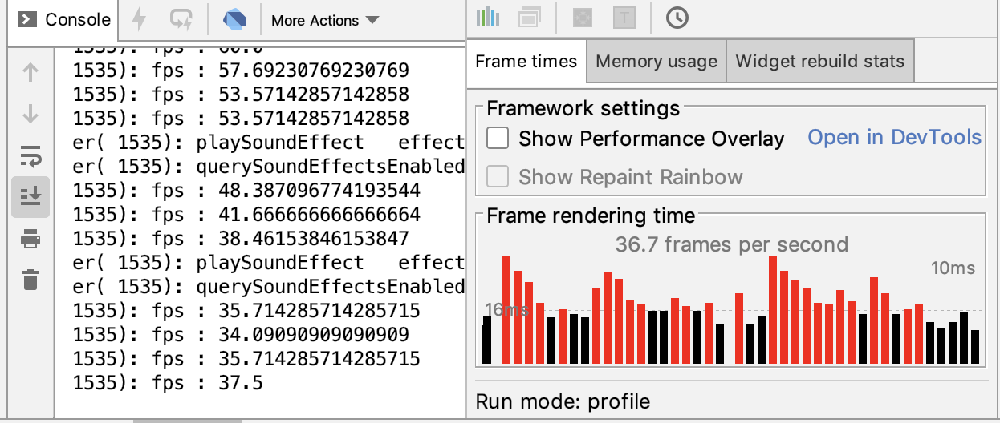

在上一篇文章中，我与你分享了如何捕获 Flutter 应用的未处理异常。所谓异常，指的是 Dart 代码在运行时意外发生的错误事件。对于单一异常来说，我们可以使用 try-catch，或是 catchError 去处理；而如果我们想对异常进行集中的拦截治理，则需要使用 Zone，并结合 FlutterError 进行统一管理。异常一旦被抓取，我们就可以利用第三方数据上报服务（比如 Bugly），上报其上下文信息了。

这些线上异常的监控数据，对于开发者尽早发现线上隐患，确定问题根因至关重要。如果我们想进一步评估应用整体的稳定性的话，就需要把异常信息与页面的渲染关联起来。比如，页面渲染过程是否出现了异常，而导致功能不可用？

而对于以“丝般顺滑”著称的 Flutter 应用而言，页面渲染的性能同样需要我们重点关注。比如，界面渲染是否出现会掉帧卡顿现象，或者页面加载是否会出现性能问题导致耗时过长？这些问题，虽不至于让应用完全不能使用，但也很容易引起用户对应用质量的质疑，甚至是反感。

通过上面的分析，可以看到，衡量线上 Flutter 应用整体质量的指标，可以分为以下 3 类：

- 页面异常率；
- 页面帧率；
- 页面加载时长。

其中，页面异常率反应了页面的健康程度，页面帧率反应了视觉效果的顺滑程度，而页面加载时长则反应了整个渲染过程中点对点的延时情况。

这三项数据指标，是度量 Flutter 应用是否优秀的重要质量指标。通过梳理这些指标的统计口径，建立起 Flutter 应用的质量监控能力，这样一来我们不仅可以及早发现线上隐患，还可以确定质量基线，从而持续提升用户体验。

所以在今天的分享中，我会与你详细讲述这 3 项指标是如何采集的。

## 页面异常率

页面异常率指的是，页面渲染过程中出现异常的概率。它度量的是页面维度下功能不可用的情况，其统计公式为：**页面异常率 = 异常发生次数 / 整体页面 PV 数**。

在了解了页面异常率的统计口径之后，接下来我们分别来看一下这个公式中的分子与分母应该如何统计吧。

我们先来看看**异常发生次数的统计方法**。通过上一篇文章，我们已经知道了在 Flutter 中，未处理异常需要通过 Zone 与 FlutterError 去捕获。所以，如果我们想统计异常发生次数的话，依旧是利用这两个方法，只不过要在异常拦截的方法中，通过一个计数器进行累加，统一记录。

下面的例子演示了异常发生次数的具体统计方法。我们使用全局变量 exceptionCount，在异常捕获的回调方法 _reportError 中持续地累加捕获到的异常次数：

```
int exceptionCount = 0; Future<Null> _reportError(dynamic error, dynamic stackTrace) async {  exceptionCount++; // 累加异常次数  FlutterCrashPlugin.postException(error, stackTrace);} Future<Null> main() async {  FlutterError.onError = (FlutterErrorDetails details) async {    // 将异常转发至 Zone    Zone.current.handleUncaughtError(details.exception, details.stack);  };   runZoned<Future<Null>>(() async {    runApp(MyApp());  }, onError: (error, stackTrace) async {    // 拦截异常    await _reportError(error, stackTrace);  });}
```

接下来，我们再看看**整体页面 PV 数如何统计**吧。整体页面 PV 数，其实就是页面的打开次数。通过第 21 篇文章“[路由与导航，Flutter 是这样实现页面切换的](https://time.geekbang.org/column/article/118421)”，我们已经知道了 Flutter 页面的切换需要经过 Navigator 来实现，所以页面切换状态也需要通过 Navigator 才能感知到。

与注册页面路由类似的，在 MaterialApp 中，我们可以通过 NavigatorObservers 属性，去监听页面的打开与关闭。下面的例子演示了**NavigatorObserver 的具体用法**。在下面的代码中，我们定义了一个继承自 NavigatorObserver 的观察者，并在其 didPush 方法中，去统计页面的打开行为：

```
int totalPV = 0;// 导航监听器class MyObserver extends NavigatorObserver{  @override  void didPush(Route route, Route previousRoute) {    super.didPush(route, previousRoute);    totalPV++;// 累加 PV  }} class MyApp extends StatelessWidget {  @override  Widget build(BuildContext context) {    return  MaterialApp(    // 设置路由监听       navigatorObservers: [         MyObserver(),       ],       home: HomePage(),    );   }   }
```

现在，我们已经收集到了异常发生次数和整体页面 PV 数这两个参数，接下来我们就可以计算出页面异常率了：

```
double pageException() {  if(totalPV == 0) return 0;  return exceptionCount/totalPV;}
```

可以看到，页面异常率的计算还是相对比较简单的。

## 页面帧率

页面帧率，即 FPS，是图像领域中的定义，指的是画面每秒传输帧数。由于人眼的视觉暂留特质，当所见到的画面传输帧数高于一定数量的时候，就会认为是连贯性的视觉效果。因此，对于动态页面而言，每秒钟展示的帧数越多，画面就越流畅。

由此我们可以得出，**FPS 的计算口径为单位时间内渲染的帧总数**。在移动设备中，FPS 的推荐数值通常是 60Hz，即每秒刷新页面 60 次。

为什么是 60Hz，而不是更高或更低的值呢？这是因为显示过程，是由 VSync 信号周期性驱动的，而 VSync 信号的周期就是每秒 60 次，这也是 FPS 的上限。

CPU 与 GPU 在接收到 VSync 信号后，就会计算图形图像，准备渲染内容，并将其提交到帧缓冲区，等待下一次 VSync 信号到来时显示到屏幕上。如果在一个 VSync 时间内，CPU 或者 GPU 没有完成内容提交，这一帧就会被丢弃，等待下一次机会再显示，而这时页面会保留之前的内容不变，造成界面卡顿。因此，FPS 低于 60Hz 时就会出现掉帧现象，而如果低于 45Hz 则会有比较严重的卡顿现象。

为方便开发者统计 FPS，Flutter 在全局 window 对象上提供了帧回调机制。我们可以**在 window 对象上注册 onReportTimings 方法**，将最近绘制帧耗费的时间（即 FrameTiming），以回调的形式告诉我们。有了每一帧的绘制时间后，我们就可以计算 FPS 了。

需要注意的是，onReportTimings 方法只有在有帧被绘制时才有数据回调，如果用户没有和 App 发生交互，界面状态没有变化时，是不会产生新的帧的。考虑到单个帧的绘制时间差异较大，逐帧计算可能会产生数据跳跃，所以为了让 FPS 的计算更加平滑，我们需要保留最近 25 个 FrameTiming 用于求和计算。

而另一方面，对于 FPS 的计算，我们并不能孤立地只考虑帧绘制时间，而应该结合 VSync 信号的周期，即 1/60 秒（即 16.67 毫秒）来综合评估。

由于帧的渲染是依靠 VSync 信号驱动的，如果帧绘制的时间没有超过 16.17 毫秒，我们也需要把它当成 16.67 毫秒来算，因为绘制完成的帧必须要等到下一次 VSync 信号来了之后才能渲染。而如果帧绘制时间超过了 16.67 毫秒，则会占用后续的 VSync 信号周期，从而打乱后续的绘制次序，产生卡顿现象。这里有两种情况：

- 如果帧绘制时间正好是 16.67 的整数倍，比如 50，则代表它花费了 3 个 VSync 信号周期，即本来可以绘制 3 帧，但实际上只绘制了 1 帧；
- 如果帧绘制时间不是 16.67 的整数倍，比如 51，那么它花费的 VSync 信号周期应该向上取整，即 4 个，这意味着本来可以绘制 4 帧，实际上只绘制了 1 帧。

所以我们的 FPS 计算公式最终确定为：**FPS=60\* 实际渲染的帧数 / 本来应该在这个时间内渲染完成的帧数**。

下面的示例演示了如何通过 onReportTimings 回调函数实现 FPS 的计算。在下面的代码中，我们定义了一个容量为 25 的列表，用于存储最近的帧绘制耗时 FrameTiming。在 FPS 的计算函数中，我们将列表中每帧绘制时间与 VSync 周期 frameInterval 进行比较，得出本来应该绘制的帧数，最后两者相除就得到了 FPS 指标。

需要注意的是，Android Studio 提供的 Flutter 插件里展示的 FPS 信息，其实也来自于 onReportTimings 回调，所以我们在注册回调时需要保留原始回调引用，否则插件就读不到 FPS 信息了。

```
import 'dart:ui';
 
var orginalCallback;
 
void main() {
  runApp(MyApp());
  // 设置帧回调函数并保存原始帧回调函数
  orginalCallback = window.onReportTimings;
  window.onReportTimings = onReportTimings;
}
 
// 仅缓存最近 25 帧绘制耗时
const maxframes = 25;
final lastFrames = List<FrameTiming>();
// 基准 VSync 信号周期
const frameInterval = const Duration(microseconds: Duration.microsecondsPerSecond ~/ 60);
 
void onReportTimings(List<FrameTiming> timings) {
  lastFrames.addAll(timings);
  // 仅保留 25 帧
  if(lastFrames.length > maxframes) {
    lastFrames.removeRange(0, lastFrames.length - maxframes);
  }
  // 如果有原始帧回调函数，则执行
  if (orginalCallback != null) {
    orginalCallback(timings);
  }
}
 
double get fps {
  int sum = 0;
  for (FrameTiming timing in lastFrames) {
    // 计算渲染耗时
    int duration = timing.timestampInMicroseconds(FramePhase.rasterFinish) - timing.timestampInMicroseconds(FramePhase.buildStart);
    // 判断耗时是否在 Vsync 信号周期内
    if(duration < frameInterval.inMicroseconds) {
      sum += 1;
    } else {
      // 有丢帧，向上取整
      int count = (duration/frameInterval.inMicroseconds).ceil();
      sum += count;
    }
  }
  return lastFrames.length/sum * 60;
}
```

运行这段代码，可以看到，我们统计的 FPS 指标和 Flutter 插件展示的 FPS 走势是一致的。


图 1 FPS 指标走势

## 页面加载时长

页面加载时长，指的是页面从创建到可见的时间。它反应的是代码中创建页面视图是否存在过度绘制，或者绘制不合理导致创建视图时间过长的情况。

从定义可以看出，**页面加载时长的统计口径为页面可见的时间 - 页面创建的时间**。获取页面创建的时间比较容易，我们只需要在页面的初始化函数里记录时间即可。那么，**页面可见的时间应该如何统计**呢？

在第 11 篇文章“[提到生命周期，我们是在说什么？](https://time.geekbang.org/column/article/109490)”中，我在介绍 Widget 的生命周期时，曾向你介绍过 Flutter 的帧回调机制。WidgetsBinding 提供了单次 Frame 回调 addPostFrameCallback 方法，它会在当前 Frame 绘制完成之后进行回调，并且只会回调一次。一旦监听到 Frame 绘制完成回调后，我们就可以确认页面已经被渲染出来了，因此我们可以借助这个方法去获取页面可见的时间。

下面的例子演示了如何通过帧回调机制获取页面加载时长。在下面的代码中，我们在页面 MyPage 的初始化方法中记录了页面的创建时间 startTime，然后在页面状态的初始化方法中，通过 addPostFrameCallback 注册了单次帧绘制回调，并在回调函数中记录了页面的渲染完成时间 endTime。将这两个时间做减法，我们就得到了 MyPage 的页面加载时长：

```
class MyHomePage extends StatefulWidget {
  int startTime;
  int endTime;
  MyHomePage({Key key}) : super(key: key) {
    // 页面初始化时记录启动时间
    startTime = DateTime.now().millisecondsSinceEpoch;
  }
  @override
  _MyHomePageState createState() => _MyHomePageState();
}
 
class _MyHomePageState extends State<MyHomePage> {
  @override
  void initState() {
    super.initState();
    // 通过帧绘制回调获取渲染完成时间
    WidgetsBinding.instance.addPostFrameCallback((_) {
      widget.endTime = DateTime.now().millisecondsSinceEpoch;
      int timeSpend = widget.endTime - widget.startTime;
      print("Page render time:${timeSpend} ms");
    });
  }
  ...
}
```

试着运行一下代码，观察命令行输出：

```
flutter: Page render time:548 ms
```

可以看到，通过单次帧绘制回调统计得出的页面加载时间为 548 毫秒。

至此，我们就已经得到了页面异常率、页面帧率和页面加载时长这 3 个指标了。

## 总结

好了，今天的分享就到这里，我们来总结下主要内容吧。

今天我们一起学习了衡量 Flutter 应用线上质量的 3 个指标，即页面异常率、页面帧率和页面加载时长，以及分别对应的数据采集方式。

其中，页面异常率表示页面渲染过程中的稳定性，可以通过集中捕获未处理异常，结合 NavigatorObservers 观察页面 PV，计算得出页面维度下功能不可用的概率。

页面帧率则表示了页面的流畅情况，可以利用 Flutter 提供的帧绘制耗时回调 onReportTimings，以加权的形式计算出本应该绘制的帧数，得到更为准确的 FPS。

而页面加载时长，反应的是渲染过程的延时情况。我们可以借助于单次帧回调机制，来获取页面渲染完成时间，从而得到整体页面的加载时长。

通过这 3 个数据指标统计方法，我们再去评估 Flutter 应用的性能时，就有一个具体的数字化标准了。而有了数据之后，我们不仅可以及早发现问题隐患，准确定位及修复问题，还可以根据它们去评估应用的健康程度和页面的渲染性能，从而确定后续的优化方向。

我把今天分享涉及的知识点打包到了[GitHub](https://github.com/cyndibaby905/40_peformance_demo)中，你可以下载下来，反复运行几次，加深理解与记忆。

## 思考题

最后，我给你留一道思考题吧。

如果页面的渲染需要依赖单个或多个网络接口数据，这时的页面加载时长应该如何统计呢？