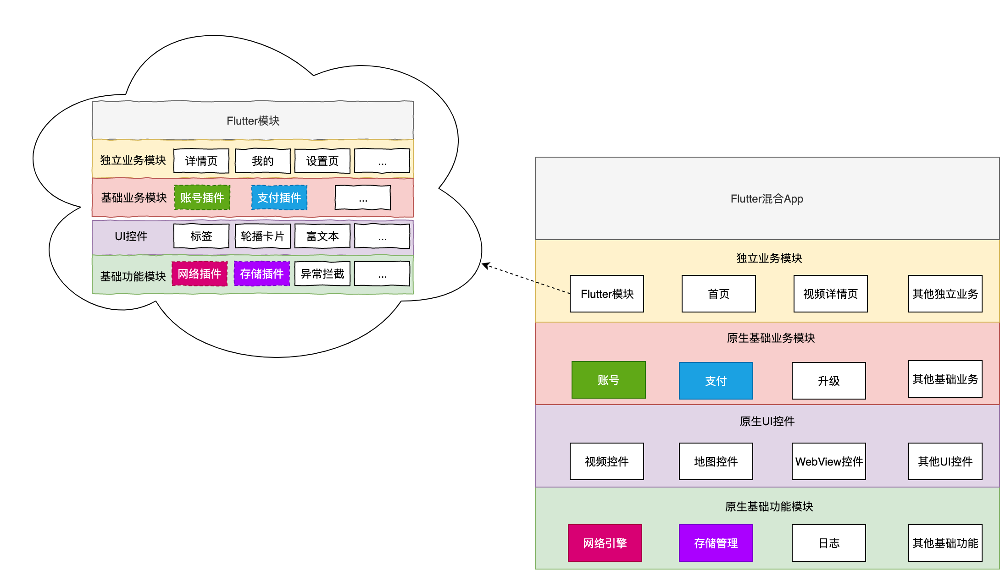
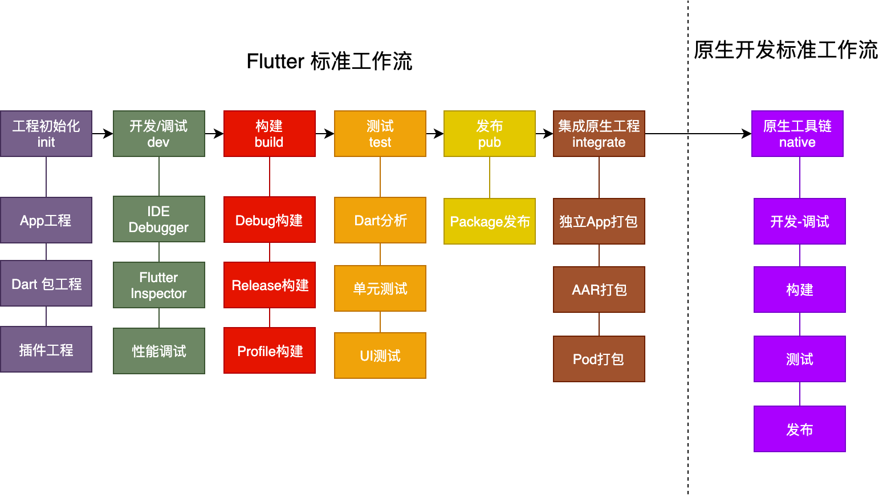
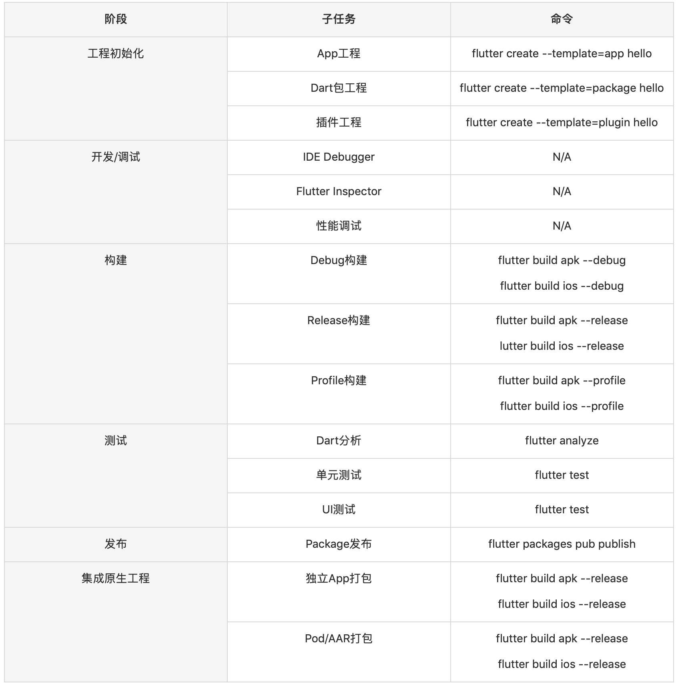

在本次课程的最后一个主题里，我来和你聊聊如何设计自己的 Flutter 混合开发框架。

所谓混合开发，是指在 App 的整体架构继续使用原生技术栈的基础上，将 Flutter 运行环境嵌入到原生 App 工程中：由原生开发人员为 Flutter 运行提供宿主容器及基础能力支撑，而 Flutter 开发人员则负责应用层业务及 App 内大部分渲染工作。

这种开发模式的好处十分明显。对于工程师而言，跨平台的 Flutter 框架减少了对底层环境的依赖，使用完整的技术栈和工具链隔离了各个终端系统的差异，无论是 Android、iOS 甚至是前端工程师，都可以使用统一而标准化的能力进行业务开发，从而扩充了技能栈。而对于企业而言，这种方式不仅具备了原生 App 良好的用户体验，以及丰富的底层能力，还同时拥有了跨平台技术开发低成本和多端体验一致性的优势，直接节省研发资源。

那么，在原生工程中引入 Flutter 混合开发能力，我们应该如何设计工程架构，原生开发与 Flutter 开发的工作模式又是怎样的呢？

接下来，在今天的分享中，我会着重为你介绍这两个主题设计思路和建设方向；而在下一次分享中，我则会通过一个实际的案例，与你详细说明在业务落地中，我们需要重点考虑哪些技术细节，这样你在为自己的原生工程中设计混合开发框架时也就有迹可循了。

## 混合开发架构

在[第 40篇文章]中，我与你介绍了软件功能分治的两种手段，即组件化和平台化，以及如何在满足单向依赖原则的前提下，以分层的形式将软件功能进行分类聚合的方法。这些设计思想，能够让我们在设计软件系统架构时，降低整体工程的复杂性，提高 App 的可扩展性和可维护性。

与纯 Flutter 工程能够以自治的方式去分拆软件功能、管理工程依赖不同，**Flutter 混合工程的功能分治**需要原生工程与 Flutter 工程一起配合完成，即：在 Flutter 模块的视角看来，一部分与渲染相关的基础能力完全由 Flutter 代码实现，而另一部分涉及操作系统底层、业务通用能力部分，以及整体应用架构支撑，则需要借助于原生工程给予支持。

在第 40 篇文章中，我们通过四象限分析法，把纯 Flutter 应用按照业务和 UI 分解成 4 类。同样的，混合工程的功能单元也可以按照这个分治逻辑分为 4 个维度，即不具备业务属性的原生基础功能、不具备业务属性的原生 UI 控件、不具备 UI 属性的原生基础业务功能和带 UI 属性的独立业务模块。
:-: 
图 1 四象限分析法

从图中可以看到，对于前 3 个维度（即原生 UI 控件、原生基础功能、原生基础业务功能）的定义，纯 Flutter 工程与混合工程并无区别，只不过实现方式由 Flutter 变成了原生；对于第四个维度（即独立业务模块）的功能归属，考虑到业务模块的最小单元是页面，而 Flutter 的最终呈现形式也是独立的页面，因此我们把 Flutter 模块也归为此类，我们的工程可以像依赖原生业务模块一样直接依赖它，为用户提供独立的业务功能。

我们把这些组件及其依赖按照从上到下的方式进行划分，就是一个完整的混合开发架构了。可以看到，原生工程和 Flutter 工程的边界定义清晰，双方都可以保持原有的分层管理依赖的开发模式不变。

图 2 Flutter 混合开发架构

需要注意的是，作为一个内嵌在原生工程的功能组件，Flutter 模块的运行环境是由原生工程提供支持的，这也就意味着在渲染交互能力之外的部分基础功能（比如网络、存储），以及和原生业务共享的业务通用能力（比如支付、账号）需要原生工程配合完成，即原生工程以分层的形式提供上层调用接口，Flutter 模块以插件的形式直接访问原生代码宿主对应功能实现。

因此，不仅不同归属定义的原生组件之前存在着分层依赖的关系，Flutter 模块与原生组件之前也隐含着分层依赖的关系。比如，Flutter 模块中处于基础业务模块的账号插件，依赖位于原生基础业务模块中的账号功能；Flutter 模块中处于基础业务模块的网络插件，依赖位于原生基础功能的网络引擎。

可以看到，在混合工程架构中，像原生工程依赖 Flutter 模块、Flutter 模块又依赖原生工程这样跨技术栈的依赖管理行为，我们实际上是通过**将双方抽象为彼此对应技术栈的依赖，从而实现分层管理**的：即将原生对 Flutter 的依赖抽象为依赖 Flutter 模块所封装的原生组件，而 Flutter 对原生的依赖则抽象为依赖插件所封装的原生行为。

## Flutter 混合开发工作流

对于软件开发而言，工程师的职责涉及从需求到上线的整个生命周期，包含需求阶段 -> 方案阶段 -> 开发阶段 -> 发布阶段 -> 线上运维阶段。可以看出，这其实就是一种抽象的工作流程。

其中，**和工程化关联最为紧密的是开发阶段和发布阶段**。我们将工作流中和工程开发相关的部分抽离，定义为开发工作流，根据生命周期中关键节点和高频节点，可以将整个工作流划分为如下七个阶段，即初始化 -> 开发 / 调试 -> 构建 -> 测试 -> 发布 -> 集成 -> 原生工具链：

图 3 Flutter 混合开发工作流

前 6 个阶段是 Flutter 的标准工作流，最后一个阶段是原生开发的标准工作流。

可以看到，**在混合开发工作模式中，Flutter 的开发模式与原生开发模式之间有着清晰的分工边界**：Flutter 模块是原生工程的上游，其最终产物是原生工程依赖。从原生工程视角看，其开发模式与普通原生应用并无区别，因此这里就不再赘述了，我们**重点讨论 Flutter 开发模式**。

对于 Flutter 标准工作流的 6 个阶段而言，每个阶段都会涉及业务或产品特性提出的特异性要求，技术方案的选型，各阶段工作成本可用性、可靠性的衡量，以及监控相关基础服务的接入和配置等。

每件事儿都是一个固定的步骤，而当开发规模随着文档、代码、需求增加时，我们会发现重复的步骤越来越多。此时，**如果我们把这些步骤像抽象代码一样，抽象出一些相同操作，就可以大大提升开发效率。**

优秀的程序员会发掘工作中的问题，从中探索提高生产力的办法，而**转变思维模式就是一个不错的起点**。以持续交付的指导思想来看待这些问题，我们希望整体方案能够以可重复、可配置化的形式，来保障整个工作流的开发体验、效率、稳定性和可靠性，而这些都离不开 Flutter 对命令行工具支持。

比如，对于测试阶段的 Dart 代码分析，我们可以使用 flutter analyze 命令对代码中可能存在的语法或语义问题进行检查；又比如，在发布期的 package 发布环节，我们可以使用 flutter packages pub publish --dry-run 命令对待发布的包进行发布前检查，确认无误后使用去掉 dry-run 参数的 publish 命令将包提交至 Pub 站点。

这些基本命令对各个开发节点的输入、输出以及执行过程进行了抽象，熟练掌握它们及对应的扩展参数用法，我们不仅可以在本地开发时打造一个易用便捷的工程开发环境，还可以将这些命令部署到云端，实现工程构建及部署的自动化。

我把这六个阶段涉及的关键命令总结为了一张表格，你可以结合这张表格，体会落实在具体实现中的 Flutter 标准工作流。

表 1 Flutter 标准工作流命令

## 总结

对于 Flutter 混合开发而言，如何处理好原生与 Flutter 之间的关系，需要从工程架构与工作模式上定义清晰的分工边界。

在架构层面，将 Flutter 模块定义为原生工程的独立业务层，以原生基础业务层向 Flutter 模块提供业务通用能力、原生基础能力层向 Flutter 模块提供基础功能支持这样的方式去分层管理依赖。

在工作模式层面，将作为原生工程上游的 Flutter 模块开发，抽象为原生依赖产物的工程管理，并提炼出对应的工作流，以可重复、配置化的命令行方式对各个阶段进行统一管理。

可以看到，在原生 App 工程中引入 Flutter 运行环境，由原生开发主做应用架构和基础能力赋能、Flutter 开发主做应用层业务的混合开发协作方式，能够综合原生 App 与 Flutter 框架双方的特点和优势，不仅可以直接节省研发资源，也符合目前行业人才能力模型的发展趋势。

## 思考题

除了工程依赖之外，我们还需要管理 Flutter SDK 自身的依赖。考虑到 Flutter SDK 升级非常频繁，对于多人协作的团队模式中，如何保证每个人使用的 Flutter SDK 版本完全一致呢？