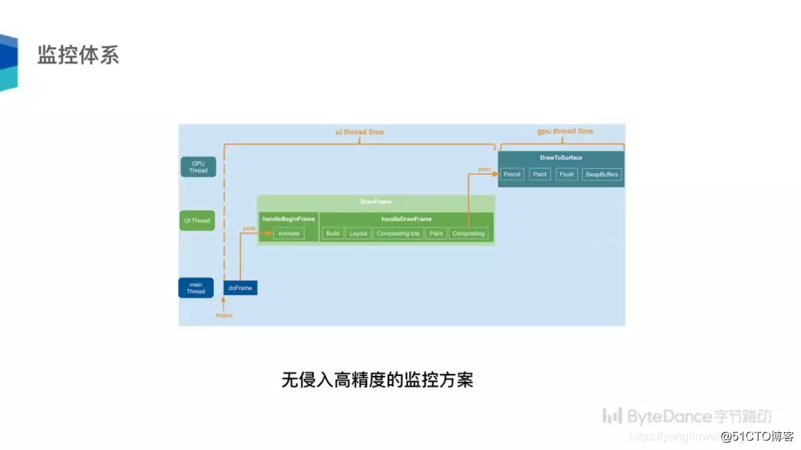

## 01 移动跨平台技术趋势

移动互联网发展 10 多年来，由之前传统 PC 端时代到移动时代，在移动时代竞争激烈，各大移动互联网公司都在争相抢夺市场，如何提高研发效率，产品快速迭代、快速试错成为非常重要的因素。

与此同时，还要看在关注研发效率的同时能否做出一个性能比较高的应用，往往我们的研发效率和性能是天平两端，性能好了开发效率可能就差了，开发效率好了性能可能就差了，这就需要思考如何把开发效率和性能这两者做到更好的平衡。

再者，面对这么多跨平台技术，能否用一种语言开发出应用在多端体验是一致的？UI 小姐姐设计这版小龙女，研发小哥哥开发出另一款小龙女，到安卓平台变成各种各样的小龙女，发现 UI 长得都不一样。我们能否实现高效的多端一致性体验？

再者，能否突破渠道去快速更新我的应用？这个不光是跨平台技术，Native 技术本身也是同样关注这个问题。

以上，是跨平台技术方案优劣最为关注的几个因素。

### 1.1 跨端技术这几年是怎么发展的？

我们在 2011 年时，以 WebView 技术做跨端，这个跨端有比较大的局限性，性能很差、功能受限，不能做复杂场景。到了 2015 年 Facebook 出了 React Native，它是以 JS 语言，通过中间层转换，最终渲染调到 Native 层，性能相对更好一些。接下来阿里推出了 Weex，也是通过 JS 语言调到原生渲染。2018 年 Google 出了 Flutter，它有自自己的引擎、自渲染机制，它的性能比较好。这就是大概的演进。

### 1.2 跨端技术类型

跨端技术分为几类：

- **原生渲染**：通过各种技术调中间层转换，最终渲染，安卓还是调安卓的，iOS 的还是调 iOS 的。
- **WebView**：通过调 WebView 的技术去渲染，我们的小程序也是基于这一块。
- **自渲染**：可以不借助系统的，自己写一套自渲染技术，这就是今天要讲的重点——Flutter。

不管跨端技术怎么演变，主要就是分这三大类。

### 1.3 Flutter 有什么技术优势？

1.「效率」：跨平台，用 Dart 语言跑，同时可以跑在多端上，毋庸置疑有高效率。

2.「高性能」：自渲染，不靠系统原生渲染，用自己的。

3.「高一致性」：一套代码写完，它在多端表现是一致的。

4.「动态化」：这个东西不适合去过多讲，其实引擎本身就有尝试原生引擎。

#### 1.3.1 Flutter 高一致性

我们来看高一致性，上面是 Flutter 写的一个 Demo，在安卓和 iOS 几乎一样。UI 小姐姐设计 UI 时往往希望多端体验一致，它可以做到高度一致。

#### 1.3.2 Flutter 高性能

我们再讲讲它的高性能，为什么常说它是高性能？以安卓为例，安卓原生框架 APP 调到大家熟悉的安卓 Framework，Flutter 再调到 Skia，Skia 再最终渲染调到 GPU。

右边一般常规框架原生渲染怎么做的？它有一个转换层，通过转换，最终安卓调安卓渲染，iOS 调 iOS 渲染机制，中间多了一个层。

对于 Flutter 中间调的是一个 Dart Framework，再调到 Skia，用 Flutter 平台和原生很接近，Flutter 是上限很高的技术，如果你优化足够好，它可以媲美原生。当然，现在 Flutter 作为一个新生婴儿可能有些方面有所不足，但是不断发展，它终究可以做得更好。

业界公司可以直接做 Flutter，BAT、字节跳动等或多或少在它们业务上有落地，这是一个趋势。

#### 1.3.3 Flutter in Fuchsia

除此之外，Google 还有一个内部做的系统叫 Fusicha，它最上层也是用的 Flutter 和 Dart，这个系统未来如何？在 5G 和 IoT 市场不断发展，很有可能这个系统也做得不错，如果它有不错的效果，你提前入局 Flutter，可能多了一次弯道超车的机会。

## 02 解读 Flutter 引擎原理

### 2.1 Flutter技术架构

我们来看看 Flutter 技术栈。上面是用 Dart 写的 APP，下面有 DartFramework，Framework 里有安卓和 iOS 的主体，里面有很多动画等等。再往下会调到引擎，引擎里有消息、PlatformChannel、Dart VM 等，引擎层再到平台，我们看的是平台、安卓还是 Web，这是我们常规的一个架构。

### 2.2 引擎创世纪

但是我们看待一个系统一定要从动态视角去看待，什么叫动态视角？这个 Flutter 是如何创立的？它的生命周期看它最终是怎么起来的？

上图依然是以安卓为例，安卓有 Application 和 Activity，用 Dart 写的 APP 终究也要这样去跟原生连接起来，Flutter 有 Flutter 的 Application 和 Flutter 的 Activity。在 Flutter Application 中就会把 Dart 写的代码生成一个产物，把它加载起来，我们的 Flutter Activity 过程中会拉起我们的引擎。

到了引擎层这块，Flutter 里四个核心线程：平台线程、UI 线程、GPU 线程、IO 线程，它们各有分工：这个平台线程对于安卓和 iOS 来说就是常说的主线程，这里的 UI 线程面对安卓本身的主线程，就是一个独立的线程；GPU 线程指的是跑在 CPU 上的线程，它做的主要是 Skia 相关工作。IO 线程比如图片解码、编解码，主要做 IO 相关的工作。这里既然有几个线程，肯定涉及线程之间的通信，就回到技术的相通，如果你熟悉安卓、iOS 就知道线程怎么通信，一会儿看看它们两个的区别。

右边有一个 Dart 虚拟机，这里有一个 Isolate 的概念，这是 Flutter 里才有的概念，从名字也可以看出来，“孤立的”，孤立的是什么意思？两个内存之间不会孤立、不会不共享。再看右上角，就到了 Dart 层，会有 UI 绘制。

接下来依次讲一下这四块。

#### 2.2.1 Fultter编译产物

第一个图，先看看 Flutter 用 Dart 写的代码最终编译的东西长什么样，最开始 Dart 代码最马上用前端编译器编译，左边绿色的是安卓，右边蓝色的是 iOS，根据不同的平台会产生不同的产物。左边组成了一个 APK，右边在我们的 iOS 上是 Runner APP。最下面引擎代码通过编译产生在安卓和 iOS 有所不同，两部分拼凑起来成为相应不同平台的 APK。发现用 Dart 写的代码在不同平台会编译成适应不同平台的应用，这是最终编译出来的产物。Flutter 能够把这个产物加载起来运行。

#### 2.2.2 线程通信

第二个图，说到线程通信，依然以安卓为例，大家非常熟悉安卓，我们是怎么通信的呢？这里面有很多消息，简单来说是把一个消息放到消息队列里去了，这是一个安卓的技术。我们来看一下右边 Flutter，会发现非常神奇，技术就是这样的相通。Flutter 依然有一个 Looper 线程，对于主线程复用了原来的 Native 的，对于另外三个线程创建一个独立的 Looper，不同的是它有两个消息队列，依然是跑消息的方式，通过 Task Runner 就好比安卓的 Handle，通过 PostTask 就好比把一个消息放在一个消息队列里去。同样在 Dart 里经常用 Furture 和异步的方法，核心还是用我们的 Task Runner 发一个消息。

我们要看到技术的相通，也要看到技术的不同，这里面不同的是什么？不同的是在于我们这里有一个 MessageQueue，这里有两个队列，它怎么处理呢？先处理微型任务，微型任务处理完了再处理普通任务，所以在 Flutter 里叫 Task，在安卓里叫 Message，技术神奇的相似。大家不用担心，学习新技术成本非常高，把技术掌握透了，学习新技术会发现成本很低，很好去理解。

#### 2.2.3 Dart 虚拟机

再看看 Isolate，同一个进程里可以有很多 Isolate，两个 Isolate 的堆是不能共享的，但它们也要交互。怎么交互？在 Dart 虚拟机里面也有一个特殊 Isolate，是运行在 UI 线程中，和 Root Isolate 是运行在一个线程的。当两个 Isolate 要通信，会找一个共同的可访问的内存，安卓听到非常多的概念是“进程间通信”，它最终怎么通信？用户态进程不能共享，但是内核态可以共享，这就找到一个可以共享的地方，把通信数据在内核态放进对方的队列里，另外一边就可以拿到了。

同样，Isolate 也是类似的逻辑，Isolate1 和 Isolate2 怎么通信？在 Isolate2 里创一个 ReceivePort，在 Isolate1 中调用其对应的 SendPort 的 send 方法，在引擎 PortMap 里面有映射表，每一个 port 端口对应一个相应 Isolate 的 MessageHandler，该 Handler 里面有两个队列，一个是普通的消息队列，一个是 OOB 高优先级消息，根据优先级把它放到相应消息队列。再把这个事件封装成一个 MessageTask，抛到另外一个 Isolate 里去，我们一般创建一个 Isolate，它里面是一个 worker 线程，worker 线程放入一个新的 Task，它就会最终去执行这个 Task，最终会解析出这个消息，你会发现技术再一次相通了。

#### 2.2.4 Widget

我们再往上走，到了 UI 层是 Widget，在整个 Flutter 里有很多 Widget。Widget 可以是一行文本、一张图片、一个颜色，所有都是 Widget。最大有两类，一个是无状态的 Widget，一个是有状态的。无状态顾名思义是一类 StatelessWidget，一旦创建状态是不可改变的；第二类 StatefulWidget 是状态可以改变的。这涉及状态是跟安卓不同的地方，既然有了状态，应用越写越复杂时就涉及状态管理，如何去管理状态。

#### 2.2.5 渲染原理

对应 Widget 创建 Widget 树，它是 Element 的配置，如果两个 Widget 之间做了变化它会做差分，比较一下到底哪部分做了变化，只把变化更新到 Element 里去，以最小粒度做更新。到了 Element 里构建渲染过程中会创建 Render 对象，创建渲染的过程。

渲染来了一个信号，UI 线程更新动画，动画完了做一个建立，建立过程中生成 Render，再往下布局、绘制大小等工作。这个完成以后会生成一个 Layer Tree，也跨两个线程，UI 和 GPU 线程。到了 GPU 线程之后会调用 Skia 做渲染。

#### 2.2.6 Platform Channels

为什么用平台的 Channel？大家常说，Flutter 是一个漂亮的 UI 工具，有时真的需要 Native 能力怎么办？比如调用相机的特性需要写 Native 代码，所以 Flutter 提供一套 Channel 机制，橙色部分代码，写相应平台安卓或者 iOS 定制代码，中间有一套机制帮你实现封装好，你写 Dart 代码直接可以调到安卓或者 iOS 代码，这个过程是异步的。

大家大概看了 Flutter 引擎核心的技术，不光是 UI 层的，以及引擎层的机制。我过程中多次提到一点，技术是相通的，你在一个领域深耕，新的领域依然可以做到继续深耕。

## 03 字节跳动在 Flutter 架构实践

字节跳动有超过 20 个应用在用 Flutter，头条、西瓜视频等都在用 Flutter，内部很多应用都已经采用 Flutter 落地了，这不是纸上工程，在很多业务上都已经落地了。

### 3.1 Flutter 架构实践

我们移动平台部在 Flutter 上做了哪些工作？

上层为了支撑我们这些应用，首先在应用框架层在工程化做了很多努力，用容器化思想，如何让业务接起来更快；有混合工程的知识，让业务快速接入 Flutter；我们的状态管理，在状态混了的情况下如何高效的接入；也为了我们业务更好的接入，我们有很多技术组件的开发，提供了很多丰富的库。

除此之外，为了监控 Flutter，有很多性能高可用平台，有稳定性测试等等。

引擎层也做了大量优化，虽然号称 Flutter 高性能，但是业务使用中还是要做到优化。首先，我们很多工程师刚开始写 Dart 不知道如何写出更高效率的 Flutter 代码，所以业务可以优化，其次，引擎可以做很多优化，以及多端一体化的尝试，以及编译、黑科技的，我们在每个领域都花了很多投入。

### 3.2 Flutter 容器化架构

简单看看我们的容器化，为业务支撑，有很多 APP，提供容器化扩展接口。比如要调图片，图片调到我们的协议层，会调一个图片的协议，里面有一个默认的适配，还有一个用户可以自定义的，可以不做任何定制，我们会帮你提供常用技术组建。下面跟安卓、iOS 的交互都可以忽略，写代码很方便，很多库都有，这就是容器化的思想，帮你封闭了底层差异性，让你接入起来更加快捷。

### 3.3 监控体系

再说说监控体系，看过我们 Flutter 发现引擎本身有我们的监控，上面是 GPU 线程，下面是 UI 线程，这是一个比较粗糙的性能统计方法。为什么粗糙？有几点做不到位的地方：第一，把性能分成 UI 和 GPU 线程，显然我们看参数时希望看一个参数，第二，它的算法很粗糙，它统计每一帧耗时，做物理平均，最后再将平均耗时根据 16.6ms 对应 60fps，来归一化处理。

业界不少公司做了改进，都怎么改进的？通常的方法在框架层去统计出 UI 线程的耗时时间，看它跨了多长时间，看它有多少帧是丢帧的，这个方案有什么缺陷？我们可以看这个图，理解这个渲染的过程，来了一个信号，你把这个消息 post 到 UI，里面再做 Handle，再把这个事情 Post 到我们的 GPU 线程。这个方案的缺陷是：第一，线程 Post 到 UI 线程中间有一个消息传递过程，有可能在 Post 过程中要等待的这段时间没有考虑进去。第二，如果你只统计 UI 线程有什么缺陷？我们举个例子，UI 线程非常快，但是 GPU 线程非常慢，UI 线程每次可能一两毫秒就完成了，但是 GPU 线程每次要一两百毫秒，虽然看到性能非常好，但是真实体验发现卡爆了，几乎刷不动，为什么？因为 UI 线程向 GPU 线程跑消息时最多 Post 两个消息，这时候 GPU 线程依然处理不过来，UI 线程就不会 Post 消息，但是 UI 线程体现不出来，所以这也是业界方案的缺陷。

我们做了高精度无侵入性能监控方案：

- 首先，要知道绘制多少帧，所以我们会统计你发了多少信号，统计 GPU 线程，最终真正绘出来多少帧，这是真正的体验。我们是在引擎层提供了一套。
- 第二，为什么叫无侵入？常常的性能监控会在我们开始滚动时调一个开始，结束时调一个 End，我们不需要做这个动作，接入框架系统会自动识别场景，自动判断什么时候开始，什么时候结束，所以是高精度无侵入的性能监控。

### 3.4 多端一体化实践

在多端一体化也做过尝试，内部写一个应用可以同时运行在 iOS、安卓端、Web，把一些内部组件串起来，做一个多端一体化的尝试。多端一体化的核心就在于常规有一个 Flutter 引擎，右边多一个 Flutter Web，调用 Dart2JS，这样就把我们 Web 包容进来了。

### 3.5 Flutter Turbo

Flutter Turbo，做了性能提升的方案，如何在有限资源情况下把我们的性能发挥到极致？这个核心思想就是我要找到核心场景做有效的资源调度，比如用户在界面滑动这个场景非常重要，你能否把一些资源有效控制？比如消息调度能否优先调度响应我的首次，这时候我在用户非常重要的场景能否把 GC 抑制了，关闭可以关闭的特效，有一系列手段，为了提高我们的性能，内部有一个 Benchmark 跑分，这些方案都能够带来提升。

### 3.6 图片透传优化方案

现有图片怎么传？常规 Dart 里要上网络中去下载一张图片会调 Image.network，然后把这张图片加载之后，要把数据传到 Dart 层，可以传一个路径等等之类的，Dart 层会再调用引擎层解码。外界纹理也很不错，但它有一些问题，没有在这个基础上改造，而是做了自己的一套透存的方案。

图中右边是我们在 Dart 层调引擎的示意，引擎加载图片时我们调到里面加载，它生成一个 Bitmap，虽然引擎是 Dart 虚拟机，但两者之间我们做了一个 Bitmap 的共享，你不需要把数据传过来，我们是共享的方式，我们再转成 Pixel buffer，对性能同样会大大提升。

### 3.7 启动速度优化

启动速度优化我们做得比较早，刚开始它启动速度也很慢，我们在引擎层里也做了很多修改，发现它的启动速度几乎提升了 1 倍。

### 3.8 包体积优化

包体积是大家非常关注的一个点，为什么关注包体积？会决定用户愿意不愿意去下载这个应用，所以我们在包体积方面做了很多工作，做了很大努力。

- 做了编译优化，如何采用更高效率的编译，iOS 上用了 O 编译，发现包体积进一步压缩。
- Flutter 产物有数据端和代码端，我们把数据端进一步压缩，包体积会减少。
- 在 Skia 我们做了裁剪，把不太需要的功能以及不那么必要的东西裁剪了。
- 引擎层我们也做了一些功能三方库的裁剪。
- 在指令这端发现用 Flutter 写的指令会比我们用 OC 代码指令更长一些。这块我们跟 Google 做了积极的沟通反馈问题，Google 花了很多精力，我们也跟进推进 Google 做这件事情。

一系列方案下来，我们的包体积会接近 50% 的优化。

以上是我们字节跳动在 Flutter 里做了众多实践中的部分重点工作。

## 04 总结

第一，分享了 Flutter 的技术趋势，Flutter 是大家争相追寻的技术。

第二，跟大家介绍了 Flutter 引擎，发现里面的技术是相通的，消息通信跟安卓的 Handle 机制几乎一样；但是它也有它的差异，技术也有不同之处。

第三，字节跳动布了一个新的领域，发现我们做了很多技术深耕。回到最开始问的问题，面对一个新技术，你是愿意继续选择深耕老的技术，还是愿意尝试新的技术？发现在做新技术时并没有大家想象的那么难，而且在过程中你会收获很多。

第四，既然选趋势，你怎么知道你选择的就是那颗最大的钻石？最后有一句话送给大家：

**有时候你选择一个方向，不是说它一定成为未来，而是它有可能成为不一样的未来。**