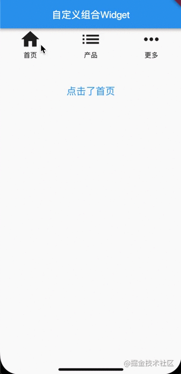
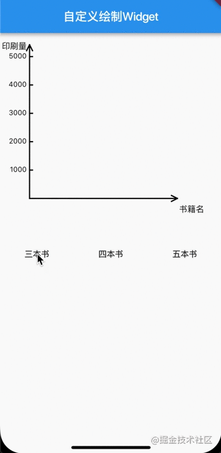

# Flutter自定义Widget和使用方法

## 前言

前面已经通过三个篇幅向大家介绍了Flutter原生提供的常用Widget和其使用方法，实际开发中我们会遇到一些特殊的需求或者规范一些常用的Widget作为基础UI组件来使用，这时我们就需要根据需求自定义Widget了。Flutter中的自定义Widget和安卓、iOS原生平台类似，可以使用现有Widget进行组合，也可以自己根据需求来绘制，下面分别对两种自定义Widget的实现和使用方法做详细介绍。

## 现有Widget组合自定义Widget

现有Widget组合即是根据前面所介绍的基础Widget根据需求来组合成一个通用的Widget，这样在使用过程中避免设置过多的属性，且增强其复用性。 比如，在实际开发中，我们经常会碰到一个Icon和一个标题组合而成的UI，且这个组合的区块可以处理点击事件，那么我们就可以根据现有Icon和Text widget组合成通用的类似UI组件。

首先创建一个单独的dart文件来实现该自定义Widget，比如命名为`custom_combined_widget.dart`。

```
import 'package:flutter/material.dart';

class CustomCombinedWidget extends StatefulWidget {

  final IconData iconData;
  final String title;
  final GestureTapCallback onTap;

  const CustomCombinedWidget({Key key, this.iconData, this.title, this.onTap}): super(key: key);

  @override
  State<StatefulWidget> createState() {
    // TODO: implement createState
    return CustomCombinedWidgetState();
  }

}

class CustomCombinedWidgetState extends State<CustomCombinedWidget> {

  @override
  Widget build(BuildContext context) {
    // TODO: implement build
    return GestureDetector(
      onTap: this.widget.onTap,
      child: Column(
        children: <Widget>[
          Icon(this.widget.iconData, size: 45.0,),
          Text(this.widget.title == null ? "" : this.widget.title, style: TextStyle(fontSize: 14.0, color: Colors.black),),
        ],
      ),
    );
  }

}
复制代码
```

上述代码中我们自定义了一个CustomCombinedWidget，这里面Icon的大小和标题的文本大小、颜色都是定好的，所以在使用时无法改变这些值，如果想在使用过程中改变这些值则需要从外部传值进来，比如标题的文本内容、icon和该Widget点击事件回调就是通过外部使用者传入的。

以上自定义Widget的使用方法如下：

```
//首先导入自定义Widget所在文件
import 'package:demo_module/custom_combined_widget.dart';

//在页面Widget中使用

class HomePageState extends State<HomePage> {
  String tips = '这里是提示';

  @override
  Widget build(BuildContext context) {
    // TODO: implement build
    return Scaffold(
      appBar: AppBar(
        title: Text('自定义组合Widget'),
      ),
      body: Container(
        child: buildCombinedWidget(),
      ),
    );
  }

  Widget buildCombinedWidget() {
    return Center(
      child: Column(
        children: <Widget>[
          Row(
            mainAxisAlignment: MainAxisAlignment.spaceAround,
            children: <Widget>[
              CustomCombinedWidget( //使用自定义Widget
                iconData: Icons.home,
                title: '首页',
                onTap: () {
                  setState(() {
                    this.tips = '点击了首页';
                  });
                },
              ),
              CustomCombinedWidget(
                iconData: Icons.list,
                title: '产品',
                onTap: () {
                  setState(() {
                    this.tips = '点击了产品';
                  });
                },
              ),
              CustomCombinedWidget(
                iconData: Icons.more_horiz,
                title: '更多',
                onTap: () {
                  setState(() {
                    this.tips = '点击了更多';
                  });
                },
              ),
            ],
          ),
          Padding(
            padding: EdgeInsets.only(top: 50),
            child: Text(
              this.tips,
              style: TextStyle(fontSize: 20, color: Colors.blue),
            ),
          ),
        ],
      ),
    );
  }
} 
复制代码
```

以上代码模拟器运行效果如下：





## 通过CustomPainter绘制自定义Widget

自定义绘制的Widget需要我们继承官方提供的CustomPainter抽象类，重写paint方法来实现，我们可以在paint方法中根据需求来绘制各种UI图形，最后根据该自定义CustomerPainter类创建一个painter对象作为系统提供的CustomPaint的painter属性值来实现自定义Widget。下面根据一个常用的柱状图的实现来学习CustomPainter的用法。

首先我们创建一个自定义Widget对应的dart文件`my_custom_painter.dart`

```
import 'dart:ui';
import 'dart:ui' as ui show TextStyle;

import 'package:flutter/material.dart';

class BaseData {
  String name;
  int num;
  BaseData({this.name, this.num});
}

class MyCustomPainter extends CustomPainter {
  //绘制区域宽度
  final int width = 300;
  //绘制区域高度
  final int height = 350;
  //坐标原点
  final Offset origin = const Offset(50.0, 280.0);
  //纵坐标顶点
  final Offset vertexVer = const Offset(50.0, 20.0);
  //横坐标顶点
  final Offset vertexHor = const Offset(300.0, 280.0);
  //纵坐标刻度间隔
  final int scaleInterval = 1000;
  const MyCustomPainter(this.data);
  final List<BaseData> data;

  //根据文本内容和字体大小等构建一段文本
  Paragraph buildParagraph(String text, double textSize, double constWidth) {
    ParagraphBuilder builder = ParagraphBuilder(
      ParagraphStyle(
        textAlign: TextAlign.right,
        fontSize: textSize,
        fontWeight: FontWeight.normal,
      ),
    );
    builder.pushStyle(ui.TextStyle(color: Colors.black));
    builder.addText(text);
    ParagraphConstraints constraints = ParagraphConstraints(width: constWidth);
    return builder.build()..layout(constraints);
  }

  @override
  void paint(Canvas canvas, Size size) {
    // TODO: implement paint
    var paint = Paint()
      ..color = Colors.black
      ..strokeWidth = 2.0
      ..strokeCap = StrokeCap.square;

    //绘制纵坐标轴线
    canvas.drawLine(origin, vertexVer, paint);
    canvas.drawLine(
        vertexVer, Offset(vertexVer.dx - 5, vertexVer.dy + 10), paint);
    canvas.drawLine(
        vertexVer, Offset(vertexVer.dx + 5, vertexVer.dy + 10), paint);
    canvas.drawParagraph(buildParagraph('印刷量', 14, origin.dx-5),
        Offset(0, vertexVer.dy-8));

    //绘制横坐标轴线
    canvas.drawLine(origin, vertexHor, paint);
    canvas.drawLine(
        vertexHor, Offset(vertexHor.dx - 10, vertexHor.dy - 5), paint);
    canvas.drawLine(
        vertexHor, Offset(vertexHor.dx - 10, vertexHor.dy + 5), paint);
    canvas.drawParagraph(buildParagraph('书籍名', 14, origin.dx-5),
        Offset(vertexHor.dx, origin.dy+8));

    //绘制纵坐标刻度
    //实际最大值
    double realMaxY = origin.dy - vertexVer.dy - 20;
    //刻度间隔实际值
    double scaleInte = realMaxY / 5;
    for (int i = 0; i < 5; i++) {
      canvas.drawLine(Offset(origin.dx, origin.dy - (i + 1) * scaleInte),
          Offset(origin.dx + 5, origin.dy - (i + 1) * scaleInte), paint);
      canvas.drawParagraph(buildParagraph(((i+1)*scaleInterval).toString(), 12, origin.dx-5),
          Offset(0, origin.dy - (i + 1) * scaleInte - 8.0));
    }

    if (data == null || data.length == 0) {
      return;
    }
    //计算纵坐标上的刻度
    int size = data.length;
    //柱状图间隔值
    double horiScalInte = (vertexHor.dx - origin.dx - 20) / size;
    //柱状图宽
    double chartWidth = 5;
    for (int i = 0; i < size; i++) {
      BaseData curData = data[i];
      double valueY = curData.num * scaleInte / scaleInterval;
      canvas.drawRect(Rect.fromLTWH(origin.dx + (i+1)*horiScalInte, origin.dy - valueY, chartWidth, valueY), paint);
      canvas.drawParagraph(buildParagraph(curData.name, 12, origin.dx-5),
          Offset(origin.dx + (i+1) * horiScalInte - 25, origin.dy+8));
    }
  }

  @override
  bool shouldRepaint(MyCustomPainter oldDelegate) {
    // TODO: implement shouldRepaint
    return oldDelegate.data != data;
  }
}
复制代码
```

代码实现中表示我们将传入一个包含柱状图数据的data对象，paint方法会根据data数据集合来在一个坐标系中绘制柱状图。在具体的Widget页面应用方法如下：

```
class HomePageState extends State<HomePage> {
  List<BaseData> data = List();

  @override
  Widget build(BuildContext context) {
    // TODO: implement build
    return Scaffold(
      appBar: AppBar(
        title: Text('自定义绘制Widget'),
      ),
      body: Container(
        child: buildDemoPaintWidget(),
      ),
    );
  }

  Widget buildDemoPaintWidget() {
    return Column(
      crossAxisAlignment: CrossAxisAlignment.start,
      children: <Widget>[
        Container(
          height: 350,
          child: buildPaintWidget(),
        ),
        Container(
          child: Row(
            mainAxisAlignment: MainAxisAlignment.spaceAround,
            children: <Widget>[
              MaterialButton(
                onPressed: () {
                  BaseData book1 = BaseData(name: '书籍A', num: 5000);
                  BaseData book2 = BaseData(name: '书籍B', num: 2000);
                  BaseData book3 = BaseData(name: '书籍C', num: 3000);
                  List<BaseData> dataList = List();
                  dataList.add(book1);
                  dataList.add(book2);
                  dataList.add(book3);
                  setState(() {
                    this.data = dataList;
                  });
                },
                child: Text('三本书'),
              ),
              MaterialButton(
                onPressed: () {
                  BaseData book4 = BaseData(name: '书籍D', num: 4500);
                  setState(() {
                    this.data.add(book4);
                  });
                },
                child: Text('四本书'),
              ),
              MaterialButton(
                onPressed: () {
                  BaseData book5 = BaseData(name: '书籍E', num: 2500);
                  setState(() {
                    this.data.add(book5);
                  });
                },
                child: Text('五本书'),
              ),
            ],
          ),
        ),
      ],
    );
  }

  //构建自定义绘制的Widget
  Widget buildPaintWidget() {
    return CustomPaint(
      painter: MyCustomPainter(data),
    );
  }
}
复制代码
```

以上代码，初始时data数据为空，通过点击三个按钮来改变data的值从而重新绘制柱状图，具体效果如下：





## 总结

本篇我们对自定义Widget进行了详细介绍，实际开发中无非就是使用者两种方式来实现五花八门的UI需求，其中绘制自定义Widget在图表较多的APP中会经常使用，后续我们会专门用一篇文章来介绍各种图形的绘制方法，敬请期待！

