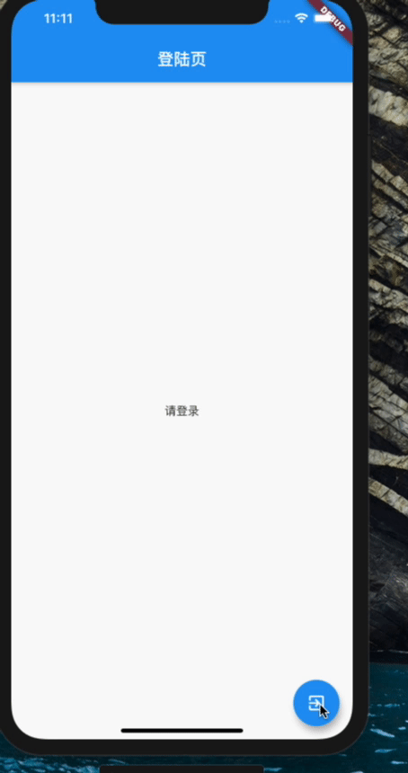

从一个页面到另一个页面的路由，是所有应用程序必不可少的的，当我们学习Flutter 框架或者任何框架时, 总是会遇到路由跳转的问题，如果所有的路由跳转方案向 <a href="xxx"/> 一样简单。

但是，当涉及到Flutter 路由跳转的时候，经过自己学习或者在项目的多次使用还是很容易掌握的，发现 [Fluro](https://link.juejin.cn/?target=https%3A%2F%2Fgithub.com%2Ftheyakka%2Ffluro) 插件 ，也许Fluro 自己介绍的一样 

> The brightest, hippest, coolest router for Flutter.  Flutter最亮，最时髦，最酷的路由器。

如果你是WEB前端开发，Fluro对路由的处理，会让你更快的适应这种方式。Flutter 路由学习起来很容易，写本片博客也是记录自己的学习，但是也希望帮助到你。


## 本篇博客最终构建应用

这个简单的APP，路由使用**Fluro**来管理。



### 开始今天的代码！

让我们开始创建FLutter App，我的用命令行去创建，也是可以用任何支持FLutter IDE来创建它！

```
flutter create fluro_study
```

让我们进入项目目录，并且用IDE中打开它 ，我这里用的Android studio ，你也可以用Vs Code。

首先，让我们获取最新版本的Fluro，[点击这个](https://link.juejin.cn/?target=https%3A%2F%2Fpub.dev%2Fpackages%2Ffluro) ，目前的最新版 1.6.0 , 将会使用此版本开始下面的代码。

现在，打开你的pubspec.yaml 添加Fluro版本

> ```
> dependencies:
>  fluro: "^1.6.0"
> ```

添加改行后，请运行下面的命令，他会从Pub仓库下载该插件，大部分IDE，他会自动执行此步骤，但是如果没有请在运行命令：

```
flutter packages get
```

让我们清除 **lib/main.dart 文件中的内容，放入一个简单组件来显示我们对的页面**


``` dart
import 'package:flutter/material.dart';
import 'package:fluro_tutorial/pages/login.dart';
void main() {  
	runApp(MyApp());
}
class MyApp extends StatelessWidget {  
	@override  
	Widget build(BuildContext context) {    
		return MaterialApp(      
			title: 'Fluro study',      
			home: LoginPage(),    
			);  
	}
}
```

### 开始真正的表演

**我知道，前面很多废话，但是如果刚刚学习Flutter的人浏览了，这会让他更清晰。**

**从这里开始，他会变得简洁明了，没有那么多废话。并且会更多涉及涉及代码**✌️

让我们在“ **pages** ”的目录下创建两个文件。

## lib/pages/login.dart

```dart
import 'package:flutter/material.dart';
class LoginPage extends StatelessWidget {
  @override
  Widget build(BuildContext context) {
    return Scaffold(
      appBar: AppBar(
        title: Text('登陆页'),
      ),
      body: Center(
        child: Text('请登录'),
      ),
      floatingActionButton: FloatingActionButton(
        child: Icon(Icons.exit_to_app),
        onPressed: () {},
      ),
    );
  }
}
```


## lib/pages/home.dart

```dart
import 'package:flutter/material.dart';

class HomePage extends StatelessWidget {  
    final String username;  

    HomePage({this.username});  

    @override  
    Widget build(BuildContext context) {    
        return Scaffold(
          appBar: AppBar(
            title: Text('首页'),
          ),
          body: Center(
            child: Text('欢迎你, $username!'),
          ),
          floatingActionButton: FloatingActionButton(
            child: Icon(Icons.settings_backup_restore),
            onPressed: () {},
          ),
     );
  }
}
```

目前，我们还无法进入首页，因为没有使用路由，从功能上看，我们希望从登陆页面**floatingActionButton** 转入首页。

现在，让我们在lib文件夹中创建一个 **router.dart** 文件

```dart
import 'package:fluro_study/pages/home.dart';
import 'package:fluro_study/pages/login.dart';
import 'package:flutter/material.dart';
import 'package:fluro/fluro.dart';
class FluroRouter {
  static Router router = Router();

  static Handler _loginHandler = Handler(
      handlerFunc: (BuildContext context, Map<String, dynamic> params) =>
          LoginPage());

  static Handler _homeHandler = Handler(
      handlerFunc: (BuildContext context, Map<String, dynamic> params) =>
          HomePage(username: params['username'][0]));

  static void setupRouter() {
    router.define(
      'login', // 这是路径
      handler: _loginHandler,
    );
    router.define(
      'home/:username', //命名参数
      handler: _homeHandler,
    );
  }}
```


**FluroRouter** 类中第一行代码 从 Fluro 库中初始化 **Router() 的静态对象**

```dart
static Router router = Router();
```

接下来，编写控制器代码，负责在路由跳转时加载组件

```dart
// 处理登陆页面
static Handler _loginHandler = Handler(handlerFunc: (BuildContext 
context, Map<String, dynamic> params) => LoginPage());

// 处理首页页面
static Handler _homeHandler = Handler(handlerFunc: (BuildContext context, 
Map<String, dynamic> params) => HomePage(username: params['username'][0]));
```

**params['username'][0]** 路由传递参数，把用户名发送**HomePage**

**现在，让我们回到main.dart 文件并且更新MaterialApp，让其知道我们正在使用Fluro 插件**

```dart
import 'package:fluro_study/router.dart';
import 'package:flutter/material.dart';

void main() {
  // 初始化路由
  FluroRouter.setupRouter();
  runApp(MyApp());
}

class MyApp extends StatelessWidget {
  @override
  Widget build(BuildContext context) {
    return MaterialApp(
        title: 'Fluro Study',
        // 初始化页面为登陆页
        initialRoute: 'login',
        // 使用Fluro 提供的 插件
        onGenerateRoute: FluroRouter.router.generator
    );
  }
}
```


现在，你的页面上已经成功引入Fluro，并且已经初始化为登陆页面，下面实现使用**Navigator** 对象进行页面跳转

## lib / pages / login.dart

在 FloatingActionButton 按钮下 新增一个 onPressed 点击事件的属性并且使用

```dart
floatingActionButton: FloatingActionButton(
  child: Icon(Icons.exit_to_app),
  onPressed: () {
      **var username = 'leoyao';**
      **Navigator.pushReplacementNamed(context, 'home/$username');**
   },
),
```


**Navigator.pushReplacementNamed () 跳转页面之后用户无法按后端按钮回到此页面**

**在主页，这非常简单，我们不用传递任何参数，只需要调用****Navigator.pushReplacementNamed（）。**


## lib / pages / home.dart

> ```dart
> floatingActionButton: FloatingActionButton(
>   child: Icon(Icons.settings_backup_restore),
>   onPressed: () {
>     Navigator.pushReplacementNamed(context, "login");
>   },
> ),
> ```

