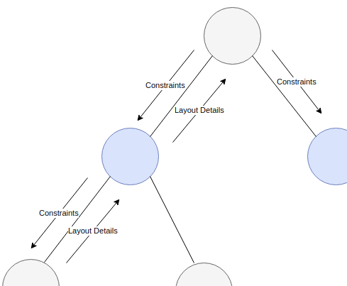
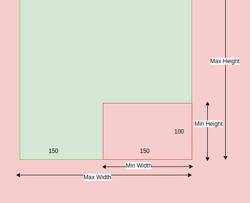
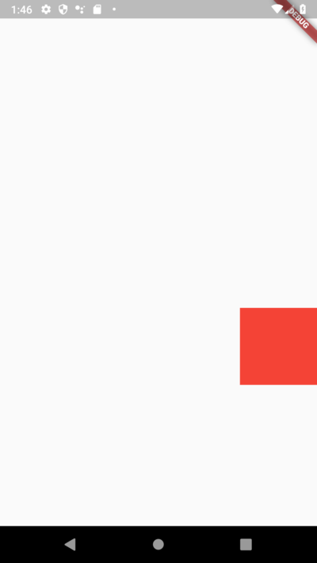
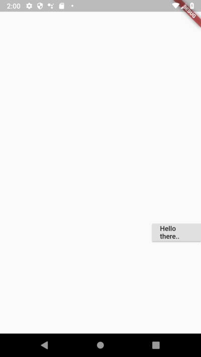

# Flutter’s Rendering Engine: A Tutorial — Part 1

This is the first in a series of articles that I plan to write about how Flutter renders our apps, and how we can use Flutter’s rendering abilities to render widgets ourselves. These articles serve to:

- Help me document and consolidate everything I learn about the topic, and
- Introduce the topic to others in an incremental, accessible format.

Even though it’s not necessary to know about the rendering process of Flutter to be able to write 99% of the apps, it might still be useful to understand it and be able to reason about it; it will definitely be extremely useful to know what is happening behind the scenes. In addition, there might be cases where you will just have to roll up your sleeves and render that widget yourself! And most importantly, learning about rendering ***is a lot of fun\***!

One last note before I start: This series requires intermediate-to-advanced knowledge of Flutter. It assumes that you know your way around Flutter well, and does not attempt to re-explain basic concepts.

# Part 1

This part will be half theoretical and half practical. I will start by explaining just enough theory to get us going, then will switch to talk about how we can render our own widgets ourselves (how cool!). In later parts, however, I will come back to the theory, and dive deeper into its details.

# So how does Flutter render our apps?

On a very high level, rendering in Flutter goes through four phases:

1. Layout Phase: in this phase, Flutter determines exactly how big each object is, and where it will be displayed on the screen.
2. Painting Phase: in this phase, Flutter provides each widget with a *canvas*, and tells it to paint itself on it.
3. Compositing Phase: in this phase, Flutter puts everything together into a *scene*, and sends it to the GPU for processing.
4. Rasterizing Phase: in this final phase, the scene is displayed on the screen as a matrix of pixels.

These phases are not exclusive to Flutter; you can find very similar phases in other rendering frameworks ([like web browsers](https://blog.logrocket.com/how-browser-rendering-works-behind-the-scenes-6782b0e8fb10)). What’s special about Flutter, though, is that its rendering process, as we shall see, is very simple, yet very efficient.

## and it all starts with laying out..

In Flutter, the layout phase is constituted of two *linear* passes: the passing of ***constraints\*** down the tree, and the passing of ***layout details\*** up the tree.



A linear layout process

The process is simple:

1. the parent passes certain *constraints* to each of its children. Those constraints are the set of rules that the child must respect when laying itself out. It’s as if the parent is telling the child: “OK, do whatever you want, as long as you respect those constraints’. One simple example of constraints is a maximum width constraint; the parent could pass down to its child the maximum width within which it is allowed to render. When the child receives those constraints, it knows not to try to render anything wider than them.
2. The child, then, generates new constraints, and passes them down to its own children, and this keeps going until we reach a leaf widget with no children.
3. This widget, then, determines its *layout details* based on the constraints passed down to it. For example, if its parent passed down to it a maximum width constraint of 500 pixels. It could say: “Well, I will use all of it up!”, or “I will only use a 100 pixels”. It, thus, determines the details necessary for its layout, and passes them back to its parent.
4. The parent in turn does the same. It uses the details propagated from its children to determine what its own details are going to be, and then passes them up the tree, and we keep going up the tree either until we reach the root, or until certain limits are reached.

But what are those “constraints” and “layout details” that we speak of? That depends on the *layout protocol* in use. In Flutter, there are two main layout protocols: *the box protocol*, and *the sliver protocol*. The box protocol is used for displaying objects in a simple, 2D Cartesian coordinate system, while the sliver protocol is used for displaying objects that react to scrolling.

In the box protocol, the constraints that the parent passes down to its children are called [**BoxConstraints**](https://docs.flutter.io/flutter/rendering/BoxConstraints-class.html). Those constraints determine the maximum and minimum width and height that each child is allowed to be. For example, the parent might pass down to its child the following *BoxConstraints*:



(150 ≤ w ≤ 300, 100 ≤ h ≤ infinity)

Which means the child can have any size within the green limits. That is, any width between 150 and 300, and any height larger than 100 (because the **maxHeight** is infinity). The child, thus, decides what size it wants to have within those constraints, and informs its parent of its decision. The “layout details” are, thus, the [**Size**](https://docs.flutter.io/flutter/dart-ui/Size-class.html) that the child chooses to be.

In the sliver protocol, things are a bit more complicated. The parent passes down to its child [**SliverConstraints**](https://docs.flutter.io/flutter/rendering/SliverConstraints-class.html), containing scrolling information and constraints, like the scroll offset, the overlap, etc. The child in turn sends back to its parent a [**SliverGeometry**](https://docs.flutter.io/flutter/rendering/SliverGeometry-class.html). We will explore the sliver protocol in more detail in a later part.

## Afterwards, we paint..

Once the parent knows all the layout details of its children, it can proceed to painting both itself and its children. To do that, Flutter passes it a [**PaintingContext**](https://docs.flutter.io/flutter/rendering/PaintingContext-class.html), which contains a [**Canvas**](https://docs.flutter.io/flutter/dart-ui/Canvas-class.html) on which it can draw. The painting context also allows it to paint its children, and to create new painting layers, for cases where we need to draw things on top of each other.

## We then go through compositing and rasterization..

which we will pass over for now, for the sake of looking at more concrete details of the rendering process..

So, let’s look at..

# The Render Tree

You know about the widget tree, and how your widgets constitute a tree whose root starts with the App widget, and then explodes into branches and branches as you add widgets to your app. What you might not know, however, is that there is another tree that corresponds to your widget tree, called the *render tree*..

You see, you have been introduced to several kinds of widgets; the StatefulWidget, the StatelessWidget, the InheritedWidget, etc. But there is also another kind of widget called the [**RenderObjectWidget**](https://docs.flutter.io/flutter/widgets/RenderObjectWidget-class.html). This widget does not have a **build** method, rather a [**createRenderObject**](https://docs.flutter.io/flutter/widgets/RenderObjectWidget/createRenderObject.html) method that allows it to create a [**RenderObject**](https://docs.flutter.io/flutter/rendering/RenderObject-class.html) and add it to the render tree.

The **RenderObject** is the most important component of the rendering process. It is to the render tree what the Widget is to the widget tree. Everything in the render tree is a RenderObject. And each RenderObject has a lot of properties and methods used to carry out rendering. It has:

- a [**constraints**](https://docs.flutter.io/flutter/rendering/RenderObject/constraints.html) object which represents the constraints passed to it from its parent
- a [**parentData**](https://docs.flutter.io/flutter/rendering/RenderObject/parentData.html) object which allows its parent to attach useful information on it.
- a [**performLayout**](https://docs.flutter.io/flutter/rendering/RenderObject/performLayout.html) method in which we can lay it and its children out.
- a [**paint**](https://docs.flutter.io/flutter/rendering/RenderObject/paint.html) method in which we can use to paint it and paint its children.
- etc.

The RenderObject is an abstract class though. It needs to be extended to do any actual rendering. And the two most important classes that extend RenderOject are [**RenderBox**](https://docs.flutter.io/flutter/rendering/RenderBox-class.html) and, you guessed it, [**RenderSliver**](https://docs.flutter.io/flutter/rendering/RenderSliver-class.html). These two classes are the parents of all render objects that implement the box protocol and the sliver protocol, respectively. Those two classes are also extended by tens and tens of other classes that handle specific scenarios, and implement the details of the rendering process.

To end this first part of the tutorial, let’s try to build our own **RenderObjectWidget**.

# The Stingy Widget

We will create a widget that we’ll call ***Stingy\***. This widget is stingy because whatever constraints it receives from its parent, it only gives the bare minimum to its child. Also, it takes up all the width and height provided to it, and positions its child at its bottom right corner! What a poor child!

Let’s start by creating a simple app:

```
void main() {
  runApp(
    MaterialApp(
      home: Scaffold(
        body: ConstrainedBox(
          constraints: BoxConstraints(
            maxWidth: double.infinity,
            minWidth: 100.0,
            maxHeight: 500.0,
            minHeight: 100.0
          ),
          child: Stingy(
            child: Container(
              color: Colors.red,
            )
          ),
        ),
      ),
    )
  );
}
```

- We created an app that contains a [**ConstrainedBox**](https://docs.flutter.io/flutter/widgets/ConstrainedBox-class.html), inside of which we placed our Stingy widget. The ConstrainedBox is a widget that allows us to explicitly specify what constraints we want to pass to the child. Thus, we provided our Stingy widget with a width between 100.0 and infinity, and a height between 100.0 and 500.0. 
  ***Note:\*** It’s not necessary to use the ConstrainedBox, but we used it in this example to be able to explicitly specify what constraints we will pass down to our stingy widget, so that we can easily see them and reason about them.
- We provided our Stingy widget with a child that is, simply, a red container.

Now, let’s look at Stingy!

```
class Stingy extends SingleChildRenderObjectWidget {

  Stingy({Widget child}): super(child: child);

  @override
  RenderObject createRenderObject(BuildContext context) {
    return RenderStingy();
  }
}
```

- Our widget extends [**SingleChildRenderObjectWidget**](https://docs.flutter.io/flutter/widgets/SingleChildRenderObjectWidget-class.html), which is a RenderObjectWidget that, as the name implies, accepts a single child.
- Our createRenderObject function, which creates and returns the RenderObject, creates an instance of a class that we called **RenderStingy**

The RenderStingy class looks as follows:

```
class RenderStingy extends RenderShiftedBox {

  RenderStingy(): super(null);

  @override
  void performLayout() {
    child.layout(BoxConstraints(
      minHeight: 0.0,
      maxHeight: constraints.minHeight,
      minWidth: 0.0,
      maxWidth: constraints.minWidth
    ), parentUsesSize: true);


    final BoxParentData childParentData = child.parentData;
    childParentData.offset 
      = Offset(this.constraints.maxWidth - child.size.width,
        this.constraints.maxHeight - child.size.height);

    size = Size(this.constraints.maxWidth, constraints.maxHeight);
  }
}
```

- RenderStingy extends [**RenderShiftedBox**](https://docs.flutter.io/flutter/rendering/RenderShiftedBox-class.html), which is one of the many helper classes that extend RenderBox to make it easier to implement the box protocol. RenderShiftedBox implements all the details of the protocol, and leaves to you the implementation of the [**performLayout**](https://docs.flutter.io/flutter/rendering/RenderObject/performLayout.html)function. In this function, you have to layout your child, and decide the offset at which you want to display it.
- To layout the child, you simply call **child.layout**, and provide it with the constraints that you desire. As described earlier, Stingy is a stingy widget! So it provides its child with constraints that range between 0 and its minimum constraints.
- We provide **child.layout** with another parameter, **parentUsesSize**. If set to *false*, this means that the parent does not care what size the child chooses to be, which is very useful for optimizing the layout process; if the child changes its size, the parent would not have to re-layout! However, in our case, we want to put the child in the bottom right corner, meaning that we do care about what size it chooses to be, which forces us to set parentUsesSize to *true.*
- By the time child.layout is finished, the child has already determined its layout details, which are, since we’re following the box protocol, the desired size. We can then proceed to place it at the offset that we desire, which is the bottom right corner.
- Finally, just like our child chose a size based on the constraints we gave it, we also need to choose a size for Stingy, so that its parent knows how to place it. And so, Stingy just says: “give me all you have!” and takes up the maximum width and height provided to it.

And now, if you run the code, you can see how StingyWidget consumed all the height and width allowed to it by its parent, and then placed its child, the red rectangle with size 100x100, in the bottom right corner:



That poor child

Please note that the **Container** is a widget with a complex behavior. In our case, it is childless, so it chose to expand to fill its allowed constraints to their maximum.

In general, each widget will deal with the constraints provided to it differently. For example, if we replace that container with a **RaisedButton**:

```
Stingy(
  child: RaisedButton(
    child: Text('Hello there..'),
    onPressed: () {
      print('It\'s been so long..');
    },
  )
)
```

we can see this:



The RaisedButton consumed all the width provided to it, but limited its height to 48.0.

This marks the end of the first part in this tutorial. I hope this has been useful!

Until I write the next part, why don’t you try playing around with the StingyWidget and its children! Also, try to look around at the code of the different widgets that Flutter provides, you will see that some of them are Stateless and Stateful widgets, while others are RenderObjectWidgets. You will also see that there is still a hell lot to learn about rendering in Flutter! So see you in the next part!

***UPDATE:\*** *Unfortunately, due to a career shift, I am not working with Flutter any more, and don’t have enough time to complete the other parts of that tutorial. If anyone writes a good continuation for it, let me know and I would be more than happy to provide a link to their work.*

# References:

- Flutter Rendering Pipeline: https://www.youtube.com/watch?v=UUfXWzp0-DU
- Flutter Rendering Library Documentation: https://docs.flutter.io/flutter/rendering/rendering-library.html