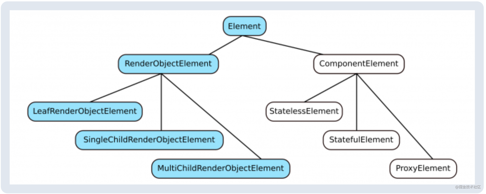

# Flutter是如何绘制文本的

原文在[这里](https://link.juejin.cn/?target=https%3A%2F%2Fwww.raywenderlich.com%2F4562681-flutter-text-rendering)。能看原文的推荐看原文。

这不是一次愉悦的旅行，但是我会带你领略Flutter文本绘制里从未有过的精彩。第一眼看起来非常的简单。只不过是几个字符，对不？但是越往深挖越有难度。

在本文的最后你会学到：

- widget、elements和绘制对象之间的关系
- 在`Text`和`RichText`下的深度内容
- 定制自己的文本widget

```
注意：这是一篇有深度的教程，我假设读者已经对Flutter的基础了如指掌。当然，如果你非常好奇，一定要看。那么继续吧。
```

## 开始

下载初始代码。

## 概览Flutter Framework

作为一个Flutter开发者，你应该已经对Flutter的**stateless**和**statefule** widget颇为熟悉了，但是Flutter里不只这些。今天我们就来学习一点第三种类型`RenderObjectWidget`，以及其他相关的底层类。

下面这幅图把喊了`widget`的全部子类，蓝色的将是本文主要关注的。


`RenderObjectWidget`是一幅蓝图。它保留了`RenderObject`的配置信息，这个类会检测碰撞和绘制UI。

这下面的图是`RenderObject`的子类。最常用的是`RenderBox`，它定义了屏幕上的用于绘制的长方形区域。`RenderParagraph`就是Flutter用来绘制文本的。


很快你就要定制自己的文本绘制widget了！

如你所知，flutter通过把widget组织成树形来实现布局。在内存中对应的会存在一个**绘制树**（render object tree)。但是widget和render object是互相不知道对方的。widget不会生成对应的render object，render object也不知道widget树什么时候发生了更改。

这就需要**element**出场了。对应于widget树，会生成一个element树。element会保留widget和render object的引用。element就是widget和render object的中间人一样。他知道什么时候生成一个render object，如何把他们放在一个树形里，什么时候更新render objects，什么时候为子widget创建新的element。

下面的一幅图说明了`Element`子类，每个element都有一个对应的element。





一个有趣的现象，你一直都在直接操作element，但是你并没有注意到这一点。你知道`BuildContext`？这只是`Element`的一个昵称而已。更正式一点的说法是，`BuildContext`是`Element`的抽象类。

>flutter视图树包含了三种树，上面介绍了三棵树的每个节点的基类及派生类的结构图。他们的对应关系和功能可以简单总结如下：
>
>1. Widget:存放渲染内容、视图布局信息,widget的属性最好都是immutable(如何更新数据呢？查看后续内容)
>2. Element:存放上下文，通过Element遍历视图树，Element同时持有Widget和RenderObject
>3. RenderObject:根据Widget的布局属性进行layout，paint Widget传人的内容


理论准备部分到此结束，现在该动手操作了

## 深入Text Widget

现在我们要深入代码来看看到底widget，element和render object是如何运作的。我们就从`Text` widget开始来看看它是如何创建它的render object：`RenderParagraph`的。

打开你的起始项目，运行`flutter pub get`来获取依赖包。运行起来之后你会看到这样的界面：


在**lib/main.dart**，滚动到最下面找到**TODO:Start your project journey here**这一行：

```
child: Align(
  alignment: Alignment.bottomCenter,
  child: Text( // TODO: Start your journey here
    Strings.travelMongolia,
复制代码
```

widget树里包含了一个`Align` widget和一个子widget `Text` 。当你浏览完代码你形成一个如下图的认识：


进行如下的步骤：

1. Command+click（或者是PC的话Control+click）**Text**跳转到这个widget的源码里。主要`Text`是一个无状态widget。
2. 向下滚动到`build`方法。这个方法返回什么？是一个`RichText` widget。`Text`只是`RichText`的一个伪装而已。
3. Command+click **RichText**来到它的源码部分。主要`RichText`是一个`MultiChildRenderObjectWidget`。为什么是*多个child*？在Flutter 1.7之前的版本里，它其实叫做`LeafRenderObjectWidget`，没有子节点，但是现在`RichText`支持[widget spans](https://link.juejin.cn/?target=https%3A%2F%2Fapi.flutter.dev%2Fflutter%2Fwidgets%2FWidgetSpan-class.html)了。
4. 滚动到`creteRenderObject`方法，这里就是创建`RenderParagraph`的地方。
5. 在**return RenderParagraph**那一行打一个断点。
6. 在调试模式下再次运行代码

在Android Studio的调试里你会看到如下的内容


你应该也会看到如下的stack调用。我在括号里添加了widget或者element的类型。最后边的数字是后面说明的编号


我们来一步一步看看`RenderParagraph`是如何创建的。

1. 点击**SingleChildRenderObjectElement.mount**。你就在`Align`widget对应的element里了。在你的layout里，`Text`是`Align`的子widget。所以，传到了`updateChild`方法里的`widget.child`是`Text` widget。
2. 点击**Element.updateChild**，在一个长长的方法之后，你的`Text` widget，被称为`newWidget`，传入了`inflateWidet`方法。
3. 点击**Element.inflateWidget**。inflate一个widget指的是从这个widget创建一个element。就如你所见**Element newChild = newWidget.createElement()**。这个时候你还在`Align` element里，但是你就要单步调试到你刚刚创建的`Text` element的`mount`方法里了。
4. 点击**ComponentElement.mount**。你现在就在`Text` elemnt里了。Component element（比如`StatelessElement`）不会直接创建render object，但是他们会创建其他的element，让这些elemnt去创建render object。
5. 下面就是几个调用栈的方法了。点击**ComponentElement.performRebuild**。找到**built = build()**那一行。这里，同学们，就是`Text` widget的`build`方法被调用的地方。`StatelessElement`使用了一个setter给自己添加了一个`BuildContext`参数的引用。那个`built`变量就是`RichText`。
6. 点击**Element.inflateWidget**。这时`newWidget`是一个`RichText`，并且它用来创建了`MultiChildRenderObjectElement`。你还在`Text` element，不过你就要进入`RichText` element的`mount`方法了。
7. 点击**RenderObjectElement.mount**。你会惊喜的发现**widget.createRenderObject(this)**。终于，这就是创建`RenderParagraph`的地方。参数`this`就是`MultiChildRenderObjectElement`。
8. 点击**RichText.createRenderObject**。注意`MultiChildRenderObjectElement`就是`BuildContext`。

累了么？这还只是开始，既然你在一个断点上了，那就去喝点水休息片刻吧。后面还有很多精彩内容。

## Text Render Object

Flutter架构图，想必你已经看过：


我们之前看到的内容都在Widget层，接下来我们就要进入**Rendering**，**Painting**和**Foundation**层了。即使我们要进入这些底层的内容，其实他们还是很简单的。因为目前还不需要处理多个树的情况。

你还在那个断点上吗？Command+click **RenderParagraph**，到他的源码看看。

- `RenderParagraph`是继承自`RenderBox`的。也就是说这个render object是一个方形，并且已经具有了绘制内容的固有的高度和宽度。就render paragraph来说，内容就是文本。
- 它还会处理碰撞检测。
- `performLayout`和`paint`方法也很有趣。

你有没有注意到`RenderParagraph`并没有处理文本绘制的工作，而是交给了`TextPainter`？在类的上方找到**_textPainter**。Command+click **TextPainter**，我们离开**Rendering**层，到**Painting**层来看看。

你会发现什么呢

- 有一个很重要的`ui.Paragraph`类型的类成员：`_paragraph`。`ui`是`dart:ui`库里面的类的通用前缀。
- `layout`方法。你是无法直接初始化`Paragraph`类的。你必须要使用一个`ParagraphBuilder`的类来初始化它。这需要一个默认的对全部文字有效的样式。这个样式可以根据`TextSpan`树里的样式来修改。调用`TextSpan.build()`会给`ParagraphBuilder`对象添加样式。
- 你会发现`paint`方法其实非常简单。`TextPainter`把文本都交给了**canvas.drawParagraph()**。如果进入这个方法的定义，你会发现它其实调用了**paragraph._paint**。

这时候，你已经来到了Flutter的**Foundation**层。在`TextPainter`类里，Comand+click下面的类：

- **ParagraphBuilder**： 它添加文字和样式，但是具体的工作都交给了native层。
- **Paragraph**：并没有什么值得看的。所有的都交给native层处理了。

现在可以停止app的运行了。刚刚看到的都可以总结到一幅图了里面：


## 继续深入Flutter的文本引擎

这里，你就要离开`Dart`的底盘进入native文本绘制引擎了。你不能在command+click了，但是代码都在githubg的Flutter代码库里。文本引擎叫做**LibTxt**。

我们不会在这部分耗费太多时间，不够如果你喜欢。可以去*src*目录看。现在我们来看看叫做`Paragraph.dart`的native类，它把绘制工作都交给了[txt/paragraph_text.cc](https://link.juejin.cn/?target=https%3A%2F%2Fgithub.com%2Fflutter%2Fengine%2Fblob%2Fmaster%2Fthird_party%2Ftxt%2Fsrc%2Ftxt%2Fparagraph_txt.cc), 点击链接。

当你有空的时候你可以看看`Layout`和`Paint`方法，但是现在我们来看看这些引入的内容：

```
#include "flutter/fml/logging.h"
#include "font_collection.h"
#include "font_skia.h"
#include "minikin/FontLanguageListCache.h"
#include "minikin/GraphemeBreak.h"
#include "minikin/HbFontCache.h"
#include "minikin/LayoutUtils.h"
#include "minikin/LineBreaker.h"
#include "minikin/MinikinFont.h"
#include "third_party/skia/include/core/SkCanvas.h"
#include "third_party/skia/include/core/SkFont.h"
#include "third_party/skia/include/core/SkFontMetrics.h"
#include "third_party/skia/include/core/SkMaskFilter.h"
#include "third_party/skia/include/core/SkPaint.h"
#include "third_party/skia/include/core/SkTextBlob.h"
#include "third_party/skia/include/core/SkTypeface.h"
#include "third_party/skia/include/effects/SkDashPathEffect.h"
#include "third_party/skia/include/effects/SkDiscretePathEffect.h"
#include "unicode/ubidi.h"
#include "unicode/utf16.h"
复制代码
```

从这里你会看到**LibTxt**是如何处理文本的。它是基于很多的其他的库的，这里有一些有趣的：

- [Minikin](https://link.juejin.cn/?target=https%3A%2F%2Fgithub.com%2Fflutter%2Fengine%2Ftree%2Fmaster%2Fthird_party%2Ftxt%2Fsrc%2Fminikin) 用于文本的测量和布局
- [ICU](https://link.juejin.cn/?target=http%3A%2F%2Fsite.icu-project.org%2Fhome) 帮助Minikin，把文字分成多行
- [HarfBuzz](https://link.juejin.cn/?target=https%3A%2F%2Fwww.freedesktop.org%2Fwiki%2FSoftware%2FHarfBuzz%2F) 帮助Minikin选择正确的字体的形状
- [Skia](https://link.juejin.cn/?target=https%3A%2F%2Fskia.org%2F) 在画布上绘制文本和相关的样式

你看的越多就越发现正确渲染文本需要多少的东西。我都还没有介绍到[行距](https://link.juejin.cn/?target=https%3A%2F%2Fstackoverflow.com%2Fquestions%2F56799068%2Fwhat-is-the-strutstyle-in-the-flutter-text-widget)，[字形集](https://link.juejin.cn/?target=https%3A%2F%2Fstackoverflow.com%2Fquestions%2F54483177%2Fhandling-grapheme-clusters-in-dart)和[双向文本](https://link.juejin.cn/?target=https%3A%2F%2Fen.wikipedia.org%2Fwiki%2FBidirectional_Text)的问题。

我们已经学习的足够深入了，现在我们要把这些内容用起来了。

## 创建一个自定义文本widget

我们要做一些也许你之前从来没有做过的事情。你要自定义一个文本widget了。不是像往常一样的组合起来一些widget，而是创建render object，由它来使用Flutter底层api来绘制文本。

Flutter本来是不允许开发人员来自定义文本布局的，但是Flutter很负责任的做出了修改。

现在我们的app看起来还不错。但是，如果能支持蒙语就更好了。传统的蒙语非常的不同。它是从上到下的书写的。Flutter的标准文本widget仅支持水平的书写方式，所以我们要定制一个可以从上到下书写，从左到右排列的widget。


## 自定义Render Object

为了帮助各位同学理解底层的文本布局，我把widge、render object和帮助类偶放进了初始项目中。


为了方便你以后定制自己的render object，我来解释一下我都做了什么。

- **vertical_text.dart**：这是`VerticalText` widget。我从`RichText`的代码开始写的。我删掉了基本上所有的代码，把它改成了`LeafRenderObjectWidget`，它没子节点。它会创建`RenderVerticalText`对象。
- **render_vertical_text.dart**: 写这个的时候，把`RenderParagraph`删掉一部分，之后加入了宽度和高度的测量。它使用了`VerticalTextPainter`而不是`TextPainter`。
- **vertical_text_painter.dart**:我是从`TextPainter`开始的，然后把不需要的内容全部删除了。我也交换了宽度和高度的计算，删掉了`TextSpan`支持的复杂的文本样式部分。
- **vertical_paragraph_constraint.dart**：我使用了`height`来做为约束，代替了之前的`width`。
- **vertical_paragraph_builder.dart**: 这个部分是从`ParagraphBuilder`开始。删除了一切不别要的代码。添加了默认的样式并在`build`方法里返回`VerticalParagraph`，而不是之前的`Paragraph`。
- **line_breaker.dart**：这个是用来代替Minikin的`LineBreaker`类的。这个类没有在dart里面暴露出来。

## 计算和测量文本

文本都需要自动换行。要做到这一点你需要找字符串里的一个合适的地方来分割成行。就如前文所述，在写作本文的时候Flutter并没有暴露出Minikin/ICU的`LineBreake`类，但是按照一个空格或者一个词来风格也是一个可接受的方案。

比如这个app欢迎语句：

```
ᠤᠷᠭᠡᠨ ᠠᠭᠤᠳᠠᠮ ᠲᠠᠯ᠎ᠠ ᠨᠤᠲᠤᠭ ᠲᠤ ᠮᠢᠨᠢ ᠬᠦᠷᠦᠯᠴᠡᠨ ᠢᠷᠡᠭᠡᠷᠡᠢ
复制代码
```

可行的分割点：


我把可分割的每个子串叫做一个**run**。后面会用`TextRun`来表示每个run。

在**lib/model**目录，创建一个文件**text_run.dart**，把下面的文件粘贴进去：

```
import 'dart:ui' as ui show Paragraph;

class TextRun {
  TextRun(this.start, this.end, this.paragraph);

  // 1
  int start;
  int end;

  // 2
  ui.Paragraph paragraph;
}
复制代码
```

解释一下上面的代码：

1. 这些是每个子串run的索引。`start`索引是包含关系，`end`是不包含的。如：[start, end)。
2. 你会为每个子串run创建一个“paragraph”，这样你就可以获得测量到的size。

在**dartui/vertical_paragraph.dart**里把下面的代码添加到`VerticalParagraph`，记住import `TextRun`。

```
// 1
List<TextRun> _runs = [];

void _addRun(int start, int end) {

  // 2
  final builder = ui.ParagraphBuilder(_paragraphStyle)
    ..pushStyle(_textStyle)
    ..addText(_text.substring(start, end));
  final paragraph = builder.build();

  // 3
  paragraph.layout(ui.ParagraphConstraints(width: double.infinity));

  final run = TextRun(start, end, paragraph);
  _runs.add(run);
}
复制代码
```

一下内容需要注意：

1. 你会分别存储字符串里的每个单词
2. 在建立paragraph之前添加文本和样式
3. 你必须在获得测量数据之前调用`layout`方法。我把`width`赋值给`infinity`来确保这子串run只有一行。

在**_calculageRuns**方法里添加如下的代码：

```
// 1
if (_runs.isNotEmpty) {
  return;
}

// 2
final breaker = LineBreaker();
breaker.text = _text;
final int breakCount = breaker.computeBreaks();
final breaks = breaker.breaks;

// 3
int start = 0;
int end;
for (int i = 0; i < breakCount; i++) {
  end = breaks[i];
  _addRun(start, end);
  start = end;
}

// 4
end = _text.length;
if (start < end) {
  _addRun(start, end);
}
复制代码
```

解释如下：

1. 不需要对子串run多次计算
2. 这是我在`util`目录添加的换行类。这些`breaks`变量是一列换行的索引的位置
3. 从文本里面的每个幻皇创建子串的run
4. 处理字符串里的最后一个词

现在的代码还不足以在屏幕上显示出什么东西。但是在**_layout**方法后面添加一个print语句：

```
print("There are ${_runs.length} runs.");
复制代码
```

运行这个app。你应该在console里面看到打印出来的信息：

```
There are 8 runs.
复制代码
```

这就很接近了


## 把子串run放在不同行

现在要看看每行可以放几个子串run。假设最长的行可以达到下图绿色的部分：


如上图，前三个子串run可以放进去，但是第四个就要放在一个新行里了。

要编程的方式达到这个效果你需要知道每个子串run有多长。辛亏这些都存在`TextRun`的`paragraph`属性里了。

这时需要一个类来存放每行的数据。在**lib/model**目录下创建一个文件**line_info.dart**。把下面的代码粘贴进去：

```
import 'dart:ui';

class LineInfo {
  LineInfo(this.textRunStart, this.textRunEnd, this.bounds);

  // 1
  int textRunStart;
  int textRunEnd;

  // 2
  Rect bounds;
}
复制代码
```

在**dartui/vertical_paragraph.dart**，**VerticalParagraph**类，添加下面的代码。记住import `LineInfo`:

```
// 1
List<LineInfo> _lines = [];

// 2
void _addLine(int start, int end, double width, double height) {
  final bounds = Rect.fromLTRB(0, 0, width, height);
  final LineInfo lineInfo = LineInfo(start, end, bounds);
  _lines.add(lineInfo);
}
复制代码
```

解释：

1. 这个列表的长度就是行数
2. 在这个时候你并没有旋转任何字符串，所以`width`和`height`还都是指水平方向的

之后，在**_calculateLineBreaks**里添加如下代码：

```
// 1
if (_runs.isEmpty) {
  return;
}

// 2
if (_lines.isNotEmpty) {
  _lines.clear();
}

// 3
int start = 0;
int end;
double lineWidth = 0;
double lineHeight = 0;
for (int i = 0; i < _runs.length; i++) {
  end = i;
  final run = _runs[i];

  // 4
  final runWidth = run.paragraph.maxIntrinsicWidth;
  final runHeight = run.paragraph.height;

  // 5
  if (lineWidth + runWidth > maxLineLength) {
    _addLine(start, end, lineWidth, lineHeight);
    start = end;
    lineWidth = runWidth;
    lineHeight = runHeight;
  } else {
    lineWidth += runWidth;

    // 6
    lineHeight = math.max(lineHeight, run.paragraph.height);
  }
}

// 7
end = _runs.length;
if (start < end) {
  _addLine(start, end, lineWidth, lineHeight);
}

复制代码
```

解释如下：

1. 这个方法必须在子串run计算之后运行
2. 在不同的约束下重新布局这些行是OK的
3. 循环每个子串run，检查测量数据
4. `Paragraph`也有`width`参数，但是这是约束的宽度，不是测量宽度。因为你把`double.infinity`作为约束，宽度就是无限的。使用`maxIntrinsicWidth`或者`longestLine`会获得子串run的宽度。更多看[这里](https://link.juejin.cn/?target=https%3A%2F%2Fstackoverflow.com%2Fquestions%2F57083632%2Fwhat-is-the-meaning-flutters-width-metrics-for-the-paragraph-class)。
5. 找到宽度的和。如果超出了最大值，那么开始一个新行
6. 当前高度总是一样的，但是在之后你给每个子串run用了不同的样式，取最大值可以适用于所有子串run。
7. 把最后一个子串run作为最后一行

在**_layout**方法的最后加一个print语句看看到此为止的代码是否可以正确运行：

```
print("There are ${_lines.length} lines.");
复制代码
```

来一个hot restart（或者直接重新运行）。你会看到：

```
There are 3 lines.
复制代码
```

这就是你期望的。因为在**main.dart**里，`VerticalText` widget有一个300逻辑像素的约束，差不多也就是下图里绿色线的长度：


## 设置size

系统想要知道widget的size，但是之前你没有足够的数据。现在已经测量了这些行，你可以计算size了。

在**VerticalParagraph**类的**——calclateWidth**方法里添加如下代码：

```
double sum = 0;
for (LineInfo line in _lines) {
  sum += line.bounds.height;
}
_width = sum;
复制代码
```

为什么我说添加高度来获取宽度。因为，`width`是你给外界的一个值。外界用户看到的是竖排的行。`height`值是你用在内部的。

这个高度是在有足够高度的时候实际可以获得高度值。在**_calculateInstrinsicHeight**方法里添加如下代码：

```
double sum = 0;
double maxRunWidth = 0;
for (TextRun run in _runs) {
  final width = run.paragraph.maxIntrinsicWidth;
  maxRunWidth = math.max(width, maxRunWidth);
  sum += width;
}

// 1
_minIntrinsicHeight = maxRunWidth;

// 2
_maxIntrinsicHeight = sum;
复制代码
```

解释如下：

1. 之前，宽度和高度值因为旋转的关系混在一起了。你不希望任何的一个单词被剪掉，所以widget的最小高度也要保证最长的行可以完全显示出来。
2. 如果这个widget把所有的内容都显示在一个最长的竖行里，代码看起来是这样的：

```
print("width=$width height=$height");
print("min=$minIntrinsicHeight max=$maxIntrinsicHeight");
复制代码
```

再次运行代码你会看到如下的输出

```
width=123.0 height=300.0
min=126.1953125 max=722.234375
复制代码
```

竖排的时候的最小和最大值基本上是这样的：


## 在画布上绘制文本

就快完事儿了。剩下的就是把子串run都绘制出来了。拷贝如下代码并放进**draw**方法里：

```
canvas.save();

// 1
canvas.translate(offset.dx, offset.dy);

// 2
canvas.rotate(math.pi / 2);

for (LineInfo line in _lines) {

  // 3
  canvas.translate(0, -line.bounds.height);

  // 4
  double dx = 0;
  for (int i = line.textRunStart; i < line.textRunEnd; i++) {

    // 5
    canvas.drawParagraph(_runs[i].paragraph, Offset(dx, 0));
    dx += _runs[i].paragraph.longestLine;
  }
}

canvas.restore();
复制代码
```

解释如下：

1. 移动到开始的位置
2. 把画布旋转90度。以前的top现在是right。
3. 移动到行开始的地方。`y`值都是负的，这样就会把每行都往上移动，也就是在旋转之后的画布上往右移动了
4. 每次话一个单词（子串run）
5. offset就是每个单词（子串run）的开始位置

下图显示了旋转前后的对比：


这次运行app。

惊艳的效果跃然屏幕上。


## 扩展

如果你不愿就此听不的话。

### 可以修改的部分

- 处理新行的字符
- 让子串支持`TextSpan`树，来实现子串的样式。也就是开发一个`VerticalRichText`。
- 添加碰撞检测[semantics](https://link.juejin.cn/?target=https%3A%2F%2Fwww.didierboelens.com%2F2018%2F07%2Fsemantics%2F)
- 支持Emoji和[cjk 字符](https://link.juejin.cn/?target=https%3A%2F%2Fen.wikipedia.org%2Fwiki%2FCJK_characters)。让他们也可以在竖排的时候正确的显示
- 如何实现一个竖排的`TextField`，支持文本的选择和闪烁的光标

我准备在后面支持这些特性。你可以在[这里](https://link.juejin.cn/?target=https%3A%2F%2Fgithub.com%2Fsuragch%2Fmongol)来查看进度或者参与开发。

如下是一些我找到的特别好的文章：

- [引擎架构](https://link.juejin.cn/?target=https%3A%2F%2Fgithub.com%2Fflutter%2Fflutter%2Fwiki%2FThe-Engine-architecture)
- [Flutter的渲染引擎](https://link.juejin.cn/?target=https%3A%2F%2Fmedium.com%2Fsaugo360%2Fflutters-rendering-engine-a-tutorial-part-1-e9eff68b825d)
- [树形结构，你需要知道的所有事](https://link.juejin.cn/?target=https%3A%2F%2Fwww.freecodecamp.org%2Fnews%2Fall-you-need-to-know-about-tree-data-structures-bceacb85490c%2F)
- [Android字体渲染](https://link.juejin.cn/?target=https%3A%2F%2Fmedium.com%2F%40romainguy%2Fandroids-font-renderer-c368bbde87d9)
- [深入Flutter](https://link.juejin.cn/?target=https%3A%2F%2Fflutter.dev%2Fdocs%2Fresources%2Finside-flutter)


