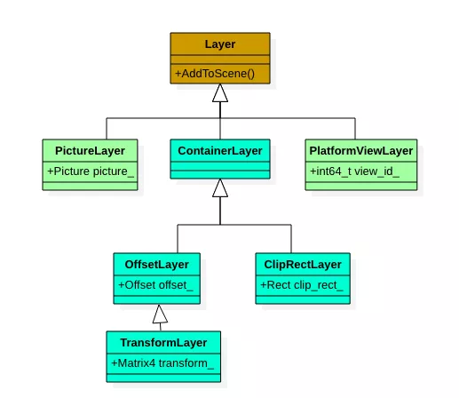

## 前言

Flutter 作为一个跨平台的应用框架，诞生之后，就被高度关注。它通过自绘 UI ，解决了之前 RN 和 weex 方案难以解决的多端一致性问题。Dart AOT 和精减的渲染管线，相对与 JavaScript 和 webview 的组合，具备更高的性能体验。


## Flutter UI Pipeline

整个 Flutter 的 UI 生成以及渲染完成主要分下面几个步骤：


这里先抛开细节，纯粹从渲染业务角度来理解

* 1-3: 借鉴其他平台的实现方法，首先使用UI树来描述完整的UI或者局部的UI，就是这里的从WidgetTree-ElementTree-RenderObject Tree的概念，从功能实现上是一致的
* 4 Layou：即决定控件放置的位置和控件的Size

* 5 Paint：即决定控件的样子，如一行文本、一张图片，一个带阴影的Button等，Paint操作通过调用Canvas API来完成，最终生成一组描画命令集
* 7 Raster：光栅化，即执行描画命令，生成像素级的位图(物理上用一块Buffer/内存)来存储
* 8 Compositor：合成，上面7 Raster生成的一块位图数据，专业术语成为图层，图层之间执行像素级的位操作，合成最终画面。比如播放器画面的Video画面和操作按钮，一帧Video画面为一个图层，操作按钮的画面为另外一个图层，执行两个图层的合成操作，将最终合成的数据送至显示屏显示。


## 1-3 Flutter的 三棵树

要弄懂Flutter的渲染管线，首先要弄清楚Flutter的三棵树设计。
Flutter 视图树包含了三颗树：WidgetTree、Element Tree、RenderObject Tree

- **Widget Tree**: 存放页面组件渲染用数据的配置内容、它使用Dart语言来定义一个嵌套的数据结构，使用Child/Children参数来静态定义Widget树结构，使用省略new的对象构造方法实现了非常清晰的静态配置Widget树。Widget树的创建等价于build函数的调用过程，所以创建Widget过程是非常轻量化的，在页面刷新的过程中随时会重建页面整个Widget树或者Widget子树
- **Element Tree**: Element是Widget和RenderObject之间的桥，是管理用的数据结构，它同时持有 Widget 和 RenderObject，它存放上下文信息，通过上下文信息来遍历视图树；Element及其子类定义并实现了何时使用Widget的配置信息来构建/更新 RenderObject及其子树的通用处理流程，这一处理流程最终将生成用于渲染的RenderObject树
- **RenderObject Tree**: 根据 Widget 树的配置数据，填充RenderObject的布局属性、渲染属性，RenderObject使用这些属性来执行 layout，paint ，生成渲染数据，提交给FlutterEngine。


从创建到渲染的大体流程是：根据 Widget 生成 Element，然后创建相应的 RenderObject 并关联到 Element.renderObject 属性上，最后再通过 RenderObject 来完成布局排列和绘制。

例如下面这段布局代码

``` dart
Container(      
	color: Colors.blue,      
	child: Row(        
		children: <Widget>[
      Image.asset('image'),
      Text('text'),
    ],
  ),
);
```

对应三棵树的结构如下图


了解了这三棵树，我们再来看下页面刷新的时候具体做了哪些操作

当需要更新 UI 的时候，Framework 通知 Engine，Engine 会等到下个 Vsync 信号到达的时候，会通知 Framework 进行 animate, build，layout，paint，最后生成 layer 提交给 Engine。Engine 会把 layer 进行组合，生成纹理，最后通过 Open Gl 接口提交数据给 GPU， GPU 经过处理后在显示器上面显示，如下图：


结合前面的例子，如果 text 文本或者 image 内容发生变化会触发哪些操作呢？

Widget 是不可改变，需要重新创建一颗新树，build 开始，然后对上一帧的 element 树做遍历，调用他的 updateChild，看子节点类型跟之前是不是一样，不一样的话就把子节点扔掉，创造一个新的，一样的话就做内容更新，对 renderObject 做 updateRenderObject 操作，updateRenderObject 内部实现会判断现在的节点跟上一帧是不是有改动，有改动才会别标记 dirty，重新 layout、paint，再生成新的 layer 交给 GPU，流程如下图：


整理build重建了Widget子树，Element的updateChild通过比对的方式更新/部分重建Element子树的同时，更新/部分重新了Render子树。然后将Render子树提交给Flutter的RenderLayer做重新Layout和paint，最终RenderLayer将Paint的结果以LayerTree的方式提交给FlutterEngine来调度GPU执行渲染。


> Flutter 三棵树主要用于管理 UI 组件生命周期，页面结构，其基础是Flutter Framework中的Render Layer，Flutter Framework中的Widgets Layer提供给用户一个Widget的声明式UI编程接口。在Vsync的驱动下，通过对三棵树的构建和管理，构建出RenderLayer的所需的RenderObjectTree，后续由Render Layer负责将RenderObject Tree 实施布局和描画操作。


## 渲染引擎分析


### 线程模型

要了解 Flutter 的渲染管线，必须要先了解 Flutter 的线程模型。从渲染引擎的视角来看，Flutter 的四个线程的职责如下：


- **Platform 线程**： 负责提供 Native 窗口，作为 GPU 渲染的目标。接受平台的 VSync 信号并发送到 UI 线程，驱动渲染管线运行。
- **UI 线程**： 受Platform线程的Vsync信号触发，主要是负责在 Flutter framework 中 Widget/Element/RenderObject 三颗树的生成以及承载绘制指令的 LayerTree 的创建，Dart VM 管理。同时负责把承载渲染指令的 LayerTree 通过Window透传给FlutterEngine的C++代码中，在Flutter Engine层提交给 GPU 线程去光栅化。可以认为是整个渲染流程的前半部，属于生产者角色。
- **GPU 线程**：负责完成UI Pipeline中的 Raster(光栅化)和Compositor(合成)工作，其接收来自UI线程生成的LayerTree，通过 flow 模块来实现光栅化并调用底层渲染 API（opengl/vulkan/meta），合成并输出到屏幕。可以认为是整个渲染流程的后半部，属于消费者角色。
- **IO 线程**： 包括若干 worker 线程会去请求图片资源并完成图片解码，之后在 IO 线程中生成纹理并上传 GPU ，由于通过和 GPU 线程共享 EGL Context，在 GPU 线程中可以直接使用 IO 线程上传的纹理，通过并行化，提高渲染的性能

后面介绍的概念都会贯穿在这四个线程当中，关于线程模型的更多信息可以参考下面两篇文章:

[《深入了解 Flutter 引擎线程模型》](https://mp.weixin.qq.com/s?__biz=MzU4MDUxOTI5NA==&mid=2247483834&idx=1&sn=a102ffba8de83bb69c84f1f692294b9e&scene=21#wechat_redirect)

《The Engine architecture》链接见文末


下图为 Android 平台上渲染一帧 Flutter UI 的运行时序图：


具体的运行时步骤：


1. flutter 引擎启动时，向系统的 Choreographer 实例注册接收 Vsync 的回调。
2. 平台侧发出 Vsync 信号后，上一步注册的回调被调用，一系列调用后，执行到 VsyncWaiter::fireCallback。
3. VsyncWaiter::fireCallback 实际上会执行 Animator 类的成员函数 BeginFrame。
4. BeginFrame 经过一系列调用执行到 Window 的 `BeginFrame`，Window 实例是连接底层 Engine 和 Dart framework 的重要桥梁，基本`所有跟平台相关的操作都会由 Window 实例来串联`，包括事件，渲染，无障碍等。
5. 通过 Window 的 BeginFrame 调用到 Dart层 Framework 的 RenderBinding 类，其有一个方法叫 `drawFrame` ，这个方法会去驱动Framework构建/局部构建三棵树，并标记RenderObject Tree的dirty 节点，之后对dirty节点进行Layout和Paint，如果遇到图片的显示，会丢到 IO 线程以及去 worker 线程去执行图片加载和解码，解码完成后，再次丢到 IO 线程去生成图片纹理，由于 IO 线程和 GPU 线程是 share GL context 的，所以在 IO 线程生成的图片纹理在 GPU 线程可以直接被 GPU 所处理和显示。
6. Dart 层绘制所产生的绘制指令以及相关的渲染属性配置都会存储在 LayerTree 中，通过 Animator::`RenderFrame` 把 LayerTree 提交到 GPU 线程，`GPU 线程`拿到` LayerTree` 后，进行光栅化并做上屏操作（关于 LayerTree 我们后面会详细讲解）。之后通过 Animator::RequestFrame 请求接收系统下一次的 Vsync 信号，这样又会从第 1 步开始，循环往复，驱动 UI 界面不断的更新。


分析了整个 Flutter 底层引擎总体运行流程，下面会相对详细的分析上述渲染流水线中涉及到的相关概念以及细节知识，大家可以根据自己的情况选择性的阅读。

### VSync

Flutter 引擎启动时，向系统的 Choreographer 实例注册接收 Vsync 的回调函数，GPU 硬件发出 Vsync 后，系统会触发该回调函数，并驱动 UI 线程进行 layout 和绘制。


```java
@ shell/platform/android/io/flutter/view/VsyncWaiter.java   
  private final FlutterJNI.AsyncWaitForVsyncDelegate asyncWaitForVsyncDelegate = new FlutterJNI.AsyncWaitForVsyncDelegate() {        
  @Override        
  public void asyncWaitForVsync(long cookie) {
    Choreographer.getInstance().postFrameCallback(new Choreographer.FrameCallback() {
      @Override                
      public void doFrame(long frameTimeNanos) {                    
        float fps = windowManager.getDefaultDisplay().getRefreshRate();  
        long refreshPeriodNanos = (long) (1000000000.0 / fps);   
        FlutterJNI.nativeOnVsync(frameTimeNanos, frameTimeNanos + refreshPeriodNanos, cookie);                
      }            
    });        
  }    
};
```


下图为 Vsync 触发时的调用栈：


在 Android 上，Java 层收到系统的 Vsync 的回调后通过 JNI 发给 Flutter engine，之后通过 Animator,Engine 以及 Window 等对象路由调回 dart 层，驱动 dart 层进行 drawFrame 的操作。在 Dart framework 的 RenderingBinding::drawFrame 函数中会触发对所有 dirty 节点的 layout/paint/compositor 相关的操作,之后生成 LayerTree，再交由 Flutter engine 光栅化并合成。

```dart
 //@widgets/binding.dart 
	void drawFrame() {
		try {
      if (renderViewElement != null)
        buildOwner!.buildScope(renderViewElement!);//这里重建/更新三棵树
      super.drawFrame(); //这里drawFrame因为mixin的机制，会调用到rendering/binding的drawFrame
      buildOwner!.finalizeTree();
    } finally {
      assert(() {
        debugBuildingDirtyElements = false;
        return true;
      }());
    }
  }
```


```dart
//@rendering/binding.dart
void drawFrame() {    
  assert(renderView != null);    
  pipelineOwner.flushLayout();    
  pipelineOwner.flushCompositingBits();    
  pipelineOwner.flushPaint();    
  renderView.compositeFrame(); // this sends the bits to the GPU  
  pipelineOwner.flushSemantics(); // this also sends the semantics to the OS.  
}
```


### 图层

在 Dart 层进行 drawFrame 对 dirty 节点进行Layout后，就会对需要重新绘制的节点进行Paint操作。而我们知道 Flutter 中 widget 是一个 UI 元素的抽象描述，绘制时，需要先将其 inflate 成为 Element，之后生成对应的 RenderObject 来负责驱动渲染。通常来讲，一个页面的所有的 RenderObject 都属于一个图层，Flutter 本身没有图层的概念，这里所说的`图层`可以粗暴理解成一块`内存 buffer`，所有属于图层的 RenderObject 都应该被绘制在这个图层对应的 buffer 中去，这种情况UI界面整体生成一个图层，供后续的Compositor来合成。


如果这个 RenderObject 的 `RepaintBoundary` 属性为` true` 时，就会额外生成一个图层，其所有的子节点都会被绘制在这个新的图层上，最后所有图层有 GPU 来负责合成并上屏。


在Flutter中，一个图层的RenderObject经过Paint操作，形成一个LayerTree，在合成阶段，执行的是LayerTree的合AddToScene操作(包括子树的合成)，最终合成出一个Picture对象，这个Picture对象记录了所有的描画OP和参数，作为合成的结果传递给GPU线程去做Raster。

LayerTree由一个或者多个Layer组成，所以Layer 和图层存在 N：1 的对应关系。根节点 RenderView 会创建 root Layer，是一个 Transform Layer，通过递归遍历渲染树，递归调用渲染树中的RenderObject的paint函数，调查后有三种场景：

* 如RenderParagraph渲染对象的Paint函数中将获取Canvas对象，执行特定的描画动画，此时会创建PictureLayer，并将PictureLayer和父Layer建立连接
* RenderFlex(布局)渲染对象的Paint函数什么都不做，会继续遍历Child的Paint函数
* RenderPhysicalModel渲染对象的Paint函数，会创建一个新的Layer，作为阴影Layer，并创建新的图层(新的PaintContext)，其Child会在此图层上继续描画，直到某个Render**对象创建了新的Layer或者所有的Child节点描画结束。


参考下面 Layer 的类图，Layer 实际上主要用来`组织和存储渲染相关的指令和参数`，比如 Transform Layer 用来保存图层变换的矩阵，ClipRectLayer 包含图层的剪切域大小，PlatformViewLayer 包含同层渲染组件的纹理 id，PictureLayer 包含 SkPicture(SkPicture 记录了 SkCanvas 绘制的指令，在 GPU 线程的光栅化过程中会用它来做光栅化)





Flutter使用Canvas向用户提供了熟悉的绘制API，其本质上是PictureRecorder，即记录用户的绘制OP和参数，结束Canvas绘制之后，会生成SkPicture对象，并将其保存到PictureLayer中。将图像的变换操作抽象为ContainerLayer及其子类，二类Layer形成LayerTree供合成步骤使用。详细的参考[Layer解析.md](file:///Users/wanghw/Documents/ProjectAssets/blog_local/Flutter/63.Layer%E8%A7%A3%E6%9E%90.md)


### 渲染指令

当渲染第一帧的时候，会从根节点 RenderView 开始，逐个遍历所有的子节点进行绘制操作。

```dart
//@rendering/view.dart //绘制入口，从view根节点开始，逐个绘制所有子节点
@override  
void paint(PaintingContext context, Offset offset) {    
  if (child != null)      
    context.paintChild(child, offset);  
}
```

我们可以具体看看一个节点如何绘制的：

**1. 创建 Canvas。** 绘制时会通过 PaintContex 获取的 Canvas 进行，其内部会去创建一个 PictureLayer，并通过 ui.PictrureRecorder 调用到 C++层来创建一个 Skia 的 SkPictureRecorder 实例，再通过 SkPictureRecorder 创建 SkCanvas，最后把这个 SkCanvas 返回给 Dart 层去使用.

```dart
//@rendering/object.dart  
	@override  
	Canvas get canvas {    
		if (_canvas == null)      
			_startRecording();    
		return _canvas;  }
  void _startRecording() {    
  	assert(!_isRecording);    
  	_currentLayer = PictureLayer(estimatedBounds);    
  	_recorder = ui.PictureRecorder();    
  	_canvas = Canvas(_recorder); 
  	_containerLayer.append(_currentLayer);  
  }
```


**2.通过 Canvas 执行具体绘制。** Dart 层拿到绑定了底层 SkCanvas 的对象后，用这个 Canvas 进行具体的绘制操作，这些绘制命令会被底层的 SkPictureRecorder 记录下来。


**3.结束绘制，准备上屏。** 绘制完毕时，会调用 Canvas 对象的 stopRecordingIfNeeded 函数，它会最后会去调用到 C++的 SkPictureRecorder 的 endRecording 接口来生成一个 Picture 对象，存储在 PictureLayer 中。

```dart
//@rendering/object.dart   
	void stopRecordingIfNeeded() {    
		if (!_isRecording)      
			return;    
		_currentLayer.picture = _recorder.endRecording();    
		_currentLayer = null;    
		_recorder = null;    
		_canvas = null;  
	}
```

这个 Picture 对象对应 Skia 的 SkPicture 对象，存储这所有的绘制指令。有兴趣可以看一下 SkPicture 的官方说明。


所有的 Layer 绘制完成形成 LayerTree，在 renderView.compositeFrame()中通过 SceneBuilder 把 Dart Layer 映射为 flutter engine 中的 flow::Layer,同时也会生成一颗 C++的 flow::LayerTree，存储在 Scene 对象中，最后通过 Window 的 render 接口提交给 Flutter engine。

```
//@rendering/view.dart
	void compositeFrame() {    
		...      
		final ui.SceneBuilder builder = ui.SceneBuilder();      
		final ui.Scene scene = layer.buildScene(builder);
		_window.render(scene);      
		scene.dispose();  
	}
```

在全部绘制操作完成后，在 Flutter engine 中就形成了一颗 flow::LayerTree，应该是像下面的样子:


这颗包含了所有绘制信息以及绘制指令的 flow::LayerTree 会通过 window 实例调用到 Animator::Render 后，最后在 Shell::OnAnimatorDraw 中提交给 GPU 线程，并进行光栅化操作,代码可以参考：

@shell/common/animator.cc/Animator::Render
@shell/common/shell.cc/Shell::OnAnimatorDraw

这里提一下 flow 这个模块，flow 是一个基于 skia 的合成器，它可以基于渲染指令来生成像素数据。Flutter 基于 flow 模块来操作 Skia，进行光栅化以及合成。


### 光栅化与合成

把绘制指令转化为像素数据的过程称为光栅化，把各图层光栅化后的数据进行相关的叠加与特效相关的处理成为合成这是渲染后半段的主要工作。

前面也提到过，生成 LayerTree 后，会通过 Window 的 Render 接口把它提交到 GPU 线程去执行光栅化操作，大体流程如下：


1-4 步，在 UI 线程执行，主要是通过 Animator 类把 LayerTree 提交到 Pipeline 对象的渲染队列，之后通过 Shell 把 pipeline 对象提交给 GPU 线程进行光栅化，不具体展开，代码在 animator.cc&pipeline.h


5-6 步，在 GPU 线程执行具体的光栅化操作。这部分主要分为两大块，一块是 Surface 的管理。一块是如何把 Layer Tree 里面的渲染指令绘制到之前创建的 Surface 中。

可以通过下图了解一下 Flutter 中的 Surface，不同类型的 Surface，对应不同的底层渲染 API。


我们以 GPUSurfaceGL 为例，在 Flutter 中，GPUSurfaceGL 是对 Skia GrContext 的一个管理和封装，而 GrContext 是 Skia 用来管理 GPU 绘制的一个上下文，最终都是借助它来操作 OpenGL 的 API 进行相关的上屏操作。在引擎初始化时，当 FlutterViewAndroid 创建后，就会创建 GPUSurfaceGL，在其构造函数中会同步创建 Skia 的 GrContext。


光栅化主要是在函数 Rasterizer::DrawToSurface 中实现的：


```cpp
//@shell/rasterizer.cc
RasterStatus Rasterizer::DrawToSurface(flutter::LayerTree& layer_tree) { 
  FML_DCHECK(surface_);  
  ...   
    if (compositor_frame) {    
    //1.执行光栅化    
    RasterStatus raster_status = compositor_frame->Raster(layer_tree, false);    
    if (raster_status == RasterStatus::kFailed) {      
      return raster_status;    
    }    
    //2.合成    
    frame->Submit();    
    if (external_view_embedder != nullptr) {      
       external_view_embedder->SubmitFrame(surface_->GetContext());    }    
    //3.上屏    
    FireNextFrameCallbackIfPresent();
    if (surface_->GetContext()) {      
      surface_->GetContext()->performDeferredCleanup(kSkiaCleanupExpiration);    
    }
  	return raster_status;  
 }
  return RasterStatus::kFailed;
}
```

光栅化完成后，执行 frame->Submit()进行合成。这会调用到下面的 PresentSurface，来把 offscreen_surface 中的内容转移到 onscreen_canvas 中，最后通过 GLContextPresent()上屏。

```cpp
//@shell/GPU/gpu_surface_gl.ccbool 
GPUSurfaceGL::PresentSurface(SkCanvas* canvas) {
	...  
	if (offscreen_surface_ != nullptr) {    
		SkPaint paint;    
		SkCanvas* onscreen_canvas = onscreen_surface_->getCanvas();
		onscreen_canvas->clear(SK_ColorTRANSPARENT);    
		// 1.转移offscreen surface的内容到onscreen canvas中    
		onscreen_canvas->drawImage(
			offscreen_surface_->makeImageSnapshot(), 0, 0, &paint);  
		}  
	{    
	//2. flush 所有绘制命令    
	onscreen_surface_->getCanvas()->flush();  }   
	//3 上屏  
	if (!delegate_->GLContextPresent()) {
   	return false;  
  }  
  ...  
  return true;}
```


GLContextPresent 接口代码如下，实际上是调用的 EGL 的 eglSwapBuffers 接口去显示图形缓冲区的内容。


```cpp
//@shell/platform/android/android_surface_gl.cc
bool AndroidSurfaceGL::GLContextPresent() {  
  FML_DCHECK(onscreen_context_ && onscreen_context_->IsValid());  
  return onscreen_context_->SwapBuffers();}
```


上面代码段中的 onscreen_context 是 Flutter 引擎初始化的时候，通过 setNativeWindow 获得。主要是把一个 Android 的 SurfaceView 组件对应的 ANativeWindow 指针传给 EGL，EGL 根据这个窗口，调用 eglCreateWindowSurface 和显示系统建立关联，之后通过这个窗口把渲染内容显示到屏幕上。


代码可以参考：

@shell/platform/android/android_surface_gl.cc/AndroidSurfaceGL::SetNativeWindow

总结以上渲染后半段流程，就可以看到 LayerTree 中的渲染指令被光栅化，并绘制到 SkSurface 对应的 Surface 中。这个 Surface 是由 AndroidSurfaceGL 创建的一个 offscreen_surface。再通过 PresentSurface 操作，把 offscreen_surface 的内容，交换到 onscreen_surface 中去，之后调用 eglSwapSurfaces 上屏，结束一帧的渲染。

> 这一段内容和最新的FlutterEngine代码有差异，未按照最新的代码整理。为了更好的理解这一片段内容，调查整理了64.Skia概要说明及渲染原理.md资料，可结合最新代码相互印证理解。


### 图片纹理

前面讲线程模型的时候，我们提到过 IO 线程负责图片加载以及解码并且把解码后的数据上传到 GPU 生成纹理，这个纹理在后面光栅化过程中会用到，我们来看一下这部分的内容。AssetBundleImageProvider


UI 线程加载图片的时候，会在 IO 线程调用 InstantiateImageCodec*函数调用到 C++层来初始化图片解码库，通过 skia 的自带的解码库解码生成 bitmap 数据后，调用 SkImage::MakeCrossContextFromPixmap 来生成可以在多个线程共享的 SkImage，在 IO 线程中用它来生成 GPU 纹理。


```cpp
//@flutter/lib/ui/painting/codec.cc
sk_sp<SkImage> MultiFrameCodec::GetNextFrameImage(    fml::WeakPtr<GrContext> resourceContext) {  ...  // 如果resourceContext不为空，就会去创建一个SkImage，  // 并且这个SkImage是在resouceContext中的，  if (resourceContext) {    SkPixmap pixmap(bitmap.info(), bitmap.pixelRef()->pixels(),                    bitmap.pixelRef()->rowBytes());    // This indicates that we do not want a "linear blending" decode.    sk_sp<SkColorSpace> dstColorSpace = nullptr;    return SkImage::MakeCrossContextFromPixmap(resourceContext.get(), pixmap,                                               false, dstColorSpace.get());  } else {    // Defer decoding until time of draw later on the GPU thread. Can happen    // when GL operations are currently forbidden such as in the background    // on iOS.    return SkImage::MakeFromBitmap(bitmap);  }}
```


我们知道，OpenGL 的环境是线程不安全的，在一个线程生成的图片纹理，在另外一个线程里面是不能直接使用的。但由于上传纹理操作比较耗时，都放在 GPU 线程操作，会减低渲染性能。目前 OpenGL 中可以通过 share context 来支持这种多线程纹理上传的，所以目前 flutter 中是由 IO 线程做纹理上传，GPU 线程负责使用纹理。


基本的操作就是在 GPU 线程创建一个 EGLContextA，之后把 EGLContextA 传给 IO 线程，IO 线程在通过 EGLCreateContext 在创建 EGLContextB 的时候，把 EGLContextA 作为 shareContext 的参数，这样 EGLContextA 和 EGLContextB 就可以共享纹理数据了。


具体相关的代码不一一列举了，可以参考：


@shell/platform/android/platform_view_android.cc/CreateResourceContext


@shell/platform/android/android_surface_gl.cc/ResourceContextMakeCurrent


@shell/platform/android/android_surface_gl.cc/AndroidSurfaceGL


@shell/platform/android/android_surface_gl.cc/SetNativeWindow


关于图片加载相关流程，可以参考这篇文章：TODO


## 参考资料


1. [复杂业务如何保证 Flutter 的高性能高流畅度](https://www.infoq.cn/article/NSTM1hTJWZzcJHZwouPJ) ：参考了三棵树的介绍部分

2. [超详解析 Flutter 渲染引擎 | 业务想创新，不了解底层原理怎么行](https://www.infoq.cn/article/c6qVm6bKcTTNf64faCJm)：整体框架未变更，增加了更多的细节