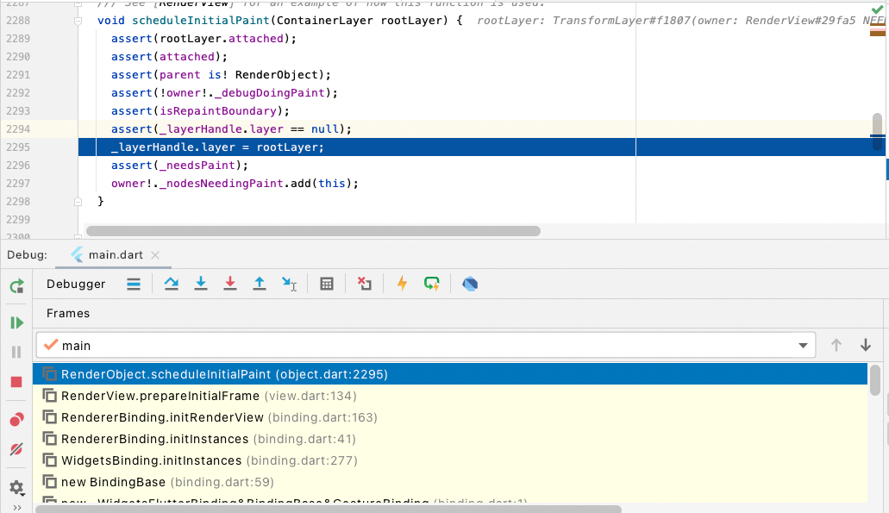
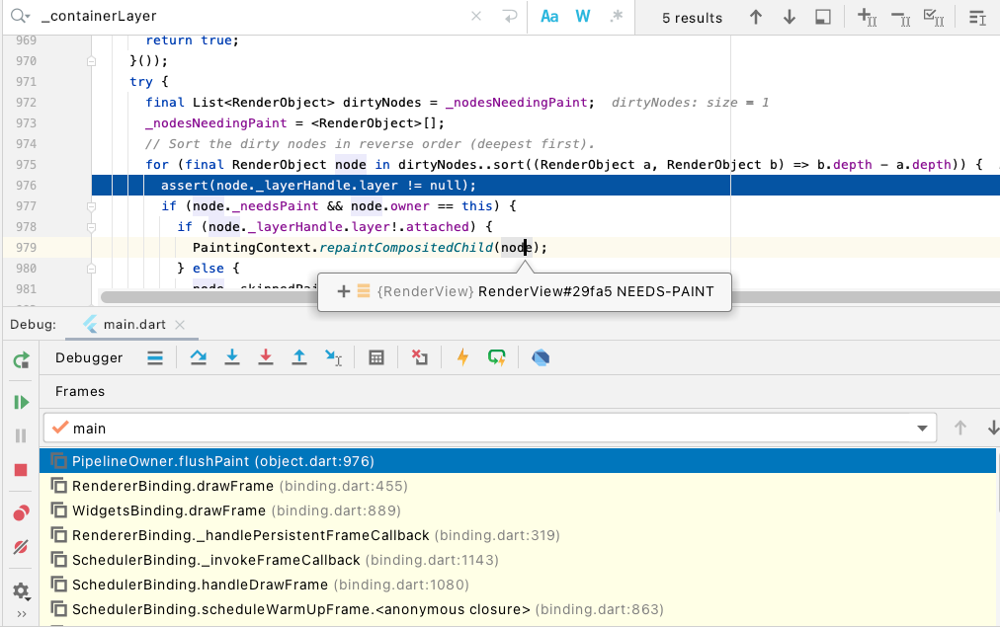
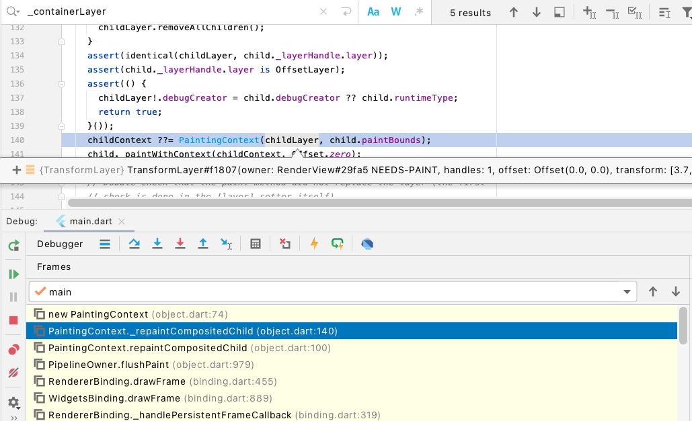
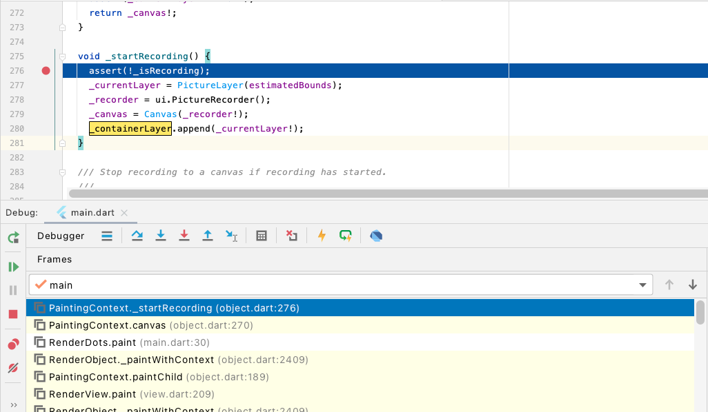
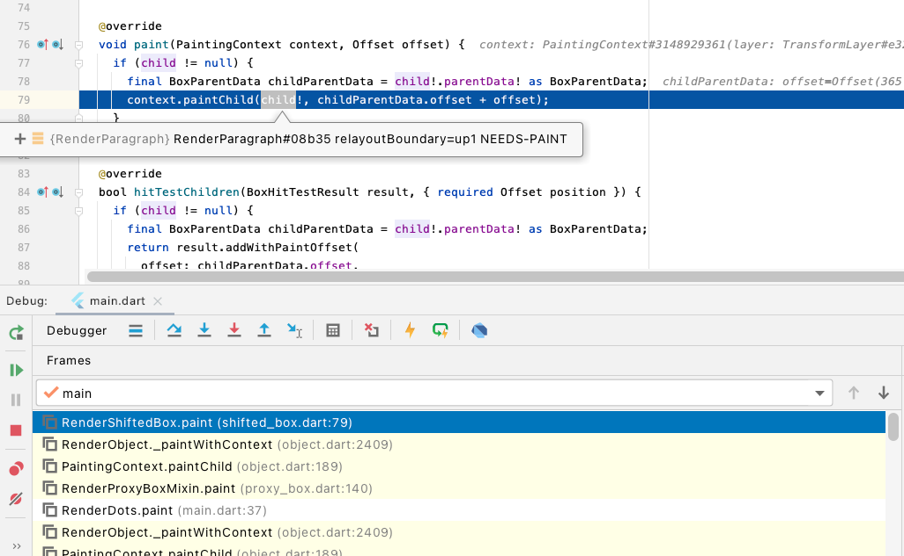
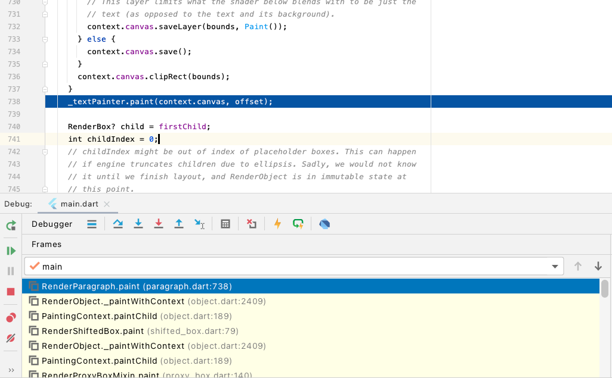
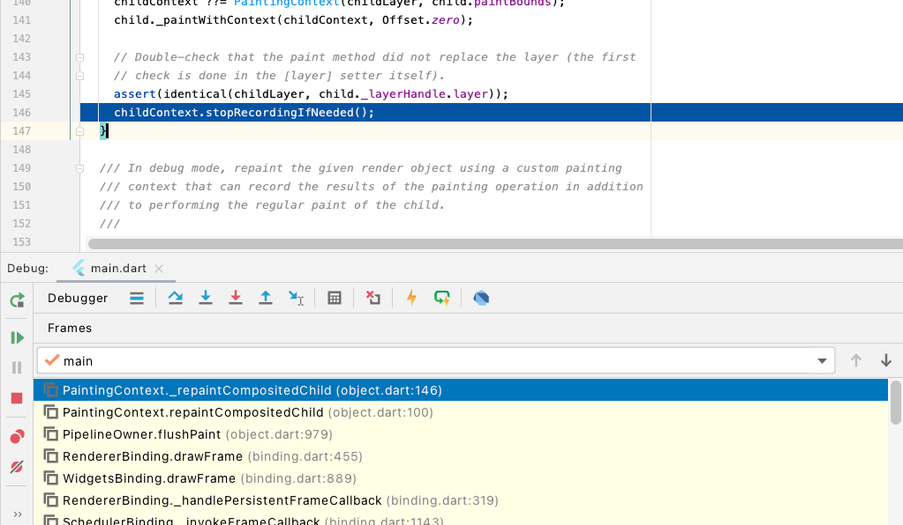

[TOC]


## RenderTree的处理过程追踪

### Step1: 初始化渲染树根节点，并配置根节点的rootLayer、并将根节点添加到dirtyList

RenderView是默认的渲染树的Root，在rendering/binding初始化的时候，构建了TransformLayer(ContainerLayer的子类)作为rootLayer。同时将RenderView这一渲染树的根Node添加到dirtyList中。




### Step2: 从dirtyList中找到根节点，触发根节点的Paint动作

在渲染树构建完毕后，在rendering/binding的drawFrame函数中，执行Layout、Paint、Compositor动作。

这里从flushPaint函数开始查看，其从dirtyList中找到渲染树根节点，执行Paint动作




### Step3: 使用根节点的rootLayer为参数，构建此渲染树的PaintContext

根节点描画过程中，取得渲染树根节点的rootLayer(图中的childLayer)，构建PaintContext。然后使用这一新的PaintContext对象为上下文环境，调用根节点(RenderView)的paintWithContext函数，执行具体的描画工作





### Step4：执行根节点的Paint... 具体为触发Child的Paint

RenderView因为是根容器，所以自身没有外观显示要求，只是调用child的描画函数。

同时这里的context，就是上一步构建的PaintContext对象，也就是说如果没有例外，由此根节点开始所有的子节点都使用这个PaintContext对象，但是如果后续调用的child对象是RepaintBoundary，这个时候，以RepaintBoundary为根节点，会再次构建一个subRootLayer，进而使用subRootLayer构建一个PaintContext对象。

```dart
  @override
  void paint(PaintingContext context, Offset offset) {
    if (child != null)
      context.paintChild(child!, offset);
  }

```


### Step5：Child为RenderDots，其Paint函数要执行Canvas描画，所以为此渲染树构建PictureLayer并生成Canvas对象

RenderDots的Paint函数如下图所示，这里的Context就是以根节点的rootLayer来配置的PaintContext对象。RenderDots是有具体的UI显示内容的，所以需要用到canvas，下面看canvas的实现

```dart
@override
    void paint(PaintingContext context, Offset offset) {
        final Canvas canvas = context.canvas;
        canvas.drawRect(offset & size, Paint()..color = const Color(0xFF0000FF));

        final Paint paint = Paint()..color = const Color(0xFF00FF00);
        for (final Offset point in _dots.values)
            canvas.drawCircle(point, 50.0, paint);

        super.paint(context, offset);
    }
```


如果本PaintContext没有创建过Canvas，则新创建Canvas，如果已经存在了，就返回已经创建的Canvas，所以一个PaintContext只有一个Canvas。Canvas使用Flutter Engine的PictureRecorder构建出来，记录用户使用Canvas接口的描画OP和参数。在stopRecordingIfNeeded的时候，将Canvas记录的所有描画OP和参数信息记录到PictureLayer的Picture对象上。

```dart
@override
  Canvas get canvas {
    if (_canvas == null)
      _startRecording();
    assert(_currentLayer != null);
    return _canvas!;
  }

  void _startRecording() {
    assert(!_isRecording);
    _currentLayer = PictureLayer(estimatedBounds);
    _recorder = ui.PictureRecorder();
    _canvas = Canvas(_recorder!);
    _containerLayer.append(_currentLayer!);
  }
```

这里是调用堆栈，供上述参考用。



### Step6：RenderDots自身Paint

```dart
@override
    void paint(PaintingContext context, Offset offset) {
        final Canvas canvas = context.canvas;
        canvas.drawRect(offset & size, Paint()..color = const Color(0xFF0000FF));

        final Paint paint = Paint()..color = const Color(0xFF00FF00);
        for (final Offset point in _dots.values)
            canvas.drawCircle(point, 50.0, paint);

        super.paint(context, offset); // 由此开始子节点的描画
    }
```

### Step7：开始RenderDots子节点的Paint(RenderShiftedBox)

RenderShiftedBox为Center容器的RenderObject，所以其自身也没有任何UI显示特征，这里使用Layout阶段计算出的Offset偏移值来实施Child(RenderParagraph)的Paint动作




### Step8：RenderParagraph Paint

RenderParagraph是有UI显示内容的，所以这里需要获取context.canvas。因为此时并未生成新的PaintContext，所以此时仍然使用基于根节点的rootLayer生成的PaintContext，则canvas已经在RenderDots Paint的时候创建完成，此时继续复用此Canvas对象。



### Step9：基于渲染树的Paint动作递归完成，完成了根节点及其子树的渲染，保存所有动作结果



使用PictureRecord的endRecording函数生成Picture，并将其保存到PictureLayer中

```dart
	void stopRecordingIfNeeded() {
    if (!_isRecording)
      return;
    _currentLayer!.picture = _recorder!.endRecording();
    _currentLayer = null;
    _recorder = null;
    _canvas = null;
  }
```


---


## WidgetTree-RenderTree-LayerTree的映射关系

### WidgetTree：

```dart
    runApp(
        const Directionality(
            textDirection: TextDirection.ltr,
            child: Dots(
                child: Center(
                    child: Text('Touch me!'),
                ),
            ),
        ),
    );
```
### RenderObjectTree

RenderView(系统默认根节点)                -->TransformLayer  -> PictureLayer
	->RenderDots						-->layer==null		 Dots的RenderObject
		->RenderPostionedBox  -->layer==null     Center的RenderObject
			->RenderParagraph  	-->layer==null     Text的RenderObject

### LayerTree

TransformLayer  
	-> PictureLayer


## 几个重要的概念：

### PictureLayer

这个是LayerTree上的叶子节点，当StartRecording的时候，创建Canvas的同时，需要创建PictureLayer

```dart
  void _startRecording() {
    assert(!_isRecording);
    _currentLayer = PictureLayer(estimatedBounds);
    _recorder = ui.PictureRecorder();
    _canvas = Canvas(_recorder!);
    _containerLayer.append(_currentLayer!);
  }
```

ContainerLayer就是在创建canvas的时候，传入的参数。也就是说，这个 ContainerLayer 是一个ParentLayer,不管是否是每一个文字/图片的renderObject是否会各自生成独立的PictureRecord，都能保证PictureRecord是一个叶子节点，而且连接到ParentLayer上。

PictureRecord的概念等同于安卓上的DisplayListCanvas


### RepaintBoundary

Flutter上定义了一个RepaintBoundary，这个会产生一个OffsetLayer，OffsetLayer其提升效率的地方在于整个Layer都是可以复用的，当重新刷新时会判断是否需要重画，如果不需要重画，就会直接重用Layer的结果，仅仅是调整Offset。

上述Flutter的渲染树的根就是一个RepaintBundary。所以也会产生一个OffsetLayer。为什么要有一个OffsetLayer，因为Skia支持作为一个图层的迁移操作，能够高效的完成这个动作。


### 一些特效Layer

除了OffsetLayer，flutter还支持一些特效，比如透明、ImageFilter、Colorfilter、BackdropFilter，这些Layer都由特定的RenderObject来创建，而RenderObject是由Widget配置信息来生成的，所以，从应用的角度，就是使用了ImageFilter的Widget，这个Widget的所有Child都会受到ImageFilter的影响。从实现上如果设置了一个ImageFilter Layer，则此Layer下的子节点都会应用这个ImageFilter效果。


### PaintContext

Flutter并没有同android一样，采用将canvas的方式传到每个RenderObject，而是传递了PaintContext，其中PaintContext中包装了Canvas,之所以要这么做，是因为PaintContext还能支持创建OffsetLayer、ImageFilterLayer等动作。

至于PaintContext是不是每个叶子节点都会重新创建一个PictureRecord，还是几个Widget叶子节点都会共用一个PictureRecord，目前没有定论。遇到问题的时候再查。

### ContainerLayer

Flutter使用ContainerLayer为界限，将本ContainerLayer下的所有子节点，执行用户自定义的paint/默认的Paint函数，实现了将用户自定义的描画操作转化为使用PictureRecord记录的canvas-op。然后将这些OP记录下来生成一个Scene。

### Scene

一个Flutter的用户界面可能会生成好几个Scene，这主要受到两个因素影响：

1）是否使用了OffsetLayer/TransformLayer,也就是说在应用开发层面是否使用了RepaintBoundary

2）是否使用了ImageFilter/ColorFilter等特效Widget，如果应用了这些Widget，则会将其下的所有widget对应的RenderObject都渲染到以ImageFilter/ColorFilter等特效Layer里面。最终生成scene。

一个Scene是有一个builder来构建的，builder依赖rootLayer(可以是一个子树的layer)，builde scene的过程就是遍历layerTree的过程。也就是遍历LayerTree，将PictureLayer、OffsetLayer、ImageFilterLayer中的所有op都记录到scene中。


> 通篇看下来，和已知的Android相对比，有如下的几点认识：
>
> 1. 安卓的ViewTree和flutter的渲染树实现的功能、抽象层次都是一致的；每个节点都有事件处理、Layout、Paint处理过程。
> 2. 安卓的RenderNodeTree和Flutter的LayerTree是思想相似的，在安卓中每个ViewNode保存了一个RenderNode，而Flutter中每个RenderObject可能会创建一个Layer，也可能不创建。在具体描画的时候，会生成PictureRecord(和DisplayListCanvas等同)
> 3. Flutter运行在UI线程，安卓是运行在UI主线程，安卓向渲染线程(HWUI)提交RenderNodeTree-每个RenderNode都保留了Paint完成后生成的DisplayList；Flutter向渲染提交由LayerTree build生成的scene。每个scene记录了所有的op(PictureRecord或者其他OP--Offset等)
> 4. 不同的地方目前看到的是：Flutter中的RenderObject(和安卓中的View对比)，并不是每个RenderObject都会生成PictureRecorde。这个可能后续会有修正。
> 5. 渲染线程和HWUI做的事情差不多。都是使用独立的线程来做，都是依赖Skia和EGL来实现Surface控制和描画动作，都是提供了一个渲染管线的实现，都是使用了DisplayList(Flutter最新版默认使用了DisplayList来实现)。


---


参考  

```dart
// Copyright 2014 The Flutter Authors. All rights reserved.
// Use of this source code is governed by a BSD-style license that can be
// found in the LICENSE file.

import 'package:flutter/rendering.dart';
import 'package:flutter/widgets.dart';

class RenderDots extends RenderConstrainedBox {
    RenderDots() : super(additionalConstraints: const BoxConstraints.expand());

    // Makes this render box hittable so that we'll get pointer events.
    @override
    bool hitTestSelf(Offset position) => true;

    final Map<int, Offset> _dots = <int, Offset>{};

    @override
    void handleEvent(PointerEvent event, BoxHitTestEntry entry) {
        if (event is PointerDownEvent || event is PointerMoveEvent) {
            _dots[event.pointer] = event.position;
            markNeedsPaint();
        } else if (event is PointerUpEvent || event is PointerCancelEvent) {
            _dots.remove(event.pointer);
            markNeedsPaint();
        }
    }

    @override
    void paint(PaintingContext context, Offset offset) {
        final Canvas canvas = context.canvas;
        canvas.drawRect(offset & size, Paint()..color = const Color(0xFF0000FF));

        final Paint paint = Paint()..color = const Color(0xFF00FF00);
        for (final Offset point in _dots.values)
            canvas.drawCircle(point, 50.0, paint);

        super.paint(context, offset);
    }
}

class Dots extends SingleChildRenderObjectWidget {
    const Dots({ Key? key, Widget? child }) : super(key: key, child: child);

    @override
    RenderDots createRenderObject(BuildContext context) => RenderDots();
}

void main() {
    runApp(
        const Directionality(
            textDirection: TextDirection.ltr,
            child: Dots(
                child: Center(
                    child: Text('Touch me!'),
                ),
            ),
        ),
    );
}

```


