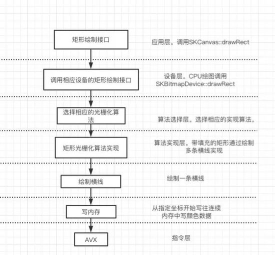
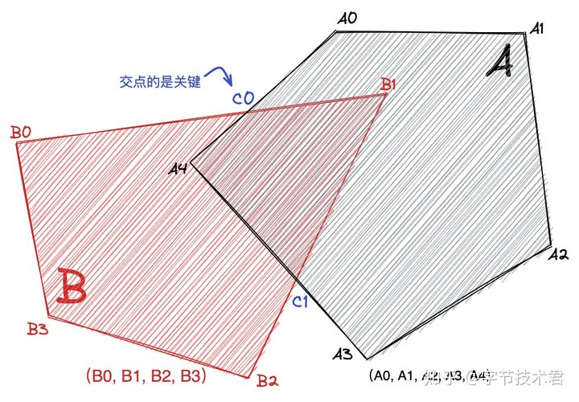

Flutter是目前流行的高性能跨平台UI框架，图形库skia是其跨平台的基石。本文将深入分析skia的图形、字体、图片的渲染原理，如何挖掘硬件特性，为UI性能优化提供思路。


## 0.渲染系统

渲染器作为现代 UI 的核心支撑模块，常常被作为内嵌在操作系统内的图形子系统的一部分提供给上层开发者。比如 Windows 下的 GDI/GDI+/Direct2D，Android 下的 Skia/HWUI （HWUI 对一些复杂多边形的处理依旧依赖 Skia 的软绘制，所以不能算完备的矢量渲染器），MacosX/iOS 内置的 CoreGraphics，Linux 下的 Cario 渲染器。 

同样其他的跨平台的库，比如 QT 就自己实现了矢量渲染器，这样可以在不同平台下拥有统一的渲染效果。Flutter，Chrome 和 Android 采用同样的Skia渲染器来完成跨平台的能力。所以要想在不同平台拥有比较好的渲染一致性，剥离对系统提供渲染器的依赖是很重要的一步。 

同样行业出现了一些类似于包括 NanoVG 在内的一些渲染器，此类渲染器都采用了模板掩码的一种特殊技法（Opengl 红宝书中提到的）来解决复杂多边形的绘制问题，巧妙的规避了复杂的几何运算。但是天下没有免费的午餐，它同样也会带来相对应的性能问题。而且天花板很低，后续优化几乎无从下手。对于游戏这类的场景偶尔需要显示一些面板来说无可厚非，但是对于传统的界面程序还是显得捉襟见肘。


在探讨之前我觉得有必要定义一下“`渲染`”这个词。这个词在目前互联网技术上面有诸多含义，带有一定的迷惑性。下文所有提及的“渲染”都和计算机图形学中“渲染”拥有同样的含义，指的是把特定的像素填充对应的颜色，以及围绕这一目的的相关算法。

## 1. Skia在渲染系统中的位置

Flutter是目前非常流行的跨平台UI开发框架，不仅支持Android、iOS，还支持Windows、Linux等操作系统。Flutter的性能非常高，拥有120fps的刷新率。那么flutter是如何实现在不同平台上高性能绘制图形图像的呢？首先我们分析下Flutter App和原生Android App、原生iOS App的UI绘制原理。


移动App的整体UI框架大致分成下面4个层次：

* **UI库**

跟Android、iOS原生开发类似，Flutter用dart语言实现一整套UI控件。Flutter先将控件树转成渲染树，然后交由skia库绘制界面。

* **图形库**

Skia图形库跟iOS平台的CoreAnimation等库功能类似，不仅提供了图形渲染功能，还提供文字绘制和图片显示功能。高级图形图像库将需要绘制的图形转成点、线、三角形等图元，再调用底层图形接口实现绘制。

* **低级图形接口**

OpenGL是使用最广的低级图形接口，兼容性最好，基本上支持市面上的所有GPU。Vulkan是最近几年新推出的图形API，除了iPhone的GPU，其他厂家的GPU基本都支持。Metal是苹果新推出的图形API，只支持自家GPU。

* **硬件设备层**

目前的移动设备出于性能考虑，大部分图形都是通过GPU渲染，少数情况也会使用CPU渲染，后文会介绍skia使用CPU和GPU渲染的具体场景。

iPhone 在A11芯片以前使用power vr系列GPU，之后采用自研GPU。安卓手机大部分采用高通Adreno GPU或ARM mail GPU。GPU渲染完一帧图像后送FrameBuffer，最后在合适的时机展示在屏幕上。

Skia应用广泛并且跨平台，不仅用于Flutter和Android操作系统，还用于Google Chrome浏览器，同时支持windows、Mac、iOS操作系统。Skia由C++编写，代码开源，通过研究skia有助于理解图形图像的绘制原理，为UI性能优化提供思路。从上图也可以看出来Flutter在iOS平台需要额外打包Skia，这也是iOS上Flutter的包尺寸要更大的原因。

## 2. skia 框架分析

### 2.1 Skia外部组件依赖

Skia依赖的第三方库众多，包括字体解析库freeType,图片编解码库libjpeg-turbo、libpng、libgifocode、libwebp和pdf文档处理库fpdfemb等。Skia支持多种软硬件平台，既支持ARM和x86指令集，也支持OpenGL、Metal和Vulkan低级图形接口。


### 2.2 Skia 层次分析

Skia在结构上大致分成三层：画布层，渲染设备层和封装适配层。


#### 2.2.1 画布层

画布层可以理解成提供给开发者在一个设备无关的画布，可以在上面绘制各种图形，且不用关心硬件细节，功能如下：

| 类别     | 函数名        | 含义       |
| :------- | :------------ | :--------- |
| 画图形   | drawPoints    | 画点       |
| 画图形   | drawRect      | 画矩形     |
| 画图形   | drawVertices  | 画多边形   |
| 画图形   | drawRoundRect | 画圆角矩形 |
| 画图形   | drawArc       | 画圆弧     |
| 画图形   | drawOval      | 画椭圆     |
| 画图形   | drawPath      | 画矢量图   |
| 绘制文字 | drawText      | 显示文字   |
| 显示图片 | drawBitmap    | 显示位图   |

这里罗列了给应用程序开发者使用的编程API，用来画出自定义的UI。在Flutter的基础架构中，大幅使用的是SkPictureRecord、SkPicture、SkImage、SaveLayer、SkClipPath等接口，用来实现Flutter框架功能。

#### 2.2.2 渲染设备层

渲染设备层负责画布层的硬件实现，skia将设备封装成下面三个类：

1）SKBitmapDevice

CPU渲染模式绘图，用于没有显卡或者显卡驱动的设备。此模式下，最后会将需要绘制的图形转成位图数据（RGB）写入指定内存，故称为BitmapDevice。写内存操作通过AVX或者NEON指令集实现。

2）SKGPUDevice

GPU渲染方式绘图。目前大部分移动设备和个人电脑都有GPU，GPU比CPU的运算单元多，并行计算能力强，通过GPU绘图可降低CPU占用，性能更好。Flutter、最新版本的chrome和android系统默认设置为GPU渲染模式。

3）SKPDFDevice

选用此设备时，渲染结果不是输出到显示器的画面，而是输出为pdf文件。

可以通过skia官网在线体验不同设备的渲染结果： https://fiddle.skia.org/c/@shapes

#### 2.2.3 封装适配层

Skia为了屏蔽不同依赖库的接口差异，对依赖库进行了封装和适配。

* 基于图片编解码库libjpeg-turbo、libpng、libwebp 封装了类SKJpegCodec、SKPngCodec、SKWebpCodec。

* 基于底层图形库OpenGL、Metal、Vulkan封装了GrGLOpsRenderPass， GrMTOpsRenderPass, GrVKOpsRenderPass三个类。

* 基于苹果平台CoreText字体库和开源字体FreeType封装了类SkScalerContext_Mac和SkScalerContext_FreeType。

Skia的外部依赖和层级结构讲解完毕，下面重点讲解skia的图形、文字和图片的绘制原理。

###  2.3. 图形绘制UseCase

Skia支持绘制的图形众多，包括圆形、椭圆、矩形、贝塞尔曲线等。下文重点分析图形的CPU和GPU两种渲染模式的原理。

#### 2. 3.1 图形CPU渲染UC

曲线的绘制涉及的数学知识较多，本文不再展开，下面以绘制实心矩形为例说明。



1）调用画布的绘图API

应用层调用画布SKCanvas的drawRect函数，传入左上角和右下角顶点坐标。

2）选用对应的设备的绘图API

由于选择的是CPU渲染模式，故调用SKBitmapDevice的矩形绘图函数drawRect实现。

3）图形表示

所有的图形可分解成下面几种基本矢量图形的组合，矩形可表示成四条直线的组合。

| 曲线类型               | 参数                         | 用途                             |
| :--------------------- | :--------------------------- | :------------------------------- |
| 直线（一次贝塞尔曲线） | 起点坐标，终点坐标           | 可表示绘制三角形、四边形等多边形 |
| 圆锥曲线               | 起点坐标，终点坐标，椭圆参数 | 表示椭圆、圆弧、圆形             |
| 二次贝塞尔曲线         | 三个控制点                   | 表示TrueType字体、抛物线等曲线   |
| 三次贝塞尔曲线         | 四个控制点                   | 表示OpenType字体和其他曲线       |

4）绘制算法实现

矢量图转成位图的过程称为光栅化。带填充的矩形光栅化过程比较简单，可以分解成绘制多条横线。

5）横线线绘制算法

每条横向的画法通过SKBlitter:: blitH实现。接口定义如下：

virtual void blitH(int x, int y, int width);

功能：从坐标x,y开始，连续写入宽度为width的RGB颜色值。

6）内存中写颜色数据

通过追踪代码，发现上文中的横线绘制函数调用的是memsetT函数（内存赋值）实现。参数如下：

static void memsetT(T buffer[], T value, int count)

目前x86和ARM处理器是32或者64位，普通的指令一次最多写入32位 或者64位数据，一个带透明通道的点通常占4个字节，相当于一次只能绘制1到2个点，效率比较低。Skia从性能角度考虑，采用的SIMD指令集来加速内存操作。

在X86平台，调用SSE、AVX、AVX2等指令集实现内存赋值，SSE支持一次操作128位操作，AVX/AVX2支持一次操作256位数据，ARM处理器的NEON指令集支持一次操作128位数据。

#### 2. 3.2 图形GPU渲染UC

GPU的并行运算能力强，目前大部分移动设备都采用的是GPU渲染。

skia GPU渲染流程如下：

1）发起绘图，先调用SKCanvas的绘图函数drawRect，传入左上角和右下角顶点坐标。

2）调用GPU设备的绘图函数SKGPUDevice::drawRect。

3）采用命令模式，将GPU绘图操作封装成类GrOpsTask的实例。

4）根据软硬件平台的不同选用不同的底层API。

OpenGL（Open Graphics Library”）是目前使用最广泛的跨平台图形变成接口，跨平台特性好，大部分操作系统和GPU。Skia在大部分平台采用OpenGL实现GPU绘图，少部分平台调用Metal和vulkan。

Metal是苹果公司2014年推出的和 OpenGL类似的面向底层的图形编程接口，只支持iOS。对软硬件有要求，要求硬件苹果A7及以后，操作系统iOS 10及以上。Metal理论上性能比OpenGL性能强，故新设备中开启Metal可提高性能。例如Flutter中已启用了metal支持，详情参考 https://github.com/flutter/flutter/wiki/Metal-on-iOS-FAQ 。

Vulkan是新一代跨平台的2D和3D绘图应用程序接口（API）,旨在取代OpenGL，理论上性能强于OpenGL。自 Android 7.0 开发者预览版开始，Google便在系统平台中添加了对Vulkan的API支持。目前Skia的GPU渲染模式已用vulkan实现了一套，但存在一些bug。具体参考 https://skia.org/user/special/vulkan 。

Skia对上述三种图形接口进行了封装，屏蔽了不同底层图形API接口的差异。OpenGL接口的封为GrGLOpsRenderPass，Metal的封装层为GrMTOpsRenderPass,Vuklan的封装层为 GrVKOpsRenderPass。


5）通过GPU完成剩余绘图操作。

下面以OpenGL为例说明。接口封装层调用OpenGL glDrawArray绘制矩形，之后在渲染流水线中完成顶点变换、光栅化和着色，最后送帧缓冲显示。渲染流水线如下图所示：


Metal、vulkan的渲染流水线这里不再展开。

### 2.4. 字体绘制UseCase

字体无法直接显示在屏幕上，需要解析成位图或者矢量图才能绘制。Skia的字体解析实现跟进平台差异有所不同，mac和iOS平台调用coreText库,安卓平台调用开源库freeType。

FreeType是一个用C语言实现的，免费的高质量可移植字体引擎，支持点阵字体PCF、BDF和矢量字体TrueType、freeType等字体。

#### 2.4.1 skia点阵字体绘制UC

Skia支持的点阵字体有PCF、BDF格式。点阵存储的是多张位图，常见的有16 *16，24* 24，32*32等尺寸，解码和显示简单，缺点是放大后有锯齿。

\1) skia点阵文字显示代码：

```css
SkFont font;
font.setEdging(SkFont::Edging::kAlias);
font.setSize(40);
const char text[] = "Click this link!";
size_t byteLength = strlen(static_cast<const char*>(text));
canvas->drawSimpleText(text, byteLength, SkTextEncoding::kUTF8, x, y, font, SkPaint());
```

文字绘制流程如下：


点阵字体最后解析成了位图，然后根据平台不同选用CPU或者GPU渲染出来。Skia为了提高字体显示速度，对字体的解析结果做了内存缓存。

#### 2.4.2 矢量字体绘制UC

矢量字体主要通过贝塞尔曲线描述字体，存储空间小，但渲染复杂，还需要导入字体库文件。Skia支持的矢量字体有tff(true type font)和otf(open true type)格式。前者采用二次贝塞尔曲线表示，后者采用三次贝塞尔曲线表示。Skia中矢量文字绘制代码如下：

```css
SkPaint p;
    p.setStyle(SkPaint::kStroke_Style);
    p.setStrokeWidth(10);
    p.setARGB(0xff, 0xbb, 0x00, 0x00);
   sk_sp<SkTypeface> ttf = MakeResourceAsTypeface("fonts/Stroking.ttf");
SkFont font(ttf, 100);
if (ttf) {
        SkFont font(ttf, 100);
        canvas->drawString("○◉  ⁻₋⁺₊", 10, 100, font, p);
}
```

绘制流程如下：


矢量字体的绘制流程跟点阵字体大部分一样，不同之处在于解析结果为贝塞尔曲线。贝塞尔曲线的渲染算法稍微复杂，参考文章 https://www3.cs.stonybrook.edu/~qin/courses/geometry/4.pdf

### 2.5. 图片绘制UseCase

#### 2.5.1 Skia位图绘制UC

skia提供了showBitmap函数可直接显示位图。位图渲染模式跟矢量图形类似，分为CPU渲染和GPU渲染。位图的CPU渲染跟实心矩形的渲染原理类似，`通过SIMD指令集将位图内存一行一行拷贝到指定内存缓存中`。GPU渲染模式通过调用OpenGL、Metal、vulkan的纹理贴图函数实现。


#### 2.5.2 Skia压缩格式图片绘制UC

位图由于占用空间大，使用频率低，大部分情况下使用压缩格式图片。Skia支持的压缩格式图片如下：

| 格式 | 优点                                                     | 缺点                                        | 场景                             | 依赖解码库    |
| :--- | :------------------------------------------------------- | :------------------------------------------ | :------------------------------- | :------------ |
| gif  | 文件小，支持动画、透明，无兼容性问题                     | 只支持种颜色，且透明度只有1位，有白边和锯齿 | 简单的动图                       | libgifcodec   |
| jpg  | 支持位真彩色，压缩率高                                   | 有损压缩，不支持透明通道                    | 色彩丰富的图片                   | libjpeg-turbo |
| png  | 无损压缩，支持透明，简单图片尺寸小                       | 不支持动画，压缩率低                        | logo/icon/透明图                 | libpng        |
| webp | 比jpeg压缩率更高，支持有损和无损压缩，支持动画、透明通道 | 谷歌自研格式，部分平台不支持。              | 支持有损和无损压缩格式，支持动画 | libwebp       |

压缩格式图片使用代码如下：

```r
		SkCanvas c(dst);  
    SkBitmap src;  
    SkImageDecoder::DecodeFile(“test.jpg”, &src);//  图片解码
    c.drawBitmap(src, 0, 0, NULL);  //图片显示
```

显示流程如下图所示：


读取文件后，先通过文件头判断图片类型，然后送相应的图片库解码成位图图像后，再通过CPU或者GPU渲染。

### 2.6. skia小结

Skia是一个功能强大的跨平台图形库，时至今日 Google 甚至微软的诸多产品都采用 Skia 作为核心渲染组件。包括但是不限于 Android、Chrome、Flutter、Xamarin 等等。不得不说这是一个伟大的技术产品。 它能绘制矩形、圆形、贝塞尔曲线等矢量图，绘制点阵字体和矢量字体，显示jpeg、png、gif、webp等图片，同时性能好，从算法和硬件两个层面进行了优化。skia支持多种软硬件平台，除了Android、chrome、Flutter等产品直接将其作为图形引擎，也支持iOS、windows等操作系统。为了支持跨平台和多种硬件，Skia抽象了描画OP，即Canvas将描画OP保存下来，交给各个平台/硬件去完成具体的渲染动作。Skia功能较多，还支持lottie动画，图像特效，同时引入了中间语言SKGL来抽象GPU的Shader，限于篇幅，本节不再展开。


## 3. 渲染器原理

本章节完全复用了知乎的文章(文后有链接)，此处为了备份，摘抄至此。

### 3.1 鸟瞰渲染器全貌 

渲染器本身是一个极其复杂的程序，就拿 Skia 来说核心侧有超过 80w 行的代码。如果算上第三方库甚至达到了惊人的 150w 到 200w 行之巨。即使构造的这个轻量的渲染器项目也有超过 25w行的代码（剔除第三方库，比如图片编解码、字体解析、XML 加载库等等。仍然还有超过 13w行的核心代码）。 

下面从以下几个方向来依次阐述它的核心技术： 


### 3.2  GPU 硬件加速能力的抽象 

硬件加速之所以快，在于运算单元多，并行能力强。同样也带来一些限制，参与运算的数据必须符合并行计算的要求。下图描述了大致的流程。 


**渲染抽象层的设计**

目前消费电子设备基本都配备了硬件显卡，但是很不凑巧主流设备中的显卡驱动存在较大的差异。因此想要构建完善的硬件加速渲染器，对不同厂商的 GPU 驱动做一层抽象是非常有必要。 


这里叫 RAL（Render Adapter Layer）这只是一个名称。在游戏引擎行业中大家更习惯于叫它 RHI（RHI 一般还涉及线程和异步的相关策略），详细可以参考 Unreal 的设计。 

那么 RAL 到底涉及哪些东西？这就要说到显卡的差异了，就目前来说主流的图形技术在所有显卡中都是相通的。显卡核心组成部件都类似（高级显卡存在一些新的着色器流程，暂时我们不会用到）。只是驱动在所在的平台存在差异，也就是显卡功能性的描述接口存在差异。这部分差异主要存在于 2 个方面（当然还存在一些细微细节不一样，比如窗口坐标系和 NDC 的差异，纹理采样坐标系的差异）。 


其中 API 的差异可以通过对驱动接口的包装来抹平（有点繁琐），编程语言就相对来说非常麻烦了。Skia 内部内置了自己的一套显卡编程语言叫 SKSL，可惜文档比较少。为了达到缩减包体积的效果，设计了一套自己的编程语言。我管它叫 RSL。 

### 3.3 设计一套新的 Shader 编程语言 

为什么要设计一套新的编程语言和语法？为什么不直接使用 glsl 的语法？ 

这里有 2 方面的思考（主要为了方便我实现编译器或者叫转化器）： 

- 在这之前我尝试让 OpenglES 运行在 iOS 的 Metal 之上（小游戏引擎的内核项目），手写过 glsl 的编译器。用来转化到 Metal 的 MSL 语法之上。由于 glsl 的 Spec 文档有点多而且复杂，为了测试编译器的稳定性，抓取了 ShaderToy（一个交流 webgl shader 的网站）1w5 千个左右的 shader 进行测试。语法分析通过率只有 95%多点，总有一些我没有考虑到语法。所以说还是不太稳定，工作量有点大。
- glsl 规范比较老，缺乏语义的支持。
- 应该还有其他的理由，比如我自己设计的语法。但凡有不太容易实现的部分，我可以选择剔除掉。


为了缩小包体积，我尝试把 Shader 的编译拆分成离线和在线两个端。和大多编译器的项目类似，或许他们都管这叫编译前端和后端。 

**离线端**：编译源码，抽取语义得到 AST（抽象语法树），由于这部分离线运行，可以任意选择开源项目配合实现，不用在乎包体积。现在开源的编译器项目很多，比如 Flex 和 Bison 很容易就可以构建出离线端。理论上应该对 AST 进行优化操作，奈何我本人对优化算法知之甚少。所以目前还没有实现任何优化相关的部分。最后对 AST 进行序列化，也可以稍微做点处理，一切以方便设备端翻译工作为目的，然后就可以内嵌或者动态下发到目标端上面了。 

**在线端**：一般指的就是设备端，接收到 AST 的序列化文件后就可以重构 AST 数据结构，并进行翻译。目前主要搞定了 OpenglES 和 Metal 两个主力平台，Vulkan 正在进行中。 

### 在开源中找找答案 

**Bgfx** 

bgfx 是一套对显卡接口的抽象，相对来说比较全面。它通过内置一个开源的 C 语言宏处理器的方式，来利用宏展开的特性把自定义的 Shader 语法实时翻译成目标平台的语法。我没有选择它的原因是我不喜欢它对 Shader 语法的处理方式，就其本身来说是一个非常优秀的项目。 

**Spirv**

在 Spirv 字节码（Vulkan 支持的 Shader 字节码，不是编程语言）慢慢变成显卡跨平台字节码的事实标准后，行业也出现了一些利用 Spirv 来进行 Shader 转化的项目。 


我有想过把 RSL 的实现换成微软的 HLSL 实现，这样我就可以不用维护 RSL 的编译器。同时还能享受微软 HLSL 编译器强大的优化能力。实际上我也确实这么做了，但是这样会明显增加包体积（会增加十几 MB，我实在没有办法忍受把这么一个巨无霸塞进去）。所以目前也是只是对内置的 Shader 在离线编译的时候会使用这个编译方案。如果需要动态下发还是保留 RSL 的方式，互相补充。这也是目前能找到的最好最稳定的办法，重点是不增加二进制体积。 

### 3.4几何原理

从这一节开始涉及渲染器最为核心的灵魂，数学是一切魔法的开始。 

**三角形和三角剖分** 

在图形学中三角形的重要性已经没有必要去描述了。它的质性简单，可以让显卡的插值器更加简单高效的工作。试想一下如果显卡支持的不是三角形而是四边形，那么由四个顶点很有可能不共面，这就会出现很复杂的情况了，而三角形则不会出现这个问题。 

如果只能渲染三角形那就太单调啦，实际情况中通常需要把多边形剖分成一组三角形的网格，我们管这个网格叫 Mesh。只有得到了 Mesh 后才能提交给 GPU 并行计算。我们管这个过程叫三角剖分，可见三角剖分是联系复杂多边形和三角形之间的桥梁。 

**复杂的多边形** 

如何定义多边形？在计算几何里面也是一个比较麻烦的问题，常见的多边形可以是下图这样的。 


这些还是多边形家族中一小部分。当我们说起多边形，可能第一印象想起的是矩形，矩形是最简单的凸多边形，它也存在一些非常重要的性质。region 这类数据结构在表示区域的时候，会使用多个不相交的矩形来进行数学表达。如果存在相交的情况可以利用线扫描快速剔除重叠的区域。这就是利用了他足够简单的特性，运算速度可以飞快。 


如上图所示，看起来杂乱无章实际上也是一个合法的多边形。这样的多边形也应该被算法正确的处理，比如三角化，甚至做一些布尔运算。 

**多边形规范** 

在图形学中会使用一些关键点序列来描述一个多边形。通常认为沿着关键点序列的顺序行走，左手边代表多边形的内部，相反右手边代表多边形的外部。 


如上图阴影部分代表多边形的区域，它有内外 2 个顺序相反的多边形组成。按照前文的定义很容易就可以得到多边形的区域，同样也很容易用程序的方式存储这个多边形。它还是比较简单的，实际运算过程中允许多边形存在父子关系（用来存储含岛多边形），也允许一个多边形的定义存在多个不连通分量，从这个角度多边形是典型的递归定义。 

对上面这个多边形进行硬件加速渲染，就需要对它进行三角剖分，如下图红色虚线构成的三角形网格。 


这里有一个问题，类似于圆这样的“多边形”应该如何处理？对于曲线需要先进行离散化，一般在处理的过程中会传递一个忍受值，当离散相邻的两个点之间的距离小于忍受值就不在进行细分了。所以曲线可以看成由许许多多的“短”的线段围成的多边形。 

时至今日三角剖分算法已经是计算机图形学中一个成熟的话题了。常见的三角剖分算法比如 “Monotone”、“EarCut” 等等。其中 Mapbox（一家专注以地图渲染的公司）就开源了一个袖珍精巧的基于“Earcut”的剖分算法。还有一些剖分算法对生成的三角形的形状具有有一定的约束，比如“符合德劳内的三角剖分算法”。在工业领域当然不希望剖分出来的三角形又长又细。因为这样用做零件加工、存储和运输都十分不方便。 

**画一条直线** 

有了前文的理论支持，现在开始面对一些实际的问题吧，比如从画一条直线开始。 


在几何中只需要 2 个端点的坐标就可以描述一条线，从数学的角度看线是没有宽度的。如果我们需要绘制一条有宽度的线就需要把线转化成面（或者是一个矩形）。 


利用给定的线宽并沿着直线的法线方向（一条直线有两个法线方向，互为相反向量）进行偏移。就可以得到一个矩形，对这个矩形进行剖分就可以得到由 2 个三角形组成的三角网格。GPU 可以高效绘制这个网格，用以表示这条有宽度的线。 

**画一条折线** 

稍微复杂一些，但是原理和绘制一条直线基本类似。 


如上图所示，最后得到了 4 个三角形的网格，分别是**红色**、**绿色**、**橙色**、**紫色** 四个三角形。在渲染器中，可能还需要指定线的端点和交点的样式。比如圆角端点，交点的长度限制等等。这些都可以用计算几何的方式得到，这里就不做过多的介绍。 

**贝塞尔曲线** 

前面我们探讨了一些基础的几何知识。已经可以从面（也就是多边形）和线（甚至是曲线）得到对应的三角形网格。程序可以构建一些简单的多边形（比如矩形，圆形，椭圆等等）然后把这些多边形转化成三角形网格，但是如果想要绘制下图图形则会发现有些难度。 


难度体现在如何得到图形的轮廓，也就是如何构建或者优雅的描述这样一个复杂的多边形。就像美术从业人员会用 Photoshop 这类产品做产品的原型设计，大多会用到一个叫“钢笔工具”的绘图功能。它通过使用**分段 3 阶贝塞尔曲线**来拟合几乎任何图形的外围轮廓。Skia 的 SkPath 类的功能就和“钢笔工具”类似。 

具体内部原理并不复杂，实现的难度并不大，这里就不过度对其实现原理加以概述。 


上图简单的描述了用分段贝塞尔曲线来拟合椭圆并三角化成 Mesh 的整个流程。最后做个科普贝塞尔曲线不是贝塞尔发明的，贝塞尔曲线也不是唯一可以用来做拟合的工控曲线。机械加工有时候要求零件表面曲率平滑，也就是曲线二阶导数平滑那么贝塞尔曲线就无能为力了。但是在图形这个分支下贝塞尔曲线和贝塞尔曲面倒大放异彩。 

### 3.5 建模构形 

尽管通过塞尔曲线有着非常好的拟合的特性。但是在构建复杂多边形轮廓的时候，完全通过贝塞尔曲线来拟合还是不够方便。 

如果把贝塞尔曲线构建的面所围成的区域看成一个集合，如果可以像数学集合一样进行 “并交叉” 运算，就可以更加方便的操作二维空间。在图形学中把这类操作看成多边形的“布尔”运算，操作的过程可以当做多二维多边形的建模或者叫构形。 

多边形减法 


多边形加法 

就如上图所示，如果直接构建左侧的多边形会有一些困难。但是利用多边形的布尔运算就比较容易了。 

**多边形堆叠**

一个复杂多边形的数据定义出现了一部分区域和另一部分区域重叠，这个时候问题就开始变的异常复杂了。 


不仅仅在多边形定义的过程中会出现多边形区域重叠。回想一下绘制折线的过程需要对折线中的子线段进行法线平移，相当于扩大了线段描述的区域。那么扩大了区域的同时难免会出现多边形区域重叠。而渲染器在执行渲染前需要对多边形进行堆叠的剔除。 

**布尔运算** 

在详细描述如果解决多边形堆叠问题前，先来了解一下多边形布尔运算。Skia 中存在对 SkPath 的 OP 操作就是对这个算法的实现。剔除多边形堆叠就可以简化成对多边形“自己”和“自己”求并集。 

这是一个古老的数学问题。不仅在图形学中存在，在材料科学等领域都有广泛的使用场景。数学家们为了找到这个问题的完美解，历时长达 50 年，直到 1990 年 Vatti bala 发表的博士毕业论文**《A Generic Solution to Polygon Clipping》**才标志着这一问题被解决。值得一提的是中国前计算几何协会的会长、浙江大学前数学系的主任、中国计算几何的泰斗**梁友栋**教授早在 Vatti 这篇论文发表的10年之前给出了一个存在约束条件的解，也就是著名的 **Liang-Barskey** 算法。直到 2009 年时隔 20 年后 Francisco Martı´nez发表了**《A new algorithm for computing Boolean operations on polygons》**貌似给出了一个更快的解决方案。此外从行业的经验来看，Boost库中的多边形运算的子库被认为是错误的实现。 

由于**《A Generic Solution to Polygon Clipping》**这篇文章，后续这类算法和衍生算法被简称为 GPC。 

**GPC 通用多边形裁剪**

得到 GPC 的过程非常坎坷，但是算法本身却十分容易描述。如下简要的描述下算法的整个过程。为了简单，采用下图 2 个凸多边形的并集运算作为样例。 


算法的关键在于求出边的“交点”和“交点的进出性”。“交点”相对比较容易理解，姑且不表。“进出性”可以用来表达交点和对应多边形的关系。比如下图交点 “C0” 如果从多边形 B 的 B0 

点出发，那么“C0”点对于多边形 A 来说是“外部”进入到“内部”，相对应的“C0”点就是多边形 B 的出点。“进出性”对后续的多边形裁剪有着非常重要的意义。 



如上图所示，多边形 A（A0,A1,A2,A3,A4）和多边形 B（B0,B1,B2,B3）。首先计算出所有的边的交点，并计算出交点相对多边形的进出性。然后随机选取一个交点沿多边形一边进行“行进”直到遇到下一个交点。交点代表着分叉口，通过“进出性”来选取对应的路线。递归整个过程，直到全部的交点都被处理掉。 


如上图所示，“C0”作为起点开始处理，直到遇到下一个交点“C1”。考虑到“C1”的“进出性”和当前是求多边形的“并集”，故选取“C1-B2”这条路线，直到所有的交点全部被处理。就能够得到新的多边形（C0,A0,A1,A2,A3,C1,B2,B3,B0），这个多边形就是剔除了堆叠后的并集。 


最后要解决的是如何快速求解多边形边的交点？尤其当多边形异常复杂的情况下。这个可以通过线扫描配合优先队列的方式来完成。此类算法在诸多论文中都有详细的描述，不做详细研究。 

上图只是描述了一个最简单的情况，真实的情况下一般是下面这样： 


请自行脑补...... 

**抗锯齿** 

抗锯齿本来和几何没有什么关系，比如游戏中常用的抗锯齿技术： 

- **SSAA**：拉大画幅后再线性插值缩小画幅的方式来抗锯齿
- **MSAA**：硬件提供的多重采样后再 resolve 的抗锯齿技术
- **FXAA** : 通过后处理的算法来来抗锯齿算法

这些抗锯齿算法在游戏这类全画幅处理中起到了很好地效果，但是在矢量渲染器中就不太合适，由于矢量描述多边形拥有明确的边界。算法只需要处理多边形的边界，像素的过渡中过滤**高频跳变**就可以达到完美的抗锯齿。所以可以在边界进行**低通滤波，**也可以通过其他技法来模拟这一过程。这里采用**轮廓区域拓展** + **径向渐变**的方法来间接模拟低通滤波。就拿绘制斜线的例子来说： 


上图前三个步骤和前文的描述没有任何区别。在最后一步对轮廓进行了一次扩展，上图所描述的多边形简单，如果对任意复杂度的多边形执行这个过程就非常复杂了。这个过程叫“**Polygon Offsetting**” 具体实现可以参考 《**Polygon Offsetting by Computing Winding Numbers》**Paper no. DETC2005-85513 pp. 565-575 这篇论文中描述。 

在正确进行了外轮廓的拓展后，多边形原本的区域被称为“实部”，扩展出来的部分被称为“虚部”。“实部”依旧按照正常的渲染方式进行，此外从“实部”径向渐变过渡到“虚部”的边缘就可以模拟出抗锯齿的效果。 

**总结** 

如前文所述，从分段贝塞尔曲线到二维构形，从多边形堆叠到通用多边形并交差。已经具备了完善的二维建模的能力，也配备了操作二维图形的手术刀。配合三角剖分算法可以完成和 GPU 的对接。 

### 3.6 硬件加速的必要性 

在计算机显卡还没有普及的年代，UI 依赖的矢量渲染器都是通过 CPU 来实现，CPU 通过线扫描为主的一系列算法来完成像素染色。此后 GPU 得到了广为普及，由于 GPU 的设计天然不适合来进行矢量渲染。故在早期尝试使用 GPU 来加速矢量渲染的尝试中大多得到的都是负优化。 

这是由于为了适应现代 GPU 的运算模式，不得不在提交 GPU 之前做很多预处理。包括但不限于 “三角化” “特殊的边缘抗锯齿算法” 等等，但是在软渲染的流程中则简单的多。显卡尽管可以比 CPU 更快速的处理像素，但是像素的成本处理在整个过程中占比不高。随着显卡速度越来越快、屏幕分辨率越来越高、显卡的驱动标准进一步提升，这些问题得到了反转。目前硬件加速矢量渲染已经作为重要的优化手段来使软件界面更加流畅。 

### 3.7  裁剪 

此裁剪和几何部分的多边形裁剪并不一样。特定场景下渲染器需要对渲染的结果做一些限定，比如上层的渲染逻辑只希望部分绘制的结果被用户看到。就像 Android 中父 View 限定子 View 的绘制不能超过父亲指定的区域一样。 

**硬件提供的裁剪** 

几乎所有的显卡都提供了 scissor 的能力。我们在渲染前给显卡前设置一个矩形区域，如果有像素超过这个窗口就会被显卡丢弃掉。 

但是显卡自带的裁剪能力要求裁剪的区域必须是一个矩形，并且这个矩形还不能够旋转。如果要裁剪一个奇异形状就无能无力了，这极大限制它的使用场景。但是由硬件直接提供的能力性能非常好，对渲染无侵入。 

**ClipPath** 

Skia 中提供了一个裁剪画布的接口 ClipPath，它可以把一个贝塞尔曲线围成的区域作为裁剪的区域。它的功能很强大，几乎可以涵盖全部的裁剪需求，如果不是性能太差就没有必要提及其他的方式了。 

如果需要通过 ClipPath 来实现对画布的裁剪，需要先构建一个和画布一样尺寸的掩码图。然后把区域绘制到掩码图上，在后续的绘制过程中要逐像素采样掩码图来判断要不要剔除。当然这个过程非常的繁重，体现在三个方面： 

- 需要对区域做预处理，甚至需要做堆叠剔除
- 需要对贝塞尔曲线包围的区域做三角化
- 需要消耗一次额外的绘制操作

正如前文描述的那样，复杂曲线围成的区域处理起来都非常复杂而且慢。 

**更快的数据结构** 

为了解决或者说部分解决 贝塞尔曲线的复杂度带来的性能损耗。可以使用多个矩形来表示一个复杂区域，但是要求矩形之间不能存在堆叠。下图描述了如何剔除矩形之间的堆叠，只需要执行一次线扫描算法即可。 


同样矩形非常容易就可以剖分成三角形，并不需要使用复杂的三角剖分的算法。所以可以快速构建对二维区域的描述。同样基于“矩形集合”的二维区域描述非常容易构建出并交差等运算。而且相关的碰撞检测算法也非常容易实现，但是对于需要使用曲线包围的区域就显的比较乏力了。 

Skia 中使用 SkRegion 这个数据结构来对这个算法进行描述。 

### 3.8 SDF 快速剔除 

SDF（Signed Distance Field，有向距离场），这里用了一种模拟 SDF 的方法来进行快速的裁剪。它发生在光栅化后像素处理的最后阶段。 


比如上图中像素 P 和像素 Q，如果需要保留多边形 （A，B，C，D，E）区域。那么就要找到一个办法来区分像素 P和Q 谁落在多边形内，谁落在多边形外。这不是一个很麻烦的事。 


如上图所示，从多边形任意一个点进行“行进”，图中从 C 点开始。那么向量 CB 需要逆时针旋转才可能和向量 CP 重合，也就是 P 点在向量 CB 的左侧，相反像素 Q 在向量 CB 的右侧。循环一周会发现点 P 永远在左侧，而 Q 则有时候在左侧有时候在右侧。至于左右可以通过向量几何的叉积的正负来判断。通过这个特性可以判断像素是不是处于多边形的包围中。算法中可以通过这个原理构建SDF的核函数。理论上只能对凸多边形有效果，其他多边形需要转化成多个凸多边形后依次加以判断（实际上还存在其他问题）。在判断像素的时候同时需要找到像素距离每个边的最短距离，通过这个距离可以控制边缘的一些策略用来抗锯齿。 

Skia 中并未暴露 SDF 相关的策略接口，但是在内核代码中存在类似的实现。


上文描述了几个典型的裁剪方式。理论上需要上层业务进行合理的选择，用以达到最佳的性能，而不是无脑的 ClipPath。 

### 3.9 和 Skia 的差异 

**SaveLayers** 

暂时不觉得需要提供 SaveLayers 这类接口。 

**CPU Backend 渲染器** 

只支持硬件加速渲染，尽可能的多支持不同的硬件。不考虑 CPU Backend，对普众的消费电子设备显卡应该和 CPU 一样是标配。不存在 GPU 的设备不在考虑范围内。 

**为什么体积会小这么多** 

主要由一下几个因素 

- 我们实现的渲染器不支持CPU软渲染策略，一些都是为了硬件加速设计的，更加简洁。
- 作为Shader处理的逻辑，核心的编译器相关模块都是离线实现。同样的Skia的SKSL编译器需要内置到Skia的核心逻辑中难以剥离。
- 由于Skia的历史非常悠久，存在相当多的legacy性质的代码和模块。

### 3.10 关于渲染器的未来使用场景 

**跨平台** 

这个方向毋庸置疑，未来类似 Flutter 这样的跨多端的会慢慢变成主流（多年前笔者从事 Windows 开发，就是先用系统的渲染器绘制一套 UI 体系，然后在上面做各种业务。Flutter 在移动端算一个新东西，但是业界早有类似的解决方案），那么构建适合自己业务的渲染引擎非常有必要，也是技术实力的体现。 

**Mini 浏览器** 

随着前端的敏捷的开发方式慢慢在整个行业得到接受，国内有众多尝试在 系统原生组件或者 Flutter 上构建类似浏览器的逻辑（远不如浏览器那么复杂）。我把这类项目称为 Mini 浏览器项目，那么渲染器可以最大化减少包体积，提高渲染性能。 

天下没有免费的午餐，没有哪一个硬件渲染器能够保证，随意使用其 API 就能得到好的性能。Flutter 本身也因为过多使用 Skia 的 ClipPath 和 SaveLayers 导致性能低下。对渲染本身足够理解、对硬件的足够理解，知己知彼才能做到最好。 

**混合渲染** 

纵观全文，我都致力于把二维渲染实时转化成由三角形构成的 Mesh。那么 3D 游戏为什么可以在渲染复杂的场景下提供好的性能？原因在于 3D 游戏中使用的 3D 模型大多都是通过 “3DMax” “Maya” “Blender”这里建模工具离线构建的。 

从三角形的 Mesh 角度来说，2D 和 3D 没有本质区别，所以可以混合到一起渲染。这会带来一些新的原来不具备的特性。移动设备时至今日运算能力已经很强了，但是交互方式却没有大的变化，随着混合模式下的渲染会带来更加新颖的体验的交互模式。

---
上述内容绝大部分来自

[我是如何把Skia的体积缩小到1/8](https://zhuanlan.zhihu.com/p/398959069?utm_source=wechat_session&utm_medium=social&utm_oi=793215177993637888&utm_campaign=shareopn)


