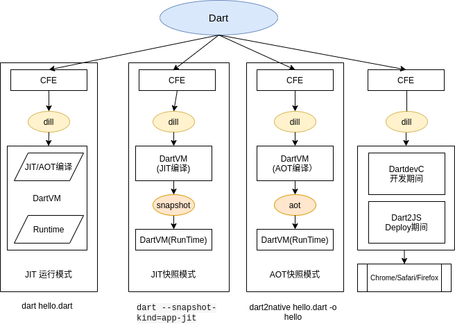
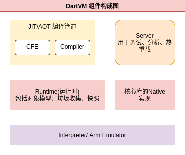

- [1. 前言](#1-前言)
- [2. DartVM使用场景](#2-dartvm使用场景)
- [3. DartVM工作方式](#3-dartvm工作方式)
- [4. DartVM内部构成](#4-dartvm内部构成)
- [5. DartVM如何运行你的代码呢？](#5-dartvm如何运行你的代码呢)
- [6. 通过 JIT 运行源代码](#6-通过-jit-运行源代码)
  - [6.1. Step1: Dart=>dill（内核二进制文件）](#61-step1-dartdill内核二进制文件)
  - [6.2. Step2：dill=>加载库和类的基本信息](#62-step2dill加载库和类的基本信息)
  - [6.3. Step3:加载类的成员和函数签名](#63-step3加载类的成员和函数签名)
  - [6.4. Step4：为当前函数生成可执行代码(Compile使用未优化编辑器)](#64-step4为当前函数生成可执行代码compile使用未优化编辑器)
  - [6.5. Step5:执行](#65-step5执行)
  - [6.6. Step6:JIT自适应优化](#66-step6jit自适应优化)
  - [6.7. Step7:JIT去优化](#67-step7jit去优化)
- [7. 从快照运行](#7-从快照运行)
- [8. 从 AppJIT 快照运行](#8-从-appjit-快照运行)
- [9. 从 AppAOT 快照运行](#9-从-appaot-快照运行)
- [10. 可切换调用](#10-可切换调用)
- [11. DartVM提供的编程接口](#11-dartvm提供的编程接口)
- [12. Quickjs的运行时实现](#12-quickjs的运行时实现)


## 1. 前言

本文基础来自英文版 https://mrale.ph/dartvm/ 
增加了一些有助于理解的内容

后续可以进行的探索的内容：
1. 英文版资料持续更新中，在需要持续追踪的时候，可以继续查看
2. 英文版资料添加了dartVM的一些参数的说明，当需要了解过程中的成果物以便加深理解的时候可以参照
3. 将DartVM以静态库的方式嵌入到原生项目（如游戏引擎或高性能图形应用）中，这里可以参考[这篇文章](https://zhuanlan.zhihu.com/p/296388598)

## 2. DartVM使用场景

介绍几种典型的应用场景：

1. 独立执行脚本: DartVM 提供了类似Node/Python的独立运行时，这样就可以在PC上执行 dart helloworld.dart文件来执行，此时使用解释执行的方式，即和python helloworld.py一样
2. Standalong Native APP： 从Dart2.6开始可以使用dart2native hello.dart -o hello 这样的形式来生成自包含的的操作系统直接支持的hello Native应用，可以通过./hello 来执行
3. Flutter：DartVM 被事前交叉编译为目标平台的库，由Flutter Engine实现自举。

在上述应用场景中，DartVM或者以独立运行时的形态被使用，或者以库的形式被调用。


## 3. DartVM工作方式

和JIT类语言的套路相同，Dart提供了DartVM用来解析执行Dart程序。根据输入和参数的差异，主要支持如下三种方式：

* 使用源代码(.dart)/内核二进制文件(.dill)的 JIT 运行模式。
* 使用预热快照AppJIT（.snapshot）的 JIT快照 运行模式。
* 使用 AOT 快照（.aot）的 AOT快照 运行模式。

> 注意：从Dart声明中提到，Dart 2 VM不再支持从dart源代码文件执行的模式， 这是Dart VM的特性，从工具链（执行的命令）角度，是仍然可以支持dart helloworld.dart 这样的命令执行的。其中原因是将 Dart 源代码翻译成 Kernel AST 的任务是由通用前端 (CFE)处理的，CFE 是用 Dart 编写并在不同 Dart 工具上共享（例如 VM、dart2js、Dart Dev Compiler）。


下面是和DartVM几个主要工作方式的一个概览图，包含了Dart2JS的内容




* 在桌面端执行标准的 dart 命令时，DartVM独立运行时程序(dart)会通过内部的 CFE 通用前端（Common Front End）组件，将 .dart 格式源码解析为二进制形式的 AST 语法树，然后在主 Isolate（类似主线程）JIT 执行,对应着 `JIT` 运行模式。

* 在桌面端执行 dart --snapshot-kind=app-jit 命令时，DartVM独立运行时程序(dart)会在解析 .dart 源码后，用训练数据（模拟程序运行）来 JIT 执行它，然后把虚拟机的状态(解析的代码和运行的数据)保存为 .snapshot 格式的快照文件(序列化后的文件)。这份快照可以被 VM 重新读取(反序列化)，一步到位地恢复 JIT 后的现场，从而优化启动性能。作为典型例子，Flutter 的 flutter run 命令执行的就是 flutter_tools.snapshot 快照， 对应这 `AppJIT快照` 模式
  
* 在桌面端执行 dart2native 命令时，Dart 源码会被编译成平台机器码，获得 .aot 格式的产物。这个产物类似原生的 ELF 可执行格式，可以和预编译出的 dart_precompiled_runtime 运行时一起被动态加载执行，对应着 AOT快照 模式。


Dart VM 实际上还能配置出很多其他工作方式，比如关闭 JIT 的解释执行之类。这里只是列出了关键的几种，而在深度支持 Flutter 的过程中，Dart VM 在移动端的执行模式，与原本的桌面端存在进一步的差异

* 在移动端 Flutter 的 Debug 模式下，Dart 源码会在开发者的桌面端被编译成 .dill 格式的 Kernel Binary，然后这些 .dill 文件会通过 RPC 服务动态更新到移动设备上。这是 Flutter 支持增量编译和热重载等黑科技的基础，对应着 JIT 模式的变体。

* 在移动端 Flutter 的 Release 模式下，Dart 源码会在开发者的桌面端被交叉编译成 ARM 机器码，与预编译出的运行时相链接，对应着 AOT快照 模式的变体。

> 注意 CFE 编译前端和 VM 在架构上的分离：虽然在直接执行dart hello.dart 文件时我们对此无感，但在 Flutter 的移动端场景下，Flutter 直接把 CFE 封装到了桌面端的 Flutter Tool 命令行项目中（纯 Dart 实现），从而在移动端的 Flutter Engine（C++ 与 Dart 混合实现）当中只包含了 VM 部分。
> 在 Flutter 中，Dart VM 的编译细节被框架封装掉了。但这并不难通过 VSCode 中断点调试 Flutter Tool 的方式来详细了解，这里不再展开。

虽然看起来很复杂，其实它们之间的本质区别在于： 「VM “何时”以及“如何”将 Dart 源代码转换为可执行代码」，然后保证执行的运行时环境保持不变，根据输入的内容中是否包含平台特定的指令码，有如下的特性

* Kernel Binary 格式是.dill，是一种json格式保存的抽象语法树(AST),所以平台通用。
* AppJIT 预热生成的快照是 .snapshot 格式，是一种包含着运行代码和状态数据的序列化后的文件，所以平台不通用。
AOT 编译命令生成的是 .aot 格式文件，是包含在和运行代码和状态数据的二进制文件，所以平台不通用。


## 4. DartVM内部构成


Dart VM 是用于本地执行 Dart 代码的组件集合，它主要由如下组件构成：



Dart VM 从某种意义上说是一个虚拟机，它为高级编程语言提供了一个执行环境，「但这并不意味着 Dart 在 Dart VM 上执行时总是需要被解释或 JIT 编译的」, 也就是说，DartVM 并非总是完全包括全部组件的。

例如可以使用 Dart VM AOT 将 Dart 代码编译成机器代码，然后在 Dart VM 的裁剪版本中执行，这被称为预编译运行时，它不包含任何编译器组件，无法动态加载 Dart 源代码。


## 5. DartVM如何运行你的代码呢？

首先介绍下Dart的并发模型:

Dart的并发模型受 erlang 的影响不小，提供了类似于 erlang process 的 isolate。在 dart 里，每个 isolate 都有自己的栈和堆，isolate 之间 "share nothing"，只能通过发送和接收消息来传递数据。每个 isolate 自己单独做 GC，这和 erlang 的 GC 也非常类似，因而内存的分配和回收无需加锁。Dart中isolate 之间的通讯如下图所示：


* VM 中的任何 Dart 代码都在某个 isolate 中运行，可以将其描述为：「具有自己的内存（堆）并且通常具有自己的控制线程（mutator 线程）的 Dart 隔离宇宙」。

* VM 可以有许多 isolate 同时执行 Dart 代码，但它们不能直接共享任何状态，只能通过端口传递消息进行通信（不要与网络端口混淆！）。

* isolate 可以通过 Isolate.spawn 创建，之后可以通过 isolate.kill() 结束生命周期。在每个 isolate 创建时，都会默认创建一个 receiving port，用来接收消息。

* dart 每个 isolate 内部，运行一个 event loop，处理这个 isolate 上的事件。所以在 dart中的异步编程和 javascript 一样，dart 里的每个异步事件都是一个 future 对象，语言本身提供 async/await 作为语法糖。
* isolate 是dartVM的抽象概念， 其具体实现高度依赖于虚拟机嵌入到应用程序的方式。比如在 web 环境下，isolate 会被 web worker 执行；而在原生环境下，isolate 可能会被某个线程调用，但要注意的是：同一个线程不能在同一时间处理两个不同的 isolate。

* 这里的 OS 线程和 isolate 之间的关系有点模糊，并且，但是主要需要保证以下内容：

    * 一个 OS 线程一次只能进入一个 isolate ，如果它想进入另一个 isolate，它必须离开当前 isolate；
    * 一次只能有一个与 isolate 相关联的 Mutator 线程，Mutator 线程是执行 Dart 代码并使用 VM 的公共 C API 的线程。
    * 然而同一个 OS 线程可以先进入一个 isolate 执行 Dart 代码，然后离开这个 isolate 并进入另一个 isolate 继续执行；或者有许多不同的 OS 线程进入一个 isolate 并在其中执行 Dart 代码，只是不会同时发生。

当然，除了单个 Mutator 线程之外，isolate 还可以关联多个辅助线程，例如：

* 一个后台 JIT 编译器线程；
* GC sweeper 现场；
* 并发 GC marker 线程；

VM 在内部使用线程池 (dart::ThreadPool) 来管理 OS 线程，并且代码是围绕 dart::ThreadPool::Task 概念而不是围绕 OS 线程的概念构建的。

例如在 GC VM 中将 dart::ConcurrentSweeperTask 发布到全局 VM 的线程池，而不是生成专用线程来执行后台清除，「并且线程池实现要么选择空闲线程，要么在没有可用线程时生成新线程」；类似地，「用于 isolate 来消息处理事件循环的默认实现实际上，并没有产生专用的事件循环线程，而是在新消息到达时将dart::MessageHandlerTask 发布到线程池」。

> dart::Isolate 类相当于一个 isolate ，dart::Heap 类相当于 isolate 的堆，dart::Thread 类描述了线程连接到 isolate 相关的状态。
> 请注意，该名称 Thread可能会让人有些困惑，因为所有 OS 线程都附加到与 Mutator 相同的 isolate，将重用相同的 Thread 实例。有关 isolate 消息处理的默认实现，请参阅 Dart_RunLoop 和 dart::MessageHandler。


## 6. 通过 JIT 运行源代码


### 6.1. Step1: Dart=>dill（内核二进制文件）

本节将介绍当从命令行执行 Dart 时会发生什么：
``` dart
// hello.dart
main() => print('Hello, World!');
```
```s
$ dart hello.dart
Hello, World!
```

如前所述，为了保持直接从源代码执行 Dart ，JIT模式下运行的DartVM独立运行时，托管一个名为 kernel service 的辅助 isolate，它处理将 Dart 源代码编译到内核中，然后 VM 运行生成的内核二进制文件。


当然这种方式并不是 CFE 和 VM 运行 Dart 代码的唯一方法，例如 「Flutter 是将编译到 Kernel 的过程和从 Kernel 执行的过程完全分离」，并将它们放在不同的设备上实现：编译发生在开发者机器（主机）上，执行在目标移动设备上处理，目标移动设备接收由 flutter 工具发送给它的内核二进制文件。


这里需要注意，该 Flutter 工具不处理 Dart 本身的解析， 相反它会生成另一个持久进程 frontend_server，它本质上是围绕 CFE 和一些 Flutter 特定的 Kernel-to-Kernel 转换的封装。

frontend_server 将 Dart 源代码编译为内核文件， 然后 flutter 将其发送到设备， 当开发人员请求热重载时 frontend_server 开始发挥作用：在这种情况下 frontend_server 可以重用先前编译中的 CFE 状态，并重新编译实际更改的库。

### 6.2. Step2：dill=>加载库和类的基本信息

「一旦内核二进制文件加载到 VM 中，它就会被解析以创建代表各种程序实体的对象，然而这个过程是惰性完成的」：首先只加载关于库和类的基本信息，源自内核二进制文件的每个实体都保留一个指向二进制文件的指针，以便以后可以根据需要加载更多信息。


> 每当我们引用 VM 内部分配的对象时，我们都会使用 Untagged 前缀，因为这遵循了 VM 自己的命名约定：内部 VM 对象的布局由 C++ 类定义，名称以 Untagged头文件 runtime/vm/raw_object.h 开头。例如 dart::UntaggedClass 是描述一个 Dart 类 VM 对象， dart::UntaggedField 是一个 VM 对象

### 6.3. Step3:加载类的成员和函数签名

「只有在运行时需要它时（例如查找类成员、分配实例等），有关类的信息才会完全反序列化」，在这个阶段，类成员会从内核二进制文件中读取，然而在此阶段不会反序列化完整的函数体，只会反序列化它们的签名。


此时 methods 在运行时可以被成功解析和调用，因为已经从内核二进制文件加载了足够的信息，例如它可以解析和调用 main 库中的函数。

> 
package:kernel/ast.dart 定义了描述内核 AST 的类； package:front_end处理解析 Dart 源代码并从中构建内核 AST。dart::kernel::KernelLoader::LoadEntireProgram是 将内核 AST 反序列化为相应 VM 对象的入口点；pkg/vm/bin/kernel_service.dart 实现了内核服务隔离，runtime/vm/kernel_isolate.cc 将 Dart 实现粘合到 VM 的其余部分； package:vm 承载大多数基于内核的 VM 特定功能，例如各种内核到内核的转换；由于历史原因一些特定于 VM 的转换仍然存在于 package:kernel 中。


### 6.4. Step4：为当前函数生成可执行代码(Compile使用未优化编辑器)

最初所有的函数都会有一个占位符，而不是它们的主体的实际可执行代码：它们指向 LazyCompileStub，它只是要求运行时系统为当前函数生成可执行代码，然后 tail-calls 这个新生成的代码。


第一次编译函数时，是通过未优化编译器完成的。


未优化编译器分两遍生成机器代码：

1、「遍历函数体的序列化 AST 以生成函数体的控制流图( CFG )，CFG 由填充有中间语言( IL ) 指令的基本块组成」。在此阶段使用的 IL 指令类似于基于堆栈的虚拟机的指令：它们从堆栈中获取操作数，执行操作，然后将结果推送到同一堆栈。

> 
实际上并非所有函数都具有实际的 Dart / Kernel AST 主体，例如在 C++ 中定义的本地函数或由 Dart VM 生成的人工 tear-off 函数，在这些情况下，IL 只是凭空创建，而不是从内核 AST 生成。


2、生成的 CFG 使用一对多的底层 IL 指令直接编译为机器代码：每个 IL 指令扩展为多个机器语言指令。
在此阶段没有执行任何优化，未优化编译器的主要目标是快速生成可执行代码。

这也意味着：「未优化的编译器不会尝试静态解析内核二进制文件中未解析的任何调用」，VM 当前不使用基于虚拟表或接口表的调度，而是使用「内联缓存」实现动态调用。

> 内联缓存的原始实现，实际上是修补函数的 native 代码，因此得名「内联缓存」，内联缓存的想法可以追溯到 Smalltalk-80，请参阅 Smalltalk-80 系统的高效实现。

**内联缓存**

「内联缓存背后的核心思想，是在特定的调用点中缓存方法解析的结果」，VM 使用的内联缓存机制包括：

一个调用特定的缓存（ dart::UntaggedICData），它将接收者的类映射到一个方法，如果接收者是匹配的类，则应该调用该方法，缓存还存储一些辅助信息，例如调用频率计数器，用于跟踪给定类在此调用点上出现的频率；

一个共享查找 stub ，它实现了方法调用的快速路径。这个 stub 搜索给定的缓存，以查看它是否包含与接收者的类匹配的条目。如果找到该条目，则 stub 将增加频率计数器和 tail-calls 用缓存方法。否则 stub 将调用一个运行时系统助手来实现方法解析逻辑。如果方法解析成功，则缓存将被更新，后续调用将不需要进入运行时系统。

如下图所示，展示了与 animal.toFace() 调用关联的内联缓存的结构和状态，该缓存使用 Dog 的实例执行了两次，使用 Cat 的实例执行了一次C。


### 6.5. Step5:执行

基于Step4编译的结果，执行dart代码。

### 6.6. Step6:JIT自适应优化

未优化的编译器本身足以执行任何 Dart 代码，然而它产生的代码相当慢，这就是为什么 VM 还实现了自适应优化编译管道的原因，自适应优化背后的想法是：「使用运行程序的执行配置文件来驱动优化决策」。

当未优化的代码运行时，它会收集以下信息：

如上所述，内联缓存收集有关在调用点观察到的接收器类型的信息；
函数和函数内的基本块相关联的执行计数器跟踪代码的热点区域；
当与函数关联的执行计数器达到一定阈值时，该函数被提交给后台优化编译器进行优化。

优化编译的启动方式与非优化编译的启动方式相同：「通过遍历序列化内核 AST ，为正在优化的函数构建未优化的 IL」。

然而不是直接将 IL 处理为机器代码，而是基于表单的优化 IL， 优化编译器继续将未优化的 IL 转换为静态单赋值(SSA) ，然后基于 SSA 的 IL 根据收集的类型反馈进行专业化的推测，并通过一系列Dart 的特定优化，例如：

* 内联（inlining）；
* 范围分析（range analysis）；
* 类型传播（ type propagation）；
* 代理选择（representation selection）；
* 存储加载和加载转发（store-to-load and load-to-load forwarding）；
* 全局值编号（global value numbering）；
* 分配下沉（,allocation sinking）等，；
最后使用线性扫描寄存器和简单的一对多降低 IL 指令，将优化的 IL 转化为机器代码。

编译完成后，后台编译器会请求 mutator 线程进入安全点并将优化的代码附加到函数中。


> 广义上讲，当与线程相关联的状态（例如堆栈帧、堆等）一致，并且可以在不受线程本身中断的情况下访问或修改时，托管环境（虚拟机）中的线程被认为处于安全点。通常这意味着线程要么暂停，要么正在执行托管环境之外一些代码，例如运行非托管 native 代码。


下次调用此函数时， 它将使用优化的代码。某些函数包含非常长的运行循环，对于那些函数，在函数仍在运行时，将执行从未优化代码切换到优化代码是有意义的。

「这个过程被称为堆栈替换( OSR )」，它的名字是因为：一个函数版本的堆栈帧被透明地替换为同一函数的另一个版本的堆栈帧。


❝
编译器源代码位于 runtime/vm/compiler 目录中；编译管道入口点是 dart::CompileParsedFunctionHelper::Compile；IL 在 runtime/vm/compiler/backend/il.h 中定义；内核到 IL 的转换从 dart::kernel::StreamingFlowGraphBuilder::BuildGraph 开始，该函数还处理各种人工函数的 IL 构建；当 InlineCacheMissHandler 处理 IC 的未命中，dart::compiler::StubCodeCompiler::GenerateNArgsCheckInlineCacheStub 为内联缓存存根生成机器代码； runtime/vm/compiler/compiler_pass.cc 定义了优化编译器传递及其顺序； dart::JitCallSpecializer 大多数基于类型反馈的专业化。❞


### 6.7. Step7:JIT去优化


需要强调的是，优化编译器生成的代码，是在基于应用程序执行配置文件的专业推测下假设的。

例如，一个动态调用点只观察到一个 C 类的实例作为一个接收方，它将被转换成一个可以直接调用的对象，并通过检查来验证接收方是否有一个预期的 C 类。然而这些假设可能会在程序执行期间被违反：

```dart
void printAnimal(obj) {
  print('Animal {');
  print('  ${obj.toString()}');
  print('}');
}

// Call printAnimal(...) a lot of times with an intance of Cat.
// As a result printAnimal(...) will be optimized under the
// assumption that obj is always a Cat.
for (var i = 0; i < 50000; i++)
  printAnimal(Cat());

// Now call printAnimal(...) with a Dog - optimized version
// can not handle such an object, because it was
// compiled under assumption that obj is always a Cat.
// This leads to deoptimization.
printAnimal(Dog());
```


每当代码正在做一些假设性优化时，它可能会在执行过程中被违反，所以它需要保证当出现违反假设的情况下，可以恢复原本的执行。

这个恢复过程又被称为去优化：当优化版本遇到它无法处理的情况时，它只是将执行转移到未优化函数的匹配点，并在那里继续执行，函数的未优化版本不做任何假设，可以处理所有可能的输入。

VM 通常在去优化后丢弃函数的优化版本，而之后再次重新优化它时，会 使用更新的类型反馈。

VM 有两种方式保护编译器做出的推测性假设：

内联检查（例如CheckSmi，CheckClassIL 指令）验证假设在编译器做出此假设的使用站点是否成立。例如将动态调用转换为直接调用时，编译器会在直接调用之前添加这些检查。
Global guards 会运行时丢弃优化代码，当依赖的内容变化时。例如优化编译器可能会观察到某个 C 类从未被扩展，并在类型传播过程中使用此信息。然而随后的动态代码加载或类终结可能会引入一个子类 C。此时运行时需要查找并丢弃在 C 没有子类的假设下编译的所有优化代码。运行时可能会在执行堆栈上找到一些现在无效的优化代码，在这种情况下受影响的帧将被标记为“去优化”，并在执行返回时取消优化。「这种去优化被称为惰性去优化: 因为它被延迟执行，直到控制返回到优化的代码」。

❝
去优化器机制在 runtime/vm/deopt_instructions.cc 中，它本质上是一个解优化指令的微型解释器，它描述了如何从优化代码的状态，重建未优化代码的所需状态。去优化指令由 dart::CompilerDeoptInfo::CreateDeoptInfo 在编译期间针对优化代码中的每个潜在"去优化"位置生成。❞


## 7. 从快照运行


VM 能够将 isolate 的堆，或位于堆中的更精确地序列化对象的图称为二进制快照，然后可以使用快照在启动 VM isolates 时重新创建相同的状态。


快照的格式是底层的，并且针对快速启动进行了优化：「它本质上是一个要创建的对象列表以及有关如何将它们连接在一起的说明」。

快照背后的最初想法：VM 无需解析 Dart 源和逐步创建内部 VM 数据结构，而是可以将所有必要的数据结构从快照中快速解包出来，然后进行 isolate up。

> 快照的想法源于 Smalltalk 图像，而后者又受到 Alan Kay 的硕士论文的启发。Dart VM 使用集群序列化格式，这类似于 《Parcels: a Fast and Feature-Rich Binary Deployment Technology》和《Clustered serialization with Fuel》论文中描述的技术。

> 最初快照不包括机器代码，但是后来在开发 AOT 编译器时添加了此功能。开发 AOT 编译器和带有代码的快照的动机：「是为了允许在由于平台级别限制而无法进行 JIT 的平台上使用 VM」。

带有代码的快照的工作方式几乎与普通快照相同，但有细微差别：它们包含一个代码部分，这部分与快照的其余部分不同，它不需要反序列化，此代码部分的放置方式允许它在映射到内存后直接成为堆的一部分。


> runtime/vm/clustered_snapshot.cc 处理快照的序列化和反序列化；API 函数 Dart_CreateXyzSnapshot[AsAssembly] 负责写出堆的快照（例如Dart_CreateAppJITSnapshotAsBlobs 和 Dart_CreateAppAOTSnapshotAssembly ）； Dart_CreateIsolateGroup 可选择获取快照数据以启动 isolate。


## 8. 从 AppJIT 快照运行

「引入 AppJIT 快照是为了减少大型 Dart 应用程序的 JIT 预热时间」，例如 dartanalyzer 或 dart2js。当这些工具用于小型项目时，它们花在实际工作上的时间与 VM 花在 JIT 编译这些应用程序上的时间一样多。

AppJIT 快照可以解决这个问题：可以使用一些模拟训练数据在 VM 上运行应用程序，然后将所有生成的代码和 VM 内部数据结构序列化为 AppJIT 快照，然后分发此快照，而不是以源（或内核二进制）形式分发应用程序。

从这个快照开始的 VM 仍然可以 JIT。


## 9. 从 AppAOT 快照运行


AOT 快照最初是为无法进行 JIT 编译的平台引入的，但它们也可用于快速启动和更低性能损失的情况。

关于 JIT 和 AOT 的性能特征比较通常存在很多混淆的概念：

JIT 可以访问正在运行的应用程序的本地类型信息和执行配置文件，但是它必须为预热付出代价；
AOT 可以在全局范围内推断和证明各种属性（为此它必须支付编译时间），没有关于程序实际执行方式的信息， 但 AOT 编译代码几乎立即达到其峰值性能，几乎没有任何预热.
❝
目前 Dart VM JIT 的峰值性能最好，而 Dart VM AOT 的启动时间最好。

无法进行 JIT 意味着：

1. AOT 快照必须包含可以在应用程序执行期间调用的每个函数的可执行代码；
2. 可执行代码不得依赖任何可能在执行过程中会被违反的推测性假设；
为了满足这些要求，AOT 编译过程会进行全局静态分析（类型流分析或TFA），以确定应用程序的哪些部分可以从已知的入口点集合、分配哪些类的实例，以及类型如何在程序运转。

所有这些分析都是保守的：意味着它们在没办法和 JIT 一样执行更多的优化执行，因为它总是可以反优化为未优化的代码以实现正确的行为。

所有可能用到的函数都会被编译为本机代码，无需任何推测优化，而类型流信息仍然用专门代码处理（例如去虚拟化调用）。

编译完所有函数后，就可以拍摄堆的快照，然后就可以使用预编译运行时运行生成的快照，这是 Dart VM 的一种特殊变体，它不包括 JIT 和动态代码加载工具等组件。


> package:vm/transformations/type_flow/transformer.dart 是基于 TFA 结果的类型流分析和转换的入口点；dart::Precompiler::DoCompileAll 是 VM 中 AOT 编译循环的入口点。


## 10. 可切换调用

即使进行了全局和局部分析，AOT 编译代码仍可能包含无法去虚拟化的调用（意味着它们无法静态解析）。为了补偿这种 AOT 编译代码，运行时使用 JIT 中的内联缓存技术扩展，此扩展版本称为 switchable calls。

JIT 部分已经描述了与调用点关联的每个内联缓存由两部分组成：

缓存对象（由 dart::UntaggedICData 实例表示）;
要调用的本地代码块（例如 InlineCacheStub）;
在 JIT 模式下，运行时只会更新缓存本身，但是在 AOT 运行时可以根据内联缓存的状态选择替换缓存和要调用的本机代码。


最初所有动态调用都以未链接状态开始，当达到第一次调用点 SwitchableCallMissStub 被调用时，它只是调用到运行帮手 DRT_SwitchableCallMiss 链接该调用位置。

之后 DRT_SwitchableCallMiss 会尝试将呼叫点转换为单态状态，在这种状态下调用点变成了直接调用，它通过一个特殊的入口点进入方法，该入口点验证接收者是否具有预期的类。


在上面的示例中，我们假设 obj.method() 第一次执行的实例是 C， 并 obj.method 解析为 C.method。

下次我们执行相同的调用点时，它将 C.method 直接调用，绕过任何类型的方法查找过程。

但是它会将 C.method 通过一个特殊的入口点进入，这将验证它 obj 仍然是 C， 如果不是这种情况，将调用 DRT_SwitchableCallMiss 并尝试选择下一个呼叫点状态。

C.method 可能仍然是调用的有效目标，例如 obj 是 D extends C ， 但不覆盖的类的实例 C.method，在这种情况下，我们会检查调用点是否可以转换为单个目标状态，由 SingleTargetCallStub 实现（另见 dart::UntaggedSingleTargetCache）。


## 11. DartVM提供的编程接口

可以参考如下路径的资料，详细介绍了DartVM[对外公开的API](https://blog.weghos.com/flutter/engine/third_party/dart/runtime/include/dart_api.h.html)

在Flutter/engine/runtime目录，就是flutter来使用dartVM的对外公开的API来实现的dartVM虚拟机的控制。

**Flutter实现dartVM操作的入口**

```cpp
std::unique_ptr<Shell> Shell::Create(
    TaskRunners task_runners,
    const PlatformData platform_data,
    Settings settings,
    Shell::CreateCallback<PlatformView> on_create_platform_view,
    Shell::CreateCallback<Rasterizer> on_create_rasterizer) {
  PerformInitializationTasks(settings);
  PersistentCache::SetCacheSkSL(settings.cache_sksl);

  TRACE_EVENT0("flutter", "Shell::Create");

  if (!task_runners.IsValid() || !on_create_platform_view ||
      !on_create_rasterizer) {
    return nullptr;
  }
  // 创世纪：创造dartVM对象，这里是操作创建dartVM的入口。
  auto vm = DartVMRef::Create(settings);
  FML_CHECK(vm) << "Must be able to initialize the VM.";

  fml::AutoResetWaitableEvent latch;
  std::unique_ptr<Shell> shell;
  // 初始化Platform线程、Raster线程、IO线程
  
  fml::TaskRunner::RunNowOrPostTask(
      task_runners.GetPlatformTaskRunner(),
      fml::MakeCopyable([&latch,                                  //
                         vm = std::move(vm),                      //
                         &shell,                                  //
                         task_runners = std::move(task_runners),  //
                         platform_data,                           //
                         settings,                                //
                         on_create_platform_view,                 //
                         on_create_rasterizer                     //
  ]() mutable {
        auto isolate_snapshot = vm->GetVMData()->GetIsolateSnapshot();
        shell = CreateShellOnPlatformThread(std::move(vm),
                                            std::move(task_runners),      //
                                            platform_data,                //
                                            settings,                     //
                                            std::move(isolate_snapshot),  //
                                            on_create_platform_view,      //
                                            on_create_rasterizer          //
        );
        latch.Signal();
      }));
  latch.Wait();
  return shell;
}
```

```cpp
void Shell::RunEngine(
    RunConfiguration run_configuration,
    const std::function<void(Engine::RunStatus)>& result_callback) {
  auto result = [platform_runner = task_runners_.GetPlatformTaskRunner(),
                 result_callback](Engine::RunStatus run_result) {
    if (!result_callback) {
      return;
    }
    platform_runner->PostTask(
        [result_callback, run_result]() { result_callback(run_result); });
  };
  FML_DCHECK(is_setup_);
  FML_DCHECK(task_runners_.GetPlatformTaskRunner()->RunsTasksOnCurrentThread());

  fml::TaskRunner::RunNowOrPostTask(
      task_runners_.GetUITaskRunner(),
      fml::MakeCopyable(
          [run_configuration = std::move(run_configuration),
           weak_engine = weak_engine_, result]() mutable {
            if (!weak_engine) {
              FML_LOG(ERROR)
                  << "Could not launch engine with configuration - no engine.";
              result(Engine::RunStatus::Failure);
              return;
            }

            // 这里执行的是engine的Run函数，最终调用到runtime/runtimeController里面的函数来控制。
            auto run_result = weak_engine->Run(std::move(run_configuration));
            if (run_result == flutter::Engine::RunStatus::Failure) {
              FML_LOG(ERROR) << "Could not launch engine with configuration.";
            }
            result(run_result);
          }));
}
```

**DartVM API介绍**

DartVM API可以概括分为如下四类：
* RuntimeController: 操作isolate的启动、终了、Embedd线程模型等
* Lifcycle：DartVM isolate的生命周期回调函数实现
* serviceProtocol：DartVM内置的服务协议，flutter使用这个serviceProtocol来实现调试、性能监控、热重载
* Dart和CPP的相互调用接口，理解的关键是两点：
  1. Cpp执行Dart函数，需要构建dart vm能够识别的数据类型，并将其作为参数传递到dart域
  2. Dart执行Cpp函数，需要设定函数名和函数指针间的映射关系，Dart域里面通过函数名来查找Native函数的地址执行，这里也需要将Dart传递过来的参数转换为Native侧的参数。
  3. 以上两点在tonic库已经完整、且简洁的实现了，可以参考flutter中的实现例子来做


## 12. Quickjs的运行时实现

在看了这两篇文章后，对dartvm的整体有了更清晰的认识，可以同样参考：
https://zhuanlan.zhihu.com/p/104333176  从 JS 引擎到 JS 运行时（上）
https://zhuanlan.zhihu.com/p/104501929  从 JS 引擎到 JS 运行时（下）

Dartvm和QuickJS同样都是一个语言的引擎，而flutter的engine可以等价为Txixi(quickjs的运行时)，或者nodejs(v8)的运行时。
所以对照着看，就比较容易理解DartVM 使用 DART_为前缀开放的一系列API了。

