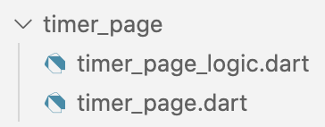
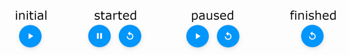

# Flutter state management for minimalists

The biggest challenge for me when coming to Flutter was learning state management. People were saying Provider and Bloc and ScopedModel and Redux and MobX and…I had no idea what they were talking about. As time passed the list of state management solutions continued to grow.

In my learning journey I wrote articles about Stacked ([here](https://medium.com/flutter-community/a-beginners-guide-to-architecting-a-flutter-app-1e9053211a74)) and Provider ([here](https://medium.com/flutter-community/making-sense-all-of-those-flutter-providers-e842e18f45dd) and [here](https://www.raywenderlich.com/6373413-state-management-with-provider)) and Riverpod ([here](https://medium.com/flutter-community/flutter-riverpod-tutorial-counter-app-ed3aa758f02f) and [here](https://medium.com/flutter-community/flutter-riverpod-tutorial-timer-app-186d04637775)). I went through the [Bloc pattern](https://www.raywenderlich.com/4074597-getting-started-with-the-bloc-pattern) and [BlocLibrary](https://bloclibrary.dev/) tutorials and looked into [Cubit](https://medium.com/flutterando/cubit-a-simple-solution-for-app-state-management-in-flutter-66ab5279ef73) and [GetX](https://pub.dev/packages/get) and watched videos about [Redux](https://pub.dev/packages/flutter_redux) and [MobX](https://pub.dev/packages/flutter_mobx) and [Command](https://pub.dev/packages/flutter_command). But with each one there was always something that I couldn’t quite wrap my brain around. There were either too many options or too much magic was happening behind the scenes. My brain needed simple and understandable. It needed minimal.

That’s where this article comes in. I’m going to introduce a way to manage your app state that doesn’t use any of the third-party state management solutions. The only third-party package it uses is [GetIt](https://pub.dev/packages/get_it), not to manage state but to provide a reference to a plain Dart class where you’ll manage your own state. For rebuilding the UI on state changes, you’ll use Flutter’s own built-in `ValueNotifier` and `ValueListenableBuilder` classes.

The purpose of this article isn’t to talk you out of any state management solution you may be currently using. If it’s working for you, then there’s no reason to change. Rather, this article is a guide for people like me who don’t understand state management and just want straight-forward explanation that they can wrap their minds around.

# Overview of app architecture

While it’s possible to build a Flutter app in one big file with all the UI and logic mixed together, that makes it really hard to understand how the app works. For most apps you’ll want to give yourself a little structure.

To start off with, let’s look at an overview of a typical app’s architecture. Each colored box below represents a class or a file or maybe even a folder of files. The two pages in this app are there as examples to represent the 10 or 20 pages you might have in a full app.


There are three layers: the UI layer, the state management layer, and the service layer. We’ll look at each of those in more detail in the following sections.

## UI Layer

The user interface layer is where Flutter resides. These are all the scaffolds, buttons, columns, and text widgets you use to compose the app layout that your users see.


UI Layer

The UI layer should have as little logic as possible in it. All you do here is take the current state of the app and make it look nice for the user.

***Note\****: When I talk about the* ***state\****, I just mean the parts of your app that can vary. That is, I’m talking about variables. If the app background color was blue but the user changed it to red, that color is state. If the user scrolls halfway down a list, that scroll amount is state. If you load an image from the internet, that image is state.*

To say it again, the only job of the UI layer is to show the app state to the user. Don’t parse or format strings here. That’s logic. It belongs in a different layer. Don’t do all your Firebase initialization and sign in work here. That’s logic. It belongs in a different layer. Don’t save data to shared preferences here. That’s logic. It belongs in a different layer.

Pretty much the only logic you should see in the UI layer are `if` or `switch`statements for choosing the right widget to display for the current app state.

***Caveat\****: There is an argument to be made for including logic inside the widget when you are making a* ***self-contained widget\*** *(meaning you could publish it as its own package if you wanted to). The whole Flutter framework is full of these. This could be a* [*simple stateful widget*](https://www.raywenderlich.com/10126984-creating-reusable-custom-widgets-in-flutter) *or a* [*custom render object widget*](https://medium.com/flutter-community/creating-a-flutter-widget-from-scratch-a9c01c47c630)*. The key, though, is that the state is self-contained inside the widget.* [*The documentation calls this* ***ephemeral state\***](https://flutter.dev/docs/development/data-and-backend/state-mgmt/ephemeral-vs-app)*. In contrast to this is* ***app state\****, which is used outside of the widget itself. What I’m saying is that app state and the logic you need to prepare it for presentation should be kept out of the UI layer.*

In order to know when to show a new update, the UI layer should listen for changes in the app state. The widgets that listen to the state and rebuild on a change are generally called builder widgets.

Another important thing to note is that although the example above says login *page* and home *page*, you could just as well replace the word page with a much smaller UI widget like a form or a text region. After all, everything is just a widget, even a page.

All the logic that you’re tempted to do right in the UI layer, you should put in a state management layer.

## State management layer

There are a million names for this layer. Some people call it a ViewModel. Others call it a Controller. Still others call it a Bloc or a Model or a Reducer or a ChangeNotifier. The idea is basically the same, though. This state management layer is the place to perform logic based on UI events and then update the app state.


State management layer

An **event** is just something that happens in the app. Usually it’s a user action like pressing a button or swiping to refresh or tapping an image or entering text. It’s the UI layer’s job to notify the state management layer about the event that happened. In the minimalist approach, this is done by simply calling a method on the state management class.

Once the state management layer gets notified about an event from the UI layer, it processes the event. For example, if the user pressed the square root button in your calculator app, then it’s the job of the state management layer to actually calculate the square root of whatever the current number is. That number is app state and is stored as a variable in the state management class. After the state management class finishes the work of calculating the square root, it updates the variable with the new value.

***Note\****: In the example above, not only should the state management do the square root calculation, but it should also do all the string formatting so that it is in just the form that the UI needs to display it. For example, the square root of* `*2*` *is* `*1.41421356237*`*, but if the UI only needs four decimal places then it’s the job of the state management class to convert that number to the string* `*'1.4142'*`*. Of course, some people might disagree with me, but I’m just saying the more logic you move to the state management layer the better. One reason for this is that the state management layer is much easier to test than the UI layer is.*

The state management layer provides a way for the UI to listen for changes in the app state, but doesn’t know anything in particular about the actual UI that is listing. Since the state management layer doesn’t know anything about the UI layer, you can refactor the UI whenever you want without breaking the code in the state management layer. This is a key advantage for building flexible and maintainable apps.

Although the state management layer is a good place to perform logic, not all app logic should be done there. Some logic should be moved to services.

## Service layer

The service layer, which is sometimes called a **data repository**, is the place to perform logic and provide data that may be needed at multiple places around your app. It’s also a way to add a layer of protection between your app logic and the third-party code you use for I/O tasks like reading a database or contacting a remote server. That layer of protection allows you to swap out service implementations without breaking the rest of your app code.


Service layer

As you can see in the image above, the storage service is called from two different pages in the state management layer. Having one service to do a job prevents you from duplicating the same code at lots of places around your app. This also gives you a single location to make updates when you need to.

From the state management layer’s perspective, the service is just an **interface**, that is, an abstract Dart class that defines the methods you can call on it. Once you’ve defined the interface API, you have to implement the abstract methods with concrete ones. For example, the storage service interface could be implemented by saving and retrieving data from a remote server or from a local database. Either choice is fine and the state management layer doesn’t care. Sometimes it’s even useful to make a service implementation that just returns fake data. This allows you to have a working prototype for the rest of the app before you get around to building the real service implementation.

Although the example above only shows a storage service, your app may very well have multiple different services. For example, you’d probably also want an authentication service for the login page.

***Note\****: If you only need a service at one place in your app, you can put the code for it directly in your state management layer. However, if you want to do something like switch database implementations or authentication providers, it will be a lot of work disentangling the code. Sometimes you need the experience of pain to learn that lesson, though, so play around with the options.*

This has been a high level overview. In the next section I’ll write in more detail how to implement the architectural pattern I described above — all without using complex third-party state management packages.

# The minimal approach

A state management solution needs to be able to do the following things:

1. Provide the UI layer with a reference to the state management layer
2. Notify the state management layer about UI events
3. Give the UI layer a way to listen for state changes
4. Rebuild the UI after state changes

Let’s take these one at a time.

## Provide the UI layer with a reference to the state management layer

When you move the logic from the UI to another class, you need to provide the UI with a reference to that state management class. The way a lot of state management solutions do this is with the [provider](https://pub.dev/packages/provider) package, which is built on `InheritedWidget`.

However, I’ve found it a lot simpler to just use [GetIt](https://pub.dev/packages/get_it) to get a reference to the state management class like so:

```
final homePageManager = getIt<HomePageManager>();
```

There isn’t anything complex about GetIt. It just creates a single instance of your state management class (if you register it as a singleton), and then gives it to you wherever and whenever you need it.

Some people may be uncomfortable with this because in essence you have a global variable that you can access from anywhere in your app. Personally I haven’t had trouble with it as long as I follow this guideline:

- Don’t directly modify state in the state management from the UI layer. Instead call methods on the state management class and let that class modify its own state.

Other people worry about testing because singleton classes are notoriously difficult to test. However, [GetIt provides a way to test these classes](https://pub.dev/packages/get_it#testing-with-getit) so that isn’t really an issue.

Another advantage for simplicity here is that you use GetIt to set up the service layer in the same way. More on that in a bit.

***Note\****: If you disagree with me in this section I’d like to hear why. Please add a comment below. The thing that first convinced to use this simple approach was* [*Riverpod*](https://riverpod.dev/)*, which uses a top-level variable to do something similar.*

## Notify the state management layer about UI events

Once the UI has a reference to the state management class, all you need to do to notify the state management class about UI events is call a method.

Here’s an example of how you might do that when the user presses the login button:

```
loginPageManager.submitUserInfo(username, password);
```

Now the state management layer can do whatever it needs to with `username`and `password`.

## Give the UI layer a way to listen for state changes

If you have some state in your state management class like the following:

```
var myState = 1;
```

there is no direct way for the UI to know when the value of `myState`changes.

However, you can notify the UI about state changes if you use a `ValueNotifier` or a `ChangeNotifier`. Both of these classes come with Flutter so you don’t need any third-party packages.

I prefer using a `ValueNotifier` because it supports immutable state and is a good way to isolate only the state that is actually changing. I found that when I was using `ChangeNotifier` I tended to build really large state management classes. Additionally, when I would notify the listeners about state changes, a lot more of the UI would rebuild than was necessary.

Here is how you would make that integer example observable:

```
final myStateNotifier = ValueNotifier<int>(1);
```

The `1` is just the initial value for notifier. Any time you change the value inside the notifier, it will notifiy any objects that are listening to it. Here is how you would change the value:

```
myStateNotifier.value = 2;
```

The `value` property stores the state.

The example above was a simple `int`. When I have more complex state, I make a new class that extends `ValueNotifier`. This has the added benefit of keeping the main state management class clean and isolating the logic to where it’s actually used.

Here is an example of an extended `ValueNotifier`:

```
class FavoriteNotifier extends ValueNotifier<bool> {  // set initial value to false
  FavoriteNotifier() : super(false);  // get reference to service layer
  final _storageService = getIt<StorageService>();  // a method to call from the outside
  void toggleFavoriteStatus(Song song) {
    value = !value;
    _storageService.updateFavoriteSong(song, value);
  }
}
```

Although the state itself, a Boolean, is still simple, it needs some extra logic to save the favorite status of the song whenever `toggleFavoriteStatus` is called. Notice that the actual work of saving the state is done by the service layer. The `value` variable belongs to `ValueNotifier` and anytime `value`changes, any object that is listening to this `ValueNotifier` will get notified about the new value.

All the logic you see in the `FavoriteNotifier` class above is logic that doesn’t need to be cluttering the main state management class for the page. Inside the page’s state management class all you have is the following:

```
final favoriteNotifier = FavoriteNotifier();
```

Extracting logic into discrete classes like this keeps your state management simple and clean.

In addition to `ValueNotifier` or `ChangeNotifier`, your state management class can also expose a future or a stream to the UI layer. The reason is that the UI layer has builder widgets for listening to updates from Future or Stream directly. In my own experience, I tend to hide futures behind a `ValueNotifier` and some people like to do that with streams as well, but that’s completely up to you.

This brings us to the last step.

## Rebuild the UI after state changes

Flutter comes with widgets that listen for state changes and rebuild themselves when it happens.

If the UI needs to listen to state that’s in a `ValueNotifier` (which is the method I recommend), then you should use a `ValueListenableBuilder`widget. The long name is rather unfortunate because it’s job is quite simple. Just rebuild a little section of the UI with the new value. Here’s the official video:

<iframe src="https://cdn.embedly.com/widgets/media.html?src=https%3A%2F%2Fwww.youtube.com%2Fembed%2Fs-ZG-jS5QHQ%3Ffeature%3Doembed&amp;display_name=YouTube&amp;url=https%3A%2F%2Fwww.youtube.com%2Fwatch%3Fv%3Ds-ZG-jS5QHQ&amp;image=https%3A%2F%2Fi.ytimg.com%2Fvi%2Fs-ZG-jS5QHQ%2Fhqdefault.jpg&amp;key=a19fcc184b9711e1b4764040d3dc5c07&amp;type=text%2Fhtml&amp;schema=youtube" allowfullscreen="" frameborder="0" height="480" width="854" title="ValueListenableBuilder (Flutter Widget of the Week)" class="ef es eo ex w" scrolling="auto" style="box-sizing: inherit; width: 680px; position: absolute; left: 0px; top: 0px; height: 382.1875px;"></iframe>

All you do is wrap the widget you want to rebuild with the `ValueListenableBuilder` widget. For example, here’s a UI widget for the `FavoriteNotifier` from above:

```
class FavoriteButton extends StatelessWidget {
  const FavoriteButton({Key? key}) : super(key: key);  @override
  Widget build(BuildContext context) {
    final playPage = getIt<PlayPageManager>();    return ValueListenableBuilder<bool>(
      valueListenable: playPage.favoriteNotifier,
      builder: (context, value, child) {
        return IconButton(
          icon: Icon(
            (value) 
              ? Icons.favorite 
              : Icons.favorite_border,
          ),
          onPressed: playPage.onFavoritePressed,
        );
      },
    );
  }
}
```

Note the following items:

- **getIt**: As described in a previous section, you can use GetIt to get a reference to the state management class for this page.
- **ValueListenableBuilder**: This widget takes two parameters: `valueListenable` and `builder`.
- **valueListenable**: This is where you give it the `ValueNotifier` from your state management class.
- **builder**: This parameter takes a function that will be called whenever the value of the state changes. The function returns the new UI widget, in this case a button with a different icon depending on the favorite status. The builder function has three parameters: `context`, `value`, and `child`.
- **context**: The builder function’s `context` is just the current `BuildContext`.
- **value**: This is the new value from the `ValueNotifier`. Since the `ValueNotifier` wraps a Boolean in this example, the type of `value` is `bool`. I usually rename `value` to something more descriptive, probably `isFavorite` in this case.
- **child**: If the widget that you’re rebuilding in this builder function has a child widget and that child widget is unaffected by the state change (that is, it doesn’t need to get rebuilt itself), then you can put the child widget here. For example, this would apply if you were rebuilding a `Container` with a new color but the child of the container was a `Text`widget that didn’t change. Using `child` in the builder function is merely an optimization. If you don’t need it you can replace `child` with `_` (or replace it with `__` if you used `_` for an unused `context`).

```
builder: (_, value, __) {...}
```

***Tip\****: Sometimes it’s a pain to wrap a widget with a* `*ValueListenableBuilder*`*. However, if you use the shortcut key in VS Code or Android Studio to show the context menu, you can choose* ***Wrap with StreamBuilder\****. Then just modify the* `*StreamBuilder*` *into a* `*ValueListenableBuilder*`*.*


I recommend keeping it simple and using a `ValueNotifier` and `ValueListenableBuilder` for everything. However, if you decide to expose a `Stream`, `Future`, or `ChangeNotifier`, there are builder widgets for those, too:

- **Stream**: Use a [StreamBuilder](https://www.youtube.com/watch?v=MkKEWHfy99Y).
- **Future**: Use a [FutureBuilder](https://www.youtube.com/watch?v=ek8ZPdWj4Qo).
- **ChangeNotifier**: Use an [AnimatedBuilder](https://www.youtube.com/watch?v=N-RiyZlv8v8). (Yes, `AnimatedBuilder` is normally used for animation, but it takes a `ChangeNotifier`, too.) [Here](https://stackoverflow.com/a/67016227/3681880) is a minimal example.

Again, if you’re going for minimalist and simple, you don’t need `StreamBuilder`, `FutureBuilder`, or `ChangeNotifier`. Just use `ValueNotifier`and `ValueListenableBuilder`.

This covers the theory behind the minimalist state management approach. However, seeing a real example is helpful for many people.

# Timer app example project

In the first draft of this article I started writing a full tutorial for how to create a timer app like I had [done previously for Riverpod](https://medium.com/flutter-community/flutter-riverpod-tutorial-timer-app-186d04637775) (which in turn was inspired by the [Bloc library timer tutorial](https://bloclibrary.dev/#/fluttertimertutorial)). However, I decided it would be more clear to only point out the relevant parts and then give you the [full source code](https://github.com/suragch/minimalist_state_management_timer_app) to explore on your own.

The app looks like this:


It’s just a simple 10-second timer that you can start, pause, and reset. In order to demonstrate a service layer, though, I also added local storage that saves the remaining time if you close the app and restores the time the next time you open the app.

Here is the architecture of the app:


This is the file structure I used to match that architecture:


In a normal app I’d have multiple pages and services so that’s why I made a **pages** folder and a **services** folder.

Now let’s look at some of the key areas that relate to the theory you learned earlier in the article.

## UI layer

The file [**main.dart**](https://github.com/suragch/minimalist_state_management_timer_app/blob/master/lib/main.dart) has very little in it. It’s good to keep this file clean and just use it to start your app. All the widgets for the pages are kept in the **pages** folder.

The file [**timer_page.dart**](https://github.com/suragch/minimalist_state_management_timer_app/blob/master/lib/pages/timer_page/timer_page.dart) in the **pages** folder has the UI layout.


Here is a condensed summary:

```
class TimerPage extends StatefulWidget {...}class _TimerPageState extends State<TimerPage> {  @override
  void initState() {
    ...
  }  @override
  Widget build(BuildContext context) {
    return Scaffold(
      appBar: AppBar(title: Text('My Timer App')),
      body: Center(
        child: Column(
          mainAxisAlignment: MainAxisAlignment.center,
          children: <Widget>[
            TimerTextWidget(),
            SizedBox(height: 20),
            ButtonsContainer(),
          ],
        ),
      ),
    );
  }
}class TimerTextWidget extends StatelessWidget {...}class ButtonsContainer extends StatelessWidget {...}class StartButton extends StatelessWidget {...}class PauseButton extends StatelessWidget {...}class ResetButton extends StatelessWidget {...}
```

These are some key points:

- You should **break your UI down into lots of small discrete widgets**. This makes your UI code much easier to read because you can give each component a meaningful name instead of just seeing a bunch of containers and padding.
- The widgets here are in a single file, but there’s nothing stopping you from putting them in their own files and organizing them in folders. If you do that, you just import the widgets wherever you need them. This brings up another advantage of extracting widgets out of your UI: **small widgets are reusable and reduce code duplication**.
- You couldn’t tell from the code above, but all of those stateless widgets were also `const` widgets. **Make your widgets const whenever possible.** Flutter doesn’t need to rebuild constant widgets, so this is a performance optimization. Note the `const` keyword in the `StartButton`constructor, for example:

```
class StartButton extends StatelessWidget {
  const StartButton({Key? key}) : super(key: key);
  @override
  Widget build(BuildContext context) {...}
}
```

- Finally, **use a stateful widget whenever you need to initialize something when the page first loads**. The `State` class of a stateful widget has a `initState` method. A lot of the other state manage solutions have special ways to do this, but I found those confusing or too magical. `initState` is easy. It runs once the very first time the widget state is created and no more. It’s a great place to call a method on your state management class. More on that in a bit.

## State management layer

I like to keep my state management file right next to my UI file. In this case I called the file [**timer_page_logic.dart**](https://github.com/suragch/minimalist_state_management_timer_app/blob/master/lib/pages/timer_page/timer_page_logic.dart)**:**




Alternatively, you could call it something else:

- *timer_page_****model\****.dart*
- *timer_page_****controller\****.dart*
- *timer_page_****manager\****.dart*

or something else.

Inside this state management file I add a plain Dart class:

```
class TimerPageManager {
  
}
```

Then I look at the UI and I analyze which parts of the UI might change independently of the other parts. For the timer app I can see two different units of state. One is the **time left** and the other is the **button configuration**.


The time left is a string and the button configuration could be represented by an enum with the following four values:




Since the UI needs a way to listen to changes in these two states, the next step is to add one `ValueNotifier` for each of them. To do that just add two variables to your state management class:

```
class TimerPageManager {
  final timeLeftNotifier = TimeLeftNotifier();
  final buttonNotifier = 
    ValueNotifier<ButtonState>(ButtonState.initial);
}enum ButtonState {
  initial,
  started,
  paused,
  finished,
}
```

You can do all the logic inside your page’s state management class, but when the logic is complex it’s better to break the `ValueNotifier` out into a separate class. In this case, that’s what I did for the `TimeLeftNotifier` since it has to manage a timer that’s controlled by a stream. The button notifier logic is pretty simple, though, so I used the `ValueNotifier` directly.

With the time left notifier logic extracted out, the file structure looks like this:


The job of the page’s state management class is to manage the notifiers, while the job of the notifiers is to handle their own state. The more you can isolate state management into small, discrete blocks, the easier your job will be.

I’ve talked about the UI layer and the state management layer individually, but now let’s see how they interact. Again I’ll go over the same four points I covered in the theory section.

## Providing the UI layer with a reference to the state management layer

As described earlier, the answer here is to use [GetIt](https://pub.dev/packages/get_it). I added the package in [**pubspec.yaml**](https://github.com/suragch/minimalist_state_management_timer_app/blob/master/pubspec.yaml):

```
dependencies:
  get_it: ^6.0.0
```

And then registered the state management page in [**service_locator.dart**](https://github.com/suragch/minimalist_state_management_timer_app/blob/master/lib/services/service_locator.dart):

```
final getIt = GetIt.instance;void setupGetIt() {
  getIt.registerLazySingleton<TimerPageManager>(
    () => TimerPageManager()
  );
}
```

And called the `setupGetIt` method in [**main.dart**](https://github.com/suragch/minimalist_state_management_timer_app/blob/master/lib/main.dart) before the app runs.

```
void main() {
  setupGetIt();
  runApp(MyApp());
}
```

With GetIt set up, I have access to the timer page state management class from the UI side in [**timer_page.dart**](https://github.com/suragch/minimalist_state_management_timer_app/blob/master/lib/pages/timer_page/timer_page.dart):

```
final stateManager = getIt<TimerPageManager>();
```

I do that not only in the main `_TimerPageState` class but also in smaller widgets like `StartButton` and `PauseButton`. Since it was registered as a lazy singleton, it only creates a new object the first time you get it. After that it just returns the same object as before.

## Notifying the state management layer about UI events

Once the UI has a reference to the state management class, the UI can call methods on the state management class when some event happens (like tapping the start timer button). That means you have to add the appropriate methods to the state management class. I added the following methods to `TimerPageManager` in [**timer_page_logic.dart**](https://github.com/suragch/minimalist_state_management_timer_app/blob/master/lib/pages/timer_page/timer_page_logic.dart):

```
class TimerPageManager {
  final timeLeftNotifier = ...
  final buttonNotifier = ...  void initTimerState() {...}
  void start() {...}
  void pause() {...}
  void reset() {...}
  void dispose() {...}
}
```

Then I could call a method from the UI side in [**timer_page.dart**](https://github.com/suragch/minimalist_state_management_timer_app/blob/master/lib/pages/timer_page/timer_page.dart) like so:

```
onPressed: () {
  final stateManager = getIt<TimerPageManager>();
  stateManager.pause();
},
```

That was inside the `PauseButton` widget.

## Giving the UI layer a way to listen for state changes

You’ve already given the UI layer a way to listen for state changes when you added the two `ValueNotifier` variables to the state management class:

```
class TimerPageManager {
  final timeLeftNotifier = ...
  final buttonNotifier = ...
  
  ...
}
```

The way to make these notifiers notify any listeners is by changing their value. Here is the implementation of the `pause` method:

```
class TimerPageManager {
  final timeLeftNotifier = ...
  final buttonNotifier = ...
  
  void pause() {
    timeLeftNotifier.pause();
    buttonNotifier.value = ButtonState.paused;
  }  ...
}
```

The `buttonNotifier` direrctly updates the value, while `timeLeftNotifier`forwards the call on to [its own notifier class](https://github.com/suragch/minimalist_state_management_timer_app/blob/master/lib/pages/timer_page/notifiers/time_left_notifier.dart) to handle on its own. Either way, any listeners will get notified about the update.

The next step is for the UI to listen and respond to those state changes.

## Rebuilding the UI after state changes

Since the state manager class has two value notifiers:

```
class TimerPageManager {
  final timeLeftNotifier = ...
  final buttonNotifier = ...
  ...
}
```

you can listen to them with `ValueListenableBuilder` widgets. The timer app UI uses two of them, one for `TimerTextWidget` and one for `ButtonContainer`. Here is the `build` method for `TimerTextWidget`:

```
Widget build(BuildContext context) {
  final stateManager = getIt<TimerPageManager>();
  return ValueListenableBuilder<String>(
    valueListenable: stateManager.timeLeftNotifier,
    builder: (context, timeLeft, child) {
      return Text(
        timeLeft,
        style: Theme.of(context).textTheme.headline2,
      );
    },
  );
}
```

These are the important parts:

- `ValueListenableBuilder` listens to the notifier in the state management class when you set the `valueListenable` parameter.
- `timeLeft` is the current value inside `stateManager.timeLeftNotifier`. It’s a string in the form of `'00:10'`, `'00:09'`, `'00:08'`, etc.
- Whenever the value inside `stateManager.timeLeftNotifier` changes, this widget (and this widget only) will rebuild. Since the internal implementation of `TimeLeftNotifier` updates the value every second when the timer ticks, this widget will show a new time string every second.

That’s it for the UI and state management layer interaction, but let me also cover the service layer.

## Service layer

The timer needs to save its state to local storage when the user leaves the app, so I created a `StorageService` interface to define an API that the state management layer can use. Here it is in [**storage_service.dart**](https://github.com/suragch/minimalist_state_management_timer_app/blob/master/lib/services/storage_service/storage_service.dart):


```
abstract class StorageService {
  Future<int?> getTimeLeft();
  Future<void> saveTimeLeft(int seconds);
}
```

While that interface could be implemented with a database or web API, I decided to implement it using shared preferences. Here it is in [**shared_preferences_storage.dart**](https://github.com/suragch/minimalist_state_management_timer_app/blob/master/lib/services/storage_service/shared_preferences_storage.dart):

```
import 'package:shared_preferences/shared_preferences.dart';
import 'storage_service.dart';class SharedPreferencesStorage extends StorageService {
  static const time_left_key = 'time_left';  @override
  Future<int?> getTimeLeft() async {
    final prefs = await SharedPreferences.getInstance();
    return prefs.getInt(time_left_key);
  }  @override
  Future<void> saveTimeLeft(int seconds) async {
    final prefs = await SharedPreferences.getInstance();
    prefs.setInt(time_left_key, seconds);
  }
}
```

Then I registered `SharedPreferencesStorage` with GetIt by adding it to the `setupGetIt` method in [**service_locator.dar**t](https://github.com/suragch/minimalist_state_management_timer_app/blob/master/lib/services/service_locator.dart):

```
void setupGetIt() {
  ...
  getIt.registerLazySingleton<StorageService>(
    () => SharedPreferencesStorage()
  );
}
```

After that I could access and use it in the `TimeLeftNotifier` class in [**time_left_notifier.dart**](https://github.com/suragch/minimalist_state_management_timer_app/blob/master/lib/pages/timer_page/notifiers/time_left_notifier.dart):

```
class TimeLeftNotifier extends ValueNotifier<String> {
  final _storageService = getIt<StorageService>();
  
  void pause() {
    ...
    _storageService.saveTimeLeft(_currentTimeLeft);
  }
  ...
}
```

Since `TimeLeftNotifier` knows nothing about shared preferences, I could swap out the storage service implementation with SQLite or something else and `TimeLeftNotifier` wouldn’t even know.

## A note on service locators vs dependency injection

I’ve used the service locator pattern (though some call it an “anti-pattern”) in this article. The other option is to use dependency injection.

This is the service locator pattern:

```
class MyStateManager {
  final myService = getIt<MyService>();
}
```

This is the dependency injection pattern:

```
class MyStateManager {
  MyStateManager(this.myService);
  final MyService myService;
}
```

With dependency injection, you give the state management class any service it needs as a constructor parameter. Proponents of dependency injection argue that this makes the dependencies more clear. I can agree with that. You’re welcome to go that route if you like to. It would only be a minor adjustment to the timer app to pass in `StorageService` as a parameter to `TimerPageManager` and `TimeLeftNotifier`. However, if you want to inject `TimerPageManager` in the UI widget tree, you’d have to modify a lot of the widget constructors. That would be a pain. That’s what `InheritedWidget`was meant to solve. And if you’re tempted to use `InheritedWidget`, then you should just use Provider or Riverpod.

I’m not convinced that service locators are an anti-pattern for Flutter apps, though. So far I’ve found them easy to use and helpful. Service locators and dependency injection both solve the bigger problem of decoupling an abstract service from its concrete implementation. At this point in time that’s good enough for me. You’ll have to make your own decision, though. Here is a helpful article by Martin Fowler on the topic (see the section titled *Service Locator vs Dependency Injection*):

[Inversion of Control Containers and the Dependency Injection patternIn the Java community there's been a rush of lightweight containers that help to assemble components from different…martinfowler.com](https://martinfowler.com/articles/injection.html)

## A note on initialization

A stateful widget’s `State` class is a good place to perform initialization tasks. For the timer app I needed to get the saved remaining time value when the page first loads. To do that I added the initialization call to the `initState` method in [**timer_page.dart**](https://github.com/suragch/minimalist_state_management_timer_app/blob/master/lib/pages/timer_page/timer_page.dart):

```
class _TimerPageState extends State<TimerPage> {
  final stateManager = getIt<TimerPageManager>();  @override
  void initState() {
    stateManager.initTimerState();
    super.initState();
  }  @override
  void dispose() {
    stateManager.dispose();
    super.dispose();
  }  ...
}
```

As you can see, there’s also a `dispose` method. That was useful for cancelling the stream in the timer. Notice that I don’t directly access the stream from here in the UI, though. I just call a method on the state management class, which in turn calls a method on the [notifier class](https://github.com/suragch/minimalist_state_management_timer_app/blob/master/lib/pages/timer_page/notifiers/time_left_notifier.dart) where the timer stream is.

If you want to start some initialization (like contacting a web server) even earlier, you can add it before `runApp` in the `main` function.

```
void main() {
  setupGetIt();
  //             <-- add here
  runApp(MyApp());
}
```

In that case you would want to have a state management class that handles app-wide state (like a user’s logged-in status).

## A note on rebuilding

Run the timer app and and press the **pause** and **start button** halfway through the countdown. Observe the print statements that show when widgets get rebuilt:

```
building MyHomePage
building time left state: 00:10
building button state: ButtonState.initial
building button state: ButtonState.started
building time left state: 00:09
building time left state: 00:08
building time left state: 00:07
building time left state: 00:06
building time left state: 00:05
building button state: ButtonState.paused
building button state: ButtonState.started
building time left state: 00:04
building time left state: 00:03
building time left state: 00:02
building time left state: 00:01
building time left state: 00:00
building button state: ButtonState.finished
```

Because the `ValueListenableBuilder` widgets in [**timer_page.dart**](https://github.com/suragch/minimalist_state_management_timer_app/blob/master/lib/pages/timer_page/timer_page.dart) only wrap the widgets that need rebuilding, you’re not needlessly rebuilding unnecessary parts of the UI tree. You can see from the print statements above that the timer updates didn’t cause the button configuration to get rebuilt. Likewise, pressing a button didn’t cause the text widget to get rebuilt.

Key point: Isolate your state!

## Summary

Here is a more detailed architectural model of the timer app based on what I described above:


Notes:

- There are two discrete units of state that can change in the UI layer: the time left and the button configuration.
- Those two ways of changing state map to two value notifiers in the state management layer.
- Of those two notifiers, only the time left notifier needs access to the storage service, which is implemented with shared preferences.
- Events come from the user pressing buttons, from a timer inside the time left notifier, and from the results of fetching a saved value from the storage service.
- The state management layer processes these events and updates the state.
- The UI is listening for state changes and rebuilds itself when that happens.

## Apply your knowledge

Clone the [timer app](https://github.com/suragch/minimalist_state_management_timer_app) and try the following challenges:

- Make a `ValueNotifier` subclass for the `buttonNotifier` and extract it to a new file.
- Add a way to change the start time.
- Swap out shared preferences with another storage service implementation (like Hive or Sqflite or Firebase or even a fake storage service).

# Conclusion

All of the state management solutions that I have seen so far (except for `setState`) work in basically the same way. They take the app state and logic and separate it from the UI by putting it in a new class. In addition to that, they provide a way for the UI to rebuild when the state changes. The minimalist method I’ve presented here does all of that but without a third-party state management package. GetIt *is* a third-party package, but I’m not calling it a state management solution because you’re only using it to get a reference to a Dart class. You could even replace GetIt with a singleton if you wanted to. However, an advantage of GetIt over a singleton is that GetIt is easier to test.

As I stated (no pun intended) at the beginning of the article, there’s no reason to abandon whatever state management solution you’re currently using if you understand it and can make it do what you need it to. However, if you’re confused by the complexity of it all, then maybe this minimalist approach is for you.

Just because this approach is “minimalist” doesn’t mean that you can’t build a large app with it, though. The key is to isolate the state and logic into small value notifiers and services that only worry about themselves.

## Appreciation

Thank you to the following people who have influenced my thinking with regard to this topic:

- **Dane Mackier**, of FilledStacks and author of [Stacked](https://pub.dev/packages/stacked). He’s the first one who gave me any hope of understanding state management in Flutter when I read/watched [Flutter Architecture — My Provider Implementation Guide](https://www.filledstacks.com/post/flutter-architecture-my-provider-implementation-guide/).
- **Thomas Burkhart**, author of [GetIt](https://pub.dev/packages/get_it). The package is simple and easy to use.
- **Rémi Rousselet**, author of [Provider](https://pub.dev/packages/provider) and [Riverpod](https://pub.dev/packages/flutter_riverpod). Even though I’m presenting an alternate state management solution, he’s still influenced my thinking a lot. He’s also one of the main reasons I gave up `ChangeNotifier` in favor of `ValueNotifier`. The power of immutable state.
- **Scott Stoll**, from [Flutter Community](https://medium.com/flutter-community). Watching [Flutter: ValueNotifier Simplified, “Explain it to me like I’m 5”](https://www.youtube.com/watch?v=Jx7JzP3-KYE) helped me to finally start to understand `ValueNotifier`. Even though I take a slightly different approach than is presented in that video, there are many similarities.
- **Bat-Orgil**, from [Bolorsoft](https://bolorsoft.com/) company. When I asked him what state management solution he used, he told me he just used `ValueListenableBuilder`. I tried it and realized that it was simple to use and eliminated the need for the third-party builder widgets I was using at the time. (Since then, though, Bat-Orgil has switched to Bloc and is happy with it.)
- **Uncle Bob Martin**, author of [Clean Code](https://www.amazon.com/Clean-Code-Handbook-Software-Craftsmanship/dp/0132350882) and [Clean Architecture](https://www.amazon.com/Clean-Architecture-Craftsmans-Software-Structure/dp/0134494164). The separation of the architecture into different layers is a big thing he promotes. I still wonder if I need to add another two layers for use cases and business rules, but I haven’t gotten that far yet. [Reso Coder has](https://resocoder.com/flutter-clean-architecture-tdd/).

## Going on

I’m not sure that I’ll always use this minimalist state management approach, but the reason I currently like it is because I can understand it. I like simple. I like things that I can understand.

However, I’m also tempted to try out [Very Good Start](https://verygood.ventures/blog/very-good-start-scalable-flutter-starter-app) from [Very Good Ventures](https://verygood.ventures/). This is based on the [Bloc Library package](https://bloclibrary.dev/), but the main reason I’ve thought about trying this is because that company makes lots of great apps and they seem very professional. I’d probably learn a lot by copying their pattern.

**Update**: In this article I presented a layered architecture. When you start to increase the size of your app, though, I recommend organizing your project by feature. Each feature can still be divided into the layers I described above, but by making your top organizational structure divided into features it will make your project easier to browse, understand, and test. Here are two articles I recently read that convinced me of this:

- [How to organize your code?](https://kislayverma.com/programming/how-to-organize-your-code/)
- [Package by Feature](https://phauer.com/2020/package-by-feature/)

## Source code

I’ve linked to the source code for the timer app throughout this article, but here is it again:

[suragch/minimalist_state_management_timer_appgithub.com](https://github.com/suragch/minimalist_state_management_timer_app)

Feel free to open issues if you think something could be improved. I’ll try to keep this article up to date.

And again, if you see flaws in this minimalist approach, I’d like to hear your viewpoint in the comments below, or on [Redit](https://www.reddit.com/r/FlutterDev/comments/mvden2/flutter_state_management_for_minimalists/) if you prefer.

## More examples

I’ll try to add more open source examples here that use the minimalist approach as I collect them. Here is another one:

- [Background audio in Flutter with Audio Service and Just Audio](https://suragch.medium.com/background-audio-in-flutter-with-audio-service-and-just-audio-3cce17b4a7d)


##  扩展

本文用到的代码示例为：https://github.com/suragch/minimalist_state_management_timer_app


###  现存状态管理框架
文章很长，如果时间有限，一定要看**Flutter状态管理-Provider**

[Flutter状态管理-Redux](https://juejin.cn/post/6844903683327524871)

[Flutter状态管理-Bloc](https://juejin.cn/post/6844903689082109960)

[Flutter状态管理-RxDart](https://juejin.cn/post/6844903700733886471)

[★Flutter状态管理-Provider](https://juejin.cn/post/6844904056364728333)


### 主流倾向于选择 Provider

Provider 不仅做到了提供数据，而且它拥有着一套完整的解决方案，覆盖了你会遇到的绝大多数情况。就连 BLoC 未解决的那个棘手的 dispose 问题，和 ScopedModel 的侵入性问题，它也都解决了。

然而它就是完美的吗，并不是，至少现在来说。Flutter Widget 构建模式很容易在 UI 层面上组件化，但是仅仅使用 Provider，Model 和 View 之间还是容易产生依赖。

我们只有通过手动将 Model 转化为 ViewModel 这样才能消除掉依赖关系，所以假如各位有组件化的需求，还需要另外处理。

不过对于大多数情况来说，Provider 足以优秀，它能够让你开发出**简单**、**高性能**、**层次清晰** 的应用。而且Provider是官方推荐的状态管理方案，可以放心使用。


### 应该如何选择状态管理

介绍了这么多状态管理，你可能会发现，一些状态管理之间职责并不冲突。例如 BLoC 可以结合 RxDart 库变得很强大，很好用。而 BLoC 也可以结合 Provider / ScopedModel 一起使用。那我应该选择哪种状态管理方式呢。

我的建议是遵守以下几点：

1. 使用状态管理的目的是为了让编写代码变得更简单，任何会增加你的应用复杂度的状态管理，统统都不要用。
2. 选择自己能够 hold 住的，BLoC / Rxdart / Redux / Fish-Redux 这些状态管理方式都有一定上手难度，不要选自己无法理解的状态管理方式，从这个角度来说，使用Provider或者上述介绍的最小化状态管理框架在绝大多数情况下就够用了。
3. 在做最终决定之前，敲一敲 demo，真正感受各个状态管理方式给你带来的 好处/坏处 然后再做你的决定。
4. 所谓的最终决定也不是不能改动的，可以在TDD的确保下快速重构的，所以根据开发人员的喜好，选择其中之一，后续改动也是很快的。
5. 状态管理新秀是GetX，虽然有很多侵入式的设计，但是看了demo是真的简单。可以在适当的场合考虑
6. 最好不用FishRedux
7. 状态管理的关系：
```
简单状态管理 --> Provider --> RxDart基于响应式编程的方式 
 						↓
 				  	Redux  --> GetX
Redux：基于大应用的角度，将逻辑部分做了更多的固化设计，如基于Action->State(相当于状态机)
RxDart:基于响应式编程的思路，函数式编程的思路，在特定场合有奇效，但是其降低了程序的理解度(在函数式编程思想未普遍的开发环境中)
GetX：看上去和Compose有点像(没有详细对比)，侵入式强，方便。
```


