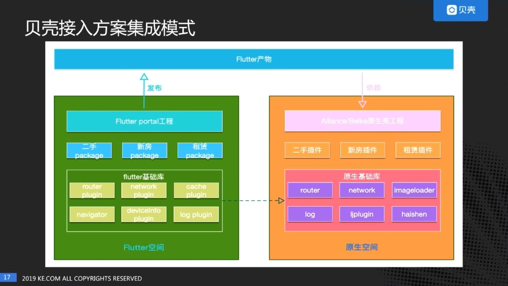
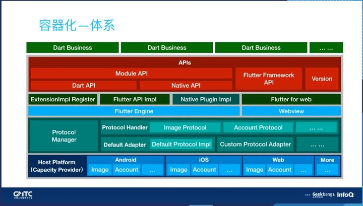
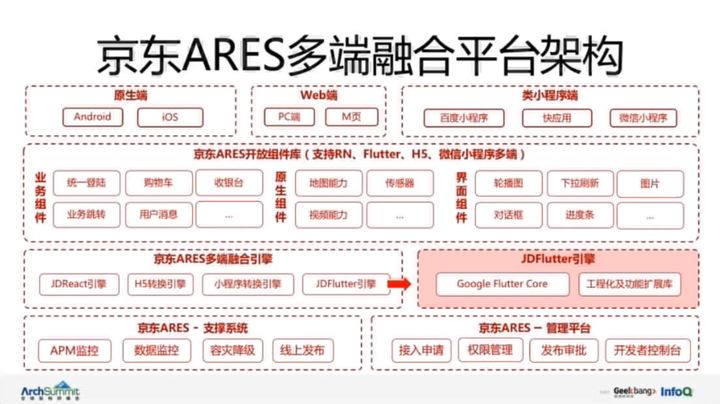
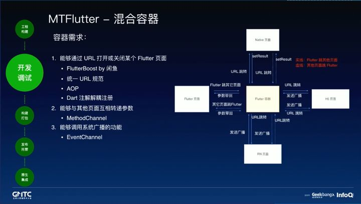
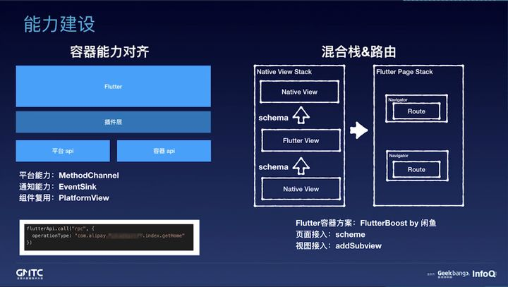

各个大厂使用flutter的方式有很多，下面尝试列举分析，以便在我们使用flutter的时候能够有借鉴作用

## 贝壳

贝壳使用flutter，也是使用混合工程的的方式，将其作为一个页面或者一组子页面，嵌入到原生APP的开发中。

所有的组件都是基于原生来开发的，Flutter中直接使用原生的组件来开发。

## 头条

更详细的文章可以参照[这篇](https://www.jianshu.com/p/4636f3b762ab)

采用业务分层架构的思想，为普通业务打造可扩展的接口和行为准则。

要适应Android和IOS两个平台，然后针对不同的平台的业务行为需要定义统一的`标准和规范`以及`封装了一些通用业务模块`功能(其中的某些可以看做是基础业务的基类)，比如：图片调用，直接去这里面的协议层，直接调用就可以了，内部都封装好了，直接传参调用，这里面有默认的适配，你也可以自定义。有了这样的架构，平台基础API的差异性就不需要考虑了，开发者只管调用内部的功能模块或者接口 + UI设计对接，即可快速开发新需求功能。

> 字节的方案很有启发性，Flutter只管UI渲染，Service(功能)级的API可以通过协议适配的方式来抹平平台的差异。

## 京东

## 美团

![](

## 蚂蚁财富

![](

